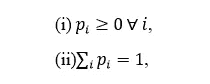
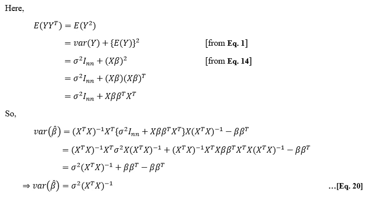

# 三次回归

> 原文：<https://medium.com/analytics-vidhya/the-three-regressions-e4c159afc157?source=collection_archive---------9----------------------->

## 探索多重、脊和套索回归背后的数学

[斯科特·格雷厄姆](https://unsplash.com/@sctgrhm?utm_source=medium&utm_medium=referral)在 [Unsplash](https://unsplash.com?utm_source=medium&utm_medium=referral) 上拍照

当我第一次开始我的数据科学和机器学习之旅时，我被互联网上的大量信息所淹没。随着时间的推移，我意识到大多数信息都是以不同的方式呈现的同一事物；大多数我真正想学习或深入研究的东西都很少，如果有的话。因此，为了帮助任何和我有同样问题的人，我将试着讨论一些经常遇到但信息相对较少的话题。

在这里，我们将讨论线性、多元、岭和套索回归的详细数学背景。在我们开始之前，我们应该回忆一下对上述推导很重要的一些重要定义和性质。

> **一些定义和性质**

**随机变量(RV)**

让我们考虑一个随机实验 *E* ，设 *S* 为其对应的样本空间。随机变量可以定义为一个函数，它将一个实数 X(s)分配给 *S* 的每个元素 *s* ，即它将一个值分配给实验 *E* 的每个结果。

**离散随机**

如果 RV *X* 可以取有限或可数无穷个值，那么 *X* 被称为离散 RV。

**概率质量函数**

如果 *X* 是取值为 *x1* 、 *x2* 、 *x3* 、…，使得 *P(X=xi)=pi* 的离散 RV，其中

然后 *pi* 称为概率质量函数。

**连续 RV**

如果一个 RV *X* 可以取一个区间内的所有值，那么 *X* 被称为连续 RV。

**概率密度函数(pdf)**

如果 *X* 是连续的 RV 并且

然后 *f(x)* 称为概率密度函数。

**数学期望或算术平均值**

如果 *X* 是 pmf *P(X=xi)=pi 的离散 RV，i=1，2，3，…*； *X* 的数学期望或算术平均值为

如果 *X* 是具有 pdf *f(x)* 的连续 RV，则

**瞬间**

设 *X* 为房车。关于任意值' *a* 的 *r* 阶非中心矩由下式给出

这样的时刻被称为中心时刻。

**差异**

二阶中心矩称为方差。

**方差的性质:**

证据:我们知道，

**标准**偏差**偏差**

方差的正平方根叫做标准差。

**正态分布**

如果连续 RV *X* 的 pdf 由下式给出，则称其遵循参数为*μ*和*σ*的正态分布

它可以象征性地表示为

**L1 和 L2 规范**

让我们考虑一个 n 维欧几里得空间。任何属于这个空间的向量 *x* 的形式为 *x=(x1，x2，…，xn)* 。这里， *x* 的长度测量如下

这被称为欧几里德范数或 L2 范数。

L1 范数由下式给出

使用这个范数导出的距离称为曼哈顿距离。

**奇异矩阵**

如果 *det(X)* 不为 0，则称一个 *n*n* 方阵 *X* 为非奇异矩阵，如果 *det(X)=0* 则称其为奇异矩阵。

**矩阵的转置**

设 *X* 为一个 *m*n* 矩阵。然后将 *X* 的行列互换得到的 *n*m* 矩阵称为 *X* 的转置，用 *X^T* 表示。

**转置属性**

**线性依赖和线性独立**

如果至少一个向量可以表示为其他向量的线性组合，即如果其中一个向量位于其他向量的区间内，则称该向量集是线性相关的。如果不是，那么就说它是线性无关的。

**矩阵的秩**

矩阵的秩是矩阵中线性无关的列向量的最大数量。

**共线性和超共线性**

如果数据中的一些独立预测变量是高度线性相关的，那么我们可以说该数据具有共线性。当我们有两个或多个完全线性相关的自变量时，那么数据具有超共线性。

**拉格朗日乘数法**

拉格朗日乘子法用于寻找等式约束下函数的局部最大值和最小值。该方法包括给定问题的重新表述，从而产生称为拉格朗日函数的函数，然后求解该函数以找到驻点。

> **相关系数**

设 *X* 和 *Y* 为对应一个随机实验的两个 RVs。让实验重复 *n* 次，这样我们最终得到成对的值 *(x1，y1)* ， *(x2，y2)* ，…， *(xn，yn)* ，它们被绘制在一张图表纸上。

> **简单回归线方程**

在我们推导相关系数时得到的图表中，让我们假设 *Y* 依赖于 *X* 。设回归线的方程为

> **Y 的估算误差**

> **多元回归**

让我们考虑 *n* 个样本，每个样本具有 *p* 个特性，其中 *n < p* 。这里， *n*p* 维数据矩阵 *X* 为

设 y 为响应变量，其中 *Y=(Y1，…，Yn)^T* 。

使用线性回归形式，

> **最大似然估计器**

虽然可以通过服用该产品来计算可能性，但我们更喜欢使用对数可能性。因为对数函数的凹度确保了似然性的最大化与对数似然性的最大化相一致，所以任何一种方式都是可接受的。

现在，为了得到使对数似然最大化的*β*的值，我们将首先对**等式求偏导数。15** 相对于*β*，

> **最大似然估计量的性质**

这里，

> **预测**

> **需要正规化**

设 *X* 是一个 *n*p* 高维数据矩阵。所以， *n < p* 。

那么， *rank(X)≤=n* 。

此外，由 *X* 的列跨越的任何子空间具有维度 *≤n* 。

我们知道 *n < p*

> **岭回归**

这是一种正则化回归，在数据存在多重共线性时使用。它可以表述为，

> **岭估计量的性质**

> **拉索回归**

我们已经看到岭回归中线性回归模型的参数是通过最小化该项而获得的，

这里，术语

称为脊罚，是一个任意选择的函数。换句话说，我们可以选择一个最小化的惩罚。在套索回归中，罚分为

这就是所谓的套索惩罚。因此，ridge 和 lasso 罚函数之间的区别是它们各自使用的 L2 和 L1 范数，即，在 ridge 中，罚项被取为*λ*乘以平方差的和，而在 lasso 中，罚项被取为*λ*乘以回归参数的绝对值。

与岭回归不同，套索回归问题没有封闭形式的解，除非 *X* 是正交的。

我们假设 *X* 是正交的。然后，

现在，套索回归可以表述为，

