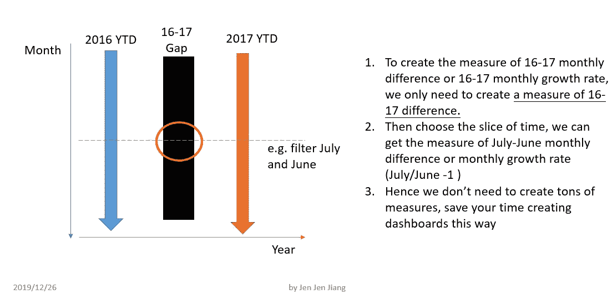
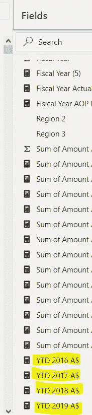
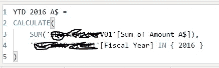
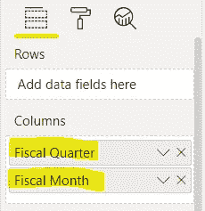
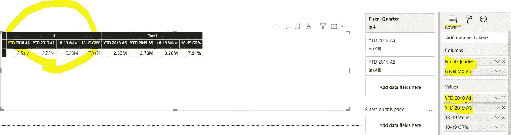

# 在 Power BI 上有效创建测量并提高仪表板工作效率的技巧

> 原文：<https://medium.com/analytics-vidhya/the-tips-to-create-measures-efficiently-on-power-bi-and-improve-the-efficiency-of-your-dashboard-bf5a4abf0a7a?source=collection_archive---------7----------------------->

在 [Unsplash](https://unsplash.com?utm_source=medium&utm_medium=referral) 上由 [Aron 视觉](https://unsplash.com/@aronvisuals?utm_source=medium&utm_medium=referral)拍摄的照片

# 创造措施的努力

作为一名数据分析师，您面临一个问题，您需要使用图表为仪表板创建度量。如果不仅有废除数据的请求，而且有季度、月、日甚至小时数据的请求，您将如何创建度量？你应该创建所有的文件并定期更新吗？答案是否定的，我将向您展示如何为所有粒度创建一次度量，并提高您的仪表板工作的效率。

# 创建度量的解决方案概念

这是创建度量的概念。对于时间维度来说，是一个连续的数据集。对于任何粒度，都是这条连续线上的一个点或者一个槽。所以关键是你只需要在最长的持续时间内积累数据，比如每年的数量。然后你可以通过一个过滤器选择你需要的时间段，并根据最长时间段的测量值创建另一个测量值，这完全取决于你的需要。

时间档措施的概念

# 创造措施的示范

# 1.累积最长持续时间的数据

这里我们有最常见的定义，年度数据。

累计最长持续时间的金额

在 Power BI 桌面上单击“创建度量”,您可以使用 DAX 创建度量并设置条件。或者退一步回到原始数据，您可以在原始数据中修改或创建一列年度数据。

# 2.使用筛选器或为图表设置类别，数据将根据您的设置自动展开

设置为季度或月度视点

建立年度度量后，您可以创建图表并设置列。假设我们希望基于之前创建的度量创建季度和月度视图。在下面的图表中，您可以看到我将年度度量放在值区域中，并使用季度和月份列作为视图。这样，您只需要创建年度数据，并灵活地使用小粒度来定制您的报告，而无需创建大量的度量。这种方式也支持下钻功能。

我希望这篇文章能节省您构建仪表板的时间，尤其是创建度量的时间。