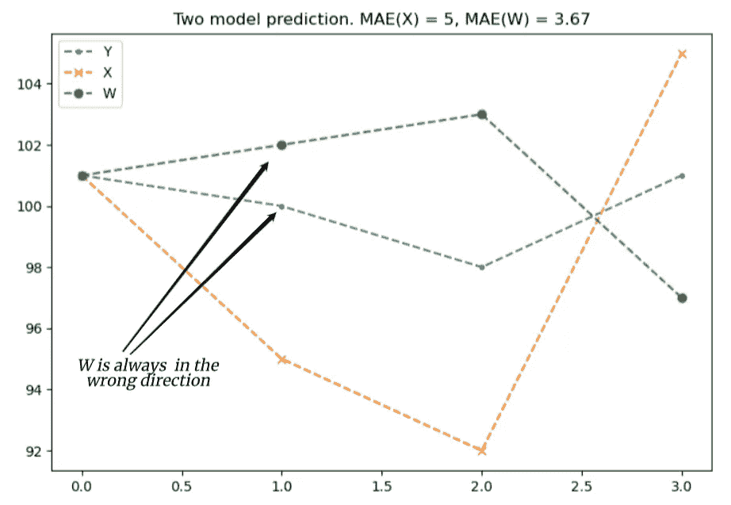
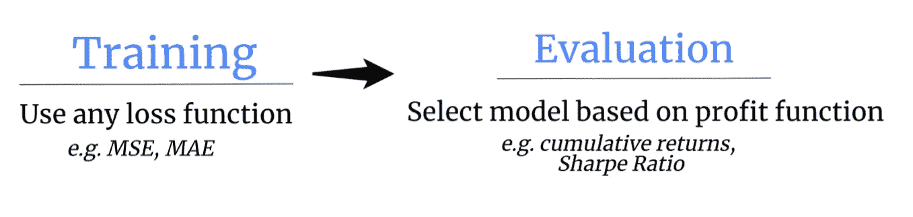

# 培训困境:损失与利润函数？

> 原文：<https://medium.com/analytics-vidhya/the-training-dilemma-loss-vs-profit-function-bf98a93cc284?source=collection_archive---------9----------------------->

## 用于股票预测应用的调谐机器学习模型

## 介绍

在机器学习的世界中，通过最小化损失函数的一些变化来训练模型。例如，当我们试图预测特定邮政编码的中值房价时，我们正在处理一个回归类型的问题，用于训练我们模型的损失函数的主要嫌疑函数是均方误差(MSE)、平均绝对误差(MAE)或平均绝对百分比误差(MAPE)函数。

继续我们的例子，假设我们使用 MAE 训练我们的模型，并选择在总共 N 个参数组合上执行网格搜索。为了选择最佳模型，通常的做法是查看哪组参数产生最低的 MAE。

> 相同的误差度量用于训练和评估我们的模型。

这在培训、评估和我们如何在实践中实际使用该模型之间建立了一种一致性。假设平均绝对误差为$50K，这是有意义的，并且有明确的解释，我们预计实际值为预测值的+/-50K。

## 股票预测模型是不同的

然而，在股票预测中，事情稍微复杂一些，现在你可能想知道为什么。首先，在股票交易(或一般的投资)中，我们感兴趣的是利润，这比仅仅使用预测要复杂得多。因此，错误信息变得不太相关，我们将在下面演示。请思考一下，在谈到股票预测模型时，以下哪种说法会让您感觉更舒服或最能引起您的共鸣

*   最好的模型实现了 12.5 的 MAE
*   最好的模型实现了 23%的累积回报率

很明显，第二句话表达了我们实际上想要实现的目标。信息量更大。其实一个模型的值 MAE = 12.5 是什么意思？我们不确定这些信息如何转化为利润。更重要的是，不能保证误差最低的模型就是利润最高的模型。

## **为什么？**

当我们使用损失函数训练模型，并相应地使用相同的指标选择最佳模型时，我们在过程方面是一致的，但是，这不一定符合我们的实际目标，即(通常)利润最大化！

> 损失最小化并不一定意味着利润最大化。

为什么会这样，有一个很重要的原因。主要使用的损失函数，如 MAE、MSE、MAPE，都是 ***对称误差函数*** ，意思是无论你从“上面”还是“下面”逼近真值，它们都是“盲的”。例如，当使用 MAE 时，如果真实价格是 100，价格预测 102 和 98 一样好，因为两个预测都给出 MAE = 2。然而，当交易时，两者中只有一个是盈利的，而另一个是亏损的！

为了使上面的想法更具体，考虑以下四天价格序列的例子

*   **Y** = [101，100，98，101]，

和最后三个样本的两个可能预测，

*   **X**=【95，92，105】，以及
*   **W**=【102，103，97】，

都是第一天生成的，当时价格是 101。 **X** 相对于 **Y** 的最后三个样本的平均绝对误差(MAE)为 5(即(| 100–95 |+| 98–92 |+| 101–105 |)/3)，而 **W** 的误差为 3.67。然而， **X** 在 **Y** 的价格运动方向上总是正确的，也就是说，当价格确实上涨时，它的预测总是比 **Y** 的先前价格高(或低)。fall ),而 **W** 总是错误的。下面的图 1 显示了上述情况。

图一。展示了两个模型的预测。与模型 W 相比，模型 X 具有更高的平均绝对误差(MAE ),然而，模型 X 总是在正确的方向上预测(即，在 Y 的相同方向上)。相反，W 总是错的(即当 Y 上升(下降)，W 预测下降(上升))。

因此，通过使用 MAE 进行训练和评估，我们将选择模型 **W** (其误差较低，但利润为零)，尽管事实上 **X** 的预测更有利可图，尽管误差更大。

> 误差最低的型号不是利润最高的型号！

## 交易需要方向

这里发生了什么？误差最低的型号怎么不是利润最高的型号？让我们深入了解一下。

如果你还记得，我们用 ***对称*** 这个词来描述损失函数，这正是失败的地方。对称误差函数没有考虑*方向，即它们同样对待正值和负值(如上面的例子所示)，这在做交易决策时至关重要。*

*这让我们回到了最初的问题:*我们真的应该使用损失函数来训练和评估我们的模型吗？这是一个相当有趣但很难回答的问题。鉴于以上讨论，让我们把问题分成两部分:(a)培训，(b)评估。**

*   *(a)不幸的是，在训练模型时，没有一个经过验证的度量标准既考虑了利润最大化又考虑了误差最小化。所以这里不存在两难问题。目前，我们坚持使用任何(对称)损失函数进行训练(这实际上是一个活跃的研究领域，试图创建一个包含方向和幅度的损失函数)。*
*   *(b)然而，在评估期间，我们 ***可以*** 实际改变度量。我们不应该选择误差最小的模型，而应该考虑利润最高的模型(可以用各种方式定义，平均或累积回报、夏普比率或其他形式)。*

*通过这样做，在上面的例子中，我们将选择最有利可图的模型(X ),这正是我们最终想要的。*

## *我们取得了什么成就？*

*嗯，我们正在根据我们的目标调整我们的选择标准。如果我们的目标是通过利用我们的预测来最大化利润，那么我们最好选择这样做的最佳模型(至少在样本中)。很清楚地说明我的模型在样本中产生了 X%的回报，然后说明我的模型的 MAE 为 12.5(这很好，但我该怎么办呢？)*

## ***选择框架***

*提议的框架很简单。*

*   *使用任何损失函数训练模型，然后，*
*   *使用任何基于利润的指标选择最佳模型。*

**

*图二。选择框架。*

*通过在训练中使用损失函数，我们确保我们的预测尽可能接近实际值。然后，在评估阶段，我们通过我们最喜欢的交易策略(或者甚至是优化模型)来运用这些预测。只有到那时，我们才能知道这些预测实际上是好是坏。*

*这需要在评估阶段结合你的交易模型来计算利润。无论您打算通过简单地应用基本的上下方向交易策略还是更复杂的[基于分布的交易策略](/swlh/stock-trading-strategy-utilizing-the-distribution-of-predicted-returns-ff5051f13bec)来使用预测，所有这些都必须在评估期间纳入。*

*上述过程至少确保了我们按照预期使用预测。如果你想了解更多，请看这篇[论文](https://www.sciencedirect.com/science/article/pii/S1568494620305056)，它使用了上述框架并产生了很好的结果。*

> *股票预测模型应该进行调整，以优化盈利能力而不是准确性*

## ***结论***

*希望我们揭示了使用对称误差函数(如 MSE 或 MAE)来训练和评估股票预测模型时的一些陷阱，并建议了一个与我们的最终目标更好地一致的框架。在我们想出一个也能提高盈利能力的损失函数之前，我们应该想办法选择一个最符合我们预期用途的模型:盈利。*