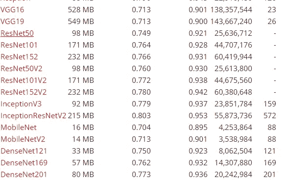
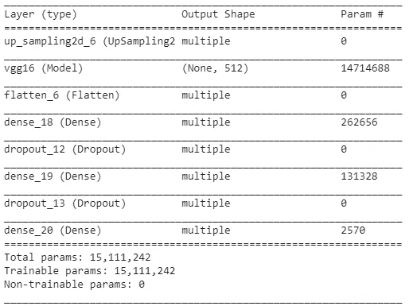
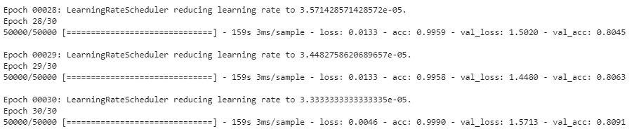
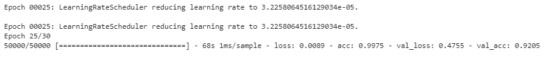
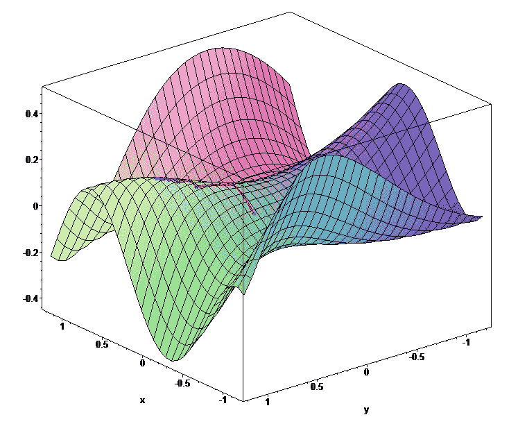

# VGG16 和 Cifar 10 数据集的迁移学习体验

> 原文：<https://medium.com/analytics-vidhya/the-transfer-learning-experience-with-vgg16-and-cifar-10-dataset-9b25b306a23f?source=collection_archive---------4----------------------->


摘自[http://www . the blue diamond gallery . com/wood-tile/t/transfer . html](http://www.thebluediamondgallery.com/wooden-tile/t/transfer.html)尼克·扬森

**摘要**

在这篇博客中，我将讲述我如何通过使用迁移学习，使用 Cifar-10 获得超过 88%的准确率(92% epoch 22)，我使用了 VGG16，应用了非常低的恒定学习速率，并实现了上采样功能，以获得更多的数据点进行处理

**简介**

如今，我们正处于机器学习的大好时光，我们有许多著名的模型，它们都有很好的结果，可以快速准确地做出预测。因此，我们应该将这些工具应用到我们的日常预测中，关注我们模型的目标，而不仅仅是 it 的足迹。为此，我们需要了解我们的数据集，并尝试应用正确的模型，对数据集进行必要的预处理，并在必要时对那些著名的模型进行修正。

**材料和方法**

在本练习中，我使用了:

Keras 1.12

使用 GPU 的 Colab:对我来说是我见过的编译和训练模型的最佳选择(性价比高)。是 Jupyter 保存在 drive 或者上传到 GitHub。

VGG16 模型:我选择这个模型是因为我认为，如果我使用 dense121 或 resnet50 这样的更深入的模型，这个模型的精度还不错，在这个实践中的结果非常好，我与 dense121 进行了比较，它们之间的精度差异只有 0.08%。



摘自[https://keras.io/api/applications/](https://keras.io/api/applications/)

Cifar 10 数据集:*“由 10 类 60000 张 32x32 的彩色图像组成，每类 6000 张。有 50000 个训练图像和 10000 个测试图像。”*

Upsampling2D:用于获取每个图像的更多数据点的方法

冻结所有的 VGG16 模型:我试着在一些层上获得更高的精确度，但是训练的时间增加了很多，结果几乎是一样的。

恒定学习率:我尝试使用学习率衰减，但结果不太好，我将在后面讨论。

**结果**

应用 VGG16 模型的结果增加了两层并具有常数学习



模型摘要

随着学习率衰减:



在恒定的学习速率下:



我们可以看到，我用恒定的学习率得到 92.05%，而不是用学习率衰减得到 80.9%。我添加了 2 层 ReLU 激活和 1 层 softmax。

**讨论**

对我来说，最重要的是实现一个非常低的恒定学习率，这可能是因为模型是用“imagenet”训练的，应用梯度下降的步骤不应该很大，因为我们可能会进入一个不是真正最小值的区域(见图，模型应该试图获得最小值，但在某些情况下可能会卡在不是最小值的低点， 我们可以看到只有一个点试图向下)另一个重要的点是预处理，因为 cifar 10 有低分辨率的图像，我们不能从它们身上取很多点，为此，上采样对提高精度有很大帮助。



**参考书目**

吴恩达视频【https://www.youtube.com/watch?v=FQM13HkEfBk index = 20&list = plk DAE 6 sczn 6 GL 29 AOE 31 wdvwsg-KnDzF

Santiago VG[https://medium . com/@ svelez . velez Garcia/transfer-learning-ride-fa 9 f2a 5d 69 EB](/@svelez.velezgarcia/transfer-learning-ride-fa9f2a5d69eb)

[](https://towardsdatascience.com/a-comprehensive-hands-on-guide-to-transfer-learning-with-real-world-applications-in-deep-learning-212bf3b2f27a) [## 在深度学习中通过真实世界的应用转移学习的综合实践指南

### 用知识转移的力量进行深度学习！

towardsdatascience.com](https://towardsdatascience.com/a-comprehensive-hands-on-guide-to-transfer-learning-with-real-world-applications-in-deep-learning-212bf3b2f27a) 

Keras 应用[https://keras.io/api/applications/](https://keras.io/api/applications/)

**附录**

```
"""This script has the methodpreprocess_data(X, Y): and decayand use transfer learning with VGG16 model"""import tensorflow.keras as Kimport datetimedef preprocess_data(X, Y):
""" This method has the preprocess to train a model """# applying astype to change float64 to float32 for version 1.12# X = X.astype('float32')#using preprocess VGG16 method by default to scale images and their valuesX_p = K.applications.vgg16.preprocess_input(X)# changind labels to one-hot representationY_p = K.utils.to_categorical(Y, 10)return (X_p, Y_p)def decay(epoch):""" This method create the alpha"""# returning a very small constant learning ratereturn 0.001 / (1 + 1 * 30)if __name__ == "__main__":# loading data and using preprocess for training and validation dataset(Xt, Yt), (X, Y) = K.datasets.cifar10.load_data()X_p, Y_p = preprocess_data(Xt, Yt)Xv_p, Yv_p = preprocess_data(X, Y)# Getting the model without the last layers, trained with imagenet and with average poolingbase_model = K.applications.vgg16.VGG16(include_top=False,weights='imagenet',pooling='avg',input_shape=(32,32,3))# create the new model applying the base_model (VGG16)model= K.Sequential()# using upsamplign to get more data points and improve the predictionsmodel.add(K.layers.UpSampling2D())model.add(base_model)model.add(K.layers.Flatten())model.add(K.layers.Dense(512, activation=('relu')))model.add(K.layers.Dropout(0.2))model.add(K.layers.Dense(256, activation=('relu')))model.add(K.layers.Dropout(0.2))model.add(K.layers.Dense(10, activation=('softmax')))# adding callbackscallback = []callback += [K.callbacks.LearningRateScheduler(decay, verbose=1)]#callback += [K.callbacks.ModelCheckpoint('cifar10.h5',#                                         save_best_only=True,#                                        mode='min'#                                         )]# tensorboard callback# log_dir = "logs/fit/" + datetime.datetime.now().strftime("%Y%m%d-%H%M%S")# callback += [K.callbacks.TensorBoard(log_dir=log_dir, histogram_freq=1)]# Compiling model with adam optimizer and looking the accuracymodel.compile(optimizer='adam', loss='categorical_crossentropy',metrics=['accuracy'])# training model with mini batch using shuffle datamodel.fit(x=X_p, y=Y_p,batch_size=128,validation_data=(Xv_p, Yv_p),epochs=30, shuffle=True,callbacks=callback,verbose=1)
```

[https://github . com/PauloMorillo/holbertonschool-machine _ learning/blob/master/supervised _ learning/0x 09-transfer _ learning/0-transfer . py](https://github.com/PauloMorillo/holbertonschool-machine_learning/blob/master/supervised_learning/0x09-transfer_learning/0-transfer.py)