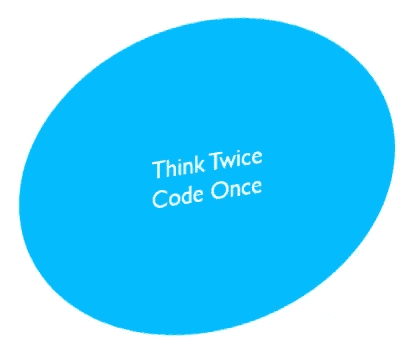

# 一个编程初学者的陷阱。

> 原文：<https://medium.com/analytics-vidhya/the-traps-in-a-way-of-a-programming-beginners-5be183546662?source=collection_archive---------14----------------------->

作为一名程序员，我想为所有编程初学者保留几个要点，以便用正确的方法学习编程语言。

[张肯尼](https://unsplash.com/@kennyzhang29?utm_source=medium&utm_medium=referral)在 [Unsplash](https://unsplash.com?utm_source=medium&utm_medium=referral) 上拍照

T 这些学习概念真的可以改变你对编程语言的思考方式。如果你正在努力学习一门编程语言，想成为一名优秀的程序员，那么请避免犯这些错误。

检查你自己！！！你中圈套了吗？

## 不要跳过基本的-

当你决定学习一门编程语言时，如果你想在学习之初尽快在你的计算机屏幕上看到一个正在运行的软件。那你已经被困住了。

从基础开始，用你的知识永远记住它，这就是关于编程语言的全部，因为仅仅写代码而不理解是不够的。因此，如果我们编写代码，那么我们理解代码是如何工作的总是必要的。

程序员对编程语言的基本概念有很强的理解是非常重要的。

例如:知道如何创建一个对象是一个非常基本的概念，但是什么时候创建一个新对象，什么时候不创建是非常重要的，它如何占用内存以及所有相关的概念实际上是一个真正的基础。所以仅仅知道如何创建一个对象是远远不够的。

## 不要跳过代码练习

你可能在想，读完理论之后，你已经学会了编程概念。那你已经被困住了。

坚持阅读理论，跳过编写代码，因为这是编程初学者最大的错误之一。

编程就是写代码，仅仅阅读概念肯定是不够的，不这样做你学不到任何东西，只有阅读理论才是这样。

这个错误的缺点会导致完全浪费时间和精力。

举例来说，即使不是太空科学家，我们也可能在理论上知道如何将卫星发送到另一个星球。我们真的知道如何实现它吗？

## 不要试图记住所有的事情-

如果你曾经试图记住编程语言中的代码和概念。这不是一个错误，实际上，这是完全错误的，这根本不需要。

你不需要记住编程中的任何概念，因为学习基础知识而不是跳过所有你学习或阅读的概念的代码练习，可以让你记住这些概念。

如果你总是忘记语法，那真的没关系，继续写代码，继续练习代码。这是肯定有效的，因为除了坚持写作，没有其他捷径或解决方法。

## 不要在思考之前就开始写代码-

关于它有一句名言，每个程序员都应该接受和应用。

## 问题是为什么？

对于有经验的程序员来说，有时试凑法也能为他们找到代码逻辑。

当反复试验成为一种实践时，这是很严重的，这种错误作为一种习惯会使你永远效率低下，直到你改变编写代码的思维方式。

“三思而后行，一次编码”的意思，其实就是先准备一个逻辑，再写代码。

## 这个怎么应用？

不要把“屡试不爽”当成惯例。你应该在写作前先思考。总的想法是尽量减少执行次数。这种做法将节省更多的时间，并使你更有效率，这种习惯真的可以使你在逻辑上理解别人写的代码。

马丁·w·柯斯特在 [Unsplash](https://unsplash.com?utm_source=medium&utm_medium=referral) 上的照片