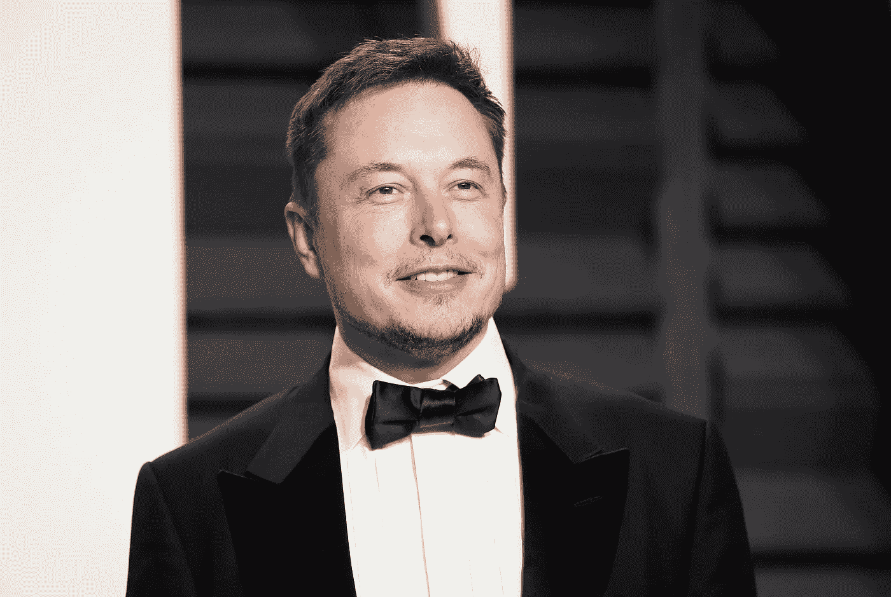

# 机器学习的类型

> 原文：<https://medium.com/analytics-vidhya/the-two-types-of-machine-learning-c7ecf3de98d5?source=collection_archive---------27----------------------->

在实践中，有两种主要类型的机器学习算法:监督的和非监督的。

*   依赖于训练数据集的算法称为监督机器学习算法。基于这个数据集，它发现某些输入和它们各自的输出之间的关联。
*   无监督的机器学习算法侧重于根据相似性对某些值或对象进行聚类。

让我们以谷歌的“面孔”功能为例，深入了解这些算法的直觉，以消除上述定义可能存在的任何混淆。如前所述，Google 相册应用中的“面孔”功能可以识别出你所有照片中经常出现的各种人物。

谷歌可以采取两种不同的方法在其软件中实现这一功能。

首先，它可能已经实现了监督机器学习算法。要做到这一点，谷歌需要访问一个训练数据集，其中包含所有出现在你图像中的不同的人，以及一个标签或算法应该做出的预测——在这种情况下，是名字。下面显示了一个示例:

**吴恩达**

**埃隆马斯克**

在这个模型中，算法本质上是寻找输入(图像)和输出(名称)之间的关联。例如，它会声明标签**【吴恩达】**具有*这组*五官，而标签**埃隆马斯克****具有*这组*五官。稍后，当该算法实际上在你的一个图像上执行时，它会做相反的事情。它将识别出*这个*特定的人具有一组与标签吴恩达的面部特征极其相似的面部特征。因此，这个人*很有可能就是*吴恩达。**

**然而，对于这个特定的功能，谷歌实现监督机器学习算法是不现实的。谷歌没有真正的方法来获得完整的训练数据集，每个人都有望出现在你的相机胶卷中，因为这对你和谷歌来说都是高度不可预测的。因此，谷歌实现无监督的机器学习算法更为现实。**

**无监督的机器学习算法不能访问任何训练数据集。相反，它执行聚类分析来查找具有相似面部特征的面部图像。下面显示了一个示例:**

************

****吴恩达****

**该算法将检测到所有这些面部具有极其相似的特征，并且它们很有可能属于同一标签。这就是谷歌在其“面孔”功能中实现的功能。事实上，有证据表明谷歌使用了无监督的机器学习算法。例如，在这个功能中，谷歌有时会询问它是否正确地对某张不确定的脸进行了分组。只有当它预测这张脸属于那个人的概率很低，并且只是要求确保它的预测正确时，它才会这样做。另一个证据是，谷歌要求你提供一个新的人的名字。这进一步支持了一个命题，即谷歌不是通过有监督的机器学习算法找到标签和图像之间的相似性，而是在无监督的机器学习算法中找到多个图像之间的相似性。**

**除此之外，还有另一种类型的强化学习，我会在我的下一篇博客中介绍它…**