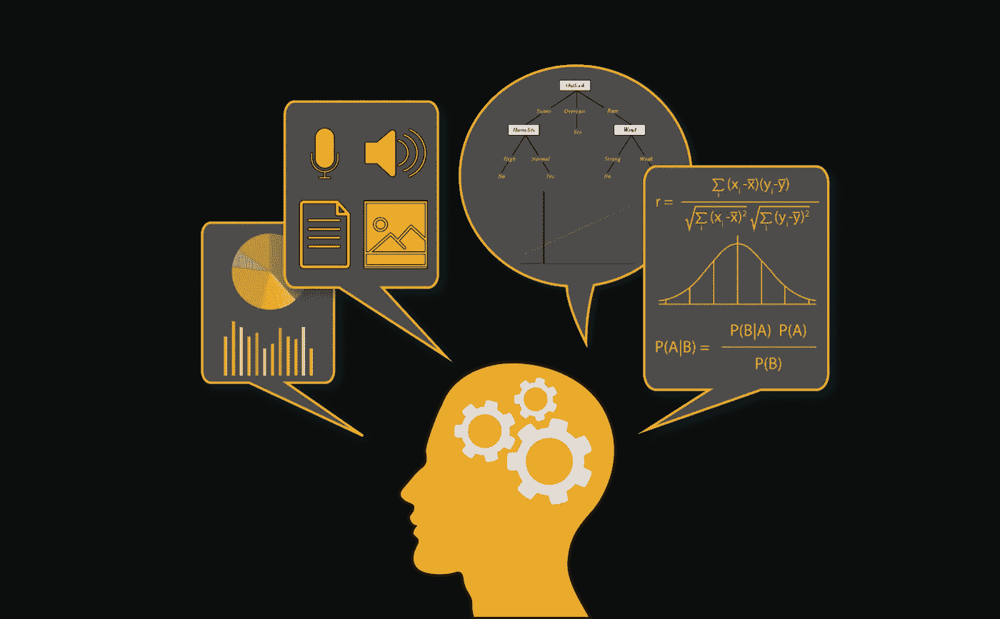

# 过度拟合、欠拟合和降维的终极指南。

> 原文：<https://medium.com/analytics-vidhya/the-ultimate-guide-of-over-fitting-under-fitting-and-dimensionality-reduction-28f44f632768?source=collection_archive---------11----------------------->

让我们考虑我们正在设计一个机器学习模型。如果一个模型以适当的方式概括了来自问题领域的任何新的输入数据，那么它就是一个好的机器学习模型。这有助于我们对未来的数据进行预测，这是数据模型从未见过的。现在，假设我们想检查我们的机器学习模型学习得有多好…