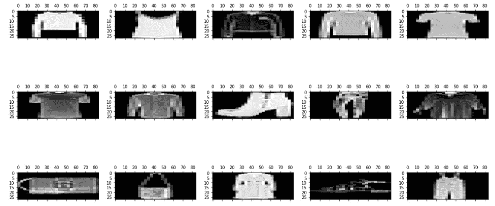
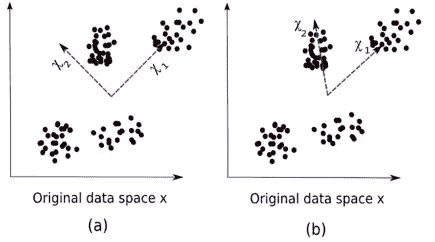
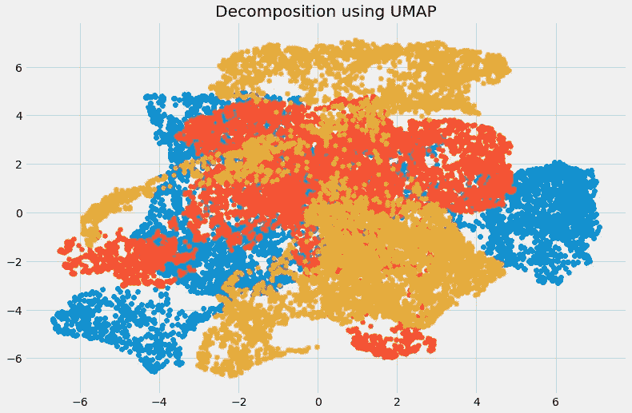

# 12 种降维技术的终极指南(带 Python 代码)

> 原文：<https://medium.com/analytics-vidhya/the-ultimate-guide-to-12-dimensionality-reduction-techniques-with-python-codes-2c2afdbc09e3?source=collection_archive---------1----------------------->

您曾经处理过包含一千多个要素的数据集吗？超过 5 万的特性怎么样？我有，让我告诉你这是一个非常具有挑战性的任务，尤其是如果你不知道从哪里开始！拥有大量变量既是一件好事，也是一件坏事。我们有大量数据可供分析，这很好，但由于规模太大，这很有挑战性。

在微观层面上分析每一个变量是不可行的。我们可能需要几天或几个月的时间来执行任何有意义的分析，并且我们会为我们的业务损失大量的时间和金钱！更不用说这将需要大量的计算能力。我们需要一种更好的方法来处理高维数据，以便我们可以快速从中提取模式和见解。那么我们如何处理这样一个数据集呢？


当然是使用降维技术。您可以使用这一概念来减少数据集中的要素数量，而不必丢失太多信息并保持(或提高)模型的性能。正如您将在本文中看到的，这是处理大型数据集的一种非常强大的方法。

这是一个全面的指南，介绍各种可以在实际场景中使用的降维技术。在深入探讨我提到的 12 种不同的技术之前，我们将首先理解这个概念是什么以及为什么我们应该使用它。每种技术都有自己的 Python 实现，可以让您很好地熟悉它。

# 目录

1.  什么是降维？
2.  为什么需要降维？
3.  常见降维技术
    3.1 缺失值比率
    3.2 低方差滤波器
    3.3 高相关滤波器
    3.4 随机森林
    3.5 后向特征消除
    3.6 前向特征选择
    3.7 因子分析
    3.8 主成分分析
    3.9 独立成分分析
    3.10 基于投影的方法
    3.11t-分布式随机邻居嵌入(t-SNE)
    3.12 UMAP
4.  各种降维技术的应用

# 1.什么是降维？

我们每天都在生成大量的数据。事实上，世界上 90%的数据都是在最近 3-4 年内生成的！这些数字确实令人难以置信。以下是正在收集的数据类型的一些示例:

*   脸书收集你喜欢的东西、分享的内容、发布的内容、你去过的地方、你喜欢的餐馆等数据。
*   你的智能手机应用程序会收集你的大量个人信息
*   亚马逊收集你购买、浏览、点击等的数据。在他们的网站上
*   赌场会跟踪每位顾客的一举一动

随着数据生成和收集的不断增加，可视化和推断变得越来越具有挑战性。最常见的可视化方法之一是通过图表。假设我们有两个变量，年龄和身高。我们可以使用年龄和身高之间的散点图或线图，并轻松地将它们的关系可视化:


现在考虑这样一种情况，假设我们有 100 个变量(p=100)。在这种情况下，我们可以有 100(100–1)/2 = 5000 个不同的图。将它们分别形象化没有多大意义，对吗？在我们有大量变量的情况下，最好选择这些变量的子集(我们将使用 AV 的 [**练习题:Big Mart Sales III**](https://datahack.analyticsvidhya.com/contest/practice-problem-big-mart-sales-iii/) 中的数据集(在此链接上注册并从数据部分下载数据集)。

3.常见的降维技术


降维有两种不同的方式:


通过只保留原始数据集中最相关的变量(这种技术称为特征选择)

# 通过寻找一个更小的新变量集，每个变量都是输入变量的组合，包含与输入变量基本相同的信息(这种技术被称为降维)

我们现在来看看各种降维技术，以及如何用 Python 实现它们。

*   3.1 缺失值比率
*   假设给你一个数据集。你的第一步是什么？在构建模型之前，您自然会希望首先探索数据。浏览数据时，您发现数据集缺少一些值。现在怎么办？您将尝试找出这些缺失值的原因，然后估算它们或完全删除有缺失值的变量(使用适当的方法)。
*   如果我们有太多的缺失值(比如超过 50%)怎么办？我们应该估算缺失值还是丢弃变量？我倾向于删除变量，因为它没有太多的信息。然而，这并不是一成不变的。我们可以设置一个阈值，如果任何变量中缺失值的百分比超过该阈值，我们将删除该变量。
*   让我们用 Python 实现这种方法。
*   首先，让我们加载数据:

*注意:读取数据时需要添加文件的路径。*

# 现在，我们将检查每个变量中缺失值的百分比。我们可以用*。isnull()。sum()* 来计算这个。

正如您在上表中看到的，没有太多的丢失值(实际上只有两个变量有它们)。我们可以使用适当的方法估算这些值，或者我们可以设置一个阈值，比如说 20%，并删除丢失值超过 20%的变量。让我们看看如何在 Python 中实现这一点:

*   所以要使用的变量存储在“variable”中，它只包含那些缺失值小于 20%的特征。
*   3.2 低方差滤波器

考虑我们数据集中的一个变量，其中所有的观察值都相同，比如说 1。如果我们使用这个变量，你认为它能改进我们将要建立的模型吗？答案是否定的，因为这个变量的方差为零。

# 所以，我们需要计算每个变量的方差。然后删除与数据集中的其他变量相比方差较小的变量。这样做的原因，正如我上面提到的，是因为方差低的变量不会影响目标变量。

让我们首先使用已知 *Item_Weight* 观察值的中值来估算 *Item_Weight* 列中的缺失值。对于 *Outlet_Size* 列，我们将使用已知 *Outlet_Size* 值的模式来估算缺失值:

让我们检查是否所有缺失的值都已填充:

瞧啊。我们都准备好了。现在让我们计算所有数值变量的方差。

```
# import required libraries 
import pandas as pd 
import numpy as np 
import matplotlib.pyplot as plt
```

如上面的输出所示，与其他变量相比， *Item_Visibility* 的方差非常小。我们可以安全地删除这个列。这就是我们如何应用低方差滤波器。让我们用 Python 来实现它:

```
# read the data 
train=pd.read_csv("Train_UWu5bXk.csv")
```

上面的代码给出了方差大于 10 的变量列表。

3.3 高相关性滤波器

```
# checking the percentage of missing values in each variable train.isnull().sum()/len(train)*100
```


两个变量之间的高度相关性意味着它们具有相似的趋势，并且可能携带相似的信息。这可能会大大降低某些模型的性能(例如，线性和逻辑回归模型)。我们可以计算本质上是数值的独立数值变量之间的相关性。如果相关系数超过某个阈值，我们可以删除其中一个变量(删除一个变量是非常主观的，应该始终记住这个域)。

```
# saving missing values in a variable 
a = train.isnull().sum()/len(train)*100 
# saving column names in a variable 
variables = train.columns 
variable = [ ] 
for i in range(0,12):
    if a[i]<=20:   #setting the threshold as 20%
        variable.append(variables[i])
```

一般来说，我们应该保留那些与目标变量表现出良好或高度相关性的变量。

# 让我们用 Python 来执行相关计算。我们将首先删除因变量( *Item_Outlet_Sales* )，并将剩余变量保存在新的数据框架( *df* )中。

太好了，我们的数据集中没有任何高度相关的变量。通常，如果一对变量之间的相关性大于 0.5–0.6，我们应该认真考虑去掉其中一个变量。

3.4 随机森林

随机森林是最广泛使用的特征选择算法之一。它具有内置的特性重要性，因此您不需要单独编程。这有助于我们选择更小的特征子集。

```
train['Item_Weight'].fillna(train['Item_Weight'].median, inplace=True) train['Outlet_Size'].fillna(train['Outlet_Size'].mode()[0], inplace=True)
```

我们需要通过应用一个热编码将数据转换成数字形式，因为随机森林(Scikit-Learn 实现)只接受数字输入。让我们也放弃 ID 变量( *Item_Identifier* 和 *Outlet_Identifier* )，因为它们只是唯一的数字，目前对我们来说并不重要。

```
train.isnull().sum()/len(train)*100
```


拟合模型后，绘制特征重要性图:

```
train.var()
```


基于上图，我们可以手动选择最顶端的特征来降低数据集中的维度。或者，**我们可以使用 *sklearn* 的 *SelectFromModel* 来完成此操作**。它根据权重的重要性选择特征。

```
numeric = train[['Item_Weight', 'Item_Visibility', 'Item_MRP', 'Outlet_Establishment_Year']]
var = numeric.var()
numeric = numeric.columns
variable = [ ]
for i in range(0,len(var)):
    if var[i]>=10:   #setting the threshold as 10%
       variable.append(numeric[i+1])
```

3.5 反向特征消除

# 按照以下步骤理解和使用“反向特征消除”技术:

我们首先获取数据集中存在的所有 n 个变量，并使用它们来训练模型

然后，我们计算模型的性能

现在，我们在消除每个变量(n 次)后计算模型的性能，即，我们每次丢弃一个变量，并在剩余的 n-1 个变量上训练模型

```
df=train.drop('Item_Outlet_Sales', 1) 
df.corr()
```


我们确定移除后对模型性能产生最小(或没有)变化的变量，然后删除该变量

# 重复这个过程，直到没有变量可以删除

**该方法可用于建立线性回归或逻辑回归模型**。让我们看看它的 Python 实现:

我们需要指定要选择的算法和特征数量，并从向后特征消除中获取变量列表。我们还可以使用“ *rfe.ranking_* ”命令来检查变量的排名。

```
from sklearn.ensemble import RandomForestRegressor
df=df.drop(['Item_Identifier', 'Outlet_Identifier'], axis=1)
model = RandomForestRegressor(random_state=1, max_depth=10)
df=pd.get_dummies(df)
model.fit(df,train.Item_Outlet_Sales)
```

3.6 前进功能选择

```
features = df.columns
importances = model.feature_importances_
indices = np.argsort(importances)[-9:]  # top 10 features
plt.title('Feature Importances')
plt.barh(range(len(indices)), importances[indices], color='b', align='center')
plt.yticks(range(len(indices)), [features[i] for i in indices])
plt.xlabel('Relative Importance')
plt.show()
```


这是我们上面看到的反向特征消除的相反过程。我们不是消除特征，而是试图找到改善模型性能的最佳特征。这项技术的工作原理如下:

```
from sklearn.feature_selection import SelectFromModel
feature = SelectFromModel(model)
Fit = feature.fit_transform(df, train.Item_Outlet_Sales)
```

# 我们从一个单一的特征开始。本质上，我们分别使用每个特征训练模型 n 次

给出最佳性能的变量被选为起始变量

*   然后我们重复这个过程，一次添加一个变量。产生最高性能增长的变量被保留
*   我们重复这个过程，直到模型的性能没有明显的改善
*   让我们用 Python 实现它:
*   这将返回一个数组，其中包含变量的 F 值以及与每个 F 值对应的 p 值。参考[此链接](http://www.statisticshowto.com/probability-and-statistics/f-statistic-value-test/)了解更多关于 F 值的信息。出于我们的目的，我们将选择 F 值大于 10 的变量:
*   这给了我们基于前向特征选择算法的最上面的变量。

**注意** : **后向特征消除和前向特征选择都是耗时且计算量大的**。它们实际上仅用于具有少量输入变量的数据集。

```
from sklearn.linear_model import LinearRegression
from sklearn.feature_selection import RFE
from sklearn import datasets
lreg = LinearRegression()
rfe = RFE(lreg, 10)
rfe = rfe.fit_transform(df, train.Item_Outlet_Sales)
```

到目前为止，我们所看到的技术通常在我们的数据集中没有大量变量时使用。这些或多或少都是特征选择技术。在接下来的部分中，我们将使用时尚 MNIST 数据集，该数据集由属于不同类型服装的图像组成，例如 t 恤、裤子、包等。**数据集可以从** [**中下载识别服装**](https://datahack.analyticsvidhya.com/contest/practice-problem-identify-the-apparels/) **练习题。**

# 该数据集总共有 70，000 幅图像，其中 60，000 幅在训练集中，其余 10，000 幅是测试图像。就本文的范围而言，我们将只研究训练图像。训练文件是 zip 格式的。解压缩 zip 文件后，您将获得一个. csv 文件和一个包含这 60，000 张图像的 train 文件夹。每个图像的相应标签可以在“train.csv”文件中找到。

3.7 因素分析

*   假设我们有两个变量:收入和教育。这些变量可能具有很高的相关性，因为受教育程度较高的人往往收入明显较高，反之亦然。
*   在因子分析技术中，变量按照它们的相关性进行分组，即特定组中的所有变量在它们之间具有高相关性，但是与其他组的变量具有低相关性。在这里，每个组被称为一个因子。与数据的原始维度相比，这些因素的数量很少。然而，这些因素很难观察到。
*   让我们首先读入火车文件夹中包含的所有图像:
*   注意:你必须用你的 train 文件夹的路径替换 glob 函数中的路径。

现在我们将把这些图像转换成一个 *numpy* 数组格式，这样我们就可以执行数学运算并绘制图像。

```
from sklearn.feature_selection import f_regression
ffs = f_regression(df,train.Item_Outlet_Sales )
```

正如你在上面看到的，这是一个三维数组。我们必须将其转换为一维，因为所有即将出现的技术都只接受一维输入。为此，我们需要使图像变平:

```
variable = [ ]
for i in range(0,len(df.columns)-1):
    if ffs[0][i] >=10:
       variable.append(df.columns[i])
```

现在让我们创建一个数据帧，包含每幅图像中每个像素的像素值，以及它们对应的标签(对于标签，我们将使用 *train.csv* 文件)。

现在，我们将使用因子分析来分解数据集:

这里， *n_components* 将决定变换数据中的因子数量。转换数据后，是时候可视化结果了:

看起来很神奇，不是吗？我们可以在上图中看到所有不同的因素。这里，x 轴和 y 轴表示分解因子的值。正如我前面提到的，很难单独观察这些因素，但是我们已经成功地降低了数据的维度。

# 3.8 主成分分析

PCA 是一种帮助我们从现有的大量变量中提取一组新变量的技术。这些新提取的变量被称为主成分。你可以参考[这篇文章](https://www.analyticsvidhya.com/blog/2016/03/practical-guide-principal-component-analysis-python/)了解更多关于 PCA 的知识。作为快速参考，以下是您在继续下一步之前应该了解的关于 PCA 的一些要点:

主成分是原始变量的线性组合

提取主成分的方式是第一个主成分解释数据集中的最大方差

```
import pandas as pd
import numpy as np
from glob import glob
import cv2
images = [cv2.imread(file) for file in glob('train/*.png')]
```

第二主成分试图解释数据集中的剩余方差，并且与第一主成分不相关

第三个主成分试图解释前两个主成分无法解释的差异，依此类推

```
images = np.array(images)
images.shape
```

(60000, 28, 28, 3)

在继续之前，我们将从数据集中随机绘制一些图像:

```
image = []
for i in range(0,60000):
    img = images[i].flatten()
    image.append(img)
image = np.array(image)
```

让我们使用 Python 实现 PCA 并转换数据集:

```
train = pd.read_csv("train.csv")     # Give the complete path of your train.csv file
feat_cols = [ 'pixel'+str(i) for i in range(image.shape[1]) ]
df = pd.DataFrame(image,columns=feat_cols)
df['label'] = train['label']
```

在这种情况下， *n_components* 将决定变换数据中主成分的数量。让我们想象一下使用这 4 个组成部分解释了多少差异。我们将使用*解释 _ 方差 _ 比率 _* 来计算相同的值。

```
from sklearn.decomposition import FactorAnalysis
FA = FactorAnalysis(n_components = 3).fit_transform(df[feat_cols].values)
```

在上图中，蓝线代表按组件解释的差异，而橙线代表累计解释的差异。**我们只用四个成分就能解释数据集中大约 60%的差异。**现在让我们试着想象一下这些分解的组件:

```
%matplotlib inline
import matplotlib.pyplot as plt
plt.figure(figsize=(12,8))
plt.title('Factor Analysis Components')
plt.scatter(FA[:,0], FA[:,1])
plt.scatter(FA[:,1], FA[:,2])
plt.scatter(FA[:,2],FA[:,0])
```


我们添加到 PCA 技术中的每一个额外的维度捕获的模型中的方差越来越少。第一个组件是最重要的，其次是第二个，然后是第三个，依此类推。

# 我们还可以使用**奇异值分解** (SVD)将我们的原始数据集分解成它的成分，从而降低维度。要了解 SVD 背后的数学原理，请参考本文。

奇异值分解将原始变量分解成三个组成矩阵。它主要用于移除数据集中的冗余要素。它使用特征值和特征向量的概念来确定这三个矩阵。由于本文的范围，我们不会深入研究它的数学原理，但是让我们坚持我们的计划，即减少我们数据集中的维度。

*   让我们实现 SVD 并分解我们的原始变量:
*   让我们通过绘制前两个主要成分来可视化转换后的变量:
*   上面的散点图非常清晰地向我们展示了分解后的组件。如前所述，这些组件之间没有太多关联。
*   3.9 独立成分分析

独立分量分析(ICA)是基于信息论的，也是应用最广泛的降维技术之一。PCA 和 ICA 的主要区别在于 PCA 寻找不相关的因素，而 ICA 寻找独立的因素。

```
rndperm = np.random.permutation(df.shape[0])
plt.gray()
fig = plt.figure(figsize=(20,10))
for i in range(0,15):
    ax = fig.add_subplot(3,5,i+1)
    ax.matshow(df.loc[rndperm[i],feat_cols].values.reshape((28,28*3)).astype(float))
```



如果两个变量不相关，这意味着它们之间没有线性关系。如果它们是独立的，就意味着它们不依赖于其他变量。例如，一个人的年龄与他/她吃什么或看多长时间电视无关。

```
from sklearn.decomposition import PCA
pca = PCA(n_components=4)
pca_result = pca.fit_transform(df[feat_cols].values)
```

**该算法假设给定变量是一些未知潜变量的线性混合。它还假设这些潜在变量是相互独立的**，即它们不依赖于其他变量，因此它们被称为观察数据的独立成分。

```
plt.plot(range(4), pca.explained_variance_ratio_)
plt.plot(range(4), np.cumsum(pca.explained_variance_ratio_))
plt.title("Component-wise and Cumulative Explained Variance")
```


让我们直观地比较一下 PCA 和 ICA，以便更好地理解它们的不同之处:

```
import seaborn as sns
plt.style.use('fivethirtyeight')
fig, axarr = plt.subplots(2, 2, figsize=(12, 8))
sns.heatmap(pca.components_[0, :].reshape(28, 84), ax=axarr[0][0], cmap='gray_r')
sns.heatmap(pca.components_[1, :].reshape(28, 84), ax=axarr[0][1], cmap='gray_r')
sns.heatmap(pca.components_[2, :].reshape(28, 84), ax=axarr[1][0], cmap='gray_r')
sns.heatmap(pca.components_[3, :].reshape(28, 84), ax=axarr[1][1], cmap='gray_r')
axarr[0][0].set_title(
"{0:.2f}% Explained Variance".format(pca.explained_variance_ratio_[0]*100),
fontsize=12
)
axarr[0][1].set_title(
"{0:.2f}% Explained Variance".format(pca.explained_variance_ratio_[1]*100),
fontsize=12
)
axarr[1][0].set_title(
"{0:.2f}% Explained Variance".format(pca.explained_variance_ratio_[2]*100),
fontsize=12
)
axarr[1][1].set_title(
"{0:.2f}% Explained Variance".format(pca.explained_variance_ratio_[3]*100),
fontsize=12
)
axarr[0][0].set_aspect('equal')
axarr[0][1].set_aspect('equal')
axarr[1][0].set_aspect('equal')
axarr[1][1].set_aspect('equal')

plt.suptitle('4-Component PCA')
```


这里，图像(a)表示 PCA 结果，而图像(b)表示同一数据集上的 ICA 结果。

主成分分析的方程是 x = Wχ。

这里，

x 是观察值

```
from sklearn.decomposition import TruncatedSVD 
svd = TruncatedSVD(n_components=3, random_state=42).fit_transform(df[feat_cols].values)
```

w 是混合矩阵

```
plt.figure(figsize=(12,8))
plt.title('SVD Components')
plt.scatter(svd[:,0], svd[:,1])
plt.scatter(svd[:,1], svd[:,2])
plt.scatter(svd[:,2],svd[:,0])
```


χ是来源还是独立成分

# 现在，我们必须找到一个非混合矩阵，使组件变得尽可能独立。测量组件独立性的最常用方法是非高斯性的:

根据中心极限定理，独立分量之和的分布趋于正态分布(高斯)。

因此，我们可以寻找使独立分量的每个分量的峰度最大化的变换。峰度是分布的三阶矩。想了解更多关于峰度的知识，请点击这里。

最大化峰度将使分布非高斯，因此我们将得到独立的分量。

上述分布是非高斯的，这又使得分量独立。让我们尝试用 Python 实现 ICA:



这里， *n_components* 将决定转换后的数据中组件的数量。我们使用 ICA 将数据转换成 3 个分量。让我们想象一下它对数据的转化有多好:

这些数据被分成不同的独立部分，在上图中可以非常清楚地看到。x 轴和 Y 轴表示分解的独立分量的值。

现在我们来看一些利用投影技术减少数据维数的方法。

*   3.10 基于预测的方法
*   首先，我们需要理解什么是投影。假设我们有两个向量，向量 **a** 和向量 **b** ，如下所示:
*   我们想找到 **a** 在 **b** 上的投影。设 a 和 b 之间的角度为∅.投影( **a1** )看起来像这样:

**a1** 是平行于 **b 的向量**因此，我们可以使用下面的等式得到向量 a 在向量 b 上的投影:

*   这里，


*   a1 =到 b 的投影
*   b̂= b 方向的单位矢量


通过将一个向量投影到另一个向量上，可以降低维数。

```
from sklearn.decomposition import FastICA 
ICA = FastICA(n_components=3, random_state=12) 
X=ICA.fit_transform(df[feat_cols].values)
```

在投影技术中，多维数据通过将其点投影到低维空间来表示。现在我们将讨论不同的预测方法:

```
plt.figure(figsize=(12,8))
plt.title('ICA Components')
plt.scatter(X[:,0], X[:,1])
plt.scatter(X[:,1], X[:,2])
plt.scatter(X[:,2], X[:,0])
```


投影到感兴趣的方向:
感兴趣的方向取决于具体的问题，但通常，投影值为非高斯的方向被认为是感兴趣的
与 ICA(独立分量分析)相似，投影寻找最大化投影值峰度的方向，作为非高斯性的度量

到流形上的投影:

# 从前，人们认为地球是平的。在地球上无论你走到哪里，它看起来都是平坦的(暂且忽略山脉)。但是如果你一直朝一个方向走，你会回到你开始的地方。如果地球是平的，那就不会发生。地球看起来是平的，只是因为与地球相比，我们实在是太小了。

地球看起来是平的这些小部分是流形，如果我们将所有这些流形结合起来，我们就可以获得地球的大尺度视图，即原始数据。类似地，对于一条 n 维曲线，小的平坦部分是流形，这些流形的组合将给出原始的 n 维曲线。让我们看看投影到流形上的步骤:


我们首先寻找一个接近数据的流形


然后把数据投射到那个流形上


最后为了表示，我们展开流形

*   有各种技术来获得流形，并且所有这些技术由三个步骤组成:
    从每个数据点收集信息以构建以数据点为顶点的图
    将上面生成的图转换成用于嵌入步骤的合适输入
    计算(nXn)本征方程
*   让我们用一个例子来理解流形投影技术。

如果一个流形对任意阶是连续可微的，则称它为光滑流形或可微流形。ISOMAP 是一种旨在恢复非线性流形的完整低维表示的算法。它假设流形是光滑的。

它还假设对于流形上的任意一对点，两点之间的测地线距离(曲面上两点之间的最短距离)等于欧氏距离(直线上两点之间的最短距离)。让我们首先想象一对点之间的测地线和欧几里德距离:

*   这里，
*   Dn1n2 =和 X2 之间的测地线距离

dn1n2 =和 X2 之间的欧几里德距离

ISOMAP 假设这两个距离相等。现在让我们来看一下这种技术的更详细的解释。如前所述，所有这些技术都基于一个三步方法。我们将详细了解这些步骤:

*   **邻里关系图:**
*   第一步是计算所有数据点对之间的距离:dij = dχ(xi，xj) = || xi-xj || χ
    这里，dχ(xi，xj)= Xi 和 xj 之间的测地线距离
    | | Xi-XJ | | = Xi 和 XJ 之间的欧氏距离
*   计算距离后，我们确定哪些数据点是流形的邻居
*   最后生成邻域图:G=G(V,ℰ)，其中顶点集合 V = {x1，x2，…，xn}是输入数据点，边集ℰ = {eij}表示点之间的邻域关系

**计算图形距离:**

现在，我们通过图的距离来计算流形中成对的点之间的测地线距离

图距离是图 G 中所有点对之间的最短路径距离


**嵌入:**

*   一旦我们有了距离，我们就形成了平方图距离的对称(nXn)矩阵
*   现在我们选择嵌入向量来最小化测地线距离和图形距离之间的差异

最后，图 G 通过(t×n)矩阵嵌入到 Y 中

让我们用 Python 实现它，更清楚地了解我在说什么。我们将通过等距映射进行非线性降维。对于可视化，我们将只取数据集的一个子集，因为在整个数据集上运行它将需要大量时间。

*   使用的参数:
*   *n_neighbors* 决定每个点的邻居数量
*   *n_components* 决定流形的坐标数

n_jobs = -1 将使用所有可用的 CPU 内核

*   可视化转换后的数据:
*   从上面可以看出，这些组件之间的相关性非常低。事实上，与我们之前使用 SVD 获得的组件相比，它们的相关性更低！

3.11 t-分布式随机邻居嵌入(t-SNE)

*   到目前为止，我们已经了解到，对于具有大量变量的数据集，PCA 是降维和可视化的好选择。但是如果我们可以使用更先进的东西呢？如果我们可以很容易地以非线性的方式搜索模式呢？SNE 霸王龙就是这样一种技术。我们主要可以使用两种方法来绘制数据点:
*   局部方法:它们将流形上的邻近点映射到低维表示中的邻近点。
*   全局方法:他们试图在所有尺度上保持几何形状，即把流形上的邻近点映射到低维表示中的邻近点，以及把远点映射到远点。

t-SNE 是为数不多的能够同时保留数据的局部和全局结构的算法之一

```
from sklearn import manifold 
trans_data = manifold.Isomap(n_neighbors=5, n_components=3, n_jobs=-1).fit_transform(df[feat_cols][:6000].values)
```

它计算高维空间和低维空间中点的概率相似性

*   数据点之间的高维欧几里德距离被转换成表示相似性的条件概率:
*   𝛔i 和 xj 是数据点，||xi-xj||代表这些数据点之间的欧氏距离，而 xj 是高维空间中数据点的方差
*   对于对应于高维数据点 xi 和 xj 的低维数据点 yi 和 yj，可以使用下式计算类似的条件概率:

其中||yi-yj||表示 yi 和 yj 之间的欧氏距离

```
plt.figure(figsize=(12,8))
plt.title('Decomposition using ISOMAP')
plt.scatter(trans_data[:,0], trans_data[:,1])
plt.scatter(trans_data[:,1], trans_data[:,2])
plt.scatter(trans_data[:,2], trans_data[:,0])
```


在计算了两个概率之后，它会最小化两个概率之间的差异

# 你可以参考[这篇文章](https://www.analyticsvidhya.com/blog/2017/01/t-sne-implementation-r-python/)来更详细地了解 SNE 霸王龙。

我们现在将在 Python 中实现它，并可视化结果:

*   *n_components* 将决定转换后的数据中组件的数量。可视化转换数据的时间:
*   在这里，您可以清楚地看到使用强大的 t-SNE 技术转换的不同组件。
*   3.12 UMAP
*   t-SNE 在大型数据集上工作得非常好，但它也有其局限性，例如丢失大规模信息，计算时间慢，以及无法有意义地表示非常大的数据集。统一流形近似和投影(UMAP)是一种降维技术，与 t-SNE 相比，它可以在较短的运行时间内保留尽可能多的局部数据结构和更多的全局数据结构。听起来很有趣，对吧？
*   UMAP 的一些主要优势是:


它可以轻松处理大型数据集和高维数据

*   它结合了可视化的能力和降低数据维度的能力


除了保留本地结构，它还保留了数据的全局结构。UMAP 将流形上的邻近点映射到低维表示中的邻近点，并对远点进行同样的操作

*   该方法使用 k-最近邻的概念，并使用随机梯度下降来优化结果。它首先计算高维空间中的点之间的距离，将其投影到低维空间中，然后计算这个低维空间中的点之间的距离。然后，它使用随机梯度下降来最小化这些距离之间的差异。为了更深入地了解 UMAP 是如何工作的，请看[这篇论文](https://arxiv.org/pdf/1802.03426.pdf)。

参考[此处](http://umap-learn.readthedocs.io/en/latest/)查看 UMAP 的文档和安装指南。我们现在将使用 Python 实现它:

这里，

```
from sklearn.manifold import TSNE 
tsne = TSNE(n_components=3, n_iter=300).fit_transform(df[feat_cols][:6000].values)
```

*n_neighbors* 确定使用的相邻点的数量

```
plt.figure(figsize=(12,8))
plt.title('t-SNE components')
plt.scatter(tsne[:,0], tsne[:,1])
plt.scatter(tsne[:,1], tsne[:,2])
plt.scatter(tsne[:,2], tsne[:,0])
```


*min_dist* 控制允许嵌入的紧密程度。较大的值确保嵌入点分布更加均匀

# 让我们想象一下这种转变:

维度已经减少，我们可以看到不同的转换组件。转换后的变量之间的相关性非常小。让我们比较一下 UMAP 和 SNE 霸王龙的结果:

我们可以看到，与从 t-SNE 获得的成分之间的相关性相比，从 UMAP 获得的成分之间的相关性要小得多。因此，UMAP 倾向于给出更好的结果。

*   **正如 UMAP 的 GitHub repository 中提到的，在保存数据的全局结构方面，它通常比 t-SNE 表现得更好。这意味着它通常可以提供更好的数据“大图”视图，并保留本地邻居关系。**
*   深呼吸。我们已经讨论了相当多的降维技术。下面简单总结一下它们各自可以用在什么地方。
*   4.简要总结何时使用每种降维技术

在这一节中，我们将简要总结我们所涉及的每一种降维技术的用例。重要的是要了解你可以在哪里，应该在哪里使用某种技术，因为它有助于节省时间，精力和计算能力。

**缺失值比率**:如果数据集有太多的缺失值，我们使用这种方法来减少变量的数量。我们可以去掉那些有大量缺失值的变量

```
import umap
umap_data = umap.UMAP(n_neighbors=5, min_dist=0.3, n_components=3).fit_transform(df[feat_cols][:6000].values)
```

**低方差过滤器**:我们应用这种方法从数据集中识别和删除常量变量。低方差变量不会过度影响目标变量，因此可以安全地删除这些变量

*   **高相关性过滤器**:一对相关性高的变量增加了数据集中的多重共线性。因此，我们可以使用这种技术找到高度相关的特征，并相应地删除它们
*   随机森林:这是最常用的技术之一，它告诉我们数据集中每个特征的重要性。我们可以找到每个特征的重要性，并保留最上面的特征，从而实现降维

**后向特征消除**和**前向特征选择**技术都需要大量的计算时间，因此通常用于较小的数据集

```
plt.figure(figsize=(12,8))
plt.title('Decomposition using UMAP')
plt.scatter(umap_data[:,0], umap_data[:,1])
plt.scatter(umap_data[:,1], umap_data[:,2])
plt.scatter(umap_data[:,2], umap_data[:,0])
```



**因素分析**:这种技术最适合于我们拥有高度相关的一组变量的情况。它根据变量的相关性将变量分成不同的组，并用一个因子表示每个组


**主成分分析**:这是处理线性数据最广泛使用的技术之一。它将数据分成一组部分，这些部分试图解释尽可能多的差异

**独立分量分析**:我们可以使用 ICA 将数据转换成独立分量，用较少的分量来描述数据

**ISOMAP** :当数据是强非线性时，我们使用这种技术

# t-SNE :当数据是强非线性的时候，这种技术也很有效。它对于可视化也非常有效

**UMAP** :这种技术适用于高维数据。它的运行时间比 t-SNE 短


*   结束注释
*   这是你在任何地方都能找到的关于降维的最全面的文章！我从中获得了很多乐趣，并找到了一些新的方法来处理大量我以前没有用过的变量(比如 UMAP)。
*   处理成千上万的要素是任何数据科学家的必备技能。我们每天生成的数据量是前所未有的，我们需要找到不同的方法来使用它。降维是一种非常有用的方法，对我来说非常有用，无论是在专业场合还是在机器学习黑客马拉松中。
*   *原载于 2018 年 8 月 26 日*[*【www.analyticsvidhya.com】*](https://www.analyticsvidhya.com/blog/2018/08/dimensionality-reduction-techniques-python/)*。*
*   **后向特征消除**和**前向特征选择**技术都需要大量的计算时间，因此通常用于较小的数据集
*   **因素分析**:这种技术最适合我们拥有高度相关的变量集的情况。它根据变量的相关性将变量分成不同的组，并用一个因子表示每个组
*   **主成分分析**:这是处理线性数据最广泛使用的技术之一。它将数据分成一组部分，这些部分试图解释尽可能多的差异
*   **独立分量分析**:我们可以使用 ICA 将数据转换成独立分量，用较少的分量来描述数据
*   **ISOMAP** :当数据是强非线性时，我们使用这种技术
*   **t-SNE** :当数据是强非线性的时候，这种技术也很有效。它对于可视化也非常有效
*   **UMAP** :这种技术适用于高维数据。它的运行时间比 t-SNE 短

# 结束注释

这是你在任何地方都能找到的关于降维的最全面的文章！我从中获得了很多乐趣，并找到了一些新的方法来处理大量我以前没有用过的变量(比如 UMAP)。

处理成千上万的要素是任何数据科学家的必备技能。我们每天生成的数据量是前所未有的，我们需要找到不同的方法来使用它。降维是一种非常有用的方法，对我来说非常有用，无论是在专业场合还是在机器学习黑客马拉松中。

*原载于 2018 年 8 月 26 日*[*www.analyticsvidhya.com*](https://www.analyticsvidhya.com/blog/2018/08/dimensionality-reduction-techniques-python/)*。*