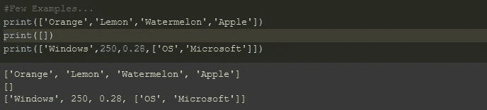

# 初级 Python 列表终极指南

> 原文：<https://medium.com/analytics-vidhya/the-ultimate-guide-to-lists-in-python-for-beginners-e6c46c21d118?source=collection_archive---------27----------------------->

照片由 [Aaron Burden](https://unsplash.com/@aaronburden?utm_source=medium&utm_medium=referral) 在 [Unsplash](https://unsplash.com?utm_source=medium&utm_medium=referral)

ython 是我们这个时代最流行的编程语言之一。它在数据科学领域找到了不可替代的地位。在本文中，我讨论了常用的数据结构——列表。我们开始吧！

列表是 python 中对象的有序集合。它可以存储不同数据类型的元素(如整型、浮点型、字符串型等。).

**几个例子…**

水果清单；空列表；不同数据类型的元素列表；

**创建列表:**可以使用 python 中的[ ]创建列表，如下所示。我将用*动物*和*狗*做进一步的演示。

创建列表——动物、狗

**索引列表:**列表索引范围从 0 到 size-1。

列表索引示例

Python 中的列表索引示例

**append( ):** 它将一个元素追加到列表的末尾。

append()示例

Just a cute picture of a Akita ❤ Photo by [Lisanto 李奕良](https://unsplash.com/@lisanto_12?utm_source=medium&utm_medium=referral) on [Unsplash](https://unsplash.com?utm_source=medium&utm_medium=referral)

我用一个简单的 for 循环给列表添加了更多的元素，*动物*和*狗*。

给动物和狗添加了更多的元素…

len( ): 返回列表中元素的个数。

动物和狗的大小

pop( ): 它从列表中删除最后一个元素。

去除动物中的最后一个元素——猫

**pop(i):** 删除索引 I 处的元素。

狗[2]=柯基；所以“柯基”从列表中删除了，狗狗们。

**remove('ele'):** 从列表中删除元素 *ele* 。

“狗”从动物中删除。

**插入(I，' ele'):** 在索引 I 处插入元素 *ele* 。

在动物的索引 2 处插入“大象”

**count('ele'):** 返回元素 *ele* 在列表中出现的次数。

在动物中,“大象”出现两次,“狮子”出现一次。

**sort( ):** 默认情况下对列表进行升序排序。字符串按字母顺序排序。

**index('ele'):** 返回列表中元素 *ele* 的索引。

因为动物[1]= '狮子'和动物[0]= '大象'

**reverse( ):** 它反转列表。

名单颠倒——动物

**extend(lst2):** 它将 *lst2* 元素追加到现有列表中。

将狗附加到动物身上。为什么不呢？！两个都是动物…！！:)

**dir([]):** 返回与列表相关的不同函数和属性

目录([ ])的快照

有 46 个功能/属性与列表相关联。我们讨论的所有功能也是它的一部分。

**你可能会有的问题……**

**1。当元素出现不止一次时，index()和 remove()将如何表现？**

*   index( ) —返回元素第一次出现的索引。
*   remove()-删除第一个出现的元素。

问题 1 的示例

在上面的例子中，*‘airport’*首先出现在*位置*的索引 1 处。因此，*位[1]* 的内容被删除，而不是*位[4]* 的内容被删除。

**2。如何对列表进行非递增(或递减)排序？**

*   默认情况下，元素按升序排序。
*   当 reverse = True 时，元素按降序排序。

问题 2 的示例

**示例练习:第 k 个最小元素**

给定一个数组 **arr[]** 和一个数字 **K** ，其中 K 小于数组的大小，任务是找到给定数组中第**K 个最小的**元素。假设所有的数组元素都是不同的。

**解决方案**

在 python 中，我们可以使用列表轻松解决这个问题。提示:对列表进行排序。请尝试自行编码此问题。

参考我在 GitHub 上的[笔记本，了解所有的代码和练习的解答。](https://github.com/athisha-rk/mediumArticlesRelatedFiles/blob/master/_python_lists_.ipynb)

嵌套列表、列表切片和列表理解是初学者在此之后可以探索的一些主题。

我希望这能有所帮助。请在下面的评论区告诉我你的观点/建议/问题。:)