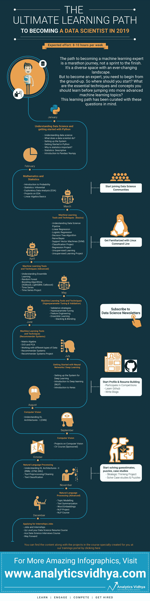

# 2019 年成为数据科学家的终极学习路径

> 原文：<https://medium.com/analytics-vidhya/the-ultimate-learning-path-to-become-a-data-scientist-in-2019-9b59f7813c07?source=collection_archive---------0----------------------->

学习路径在我们的读者中非常受欢迎，这是有充分理由的！学习路径消除了学习过程中的痛苦和困惑。对于那些不知道什么是学习路径的人来说，我们不厌其烦地浏览数据科学、机器学习和人工智能方面的所有可用资源，选择最好的资源，并按照逻辑顺序排列它们，供您遵循。

如果这听起来像是很大的工作量——的确如此。这样做的目的是为你消除大量的工作。我们知道，当你开始从事数据科学时，大量的资源会让你不知所措。因此我们创造了学习路径。我们的学习之路在我们的社区里很快就成功了。

如果学习路径在 2018 年是有用的，那么今年它们将是对试图成为数据科学家的人最有帮助的工具。为什么？因为那里的内容和信息量已经增加了好几倍。数据科学家的困惑和知识量也是如此。

# 在此访问[2019 年成为数据科学家的完整学习路径](https://trainings.analyticsvidhya.com/courses/course-v1:AnalyticsVidhya+Python-Final-Jan-Feb+2019_T1/about)。您需要在我们的培训门户网站上注册，这将使您能够跟踪您所学的内容。

# 摘要—2019 年成为数据科学家的学习之路

概括地说，成为数据科学家的学习之路可以分为以下几个步骤:

1.  **开始:**其中最重要的一步——开始您的数据科学之旅。这一阶段主要是了解什么是数据科学以及数据科学家角色需要什么。此外，这也是您应该选择编程语言和工具的地方(我们推荐 Python)。这将使您能够在接下来的几个月中通过您所学的所有内容进行编码
2.  **学习基础数学和统计:**数据科学家必须了解哪些核心概念？那就是统计学和数学。学习工具将帮助您执行快速计算并生成结果，除非您对统计方法(概率、描述和推理统计)和数学领域(准确地说是线性代数)有扎实的掌握，否则您无法真正成为数据科学家。这就是为什么我们在今年的学习计划中强调这两个领域
3.  **学习机器学习概念并应用它们:**这是事情开始发生的地方——你读这篇文章是因为你对机器学习能做什么很感兴趣。一旦你完成了以上几点(如果你遵循学习路径，将在 3 月开始)，你将开始学习机器学习的基础知识。但这不仅仅局限于理论概念。我们坚信边做边学，因此我们提供了一些很棒的项目，让您可以体验数据科学家的工作！
4.  **机器学习的更多应用:**一旦你很好地掌握了这些基本技术，我们将在 4 月继续讨论更高级的主题，如集成学习、随机森林、boosting 算法和时间序列方法。但是 ML 不仅仅局限于算法，你需要知道漂亮的技巧来改进你的模型，对吗？这就是验证策略和特性工程发挥作用的地方。我们还鼓励您将注意力放在行业应用上，因此在学习过程中加入了一个推荐引擎项目
5.  **深度学习简介:**现在你知道了这些机器学习概念，接下来是什么？当然是深度学习！如今，这已经成为任何数据科学家简历中必不可少的一部分。7 月份，你的数据科学家之路会倾向于理解神经网络和掌握 Keras
6.  **各种深度学习架构，如 RNN，CNN:** 接着深入研究高级神经网络框架，即递归神经网络和卷积神经网络。这些是相当沉重的概念，因此我们建议花几周时间从头开始理解它们
7.  **计算机视觉应用:**计算机视觉是目前最热门的领域之一，因此我们在这个领域投入了大量精力。我们认为每个数据科学家都应该在简历上写下这一点，因为这是未来许多工作的来源。我们包括了一个非常酷的项目，让你实际了解计算机视觉模型是如何工作的
8.  **自然语言处理(NLP):** 如果不先学习 NLP，任何数据科学家的学习道路都是不完整的。你应该专注于学习最起码的基础知识，包括文本预处理和文本分类。如果你喜欢冒险，你可以探索深度学习在 NLP 中是如何工作的，但这不是强制要求

我们已经逐月分解了所有这些步骤——因此，如果你开始遵循学习路径，你就会确切地知道从今天开始每个月你需要遵循什么和需要覆盖什么。

这里有一张图片，展示了为了在 2019 年底成为一名数据科学家，你应该每月做些什么。**如果你付出了学习道路中提到的所有努力，你将在今年年底前成为一名数据科学家。**

我们还有一份礼物，让你的新年真正与众不同。[**1 月 10 日，加入 Analytics Vidhya 的首席执行官兼创始人 Kunal Jain 的独家网络研讨会**](https://datahack.analyticsvidhya.com/contest/webinar-how-to-become-a-data-scientist-in-2019/) **，他将详细阐述如何充分利用这一学习途径。他将讨论 2019 年成为数据科学家的路线图。让你的问题得到解答，让这一领域的知名人士澄清你的疑问！**

我们已经做了所有艰苦的工作，以确保您在 1 月 1 日具备今年成为数据科学家所需的所有条件。现在，轮到你了。一如既往，如果您有任何问题，请告诉我们。2019 年在 Analytics Vidhya 上更常看到你！

*原载于 2019 年 1 月 1 日*[*www.analyticsvidhya.com*](https://www.analyticsvidhya.com/blog/2019/01/learning-path-data-scientist-machine-learning-2019/)*。*