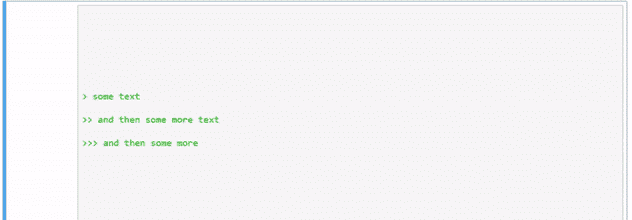
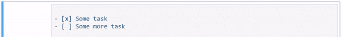

# 终极降价指南(Jupyter 笔记本)

> 原文：<https://medium.com/analytics-vidhya/the-ultimate-markdown-guide-for-jupyter-notebook-d5e5abf728fd?source=collection_archive---------0----------------------->


> 只有代码而没有标题会让 Jupyter 变得乏味。

你可能听说过上面的谚语，但如果没有，那么好吧，我刚刚创造了它！但它确实有一定的分量，特别是如果你浏览了其他人出版的笔记本，你可能还会注意到作者通过在代码单元之间加入文本、链接和图像来描述他们的代码。为此，您可以使用降价单元格。Markdown 写作技巧对于在 Jupyter 笔记本中描述你的作品，向读者提供代码和概念的充分解释是必不可少的。

但是首先…

# 什么是降价？

Markdown 是一种具有纯文本语法的轻量级标记语言。约翰·格鲁伯在 2004 年与艾伦·施瓦茨合作开发了 Markdown 语言，旨在使人们能够“用易读易写的纯文本格式写作，并有可能将其转换为结构正确的 XHTML(或 HTML)。”Markdown 被设计成尽可能的易读易写。然而，可读性是最重要的。

然而，Markdown 并不是 HTML 的替代品，甚至不能与之相提并论。它的语法很简单，只与一小部分 HTML 标签相关。Markdown 的想法是让阅读、写作和编辑散文变得容易，而不是创建一个只是为了快速添加 HTML 标签的语法。HTML 是用于发布的格式，而 Markdown 是用于阅读的格式。因此，Markdown 的格式语法只处理可以用纯文本表达的问题。对于 Markdown 语法没有涵盖的任何标记，只需使用 HTML。你不需要在它前面加前缀或者定界来表明你正在从 Markdown 切换到 HTML——你只需要使用标签。

在数据爱好者中，Jupyter 笔记本很流行。它使用简单，帮助您创建和共享包含代码、可视化和叙述的文档。回想一下，Jupyter 笔记本是一系列可以存储文本或代码的单元格。细胞塑造了笔记本的核心。降价单元格允许您编写和呈现降价语法。您可以在这里解释和记录流程。另一方面，代码单元允许你像 Python 一样编写和运行程序代码。


Jupyter 笔记本—细胞类型

*注意:Markdown 格式语法不在块级 HTML 标签中处理，而是在 span 级标签中处理。*

现在我们已经有了一些关于 Markdown 的背景知识，不再多说，让我们深入语法吧！

# **Markdown 语法集**

## **标题**

***Markdown 语法***

```
# Header 1## Header 2### Header 3#### Header 4##### Header 5###### Header 6
```

***等效 HTML 语法***

```
<h1>Header 1</h1><h2>Header 2</h2><h3>Header 3</h3><h4>Header 4</h4><h5>Header 5</h5><h6>Header 6</h6>
```

***渲染输出***


## **文字强调**

**加粗**

***Markdown 语法***

```
**This is bold text** __This is bold text__
```

***等效 HTML 语法***

```
<strong>This is bold text</strong>
```

***渲染输出***


**斜体**

***降价语法***

```
*This is italic text* _This is italic text_
```

***等效 HTML 语法***

```
<em>This is italic text</em>
```

***渲染输出***


**粗体&斜体**

***降价语法***

```
***Bold and Italic*** ___Bold and Italic___
```

***等效 HTML 语法***

```
<strong><em> Bold and Italic </em></strong>
```

**渲染输出**


**删除线**

***Markdown 语法***

```
~~Scratch this~~
```

***等效 HTML 语法***

```
<del>Scratch this</del>
```

***渲染输出***


## 反斜杠转义

反斜杠转义防止 Markdown 将字符解释为指令，而不是字符本身。

***Markdown 语法***

```
\# Not a header
```

***等效 HTML 语法***

```
# Not a header
```

***渲染输出***


## **段落**

段落就是一行或多行连续的文本，由一行或多行空行分隔。

**Markdown 语法 **

```
Hello World! We are learning Markdown.
```

***等效 HTML 语法***

```
<p>Hello World!</p><p>We are learning Markdown.</p>
```

## **换行**

换行符是前一行的结束和新一行的开始。

**Markdown 语法 **

若要强制换行，请在行尾放置两个或多个空格，然后按 Enter 键。

```
Some text Some more text
```

***等效 HTML 语法***

换行符标记以
标记开始，没有结束标记来换行，其余内容以新的一行开始。

```
Some text <br>Some more text
```

**渲染输出**


## **大宗报价**

块引号可以容纳大块文本，通常是缩进的。

***Markdown 语法***

```
> This is a blockquote
```

***等效 HTML 语法***

```
<blockquote>This is a blockquote</blockquote>
```

***渲染输出***


## **嵌套块引用**

**Markdown 语法 **

```
> some text>> and then some more text>>> and then some more
```

***等效 HTML 语法***

```
<blockquote>
<p>some text</p>
<blockquote>
<p>and then some more text</p>
<blockquote>
<p>and then some more</p>
</blockquote>
</blockquote>
</blockquote>
```

***渲染输出***



## **水平线**

***降价语法***

```
---
___***
```

***等效 HTML 语法***

```
<hr>
```

***渲染输出***


## **有序列表**

有序列表是一个编号列表。

***Markdown 语法***

```
1\. Cheese2\. Carrot3\. Coconut
```

*注意:编号无关紧要*

***等效 HTML 语法***

```
<ol>
 <li>Cheese</li>
 <li>Carrot</li>
 <li>Coconut</li>
</ol>
```

***渲染输出***


## **无序列表**

无序列表是一个项目符号列表。

***降价语法***

```
- Cheese- Carrot- Coconut
```

***等效 HTML 语法***

```
<ul>
 <li>Cheese</li>
 <li>Carrot</li>
 <li>Coconut</li>
 </ul>
```

***渲染输出***


## **图形**

您可以在减价单元格中将图形(如图像)附加到笔记本上。

*注 1:您也可以将您的图像拖放到 Markdown 单元格，以将其附加到笔记本上。*

*注 2:下面我使用了网络图片的链接，但是你也可以通过添加完整的文件名(加上文件路径，如果它在 Jupyter Notebook 之外的其他目录中)来使用离线图片。*

***Markdown 语法***

向 Markdown 单元格添加图像的一种简单方法是使用以下语法:

```

```

如果你想给图片添加一个悬停标题，你可以简单地修改如下语法:

```

```

您也可以对图像使用参考样式格式:

```
![][some-id] [some-id]: https://www.python.org/static/community_logos/python-logo-master-v3-TM.png "Python Logo"
```

***等效 HTML 语法***

```

```

***渲染输出***


## 超链接

**自动链接**

***降价语法***

```
https://en.wikipedia.org
```

***等效 HTML 语法***

```
<a href="https://en.wikipedia.org">https://en.wikipedia.org</a>
```

**标准链接**

***Markdown 语法***

```
[click me](https://en.wikipedia.org)
```

***等效 HTML 语法***

```
<a href="https://en.wikipedia.org">click me</a>
```

**标准链接(带有鼠标悬停标题)**

***Markdown 语法***

```
[click me](https://en.wikipedia.org "Wikipedia")
```

***等效 HTML 语法***

```
<a href="https://en.wikipedia.org" title=”Wikipedia”>click me</a>
```

**引用式链接**

***Markdown 语法***

```
This is [a reference][id] [id]: https://en.wikipedia.org "Wikipedia"
```

*注意:链接 id 不区分大小写。*

你真的不需要给你的链接一个 ID。如果您使用第一组括号中的单词来定义链接，Markdown 将理解它。其工作原理如下:

```
This is [a reference][] [a reference]: https://en.wikipedia.org "Wikipedia"
```

***等效 HTML 语法***

```
This is <a href="https://en.wikipedia.org" title="Wikipedia">a reference</a>
```

***渲染输出***


**锚链接**

锚定链接是页面上的链接，它将您带到该页面上的特定位置。在 Jupyter 笔记本中，它可以用来链接到笔记本的任何部分，以便于导航。

*注意:用于链接的 ID 应该是唯一的，以避免误导。*

***手法 1***

在要链接的部分上方创建一个新单元格，并添加以下代码行:

```
<a id="id"></a>
```

要创建链接到上述部分的锚链接，只需添加以下代码行:

```
[Section title](#id)
```

***手法二***

如果您有一个标题为“我的伟大的标题”的部分，那么要添加一个锚链接到这个部分，只需在空白处添加一个连字符，如下所示:

```
[Section title](#My-Great-Heading)
```

***渲染输出***


## **任务列表**

***Markdown 语法***

```
- [x] Some task- [ ] Some more task
```

***等效 HTML 语法***

```
<input type=”checkbox” disabled checked> Some task<input type=”checkbox” disabled> Some more task
```

***渲染输出***



## 代码部分

***Markdown 语法***

内嵌代码:

```
`some piece of inline code````some piece of block code```
```

您还可以执行如下语法高亮显示:

```
```javascriptvar s = "JavaScript syntax highlighting";alert(s);``````pythons = "Python syntax highlighting"print s```
```

***等效 HTML 语法***

您可以在 HTML 中使用`<code>`标签来获得类似的结果。对于语法突出显示，必须为不同的元素使用适当的类。

***渲染输出***


## 桌子

可以使用`|`(管道符号)和`—` (破折号)标记列和行来构建表格。

**降价语法**

```
|Header|Header|Header|
|------|------|------|
|A     |B     |C     |
|X     |Y     |Z     |
```

*注意:在每个文本后添加空格并不重要，大致与列对齐就可以了。此外，破折号的数量无关紧要，只是装饰性的。*

默认情况下，表格的每个标题和单元格中的文本将向右对齐。

要手动更改对正方式，您可以使用:

使用`:-:`居中

使用`—`向右居中

使用`:-`向左居中

***等效 HTML 语法***

```
<table><thead><tr><th>Header</th><th>Header</th><th>Header</th></tr></thead><tbody><tr><td>A</td><td>B</td><td>C</td></tr><tr><td>X</td><td>Y</td><td>Z</td></tr></tbody></table>
```

***渲染输出***


## **内嵌 HTML**

**文字颜色**

```
<span style="color:color">Text</span>
```

其中 color = `blue|red|green|pink|yellow`

有关所有支持的颜色名称列表，请查看 [HTML 颜色名称](https://www.w3schools.com/colors/colors_names.asp)。

您也可以使用十六进制颜色代码来自定义文本颜色。

***渲染输出***


**文本字体系列**

```
<span style="font-family:Comic Sans MS">This is a text</span>
```

如需一些常用字体的列表，请查看 [CSS 字体系列列表](https://www.tutorialbrain.com/css_tutorial/css_font_family_list/)。

***渲染输出***


**彩色便条盒**

使用以下

标签之一在彩色框中显示文本。框的颜色由指定的警报类型决定。

*蓝色方框(预警信息)*

```
*<div class="alert alert-block alert-info"><b>Tip:</b> Use blue boxes (alert-info) for tips and notes.</div>*
```

****黄色方框(alert-warning)****

```
*<div class="alert alert-block alert-warning"><b>Example:</b> Use yellow boxes for examples that are not inside code cells, or use for mathematical formulas if needed. Typically also used to display warning messages.</div>*
```

****【绿色方框(预警成功)****

```
*<div class="alert alert-block alert-success"><b>Success:</b> This alert box indicates a successful or positive action.</div>*
```

****红色方框(警告-危险)****

```
*<div class="alert alert-block alert-danger"><b>Danger:</b> This alert box indicates a dangerous or potentially negative action.</div>*
```

****渲染输出****

**

***单元格背景色***

```
*<code style="background:yellow;color:black">Useful for highlighting to grab the attention of the reader towards certain points.</code>*
```

****渲染输出****

**

*在向 Markdown 单元格添加一段终端代码时，我也倾向于使用以下颜色样式:*

```
*<p style="background:black">
<code style="background:black;color:white">C:\Users\YOUR_USERNAME> pip3 install roughviz
</code>
</p>*
```

*顺便说一下，roughviz 是我为创建草图/手绘风格的图表而创建的 Python 可视化库。务必在 [Github](https://github.com/hannansatopay/roughviz) 和 [PyPI](https://pypi.org/project/roughviz/) 上查看。*

****渲染输出****

**

***HTML 标记标签***

*突出显示文本的某些部分:*

```
*Do not forget to buy <mark>milk</mark> today.*
```

****渲染输出****

**

***定义列表***

```
*<dl>
<dt>First Term</dt>
<dd>This is the definition of the first term.</dd>
<dt>Second Term</dt>
<dd>This is one definition of the second term. </dd>
<dd>This is another definition of the second term.</dd>
</dl>*
```

****渲染输出****

**

***导航菜单***

*它定义了一组导航链接。*

```
*<nav><a href=”https://www.google.com">LinkedIn</a> |<a href=”/css/”>Github</a> |<a href=”/js/”>Medium</a> |</nav>*
```

****渲染输出****

**

## *LaTeX MATH*

*Jupyter Notebooks 的 Markdown 单元格支持 LateX 格式的数学方程。要让 Markdown 将您的文本解释为 LaTex，请用美元符号将您的输入括起来，如下所示:*

```
*$\sqrt{k}$*
```

****渲染输出****

**

## ***几何形状***

*从这里开始使用带有十进制或十六进制参考数字的代码: [UTF-8 几何图形](http://www.w3schools.com/charsets/ref_utf_geometric.asp)*

```
*&#reference_number;*
```

*如果你觉得这篇文章有用，那么一定要疯狂地点击那个按钮！此外，在 medium 上关注我可以直接在你的订阅中获得更多精彩的文章。*

***[](https://www.linkedin.com/in/hannansatopay)*