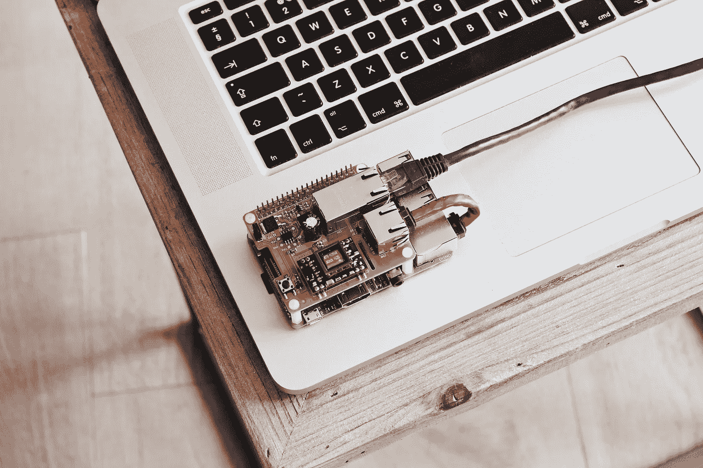

# 嵌入式处理器 OpenCV 交叉编译终极指南

> 原文：<https://medium.com/analytics-vidhya/the-ultimate-opencv-cross-compilation-guide-for-embedded-processors-f2fdc8ccb7b2?source=collection_archive---------8----------------------->



在 [Unsplash](https://unsplash.com/s/photos/circuit-board?utm_source=unsplash&utm_medium=referral&utm_content=creditCopyText) 上由[路易斯·里德](https://unsplash.com/@_louisreed?utm_source=unsplash&utm_medium=referral&utm_content=creditCopyText)拍摄的照片

我在这里，致力于这个项目来评估计算机视觉和卷积神经网络的边缘。我已经将训练好的模型导出为冻结图，并准备使用 OpenCV 进行一些推理。一切都很顺利，直到我意识到 OpenCV 需要为我的设备从源代码构建，一个是基于 ARMv8 的，另一个是 32 位的 PowerPC。

在 ARMv8 设备上构建 OpenCV 非常简单，因为它有足够的内存和足够的速度。PowerPC 不能存储超过 2 个二进制文件，并且需要交叉编译 OpenCV。OpenCV 源代码带有交叉编译脚本，但是没有用于 32 位 PowerPC 的脚本。我在网上找不到任何具体的解决方案，所以我把我的放在这里作为其他人的参考。

注意:下面的说明是针对 32 位 PowerPC 的，您只需要用您的体系结构替换 PowerPC。

## a)下载交叉编译工具

根据您的主机和目标平台，下载 gcc 和 g++编译器。可以在 [GNU 安装页面](https://gcc.gnu.org/install/specific.html)找到支持的架构列表

```
sudo apt-get install gcc-powerpc-linux-gnu g+-powerpc-linux-gnu
```

## b)克隆 OpenCV

将 OpenCV 从 Github 资源库下载或克隆到您选择的工作目录(在我的例子中是 home)中，并在其中创建一个构建目录。

```
git clone [https://github.com/opencv/opencv.git](https://github.com/opencv/opencv.git)
cd ~/opencv
mkdir build
```

## c)交叉编译 OpenCV

在 opencv/platforms/linux 目录下创建一个 toolchain.cmake 文件，如下所示。将路径替换为与 a 节中下载的工具链相对应的路径。

移动到构建目录并运行下面的命令。要更快地并行运行该命令，请将-j 后面的数字替换为您想要使用的处理器数量。运行命令 *nproc* 将给出可用处理器的数量。

```
cmake -D CMAKE_VERBOSE_MAKEFILE=ON \
-D CMAKE_GENERATE_PKGCONFIG=YES \
-D CMAKE_TOOLCHAIN_FILE=../platforms/linux/ppc-gnu.toolchain.cmake \ ..make -j16
sudo make install
```

OpenCV 现在应该安装在 install_prefix 目录中。接下来，将二进制文件复制到目标平台。复制 prefix_directory 中的所有二进制文件可能会导致一些不匹配的错误，因此建议只复制安装 OpenCV 后添加的文件。

最后，更新路径以定位新的 OpenCV 库。根据您的目标系统,/etc 目录会有一个 ld.so.conf.d 目录或一个 ld.so.conf 文件。对于前者，创建一个 open.cv 文件，否则直接编辑该文件。在目标设备上运行以下命令。

```
vi /etc/ld.so.conf#add the path to the OpenCV library, save, and exitldconfig -v
export LD_LIBRARY_PATH = $LD_LIBRARY_PATH:/path/to/opencv/library
```

## d)测试 OpenCV

我添加了一小段 c++代码来使用 OpenCV 加载图像并调整其大小。

在您的主机平台上交叉编译这段代码。

```
powerpc-linux-gnu-g++-8 test_opencv.cpp -o test_opencv $(pkg-config --cflags --libs opencv4)
```

在目标设备上执行编译后的二进制文件。

```
./test_opencv imagepath
```

感谢您的阅读，我希望这能帮助您加快工作速度。如果你喜欢它，请分享，这样其他人也可以从中受益！