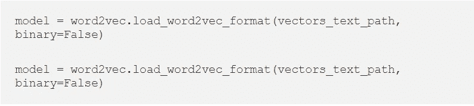
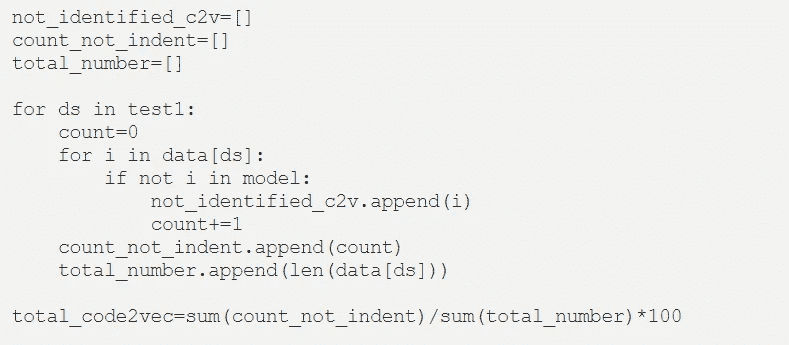
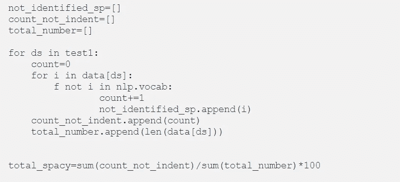

# 概念搜索中的词嵌入

> 原文：<https://medium.com/analytics-vidhya/the-ultimate-search-engine-would-basically-understand-everything-in-the-world-and-it-would-always-5b5590864f4a?source=collection_archive---------19----------------------->

终极搜索引擎基本上能理解世界上的一切，并且总是给你正确的信息。基本上，它的工作方式类似于语义搜索，涉及搜索过程:理解查询，而不是简单地查找文字匹配，或者以适合于有意义检索的方式表示知识。

检查门户网站中使用的搜索关键字和单词、短语的种类。分析你的分析。可以实施并且非常适合数据集上的预定义手套嵌入的技术。该算法将给出单词的矢量表示。在数据集上训练手套嵌入，并将该列存储到数据中。进一步用于查询实现。

另一种方法是使用 LSTM，这是一种词汇袋。计算所有单词的平均值，然后传递给余弦相似性得分，它会将您的查询与您的单词包相匹配。

有以下几个部分:

1.下载词汇

a.由 [gensim](https://www.blogger.com/blog/post/edit/4259273636854384090/1774401414092740185#) 库加载 Code2Vec。

Code2Vec Vocab 下载

b.手套

从网站上下载一个[手套](https://www.blogger.com/blog/post/edit/4259273636854384090/1774401414092740185#)词汇。您可以选择想要下载它的位置，但是为了方便起见，最好将它存储在工作目录中。

链接:-[https://nlp.stanford.edu/projects/glove/](https://nlp.stanford.edu/projects/glove/)

2.令牌化密钥

制作标记，这将有助于消除像`_`和`-`符号这样的脉冲。然后，让这个词成为词典形式。使用斯特梅尔普遍使用的 NLTK 库和 Lemmetizer。

省略情况

3.文本嵌入

*代码 2vec 和手套*

现在我们可以找出词汇表外的单词(not_identified_c2v)并统计这些单词占 code2vec 词汇表的百分比。以下代码也适用于 GloVe。

*空间*

空间词汇是不同的，所以我们需要相应地修改我们的代码:

空间词汇

4.结论

我们已经为 OpenAPI 规范尝试了三种不同的单词嵌入算法，spaCy 比其他算法更快。与 GloVe 或 code2vec 词汇表相比，spaCy 词汇表上传速度快五倍。此外，spaCy 适用于我们的数据集这一事实并不意味着 spaCy 对世界上的每个数据集都更好。

感谢阅读！