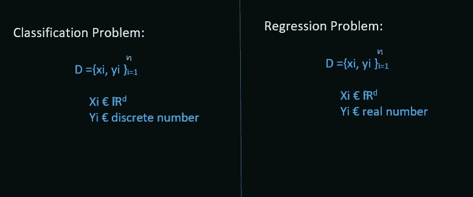
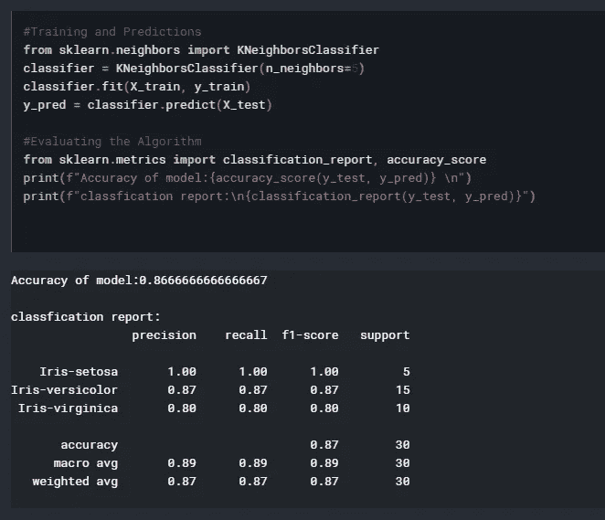

# K-NN 的不同寻常的影响

> 原文：<https://medium.com/analytics-vidhya/the-unusual-impact-of-k-nn-48617b81ba80?source=collection_archive---------16----------------------->


信用:[68 教堂](http://68church.com/wp-content/uploads/2017/06/Love-Your-Neighbor.jpg)

```
This blog is beginner friendly, will start from scratch and cover upto a medium-advance level of intuitive understanding of K-NN. All the techniques and concepts are covered using [first principle technique](https://jamesclear.com/first-principles).This blog uses various references as well which I have mentioned below.Criticism and doubts are welcome.
For more you can go through resources referred in the end.Hope you enjoy learning with me :)
```

## 目录

1.  对 K-最近邻(K-NN)的直观理解
2.  K-NN 的行为
3.  K-NN 的优缺点
4.  使用 K-NN 而不是分类和回归
5.  什么时候不用 K-NN？
6.  伪代码实现
7.  修改你的学习
8.  K-NN 上的结论和面试问题
9.  参考

# 1.K-NN 直觉理解

*在最简单的意义上，K-NN 是一种机器学习模型，可用于分类和回归问题，根据其“K”个最近邻居的行为预测查询输出。*

[**K-NN 的伪算法**](https://datascienceplus.com/k-nearest-neighbors-knn-with-python/) **:**

训练算法:

1.  存储所有数据

预测算法:

1.  计算从 x 到数据中所有点的距离
2.  通过增加与 x 的距离对数据中的点进行排序
3.  预测“k”个最近点的多数标注

让我们假设一个分类，例如

假设我们要使用两个特征'**身高**和'**头发长度**'来对两个阶级'**男性**和'**女性**'进行分类。


数据集可视化

***对数据集*** 的观察:**数据集不平衡**，即与男性数据点相比，女性数据点的数量非常多。并且它还**包含很少的离群值**来模拟真实生活数据集。**数据集男女比例为 70:30**

现在，我们想使用 K-NN 来预测查询点 x *_q 的类别。*

*注意:K-NN 模型中的“K”是一个超参数，需要对其进行超调以获得 K-NN 的良好性能*


现在让我们取 k = 5，并计算在 *x_q.* 周围的 5 个最近的邻居，将这些邻居可视化在假想的圆内。


现在，看看裁剪区域的大图


黄色圆圈内的数据点代表 X_q 的 5 个最近邻居

由于我们已经计算了 *x_q 的 5 个最近邻，*该检查我的 *x_q* 属于哪个类了。

取所有 5 个最近的邻居，并找到多数标签。在这个特定的例子中，5 个邻居中有 4 个属于女性类(*红色方块*)。这意味着大多数邻居是女性。

我的查询数据点 *x_q* 有 80%的概率属于女性类，因此我们将我们的查询点标记为女性。就这么简单。

# 2.K-NN 的行为

## **2.1】K-NN 中 K 的影响**

我们将看到改变 K-NN 中的“K”如何影响模型的性能。

***x_q* 是我们的查询点。使用 K-NN 中‘K’的不同值预测 *x_q 的类别。***


***x_q* 是我们的查询点**

## **a. K=1**

1.  实际班级标签:**女**

让我们看看我的模型预测了什么


**正确预测**:x _ q 的实际类标签是女性，我们的模型也预测了女性

预测类标签:**女**

**正确预测**:x _ q 的实际类标签是女性，我们的模型也预测了女性

2.实际阶级标签:**女**


**错误预测**:x _ q 的实际类别标签是女性，但我们的模型预测的是男性

预测类标签:**男**

**错误预测**:x _ q 的实际类别标签是女性，但我们的模型预测了男性，因为它的 1-NN 是男性，这可能是异常值或例外。

3.实际班级标签:**男**


**正确预测**:x _ q 的实际类标签是男性，我们的模型也预测了男性

预测类标签:**男**

**正确预测**:x _ q 的实际类标签是男性，我们的模型也预测了男性

4.实际班级标签:**男**


**错误预测**:x _ q 的实际类别标签是男性，但我们的模型预测的是女性

预测类标签:**女**

**错误预测**:x _ q 的实际类别标签是男性，但我们的模型预测为女性，因为它的 1-NN 是女性。

**观察(当 K=1 时):**

**当选择 k=1 时，获得错误预测的可能性非常高。这是因为我们的模型过于努力地拟合训练数据，导致模型过度拟合，导致模型中的高方差。**

现在，让我们看看当 k=5 时，K-NN 性能如何变化

## **b. K= 5**


在所有 3 个数字中，我们的查询点是正确分类的

**观察(当 K=5 时):**

当 K = 5 时，观察到我们的模型能够分类所有的查询点 x_q。

当 K-NN 中的“K”增加时，模型的高方差的影响减小。因此，看起来这是过度适应和欠适应之间的完美权衡(细节在博客后面)。

## **c. K= 100**


图 1: **正确分类** — — —图 2: **错误分类**——**—**图 3: **错误分类**

**观察(当 K=100 时):**

在 K-NN 中使用非常高的“K”显然不符合模型。这意味着哪个是多数阶级，它将支配我的少数阶级，并且模型在预测阶级标签时将高度偏向我的多数阶级。

## 2.2]在 K-NN 中选择正确的“K”值

在选择正确的“K”值之前，我们首先需要了解我的模型性能是如何通过以图形方式改变“K”值而改变的。我们只需要绘制上述观察结果

**过度配合和欠配合之间的权衡**


随着“K”的增加，验证准确度分数增加，并且在阈值之后，性能逐渐降低

**使用肘点或膝点来选择最佳的‘K’值**


方差和偏差之间的权衡

为了选择“K”的最佳值，我们需要注意上图中的拐点或拐点，并选择我们获得最大验证或测试精度的点。

这里，在 K=8 时可以观察到“K”的最佳值。

## 2.3]K-NN 的判定边界


上面的例子不是指我们的数据集，而是取自 kaggle 以便理解([参考](https://stats.stackexchange.com/questions/21572/how-to-plot-decision-boundary-of-a-k-nearest-neighbor-classifier-from-elements-o))

K-NN 的决策面是非线性的，因此有时它比其他线性模型(如逻辑回归)更好，特别是当数据在模型性能方面不是线性可分的时候。

## 2.4]使用哪种距离度量？

在训练 K-NN 模型时，我们已经看到，为了计算邻居，我们需要计算查询点和所有其他点之间的距离，以找到“K”个最近的邻居。但是我们有许多可用的距离度量，从中选择哪一个呢？

选择**距离度量**取决于你的数据集和需求。没有经验法则。但是，要理解数据集的要求并了解哪种距离测量在各种情况下都适用，最好了解一些常见距离测量的属性。

**a .欧几里德距离**

**b .曼哈顿距离**

**c .闵可夫斯基距离**

**d .余弦距离**

**e .海明距离**

**a .欧几里德距离**


我们有二维的两个向量点 x1 和 x2，[欧几里得距离 b/w x1 和 x2](https://hlab.stanford.edu/brian/making7.gif)如图所示。

欧几里得的通式:


欧氏距离测度的一般公式

简单来说，**欧几里德距离**可以解释为两点之间的最短距离或者两点的位移。

**b .曼哈顿距离**


A 和 B 是两个二维向量点，d(A，B)是 A 和 B 之间的 [**曼哈顿距离**](https://predictiveprogrammer.com/wp-content/uploads/2019/04/manhattan_distance.jpg)

曼哈顿距离的一般公式:


曼哈顿距离测度的一般公式

**曼哈顿距离**可以看做两个矢量点的绝对差之和。

**c .闵可夫斯基距离**

闵可夫斯基距离的一般公式:


闵可夫斯基距离的一般公式

如果闵可夫斯基距离中的**‘p’= 1**，则变成**曼哈顿距离**。

如果**‘p’= 2**在闵可夫斯基那里，就会变成**欧几里德距离**。


**比较** [**欧几里德距离和曼哈顿距离**](https://theprofessionalspoint.blogspot.com/2019/01/knn-algorithm-in-machine-learning.html)

**d .余弦距离**

它可以解释为两个矢量点之间的角度差。


余弦距离的广义公式

直观的讲就是和向量点有多相似。x1 和 x2 之间的角度越小，它们越相似，反之亦然。

**e .海明距离**


[海明距离](https://i.pinimg.com/originals/f7/9c/fe/f79cfe41a0c007a2cf4f94856ff88133.jpg)

为了**理解汉明距离**，以两个相同长度的字符串为例，然后在相应的索引中统计两个字符串中不同的字数。总差之和直观上就是海明距离。

汉明距离最常见的例子是[基因编码](https://www.researchgate.net/figure/Hamming-distance-matrix-visualizing-the-number-of-genes-differing-between-any-2-samples_fig1_11054265)。

现在我们已经看到了一些常见距离度量的性质。让我们理解在选择距离度量时应该记住几个概念和约束。

**维数灾难:**直观意义上，维数灾难是指当维数或特征的数量太大时，两点之间的差值为零。要获得更精确的理解，请参考[和](https://www.wikiwand.com/en/Curse_of_dimensionality)。


维度的诅咒

**选择正确的距离度量:**

***欧几里德距离*和*曼哈顿距离*对维度诅咒的影响最大。**因此，当数据集的维数过大时，尽量避免使用欧几里德和曼哈顿距离度量，因为它们直接计算两个向量点之间的差异。

**余弦距离也会受到维数灾难的影响，但与上面两个相比，影响较小**，因为它计算角度差。这也可以作为欧几里德距离的替代，以减少维数灾难的影响。

**汉明距离不会因为维数灾难**而受到影响，因为它计算的是 1–0 差异。但是海明距离的应用却很少。

希望如此，现在您可能已经知道在 K-NN 中计算邻居到查询点的距离时如何选择所需的距离度量

## **2.5****距离加权 K-NN**

我们不应该给那些更靠近查询点的邻居更多的权重，而不是给所有的邻居相同的权重吗？


该图像中的预测类标签应该是什么？

使用简单的 K-NN 多数投票，我们的模型会说查询点属于女性类，但我们应该给靠近查询点的两个邻居更多的权重，而给其他三个邻居较少的权重吗？

距离加权 K-NN 正是这样做的。它是简单 K-NN 的**修改版本，给最近的邻居更大的权重，给更远的邻居更小的权重。**


**距离加权 K-NN** 示例

在上面的例子中，如果我们使用简单的 K-NN，那么我们预测的类别标签将是女性，因为多数投票，但是**使用加权的 K-NN，我们能够得到正确的类别标签(男性)。**

**加权 K-NN 在回归问题中也很有用。**

## 2.6]可解释性

K-NN 给出的**解释**并不十分严谨，但它足以让我们知道为什么模型给出特定的预测。K-NN 给出的唯一解释形式是它的‘K’个邻居。我们只能看到其“K”个邻居的行为或性质，并解释基于查询点相对于其邻居的相似性通过模型给出特定预测的推理。

**例如**，让我们利用医疗数据集来预测一个人是否患有**乳腺癌**？

在使用 K-NN 之后，模型已经预测‘是’这个人患有乳腺癌。因此，为了知道为什么模型说如果这个人患有癌症，我们将查看其“k”个邻居，并检查查询点与其邻居之间的相似性。

让 k=5，因此在检查查询点和它的 5 个邻居之间的相似性之后，我们观察到 5 个邻居中的 4 个具有作为查询点的 save 症状，并且它们都具有阳性乳腺癌。这就是为什么我的 K-NN 模型也说查询点有 80%的概率患乳腺癌。

## **2.7****特征重要性**

> [*作为数据科学家，我们通常专注于优化模型性能。然而，有时理解模型中的特征如何有助于预测也同样重要。不幸的是，表现更好的模型往往也更不透明。*](/bigdatarepublic/feature-importance-whats-in-a-name-79532e59eea3)

抱歉，但是 K-NN 没有隐含地给出任何类型的特征重要性。从 K-NN 中明确获得特征重要性的一种方法是**前向特征选择。**更多详情请参考[本。](https://www.analyticsvidhya.com/blog/2016/12/introduction-to-feature-selection-methods-with-an-example-or-how-to-select-the-right-variables/)

## 2.8 —用于多类分类的 K-NN


多类分类示例

K-NN 可以很容易地扩展到多类分类。因为最终 K-NN 只对类标签做多数表决，所以类是二进制还是多进制并不重要。

## **2.9****用于回归的 K-NN**

在学习如何解决回归问题之前，首先我们需要了解什么是回归问题？

分类问题和回归问题之间的区别在于，在分类的情况下，我们的类别标签是离散值(例如 0，1，2，3…等)，但在回归的情况下，我的类别标签或我的预测变量“Y”属于真实值(0.01，0.05，0.1，1.5，11，1.99…等)。



回归和分类的区别

现在我们知道了什么是回归问题，让我们深入研究解决回归问题。

让我们举一个例子:

我们想要预测一个公司想要雇佣的员工的估计工资应该是多少，基于它的“资格”、“经验”、“技能”、“个性”等等。

我们将应用 K-NN，并根据相似性找出查询人最近的“K”个邻居，并尝试找出邻居工资的集中趋势。


回归问题示例

假设最佳 k=5:


在找到“k”个邻居后


寻找邻居工资的平均值

**K-NN 预测查询人的薪资为 26.4 K(即 1000)。**

## 2.10]K-NN 的复杂性

K-NN 的复杂性取决于我们在 K-NN 模型中使用的算法。

在研究 K-NN 的伪算法时，我们已经看到，在训练时间，它存储所有的数据点，而所有的工作 K-NN 在测试时间内寻找邻居。

这就是为什么 K-NN 也被称为**懒学习者、**的原因之一，因为它在训练时间里什么也学不到。

根据我们使用什么样的**数据结构**来存储训练数据点，决定训练时间复杂度和运行时间复杂度。

如果你想了解更多关于 K-NN 中可以使用的算法的细节和工作原理，请参考[本](https://www.wikiwand.com/en/K-d_tree)和[本](https://www.wikiwand.com/en/Locality-sensitive_hashing)。这里我只讨论 K-NN 中使用的一些算法的运行时间复杂度和一些优缺点。

**A .蛮 K-NN**

**B. K D 树 K-NN**

**C .局部敏感哈希 K-NN**

## **A .蛮 K-NN**

Brute K-NN 在线性结构中存储训练数据，并且在测试它时，粗暴地转到‘nd’的所有数据点并寻找‘K’个邻居。

因此，运行时间复杂度为 O (n d k)


Brute K-NN

**反对:**

**对于大型数据集，运行时间复杂度变得太高。**

## **B. K D 树 K-NN**

**使用树状结构(如二叉查找树)存储训练数据点，大大降低了运行时间复杂度。**

但是它只对数据点的低维有用(例如 d=1 到 5 或 6)。对高维数据点使用 k-d 树 K-NN 是大忌，因为它会以 2^dimension.因子增加运行时间复杂度


K-D 树

**反对:**

**仅对低维数据有用(如计算机图形、几何数据等)。**

## **C .局部敏感度哈希 K-NN**

它是一种**随机化算法**，使用**哈希**使用一些随机超平面对相似的训练数据点进行聚类。


局部敏感哈希 K-NN

**优点:**

**能很好的处理高维数据。**

**缺点:**

**如果数据集很大，存储训练数据可能需要相当大的时间复杂度。**

## 2.11]如何处理分类特征

如果输入变量是分类的，我们需要使用某种**特征工程**到将分类输入特征转换成数字特征。但是老实说，如何特征化分类输入特征取决于特征的性质和需求是什么。**特征工程是机器学习的艺术部分**，它是经过大量实践和反复试验而产生的。在这里，我指的是一些你可以用来将分类特征转换成数字特征的技术。

**a.** [**包话(鞠躬)**](https://maelfabien.github.io/machinelearning/NLP_2/#1-bag-of-words)

**b .**T8**Tf-Idf**

**c .**[**Avg word 2 vec**](/@jayeshbahire/introduction-to-word-vectors-ea1d4e4b84bf)

**d .**T20**Tf-Idf word 2 vec**

# **3。K-NN 的优缺点**

## a.K-NN 的优势

1.  简单且易于理解和实现。
2.  由于 K-NN 的非线性决策边界，它有时可以优于线性机器学习模型(例如，逻辑回归和线性 SVM)，特别是当数据不是线性可分的时候。
3.  易于扩展为多类分类问题。

## **b . K-NN 的缺点**

1.  高运行时间复杂性。
2.  因此，高等待时间不能用于要求低等待时间互联网应用中。
3.  没什么可解释的。
4.  没有给出隐含特征的重要性。
5.  当数据维数较高时，K-NN 方法会遭遇**维数灾难。**
6.  不平衡数据集无法正常工作。

# 4.使用 K-NN 而不是分类和回归

在上面的部分中，我们已经看到 K-NN 的缺点多于优点。所以这个问题可能会出现在你的脑海中，如果 K-NN 有这么多的缺点，我们是否应该使用 K-NN？如果是的话，我们还可以在什么情况下使用 K-NN。

让我们看看几个我们可以使用 K-NN 作为优势的情况:

## 4.1]用于输入缺失值的 K-NN

使用 K-NN 模型寻找或预测缺失值是输入特征缺失值的最佳技术之一。

我们可以使用那些缺失值的数据点作为查询点或测试点，其余的数据作为训练点。对缺失特征应用 K-NN，其中缺失的特征值将成为预测变量。

## **4.2】寻找两个数据点之间的相似性**

让我们举个例子来理解这一点:

假设我们想要**在亚马逊上推荐类似的产品，只使用产品的“标题”作为输入特征。**

**我们可以使用 K-NN 输出的概率分数作为另一个机器学习模型**的输入特征。这可以解释为“两个数据点有多相似？或者两个产品有多相似？”。这种技术也被称为 [**集成建模**](https://www.datacamp.com/community/tutorials/ensemble-learning-python) 其中我们一起使用多个模型进行预测。

# **5。哪里不用 K-NN**

很多时候，我们了解了一个模型的所有东西，但是忘记了在哪里不使用它。在这里，我们将确切地了解，我们不应该应用 K-NN 的情况。

1.  **当数据集不平衡时连同** [**准确度**](https://developers.google.com/machine-learning/crash-course/classification/accuracy) **作为度量**

如果我们以“准确性”作为衡量标准，当我们的数据集不平衡时，我们经常会对模型的性能做出错误的解释。

假设我的数据集不平衡，比率为 90:10，其中 90%的数据属于类{1}，10%的数据属于类{0}。

现在，即使我们预测所有数据点都属于{1}类，我们的“T16 准确性 T17”指标仍会显示我的模型 90%准确，这无疑是对模型性能的错误解释。我们可以明确地看到，我们的模型偏向于多数阶级，而且模型是不合适的。我们在本博客的开始部分已经看到，K-NN 在寻找最近邻居时很容易偏向多数类。

**2。维度高时:维度的诅咒**

使用欧几里德距离或曼哈顿距离度量容易遭受维数灾难。因此，当输入的维数很高时，使用欧氏距离确实不是一个好主意。

**3。当查询数据点远离列车数据时**

这意味着很有可能训练数据的分布与测试数据不同，我们的模型将无法更好地执行。


查询点远离列车数据点


训练数据的分布与测试数据的分布非常不同

**4。当数据随机或有噪声时**

嗯，在这种情况下，很少有任何模型可以做任何明智的事情。这就是为什么在应用机器学习模型之前，预处理数据并去除异常值是必要步骤之一的原因。

# 6.使用 Sklearn 库实现伪代码

1.  **导入库**


**导入库**

**2。导入数据集**


**导入数据集**

**3。预处理和分割训练和测试数据集**


**预处理并剥离训练和测试数据集**

**4。特征缩放**


**特征缩放**

**5。应用 K-NN、训练、预测和评估**



**训练、预测和评估**

**5。错误 V/S 'K'**


**错误 V/S‘K’**

**6。K-NN 的代码编译**

```
#Importing Libraries
import numpy as np
import matplotlib.pyplot as plt
import pandas as pd#Importing the Dataset
url = "[https://archive.ics.uci.edu/ml/machine-learning-databases/iris/iris.data](https://archive.ics.uci.edu/ml/machine-learning-databases/iris/iris.data)"# Assign colum names to the dataset
names = ['sepal-length', 'sepal-width', 'petal-length', 'petal-width', 'Class']# Read dataset to pandas dataframe
dataset = pd.read_csv(url, names=names)
dataset.head()#Preprocessing
X = dataset.iloc[:, :-1].values
y = dataset.iloc[:, 4].values#Train Test Split
from sklearn.model_selection import train_test_split
X_train, X_test, y_train, y_test = train_test_split(X, y, test_size=0.20)#Feature Scaling
from sklearn.preprocessing import StandardScaler
scaler = StandardScaler()
scaler.fit(X_train)X_train = scaler.transform(X_train)
X_test = scaler.transform(X_test)#Training and Predictions
from sklearn.neighbors import KNeighborsClassifier
classifier = KNeighborsClassifier(n_neighbors=5)
classifier.fit(X_train, y_train)
y_pred = classifier.predict(X_test)#Evaluating the Algorithm
from sklearn.metrics import classification_report, confusion_matrix
print(confusion_matrix(y_test, y_pred))
print(classification_report(y_test, y_pred))#Comparing Error Rate with the K Value
error = []# Calculating error for K values between 1 and 40
for i in range(1, 40):
    knn = KNeighborsClassifier(n_neighbors=i)
    knn.fit(X_train, y_train)
    pred_i = knn.predict(X_test)
    error.append(np.mean(pred_i != y_test))plt.figure(figsize=(12, 6))
plt.plot(range(1, 40), error, color='red', linestyle='dashed', marker='o',
         markerfacecolor='blue', markersize=10)
plt.title('Error Rate K Value')
plt.xlabel('K Value')
plt.ylabel('Mean Error')
```

# 7.修正你的倾向

1.  直观解释 K-NN。
2.  解释 K-NN 在各种情况下的行为。
3.  K-NN 的优缺点是什么？
4.  除了分类和回归，K-NN 还可以用在哪里？
5.  在哪些情况下我们不应该使用 K-NN？
6.  编写 K-NN 的伪算法。
7.  使用 sklearn 库实现 K-NN 的伪代码。

# 8.结论和面试问题

**结论**:

除了这些学习如果你想学习如何在真实生活数据集上应用 K-NN(极性分析关于 [***亚马逊美食评论***](https://www.kaggle.com/snap/amazon-fine-food-reviews) ***【使用 K-NN】)***请参考[这个](https://github.com/adityaadarsh/amazon-fine-food-reviws-polarity-analyses)[这个](https://github.com/adityaadarsh/amazon-fine-food-reviws-polarity-analyses/blob/master/1.EDA%20on%20amazon%20fine%20reviews.ipynb)和[这个](https://github.com/adityaadarsh/amazon-fine-food-reviws-polarity-analyses/blob/master/2.%20Amazon%20Fine%20Food%20Reviews%20Analysis_KNN-Copy1.ipynb)。

我试图涵盖 K-NN 和用例场景的几乎所有方面。如果你还有任何疑问或任何话题，请通过我的[邮箱](http://adityaadarsh99@gmai.com)联系我。对于现实生活数据的代码实现，请通过上面的链接。

**面试问题:经过** [**这个环节**](https://github.com/adityaadarsh/amazon-fine-food-reviws-polarity-analyses/blob/master/Dive%20Deep%20into%20KNN.pdf) **。**

# **9。参考文献**

1.  [appliedaicourse.com](https://www.appliedaicourse.com/course/11/Applied-Machine-learning-course)
2.  [wikiwand.com](https://www.wikiwand.com/news)

3.开源代码库

4.stackoverflow

5.[解析维迪亚](https://www.analyticsvidhya.com/blog/2018/03/introduction-k-neighbours-algorithm-clustering/)

6.[机器学习掌握度](https://machinelearningmastery.com/k-nearest-neighbors-for-machine-learning/)

# 结束:)

希望你喜欢。