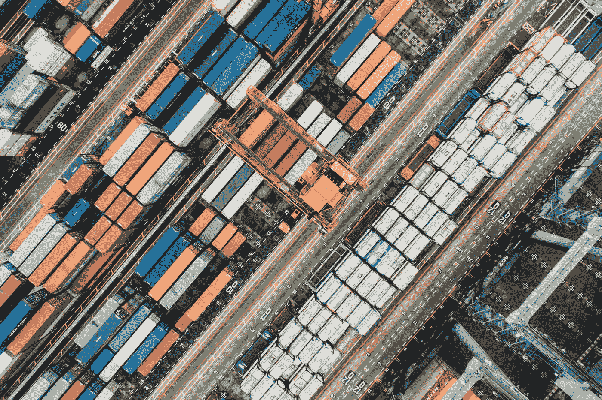

# Docker 图像管理的基础知识(1/2)

> 原文：<https://medium.com/analytics-vidhya/the-very-fundamentals-of-docker-images-management-1-2-820676ac40dc?source=collection_archive---------22----------------------->

[丘特尔斯纳普](https://unsplash.com/@chuttersnap?utm_source=medium&utm_medium=referral)在 [Unsplash](https://unsplash.com?utm_source=medium&utm_medium=referral) 上拍照

Docker 令人着迷，只要你习惯了容器化的概念，你就会知道这种技术可以在任何地方实现。

现代软件实际上使用了很多容器，就容器技术而言，不仅仅是 Docker，但是在某一点上，Docker 被广泛采用，并且向前迈进了一步。

请和我一起参加这个讲座，对它有更多的了解。我假设你已经在你的电脑上安装了至少`Docker`，使用这个指南作为安装后的步骤，相信我，这是一个非常简单的过程。

准备好了吗？

`Docker`的第一个基本概念是`Docker Image`，基本上，这是一个包含运行应用程序所需的一切的包:代码、运行时、库、环境变量和配置文件。如果你熟悉 **OOP 编程**，你可以把一个`Docker Image`当做一个`Class`。

这很好，让我们继续第二个概念，这里是`Docker Image`的补充，是`Docker Container`，这是一个图像的运行时实例。回到 **OOP 关系**中，`Docker container`是一个`Object`(`Class`的实例)

因此，在您的本地`Docker`安装中，您实际上是从某个特定的来源下载`Docker Images`(稍后解释)。这些下载的映像是只读的，所以您可以使用它们作为模板(基础映像)来构建新的映像。

## 了解 Docker 图像

在内部，`Docker`映像由层组成，这些内部层文件系统允许`Docker`在可重用性方面灵活高效，特别是在创建容器时，因为您可以一次创建 X 个容器，而不会相互冲突。

在底层，当一个容器被实例化时，一个顶部可写层被创建，它将接收开发人员在运行时所做的所有更改，一旦实例被删除，该层也将被删除。

`Docker`使用存储驱动程序管理图像层和可写容器层的内容。每个存储驱动程序处理实施的方式不同，但所有驱动程序都使用可堆叠的图像层和 CoW 策略。

为了快速理解在运行时如何编写层，您需要理解`UFS`(联合文件系统)的概念。这篇文章[非常好，因为它从 Linux 实现开始，这是一个非常值得推荐的讲座。](https://www.terriblecode.com/blog/how-docker-images-work-union-file-systems-for-dummies/)

`Docker Image Union FS`(称为 DIUFS)包含集装箱的清单文件，这类似于集装箱的文档描述)，以及:

1.用于创建新容器实例的容器层(构建说明)

2.实例完成后将执行的配置更改

3.为便于用户访问而运行的应用程序

这对于刚开始使用来说是非常明显的，可以认为这是一个必须知道的理论，但在课程中很少使用或提及。

在继续之前，让我们回顾一下。在`DIUFS`的帮助下构建的整个先前的映像还包括一个在实例化时创建的顶部可写层。一旦执行完成，层被移除，但是图像保留，这概括了容器是无状态的。

## 让我们从代码开始:让我们从图像开始

我个人会(盲目地)推荐在 CLI 中使用`Docker`，有 GUI 的工具，但不提供最好的使用深度。如果你愿意，你可以使用`Docker Toolbox`的一个 GUI 工具部分`Kitematic`，它是可以使用的。

现在的基础命令是`docker image`。这将处理系统中本地和远程映像的完整管理。

假设您有一个全新的安装，因此，没有图像安装在您的系统中，那么下一步是什么？

## 归零地

我们可以使用以下内容向您展示安装了哪些`Docker Images`

`docker image ls`(这列出了存储库、标签、图像 ID、大小等等)

如果为零，那么，我们可以执行图像搜索。

## 搜索图像

`docker search <image>`将在`Docker Hub`(系列的第 2 部分)中搜索图像。这个命令处理多个选项，我将向您展示其中的一些。

*   `docker search — limit=1 <Name>`这限制了特定图像名称的查询结果
*   这将只检查官员 Docker 图像(更多内容在本系列的第 2 部分)
*   `docker search --filter "stars=80” <name>`这将找到排名中有 80 颗或更多星星的图片(Docker hub)

## 下载图像

这里我们要做一点小小的改变，因为我们要引入`pull`命令，这将抓取(下载)并安装某个来源的特定镜像，该镜像将在本系列的后面解释。

使用`docker pull <name:tag>`您可以选择任何特定的映像和版本，并将其安装在本地。

这里有一个例子

`docker pull nginx:latest`

这将抓取并下载设置了`latest`标签的`Nginx`图像。执行后会在您的计算机上安装一份副本。

## 磨尖

图像可能会随着时间的推移而改变和改进，因此版本控制是关键。`Docker`图像需要标签来识别，有了标签，您还可以执行直接搜索。您可以在处理容器时执行标记，如下所示:

`docker image tag <container>:<your-tag>`

它们都与同一个原始图像相关，可以使用`rm`命令移除标签

## 消除

它说了什么，没什么好解释的。移除会从您的硬盘上删除图像。

1.  `docker image rm [TAG or ID]`从磁盘上删除已安装的特定映像。如果图像被容器使用，必须用`--force`标志强制
2.  `docker image prune`将删除未使用和未标记的图像

还有类似`docker rmi [TAG]`的变体，用于删除一个或多个图像，或者`docker image prune`用于删除未使用的图像

还有很多，这只是给你一个想法。

# 离开基础

## 检查图像

在`docker inspect`命令的帮助下，您可以查看任何 JSON 数组格式的已安装映像的详细信息，这里有关于网络、层、id、版本的信息，以及许多相关信息。

您也可以使用`docker image inspect <image>:<tag>`来执行

我建议过滤输出，如下例。

1.  使用 Linux 命令过滤

-`docker image inspect ubuntu:latest | grep Os`-
-`docker image inspect ubuntu:latest > ubuntu-inspect.txt`(IO 重定向)

2.直接的方法

-`docker image inspect ubuntu:latest --help`
-`docker image inspect ubuntu:latest --format=’{{.Id}}’`(sha 256 ID)
-`docker image inspect test:1.0 --format=’{{json .ContainerConfig}}’`

这是标准输出格式:

- `docker image inspect test:1.0 --format=’{{.ContainerConfig.ID}}’`

## 著名的码头文件

`Dockerfile`是从文件中提取图像的方式。它是一个文本文件，包含构建给定图像所需的所有命令。一个`Dockerfile`由 docker 构建命令执行。

使用`Dockerfile`执行构建的`Docker`客户端，其中:

1.  `docker build`将图像发送到创建图像的 Docker 守护进程。
2.  生成的图像可用于创建容器
3.  图像可以从`registries`到`pulled`或`pushed`

您可以在官方文档(`Dockerfile`部分)中找到说明

## 说明列表

以下是可在`Dockerfile`上使用的命令(指令)列表

**添加**:将文件复制到镜像中但支持 tar 和远程`URLs`
**复制**:将文件复制到镜像中，优先于`ADD`(为简单起见 被认为是最佳实践)
**卷**:在容器运行时创建定义的挂载点
**入口点**:在容器运行时运行可执行文件
**暴露**:记录应该发布的端口
**CMD** :为**入口点**(只允许一个)
**ENV** 提供参数:用于定义容器中的环境变量 `FROM`指令必须是`Dockerfile`
**维护者**上的第一条指令:电子邮件地址(记录`Dockerfile`的作者)
**ONBUILD** :仅在该映像用于构建其他映像时用作触发器；将定义命令运行" on build"
**RUN** :在新层运行新命令
**WORKDIR** :定义容器的工作目录

## 从 Dockerfile 构建

一旦你准备好了，就该把它转换成我们容器的工作基础图像了。Docker 的`build`命令也可以通过 Github 库、tarballs 和 stdins 来执行。

`docker build`从指定的目录中读取文件，并根据文件中的内容构建图像

示例:
- `docker build -f ./Dockerfile`这将启动用`-f`标志指定的文件的构建过程

或者，您可以强制不使用缓存

- `docker build --no-cache=true -f ./Dockerfile`

## Dockerfiles 提示

1.  检查使用`.dockerignore`文件的文档
2.  将`\`用于多行图像(更好的组织)
3.  用`&&`符号将命令绑定在一起(如果它是多行的),命令将被缓存

之后，您可以使用`inspect`轻松查看内容，获取图像细节。

## 修改图层

拥有多个图层并不总是有效的，如果你检查你的图像大小，实际上是相当大的，所以可能会想，我们如何才能减少图像的大小？

为了部署，性能是一个很好的选择，找到一种优化的方法，一个很好的选择是**挤压**

压缩一个图像，成为一个单一的图像层。检查 docker 服务器上的实验选项是否设置为 true
2。如果是，则使用选项`--squash`进行构建

`docker build --squash -f Dockerfile -t ubuntu:<your-new-tag> .`

最后的`.`代表`Dockerfile`所在的目录。

毕竟，您也可以对图像执行一个`export`并使用`history`命令检查新版本(从-)

*   `docker container export <name> > nginx.tar`
    -`docker image import nginx.tar`-
    -`docker tag <tag> <name>`-
    -`docker image history <name>`

我试图涵盖许多主题，只关注`Docker Image`的创建和管理，当然，不接触`Docker Containers`很难找到这篇文章的好感觉，但我会非常大，我相信周围有很多信息。

我将很快为容器添加一个完整的实用部分。

目前我已经完成了，在本系列的第二部分，我将讨论从`Docker Hub`、`DTR`和来自`Google`或`VMWare`的其他第三方注册中心的拉取和推送

快乐编码:)