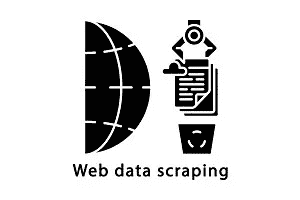

# 回程机器铲运机

> 原文：<https://medium.com/analytics-vidhya/the-wayback-machine-scraper-63238f6abb66?source=collection_archive---------1----------------------->



**为什么是 Wayback 机铲运机？**

收集数据的 Web 抓取是一种常见的做法，我想抓取一些新闻网站来收集某些数据元素，如新闻标题、摘要和每篇文章的 url。这个想法是编译一个新闻数据集来训练话题模型，如 LDA、NMF 和奇异值分解。更多关于主题模型实现的信息将在接下来的文章中发布。

我可以走 api 路线，使用一些新闻 api 来收集相同的数据点，但是对于大多数新闻 API，您要么必须支付费用来每天发出更高的请求，要么使用几个不同的 API 来从多个新闻来源收集数据。[折返机](https://archive.org/help/wayback_api.php)铲运机解决了这两个问题。Wayback Machine api 可以免费使用，但每天的请求量很高。Wayback Machine 存档了大多数新闻网站，所以你可以使用一个 api 从不同的新闻来源收集相同的信息。

根据请求的强度，抓取可能会使服务器过载，并且有被阻塞的风险。Wayback machine api 最大限度地降低了这种风险，因为我们不是针对单个新闻网站。我们仍然必须遵循 Wayback 机器 api 规则，但我们不会遇到单个新闻网站服务器过载的风险。

**铲运机深潜**

scraper 是用 python 构建的，使用一些流行的 Python 包来进行 web 抓取。以下是我们案例中使用的一些包。

```
import sys
import requests as rq
from bs4 import BeautifulSoup as bs
from time import sleep
from time import time
from random import randint
from warnings import warn
import json
import pandas as pd
```

`BeautifulSoup`是一个流行的用于 html 和 xml 解析的 python 包。我们使用它遍历不同的 html 标签，并提取所有必要的数据，在本例中，是新闻标题、摘要和每篇文章的 url 链接。

整个刮削过程如下:

1.  使用`Wayback Server CDX API`编译一个 URL 列表。

`Wayback Server CDX API`作为 Wayback 机器网站捕获的 http 入口，允许对数据进行深入查询。下面是一个示例查询，它为每个 MSNBC 新闻网站“capture”返回一些索引数据

```
'[http://web.archive.org/cdx/search/cdx?url=nbcnews.com/politics&collapse=digest&from=20190401&to=20190431&output=json'](http://web.archive.org/cdx/search/cdx?url=nbcnews.com/politics&collapse=digest&from=20190401&to=20190431&output=json')
```

在上面的查询中，`url=`是必需的参数，这里我们将其设置为`GET` MSNBC 政治部分屏幕截图。对于 nbcnews.com/politics 部分的每个“捕获”,上述查询将为每个索引返回一行。`Wayback CDX Server`响应上述 GET 查询，并将结果作为 JSON 数组输出。输出的列如下所示。

```
[['urlkey',
  'timestamp',
  'original',
  'mimetype',
  'statuscode',
  'digest',
  'length'],
 ['com,nbcnews)/politics',
  '20190401012911',
  'https://www.nbcnews.com/politics',
  'text/html',
  '200',
  'FVZYAKIUIFOQY5NCP7AI4LJB4JNLYQOF',
  '38471'],
```

一旦我们得到如上所示的 CDX 列的部分，我们将使用“时间戳”和“原始”列来组合最终的 Wayback 机器 url，然后我们使用它来打开特定的 html 页面并抓取所需的数据点。

```
# MSNBC Wayback machine archive urls
url = '[http://web.archive.org/cdx/search/cdx?url=nbcnews.com/politics&collapse=digest&from=20190401&to=20190431&output=json'](http://web.archive.org/cdx/search/cdx?url=nbcnews.com/politics&collapse=digest&from=20190401&to=20190431&output=json')urls = rq.get(url).text
parse_url = json.loads(urls) #parses the JSON from urls.## Extracts timestamp and original columns from urls and compiles a url list.url_list = []
for i in range(1,len(parse_url)):
    orig_url = parse_url[i][2]
    tstamp = parse_url[i][1]
    waylink = tstamp+'/'+orig_url
    url_list.append(waylink)## Compiles final url pattern.for url in url_list:
    final_url = '[https://web.archive.org/web/'+url](https://web.archive.org/web/'+url_list[0)
```

2.使用`BeautifulSoup`解析 html 页面。

一旦我们编译了最终 URL 的列表，我们就使用`html.parser`来解析来自`final_url`的每个 html 页面。

```
# Open page
req = rq.get(final_url).text# parse html using beautifulsoup and store in soup
soup = bs(req,'html.parser')
soup
```

`soup`存储`final_url`的 html 输出，我们可以解析`soup`的 html 标签来收集所需的数据。为了知道要搜索哪些标签，需要检查 Wayback 机器捕获的 html 页面。有许多中型文章展示了如何检查 html 页面，挑选出特定的标签进行抓取。

```
# Get list of article tags that contain news titles
articles= soup.find_all('article')for article in articles:
        try:

            if article != None:
                #title and link
                if article.find_all('h2') != None:
                    #get news title
                    title = article.find_all('h2')[1].a.text 
                    #get individual news article link
                    link = article.find_all('h2')[1].a['href'] 
                else:
                    title = 'N/A'
                    link = 'N/A'
```

标签给出了所有新闻文章的列表，它们的标题，以及每篇文章的链接。然后，我们使用单个文章`link`来收集文章摘要。

```
req = rq.get(link).text
soup=bs(req,'html.parser') # Parse each individual news article
article = soup.find('div',attrs={'class':'article container___2EGEI'})
article.div.text # news summary
```

3.将数据导出为 csv 格式。

一旦我们收集了所有的数据点，我们就使用`pandas.to_csv`函数将数据导出为 csv 格式。

```
import pandas as pdnbc_df = pd.DataFrame({'title':news_title
                       ,'summary':news_summary
                       ,'source':news_source
                       ,'article_link':news_link})
nbc_df.to_csv('nbc_articles.csv',index=False)
```

这里我们只抓取了新闻标题、摘要、来源和文章链接。通过更多的 html 检查和解析，我们可以做同样的事情来抓取图像、图像标题和文章作者。

下面是将上述各个部分组合在一起的完整代码。

刮的开心！