# Python 中探索性数据分析的原因和方法

> 原文：<https://medium.com/analytics-vidhya/the-why-and-how-of-exploratory-data-analysis-in-python-cb51b8d32f29?source=collection_archive---------17----------------------->

> EDA |数据分析| Python | Pandas |

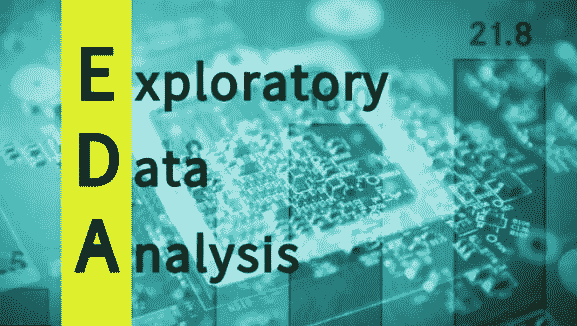

探索性数据分析

> **1。Python 中的探索性数据分析是什么？**

**Python**中的探索性数据分析(EDA)是由**约翰·图基**在 20 世纪 70 年代开发的数据分析过程的第一步。在统计学中，探索性数据分析是一种分析数据集以总结其主要特征的方法，通常采用可视化方法。从名字本身就可以知道，这是我们需要探索数据集的一个步骤。

> **2。对探索性数据分析的需求**

探索性的数据分析是你跳到机器学习或数据建模之前的关键一步。通过这样做，您可以了解所选特征是否足以建模，是否所有特征都是必需的，是否存在任何相关性，我们可以基于这些相关性返回到数据预处理步骤或继续建模。

一旦**探索性数据分析**完成并得出见解，其特征可用于监督和非监督机器学习建模。

> **3。Python 中探索性数据分析的步骤有哪些？**

进行探索性数据分析有许多步骤。我想讨论使用波士顿数据集的以下几个步骤，该数据集可以从**sk learn . datasets import load _ Boston**导入

*   数据描述
*   处理缺失数据
*   处理异常值
*   通过情节理解关系和新的见解

## **a)数据描述:**

我们需要了解不同种类的数据和数据的其他统计数据，然后才能继续其他步骤。一个好的方法是从 python 中的 **describe()** 函数开始。在 [Pandas](https://www.edureka.co/blog/python-pandas-tutorial/) 中，我们可以在数据帧上应用 describe()，这有助于生成描述性统计数据，这些数据汇总了数据集分布的集中趋势、分散性和形状，不包括 NaN 值。

结果的索引将包括计数、平均值、标准差、最小值、最大值以及下限、50%和上限。默认情况下，下百分位是 25，上百分位是 75。50%与中位数相同。

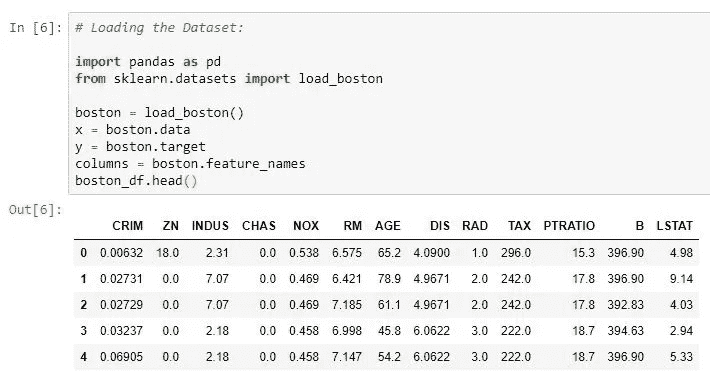

显示波士顿数据集的前五行

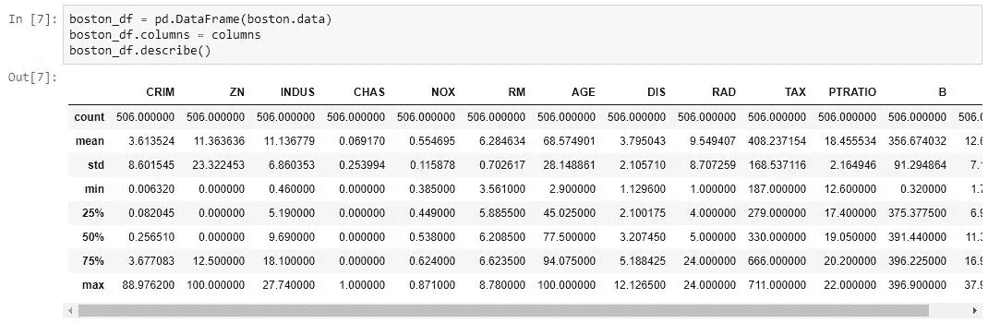

描述统计学

## **b)处理缺失数据:**

现实世界中的数据很少是干净和同质的。由于多种原因，数据可能在数据提取或收集过程中丢失。缺失值需要小心处理，因为它们会降低我们任何绩效矩阵的质量。它还会导致错误的预测或分类，并且还会对所使用的任何给定模型造成高偏差。有几种处理缺失值的方法。然而，应该做什么的选择在很大程度上取决于我们的数据和缺失值的性质。以下是一些技巧:

*   删除空值或缺失值
*   填充缺失值
*   用 ML 算法预测缺失值

## **删除空值或缺失值:**

这是处理缺失值的最快和最容易的步骤。不过一般不建议。这种方法降低了我们模型的质量，因为它减少了样本量，因为它通过删除任何变量缺失的所有其他观察值来工作。

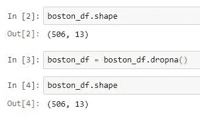

上面的代码表明我们的数据集中没有空值。

## 填充缺失值:

这是处理缺失值的最常见方法。在此过程中，缺失值将被测试统计数据(如缺失值所属的特定特征的平均值、中值或众数)替换。假设我们在波士顿数据集中缺少年龄值。然后下面的代码会用 30 来填充缺少的值。

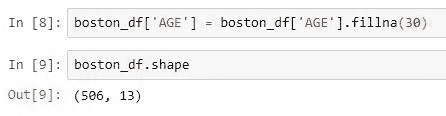

## c)处理异常值:

离群值是与人群分离或不同的东西。异常值可能是数据收集过程中出现错误的结果，也可能只是数据中出现偏差的迹象。检测和处理异常值的一些方法:

*   箱线图
*   散点图
*   z 分数
*   IQR(四分位数间距)

## 箱线图:

箱线图是一种通过四分位数以图形方式描绘数字数据组的方法。该方框从数据的 Q1 值延伸到第三季度的四分位值，中间有一条线(Q2)。触须从框的边缘延伸出来，以显示数据的范围。离群点是那些超过胡须末端的点。箱线图显示了位置和分布的稳健度量，并提供了关于对称性和异常值的信息。

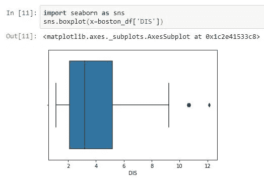

显示异常值的箱线图

## 散点图:

散点图是一种数学图表，使用笛卡尔坐标来显示一组数据的两个变量的值。数据显示为点的集合，每个点的一个变量的值决定水平轴上的位置，另一个变量的值决定垂直轴上的位置。远离总体的点可以称为异常值。

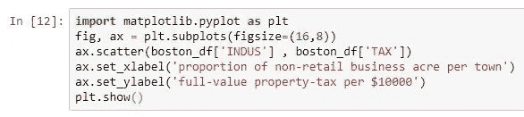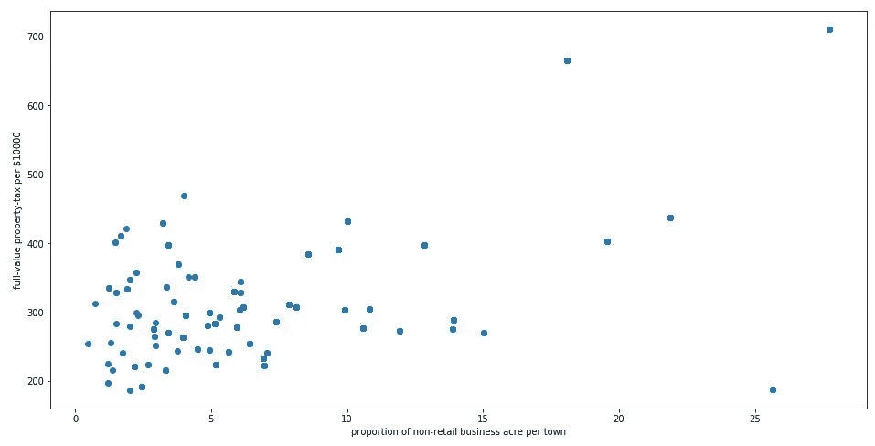

## z 分数:

Z 得分是标准偏差的有符号数，通过它，观察值或数据点的值高于正在观察或测量的平均值。在计算 Z 值时，我们会重新调整数据的比例并使其居中，同时寻找离零太远的数据点。这些离零太远的数据点将被视为异常值。在大多数情况下，使用阈值 3 或-3，即如果 Z 分值分别大于或小于 3 或-3，则该数据点将被识别为异常值。

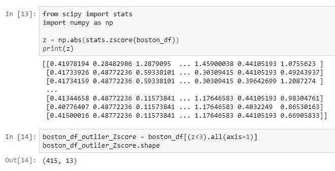

我们可以从上面的代码中看到，形状发生了变化，这表明我们的数据集有一些异常值。

## IQR:

四分位数间距(IQR)是统计离差的一种度量，等于第 75 个和第 25 个百分位数之间的差值，或者上四分位数和下四分位数之间的差值。

IQR = Q1。

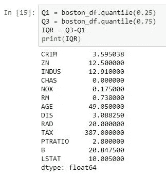

一旦我们有 IQR 分数低于代码将删除我们的数据集中所有的离群值。

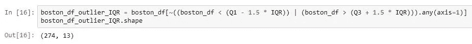

## d)通过情节理解关系和新见解:

通过可视化数据集，我们可以获得数据中的许多关系。让我们来看一些技巧，以便了解其中的洞见。

*   柱状图
*   热图
*   配对图
*   重新绘图

## 直方图:

直方图是快速评估概率分布的一个很好的工具，几乎任何观众都可以很容易地理解它。Python 为构建和绘制直方图提供了一些不同的选项。

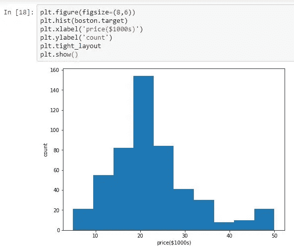

## 热图:

热图程序显示了定量变量在 2 个分类因素的所有组合中的分布。如果这两个因素中有一个代表时间，那么这个变量的演变就可以很容易地用图来观察。渐变色标用于表示定量变量的值。两个随机变量之间的相关性是一个从-1 到 0 到+1 的数字，分别表示强的反比关系、无关系和强的正关系。

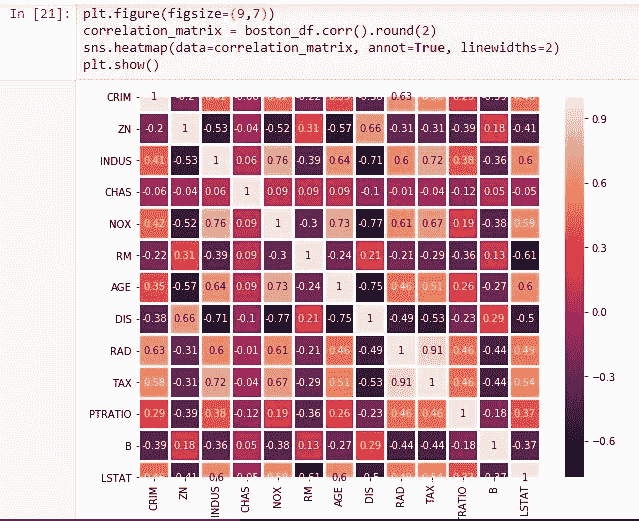

***相关性*** 值介于 ***-1 到+1 之间。***

***高度相关的*** 变量会有相关值 ***接近+1***

*相关性较低的变量会有相关值 ***接近-1****

*矩阵值的 ***对角元素*** 是 ***总是 1*** 正如我们在寻找同一列之间的 ***关联一样。****

# *就是这样！*

*感谢阅读！*

*觉得这篇文章有用？在 Medium 上关注我，查看我最受欢迎的文章！请👏这篇文章分享一下吧！*

# *参考资料:*

*   ***探索性数据分析:**【https://en.wikipedia.org/wiki/Exploratory_data_analysis *
*   ***Python 探索性数据分析:**[https://www . Data camp . com/community/tutorials/explorative-Data-Analysis-Python](https://www.datacamp.com/community/tutorials/exploratory-data-analysis-python)*
*   ***利用 Python 进行探索性数据分析:**[https://www . active state . com/blog/explorative-Data-Analysis-using-Python/](https://www.activestate.com/blog/exploratory-data-analysis-using-python/)*
*   ***单变量和多变量异常值:**[https://www . statistics solutions . com/单变量和多变量异常值/](https://www.statisticssolutions.com/univariate-and-multivariate-outliers/)*

# *如果你喜欢这篇文章，请鼓掌！*