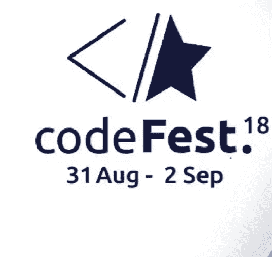
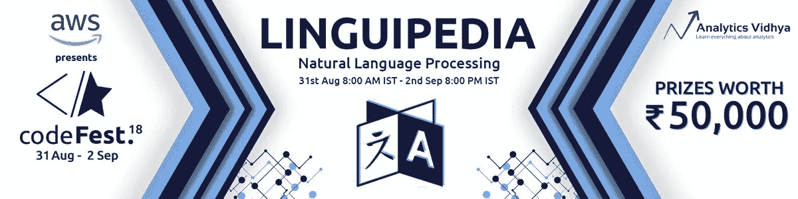
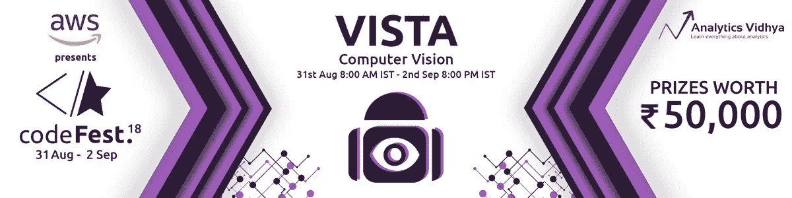
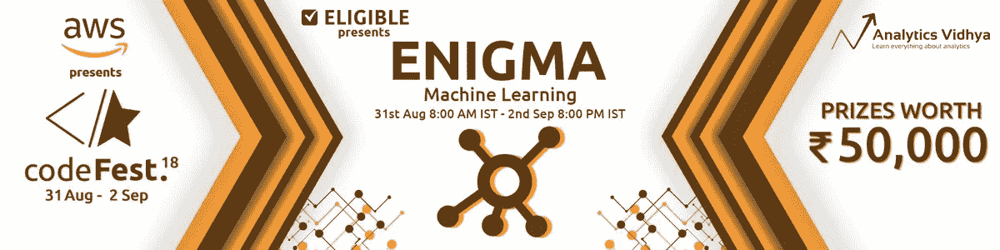

# codeFest 2018 的获奖方法— NLP、计算机视觉和机器学习！

> 原文：<https://medium.com/analytics-vidhya/the-winning-approaches-from-codefest-2018-nlp-computer-vision-and-machine-learning-666266a61593?source=collection_archive---------2----------------------->

[分析 Vidhya 的黑客马拉松](https://datahack.analyticsvidhya.com/contest/all/)是评估您在数据科学之旅中走了多远的最佳方式之一。还有什么比与全球顶尖数据科学家一起测试您的技能更好的方式呢？

参加这些黑客马拉松也有助于你了解你需要改进的地方，以及你还可以学习什么，以便在下次比赛中获得更好的分数。每次黑客马拉松后，一个非常受欢迎的需求是看看获胜的解决方案是如何设计的，以及其背后的思维过程。从中可以学到很多东西，包括如何为未来的黑客马拉松开发自己独特的框架。

我们都在倾听我们的社区，所以我们决定策划我们最近结束的黑客马拉松系列的获胜方法，codeFest！这是与 IIT-BHU 合作举办的三场黑客马拉松系列赛，于 8 月 31 日至 9 月 2 日举行。竞争非常激烈，超过 1，900 名有抱负的数据科学家将展开激烈角逐，争夺最终大奖！

每个黑客马拉松都有独特的元素。有兴趣了解更多吗？您可以在下面查看每场比赛的详细信息:

*   [Linguipedia](https://datahack.analyticsvidhya.com/contest/linguipedia-codefest-natural-language-processing/) —自然语言处理
*   [谜](https://datahack.analyticsvidhya.com/contest/enigma-codefest-machine-learning/) —机器学习
*   Vista —计算机视觉

是时候看看获胜者的方法了！

# 自然语言处理

# 优胜者

[阿比纳夫·古普塔](https://datahack.analyticsvidhya.com/user/profile/abhinav_gupta)和[阿比舍克·夏尔马](https://datahack.analyticsvidhya.com/user/profile/abhishek0318)。

# 问题陈述

参与者得到了一份来自客户的推文列表，这些推文涉及制造和销售手机、电脑、笔记本电脑等的各种科技公司。面临的挑战是找到对这些公司或产品表现出负面情绪的推文。

用于评估分类模型性能的度量是加权 F1 分数。

# 胜利者的方法

Abhinav 和 Abhishek 以一种非常直观的方式总结了他们的方法，解释了从预处理和特征工程到模型构建的一切。

**预处理:**

*   将单词转换为小写
*   将 ***网址*** 替换为单词 *'* ***网址*** *'* 和***@句柄*** 替换为单词' ***用户 _ 提及*** *'*
*   删除了 **RT** (转发) **—** 和**’**
*   用 hashtag 替换#hashtag
*   用空格替换了两个以上的点，用一个空格替换了多个空格
*   用 EMO_POS 或 EMO_NEG 替换表情符号
*   tweet 中的“和”
*   删除标点符号
*   将两个以上的字母重复转换为两个字母(有趣)
*   用过的词干分析器

**特征提取:**

*   稀疏向量表示(一键编码)情况下的前 15，000 个单字，密集向量表示情况下的前 90，000 个单字
*   在稀疏向量表示的情况下，他们使用 tf-idf 方法
*   对于密集向量，他们使用手套嵌入(在推特上训练)

**使用的分类器:**

*   朴素贝叶斯
*   最大熵分类器
*   决策图表
*   随机森林
*   XGBoost
*   支持向量机
*   多层感知器
*   卷积神经网络(我们实验了 1、2、3 和 4 层)
*   LSTM(使用获得的最后一层进行分类)
*   LSTM(带注意机制)

他们超调了上述每个分类器，发现 LSTM(具有注意力机制)产生了最好的结果。

**合奏**

*   他们给每个分类器一个权重——朴素贝叶斯、最大熵分类器、决策树、随机森林、XGBoost、SVM、多层感知器；两个权重给 CNN，三个权重给 LSTM(不关注)，五个权重给 LSTM(关注)
*   这些权重是在对一部分数据进行超参数调整后获得的(他们将训练数据集分为三部分)

# Vista —计算机视觉

# 赢家

迪帕克·拉瓦特。

# 问题陈述

Vista 黑客马拉松有一个非常有趣的问题陈述。参与者必须建立一个模型，计算给定集体自拍/照片中的人数。所提供的数据集已经被分割，其中训练集由具有边界框坐标的图像和每个图像的人数组成。

本次竞赛的评估标准是针对测试图像预测的人数的 RMSE(均方根误差)。

# 赢家的解决方案

下面用迪帕克自己的话来看看他的方法:

*   由于这是一个对象检测问题，我使用 Keras 和 TensorFlow 在 Python 3 中实现了 [Mask R-CNN](https://arxiv.org/abs/1703.06870v3) 。该模型为图像中的对象的每个实例生成边界框和分段掩码。它基于功能金字塔网络(FPN)和 ResNet101 主干网

**屏蔽 R-CNN 和 ResNet101**

*   掩模 R-CNN 是一个两阶段框架:
    第一阶段扫描图像并生成提议(可能包含对象的区域)
    第二阶段对提议进行分类并生成边界框和掩模

两级都连接到主干结构。我用过 ResNet101 主干网。主干是一个 FPN 式的深度神经网络。它由自下而上的路径、自上而下的路径和横向连接组成:

*   自底向上路径从原始图像中提取特征
*   自顶向下路径生成与自底向上路径大小相似的特征金字塔图
*   横向连接是两个通路的两个相应级别之间的卷积和加法运算

**预处理**

*   为了更准确，我使用了默认的 1024×1024 图像尺寸
*   除此之外，我还应用了一些数据扩充技术来避免过度拟合和更好的泛化

**模型构建**

*   我还使用了在 MS-COCO 数据集上训练的预训练权重。 [MS-COCO](http://cocodataset.org/) 是一个大规模的对象检测、分割和字幕数据集。**我使用迁移学习和预训练权重的微调，在给定数据集上训练自己的定制掩模 R-CNN 模型**
*   首先，只训练“头部”层。这些包括区域提议网络(RPN)、分类器和网络的掩码头。然后我微调了 ResNet101 的图层。ResNet 有各种块，其中我只训练块 4 和以上
*   最后，我使用加权多数投票来集成最佳模型并预测最终值

# 谜——机器学习

# 赢家

拉杰·舒克拉。

# 问题陈述

作为 enigma 竞赛的一部分，目标是根据提供的其他信息预测某个问题的投票数。对于每一个问题——它的标签、被浏览的次数、回答的次数、问题作者的用户名和声誉都被提供了。利用这些信息，参与者必须预测该问题将获得的投票数。

本次竞赛的评估标准是 RMSE(均方根误差)。以下是数据字典，供您参考:

**变量**

# 赢家的解决方案

以下是 Raj 破解 Enigma 黑客马拉松的方法:

**特色工程:**

我关注的是特征工程，即使用现有的特征来创建新的特征。以下是我编造的一些关键特征:

*   我创建的第一个特性是查看和回答的比率。我相信这个比率是一个比单个的观点或答案数量更好的指标。否则，一个有更多答案和大量总浏览量的人会比一个只有很少(但很好)答案和较少总浏览量的人得到更多的信任
*   第二个特征是信誉与五倍回答数的比值。我加上了因子 5，因为声誉大概是答案的 5 倍。这个比例直观上更有意义
*   我使用视图和信誉值创建了另一个特性。我取了观点和声誉之间差异的绝对值

**模型构建:**

*   我使用了具有多项式特征的线性回归模型
*   我将多项式的次数限制为 2，因为增加次数会导致模型更加灵活，并增加过度拟合的机会

# 结束注释

非常感谢大家参与 codeFest 2018！这个比赛是关于快速和结构化的思考，编码，实验，并找到一个让你在排行榜上领先的方法。简而言之，机器学习是怎么回事！

这次错过了？别担心，您可以在我们的 [DataHack 平台](https://datahack.analyticsvidhya.com/contest/all/?)上查看所有即将举办的黑客马拉松，并立即注册！

*原载于 2018 年 9 月 27 日*[*www.analyticsvidhya.com*](https://www.analyticsvidhya.com/blog/2018/09/the-winning-approaches-from-codefest-2018-nlp-computer-vision-and-machine-learning/)*。*