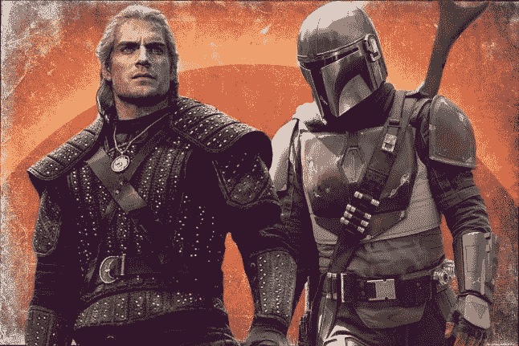

# 巫师 vs 曼达洛人|数字和文本挖掘说明了什么

> 原文：<https://medium.com/analytics-vidhya/the-witcher-v-s-the-mandalorian-what-does-the-numbers-text-mining-say-3ad6d473f4ed?source=collection_archive---------37----------------------->

# 烂番茄| Metacritic | IMDb |推特

[来源](https://decider.com/2019/12/20/the-witcher-vs-the-mandalorian/)

自去年圣诞节以来，网飞的《巫师》和迪士尼公司的《曼达洛人》占据了媒体的主导地位，它们各自成为了全球最热门的电视剧。

这两部剧在各自发行前都有大量的宣传和资金支持。虽然曼达洛人的优势在于发生在非常受欢迎的《星球大战》宇宙中，但巫师有三大营销优势:英国著名演员亨利·卡维尔(克拉克·肯特/DC 扩展宇宙解放运动的超人&碟中谍:辐射尘的主要对手)，该系列基于安德烈·萨普克维斯基的波兰系列小说，以及使其内容在世界各地受欢迎的巫师游戏系列。

加利福尼亚州圣地亚哥-7 月 19 日:亨利·卡维尔于 2019 年 7 月 19 日在加利福尼亚州圣地亚哥的圣地亚哥会议中心参加了 2019 年国际动漫展期间的网飞原创系列小组“巫师”。(艾伯特·l·奥尔特加摄影/盖蒂图片社)

现在，是时候看看数字和文本挖掘对这两个系列说明了什么。

*注意:不会有剧透。*

# 烂番茄和梅特克里斯特身上的疮

烂番茄和 Metacritic 是两个最受欢迎的电影和电视评论聚合网站。

*注意:对于绘图，Python 脚本在 Orange 软件中使用，带有图形库 Plotly。*

这两个节目都收到了世界各地烂番茄和 Metacritic 用户的积极反馈。虽然曼达洛人得到了评论家和用户的高度赞扬，但巫师从评论家那里得到的反馈大多一般，但得到了观众的高度赞扬。

曼达洛人被定为 PG-13 级，而巫师被定为 M 级。《巫师》包含了高度生动的性、裸体和暴力场景，同时探索了许多黑暗的主题。这是一个被许多网飞系列高度实践的大胆举措，但并不为一些评论家所接受。要理解巫师，重要的是至少要熟悉游戏系列或小说。

《娱乐周刊》给《巫师》的评分是 0/100，然后承认对小说或连续剧毫无概念，跳过了大部分剧集，以确保他们能按时写评论。这在许多粉丝和评论家中引起了巨大的争议。

 [## 《娱乐周刊》在承认跳过网飞的《巫师》后，猛烈抨击该片给了 0/100 分…

### 一位评论家写道，“因为生命对于网飞戏剧来说太短暂了，所以我跳到了第五集…

reclaimthenet.org](https://reclaimthenet.org/entertainment-weekly-netflix-the-witcher/) 

《福布斯》还猛烈抨击了负面评论，写道:“我认为把它写成《权力的游戏》是一种耻辱，我认为我读过的许多负面评论似乎误解了《巫师 T2》和《T3》，但事情就是这样。作为一个奇幻小说、游戏、节目和电影的粉丝，我对这类事情已经很习惯了。这是野兽的天性。”

《福布斯》承认，每个人都有权表达自己的观点，但评论家们真的应该先看看他们写的节目，然后再给它打分。

 [## 评论家们一定是疯了:《巫师》是网飞原创的一部精彩的新连续剧

### 不要相信烂番茄分数，伙计们。这是我们今天要学的一课。我们是…

www.forbes.com](https://www.forbes.com/sites/erikkain/2019/12/20/the-critics-must-be-crazy-the-witcher-is-a-fantastic-new-netflix-original-series/#2ef3548354a4) 

# IMDb 投票和得分

IMDb 是一个在线数据库，包含电影、电视剧、家庭视频、视频游戏和在线流媒体内容的信息。它还包括演员，制作人员，个人传记，情节概要，琐事，评级，以及评论家和粉丝的评论。

*注:对于绘图，Orange 软件使用了 Python 脚本和图形库 Plotly。*

看起来曼达洛人在上面的图表中得分很高，从 0 到 10 分，但是巫师有大约 253，687 票，相比之下曼达洛人有 169，318 票。

**伊利诺伊州芝加哥——4 月 14 日:(L-R)卡尔·韦瑟斯(格里夫)、佩德罗·帕斯卡(曼达洛人)和吉娜·卡拉诺(卡拉·杜恩)参加了 2019 年 4 月 14 日在伊利诺伊州芝加哥市麦考密克广场会议中心举行的星球大战庆典上的“曼达洛人”小组讨论会。(丹尼尔·博查斯基/迪士尼 WireImage 摄影)**

# 推特上说什么

大多数人倾向于在推特上发布他们观看的节目或电影的经历和想法，所以看看推特上对巫师和曼达洛人的评论是很有趣的。这就是情绪分析发挥作用的地方。现在，我们将分析文本，看看推文是正面的还是负面的。

*注意:对于情感分析，R 在 RStudio 中使用了各种包，包括****Twitter RR****，它提供了对 Twitter API 的访问。*

*# TheWitcher 用于发布关于巫师的推文，而#TheMandalorian 用于发布关于 Mandalorian 的推文。我们分析了每一个标签的最后 3000 条用英语写的推文。*

****

*这两个节目都受到 Twitter 用户的喜爱，他们在谈论节目时大多使用积极的词语。但是我们也可以了解到巫师的推特比曼达洛人有更少的负面词汇。*

# *词频*

*现在，让我们看看词频，试着了解哪些词用得最多。为了保持相关性，我们将只查看最近 200 条关于巫师和曼达洛人的推文，而不是查看 3000 条推文，这是一个巨大的推文数量。*

**注意:对于词频，R 在 RStudio 中使用了各种包，包括* ***【雪球】*** ，它实现了波特的词干算法，将单词压缩到一个共同的词根，以帮助比较词汇*

**

*像“巫师”、“杰拉斯基尔”(巫师杰洛特和他的同伴吟游诗人贾斯基尔的动态组合名称)、“杰拉特”和“贾斯基尔”这样的词似乎出现得最多。这意味着人们对杰洛特和贾斯克尔这两个角色以及他们之间的化学反应很感兴趣，并在谈论他们。*

**

*Twitter 用户主要使用“themandalorian”这个词最常用的词是“星球大战”、“插曲”、“小宝贝”等等。尤达宝宝是所有角色中最可爱的。看来人们对曼达洛人和尤达宝宝这两个角色很感兴趣。他们还提到了《星球大战》的选举权，谈论了每一集，等等。*

# *最终注释*

*这两个节目都很棒。就我个人而言，我喜欢这两个节目，并且对这两个节目的下一季感到非常兴奋。我认为观看和欣赏这两个节目很重要，因为它们在许多方面既相似又不同。*