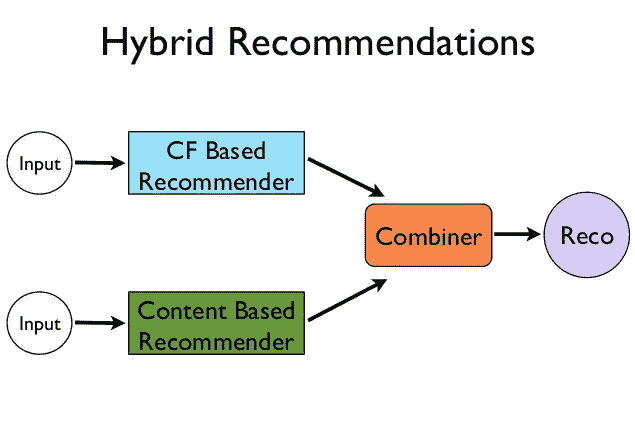

# 推荐系统的世界

> 原文：<https://medium.com/analytics-vidhya/the-world-of-recommender-systems-e4ea504341ac?source=collection_archive---------15----------------------->

*数据科学领域有哪些推荐系统？*

**推荐系统**是点燃我对数据科学兴趣的领域之一。作为*、亚马逊以及更多电子商务和基于内容的平台的狂热终端用户，我曾经着迷于我在所有这些在线平台上获得的推荐的质量，这反过来促使我详细阅读它们。*

# ***什么是推荐系统？***

**维基百科称“一个* ***推荐系统*** *或一个* ***推荐系统*** *(有时用一个同义词如平台或引擎代替“系统”)是* [*信息过滤系统*](https://en.wikipedia.org/wiki/Information_filtering_system) *的一个子类，它试图预测用户对一个项目的“评分”或“偏好”。它们主要用于商业应用。**

*[https://en.wikipedia.org/wiki/Recommender_system](https://en.wikipedia.org/wiki/Recommender_system)*

*基本上，任何基于用户过去的偏好来预测用户未来偏好的系统都被称为推荐系统。现在，有许多先进的推荐系统被网飞、亚马逊等公司使用。事实上，他们的大部分收入取决于他们的推荐系统的质量。因此，作为一名数据科学家，我们必须了解它们是如何工作的。首先，在深入研究它们的实现之前，让我们简要地看一下几种推荐系统。*

*我将通过例子简要地解释它们，因为例子会增加你对它们了解更多的好奇心，这才是最重要的*

# *1)基于内容的推荐系统:*

*基于内容的推荐系统，顾名思义，通过使用我们以前喜欢的产品的内容来推荐产品。*

*假设你是一个非常喜欢电影《A》情节的人，你想被推荐一部与其情节相似的新电影。能够基于情节实际提供这种相似电影的推荐系统属于基于内容的推荐系统。*

*下面是我的博客，在这里我用 Python 演示了基于内容的推荐系统的实现:*

*[***https://medium . com/@ saketgarodia/content-based-recommender-systems-in-python-2b 330 e 01 EB 80***](/@saketgarodia/content-based-recommender-systems-in-python-2b330e01eb80)*

# *2.**基于元数据的推荐系统***

*同样，顾名思义，当推荐系统基于我们过去购买的产品的元数据向我们推荐产品时，这些系统属于基于元数据的推荐系统。*

*例如，假设一个人非常喜欢一些导演和类型，他只是希望根据这些导演和类型以及其他一些元数据(如电影的演员和工作人员)被推荐电影。在这种情况下，基于元数据的推荐系统将会拯救他。*

**

*在我的博客中，我用 Python 演示了基于元数据的推荐系统的实现:*

*[***https://medium . com/@ saketgarodia/metadata-based-recommender-systems-in-python-c 6 aae 213 b 25 c***](/@saketgarodia/metadata-based-recommender-systems-in-python-c6aae213b25c)*

# *3.**使用协同过滤的推荐系统:***

*现在使用的大多数推荐系统都使用某种形式的协同过滤方法。我们每个人都会购买或使用基于协同过滤方法推荐给我们的产品。**网飞的“像你一样的用户也喜欢**”功能或**亚马逊的“因为你买了”功能**使用协同过滤技术来推荐美国产品。*

*举个例子，假设一家公司(比如网飞)有用户和电影的数据，以及用户对他们看过的电影的一些评级。为了向我们推荐一部基于协同过滤的电影，该公司将首先使用其他用户提供的对其他电影的评级来找到与我们相似的用户，然后他们将尝试使用其他相似用户的力量来预测我们可能给所有其他我们没有看过的电影的评级**。***

*简而言之，协同过滤是一种技术，通过这种技术，系统试图找到最相似的用户，并根据其他相似的用户推荐产品。*

**

*在我的博客中，我用 Python 演示了基于元数据的推荐系统的实现:*

*[***https://medium . com/@ saketgarodia/re commendation-system-using-collaborative-filtering-cc 310 e 641 FDE***](/@saketgarodia/recommendation-system-using-collaborative-filtering-cc310e641fde)*

*还有其他种类的推荐系统，如**混合推荐系统**，可以通过组合一个或多个上述推荐系统来实现。*

**

*我希望我能够通过这个博客引起一些关于推荐系统的好奇心。*

*请浏览我下面的博客，我在 Kaggles movielens 100k 数据集上用 python 实现了所有这些推荐系统。*

1.  *基于内容的推荐系统:[*https://medium . com/@ saketgarodia/content-Based-recommender-systems-in-python-2b 330 e 01 EB 80*](/@saketgarodia/content-based-recommender-systems-in-python-2b330e01eb80)*
2.  *基于元数据的推荐系统:[*https://medium . com/@ saketgarodia/metadata-based-Recommender-Systems-in-python-c 6 aae 213 b 25 c*](/@saketgarodia/metadata-based-recommender-systems-in-python-c6aae213b25c)*
3.  *使用协同过滤的推荐系统:[*https://medium . com/@ saketgarodia/recommendation-system-using-Collaborative-Filtering-cc 310 e 641 FDE*](/@saketgarodia/recommendation-system-using-collaborative-filtering-cc310e641fde)*

*我将很高兴得到一些反馈。*

*谢谢你。*