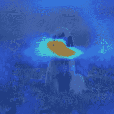
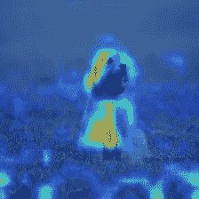
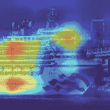

# CNN 眼中的世界。

> 原文：<https://medium.com/analytics-vidhya/the-world-through-the-eyes-of-cnn-5a52c034dbeb?source=collection_archive---------8----------------------->

卷积神经网络是一类广泛应用于计算机视觉及其应用领域的深度学习模型。卷积神经网络在识别物体、识别人群中的面孔方面非常精通&它们甚至构成了自动驾驶汽车的基本组成部分。给定一堆训练图像，CNN 可以通过分析图像的特征来学习识别图像中的物体。随着图像从一层向前传播到下一层，CNN 学会了拾取更复杂的特征和模式。

当我们训练一个卷积神经网络时，它是否像我们人类一样准确地理解图像？

如果我们将深度学习模型视为一个**黑盒**，我们向模型输入数据/图像&，模型输出其预测，那么回答这个问题就变得困难了。即使预测可能是准确的，如果模型不能像我们人类一样感知图像，它就不是真正的**智能**。毕竟，我们正在尝试在计算机或人工智能上再造人类智能。

如果我们理解网络内部的流程，而不是将其解释为黑盒，那么我们人类调试深度学习网络将变得更容易。

# 图像怎么看每一层？

通过在卷积操作后可视化特定层的滤波器的特征/激活图，我们可以洞察**“网络在卷积神经网络的每个阶段看到了什么”**。让我们考虑一个名为 VGG16 的 CNN 模型，它在 ImageNet 分类上取得了基准结果。使用这个网络将为我们提供关于网络如何可视化图像中的对象的深刻见解。

最初几层的滤镜**提取方向&颜色**，这些原始(边缘&颜色)特征贴图被组合成**基本网格，纹理&图案**。反过来，这些被组合起来，以提取越来越复杂的特征，这些特征类似于物体的一部分。随着我们沿着网络向下移动，提取的特征变得更加复杂，难以解释。

上图显示了网络上不同阶段的功能图。初始(较低)层的特征地图编码**边缘&方向，即水平线或垂直线**，在网络中间获得的特征地图可视化**纹理&图案**，顶层的特征地图描绘图像中&物体的**部分。我们来形象化一下这张特斯拉汽车在 VGG16 不同阶段的图像。**

## 低级/原始特征

**低层特征图**提取图像的边缘&线。这些是原始特征提取器(过滤器)，它们提取图像的微小细节，如直线、曲线&点。

输出特征图来自在 ImageNet 数据集上训练的 VGG16 网络的初始层。原始特征水平、垂直和 45⁰线有助于描绘车身的形状。

## 中级功能

原始特征图组合产生简单的形状，例如圆形、正方形、椭圆形等。**中间层功能**提供了比第一个更多的信息，例如，过滤器学习检测角落，**复制基本模式，纹理&形状。**

中级特征类似于轮胎、车门、保险杠等的圆形。我们可以概括地说，中级特征描绘图像中的纹理、图案。

## 高级功能

高级特征描绘了类似于图像中对象部分的复杂模式，这往往是该类别(对象)的独特特征，这也有助于该类别的分类分数。下面的特征地图描绘了狗的脸，眼睛等。

随着我们深入，CNN 产生了复杂的图案，如眼睛、鼻子等。上面的特征地图描绘了狗的不同部位，鼻子、眼睛、毛发、耷拉的耳朵、尾巴等等。

特斯拉在 VGG16 更高级别的特征图如下图。这些图像可能很难理解，但通过仔细观察右边的图像，我们会注意到一些细节，如窗户、轮胎等。

特斯拉汽车在 VGG16 更高层的特征图。

更高级的功能

看看火烈鸟特征图，它从不同的角度表现了火烈鸟，与广告牌表类似。这些是特定类别图像所特有的特征或模式。

> 因此，在网络的较高层次上的特征地图通过呈现对特定物体保持唯一的特征来帮助区分两个物体。CNN 然后可以容易地将输入图像分类到其相应的类别。

这些经过训练的 CNN 模型的可视化不仅让我们深入了解其操作，这在以前被认为是一个黑盒，而且还有助于诊断网络&调整网络架构以提高其性能。

虽然，看着 CNN 的 visualize 不精确地指出是什么使 CNN 将一幅图像分类到一个特定的类别的幻觉模式。更高层的视觉形成人类无法理解的复杂图案**。如果我们可以可视化特征/激活图在输入图像上看到的确切区域/部分，这可以通过将特征图投影回输入图像来实现，这将突出显示 CNN 通过该层&及其相应的过滤器(又名热图)看到的图像上的区域。**

# **诊断** g 卷积神经网络。

## 为什么 CNN 的特征图可视化很重要？

在这张来自 [hackevolve](https://www.hackevolve.com/where-cnn-is-looking-grad-cam/) 的图像中，图像的足球区域被突出显示，这很好地表明网络正在寻找精确的特征来将对象分类为足球。右边的图像是特定滤波器下网络的 **Gradcam** 输出。你可以把它想象成一个热点图，重点是感兴趣的区域。突出显示了网络已经学习了在足球上发现的五边形-六边形模式&使用这一特定特征进行分类。

通过可视化，我们很容易理解网络在看哪里&有助于推断网络是否在作弊。

**卷积神经网络怎么可能作弊？**

想象一下，如果网络正在查看绿草地，以将对象分类为足球，而不是球本身。突出显示的区域是草地，而不是球。

然后，网络会将足球场上的篮球误归类为足球。意味着网络看起来不够近，或者看不到相关特征。

这里还有几个网络作弊的例子。

*   如果天空中的飞机图像被显示给网络，将鸟与蓝天相关联的卷积神经网络可以将飞机分类为鸟。反之亦然。
*   网络查看植物/树木，同时将图像分类为大象。该网络无法捕捉到大象的鼻子、耳朵、长牙或任何特定特征。

## 使 CNN 更加透明的技术。

通过可视化输入图像上的感兴趣区域(可视化热图)来清楚地了解 CNN 在看哪里，通过使其更加透明，为我们提供了对网络工作的更深入理解。**通过分析这些热图，用户可以对网络进行更改、添加或删除少量图层、超参数调整、向数据集添加更多图像或应用不同的数据扩充策略。**

## 类激活图，又名 CAM

一种技术，用于可视化 CNN 在分类时正在查看的图像部分。可视化是一个热图，突出显示了“图像上特定类别的区域”。

CAM 提出的想法要求 CNN 有一个可以利用的特定架构。CAM 在倒数第二层(倒数第二层)需要一个全局平均池层，即完全连接层之前的间隙层。

输入图像通过 CNN 层，在每层提取特征。GAP 之前的图层将有 **n** 个特征地图，这是所有前面图层捕获的所有特征的结果。 **n** 可以是网络指定的任何值，这些 **n** 特征图中的每一个都是宽度**u**高度 **v.** 在上图中，红色、蓝色、绿色特征图表示 GAP 之前的最终特征图。

**什么是全球平均池？**

全局平均池通过对像素值取平均值，将特征图转化为单个数字。如果有 **n** 个特征图，GAP 产生 **n** 个单值张量。

全局平均池使网络不受图像的空间平移或扰动的影响。

**全连接层&分类得分。**

在 GAP 之后，网络输出 **n 个**单值数字，这些数字被转换成分类分数。“澳大利亚梗”的分类分数为，
y^australian-terrier = w1×n1+w2×N2+…。+ wn x n .(这里 n 是间隙输出)。

**如何获取职业激活图？**

不是将与澳大利亚梗相关的权重乘以 GAP 输出，而是将权重乘以 GAP 之前的特征图。

假设，在全局平均汇集之前，我们有宽度**u**高度 **v** 的 **n** 个特征图 f1，f2，f3 … fn。与澳大利亚梗神经元相关的权重是 w1、w2、w3 … wn。

cam^aus = f1 x w1+F2 x w2+F3 x w3+…+fn x wn。

生成的特征图宽度为**u**高度为 **v** (与 f1，f2，…，fn 相同)**。**类别激活图尺寸与特征图尺寸相同(A1，A2，A3 … An。)

分类激活图被上采样以匹配输入图像尺寸&覆盖在顶部以查看结果。

输出类激活图是所有特征图的总和。在上面，我们有 n 张特征图，每一张看着狗的不同部分或图案，一张特征图集中在它的腿上，而另一张集中在它的皮毛上，而另一张集中在它的脸上。热图区域包含了所有单独的功能图。

这是另一个网络收集宫殿不同特征的例子，比如它标志性的圆顶，文艺复兴风格的建筑等等。网络预测城堡类的概率很高，不忽略教堂、祭坛或修道院，因为它们看起来都一样。

**类激活图的限制。**

*   卷积神经网络需要修改，它没有全局平均池层。
*   添加间隙层需要重新训练网络。
*   可以获得关于最后一个 CNN 层的可视化或热图。

## GradCAM:基于梯度的类激活图

为了解决类激活图面临的局限性，引入了基于梯度的类激活图。GradCAM 并不直接将预测图层的权重与特征图相关联，而是根据卷积图层的特征图计算输出得分的梯度。

> 通过计算分类分数相对于各个特征图的梯度(导数),我们获得了一个值，该值指示特征图对分类分数有多大贡献。即分类分数随特征图的变化而变化的速率。

例如，我们用狗的一个特征图来计算狗的分类分数，该特征图可视化了狗的松软耳朵。如果松软的耳朵在特征图中比以前更突出，分类分数将增加，如果它们不太突出，分类分数可能降低。通过计算梯度，我们获得了特征图对分类的贡献度量。

这里，y^c 是 c 类的输出分类分数(在 softmax 之前)，A^k 是卷积层 I 的第 k 个特征图，是来自层 I 的滤波器 j 的输出。输出可以被称为梯度特征图。

在计算 k 个梯度特征图之后，我们在 k 个梯度特征图的每一个上执行全局平均汇集。

作为结果输出的全局平均汇集梯度特征图(α-k)，我们执行卷积层的αk 和特征图的加权线性组合。

**每个特征图乘以它自己的全局平均混合梯度特征图**(α-k 与特征图 A^k).这种加权线性组合产生与特征图 A^k.大小相同的粗略热图。我们将 ReLU 应用于粗略热图，因为我们只对对其预测有积极影响的图像特征感兴趣。

**grad CAM 如何克服 CAM 的局限性？**

1.  可以计算关于任何卷积层的特征映射的输出分类分数的梯度，这与 CAM 不同，在 CAM 中只能使用最后一层的特征映射。
2.  该网络不需要任何修改，无需网络中的全局平均层即可计算 GradCAM。(注意，我们对不属于网络一部分的梯度执行间隙操作)。

以下是在 ImageNet 数据集上训练的 VGG16 网络不同部分的 GradCAM 输出。

block5_conv3、block5_conv2、block4_conv3

# 结论

概念的实现可以在这个[笔记本中找到。](https://github.com/shivvignesh/VGG-Feature-maps-GradCAM/blob/master/CNN_Visualization.ipynb)