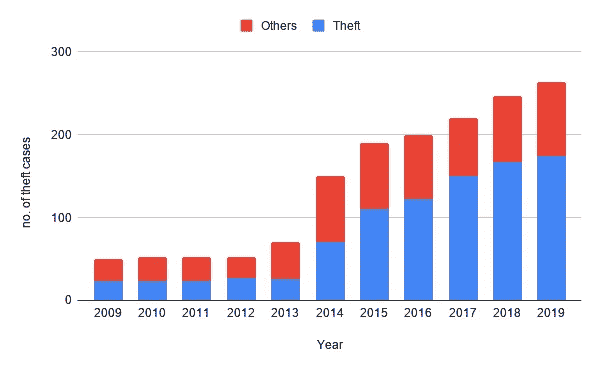
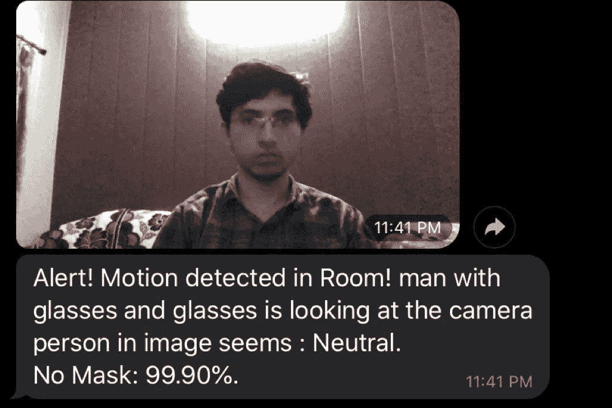

# 使用机器学习的盗窃检测

> 原文：<https://medium.com/analytics-vidhya/theft-detection-using-machine-learning-a4232ea51f1c?source=collection_archive---------0----------------------->

盗窃是一种常见的犯罪活动，这些年来非常普遍，并且与日俱增。为了解决这个问题，市场上已经引入了许多监控系统。有些只是基于人类监控的视频监控，而有些是基于人工智能的，能够检测可疑活动并发出警报。然而，它们都没有足够的智能来实时识别正在进行何种可疑活动以及应该采取何种保护措施。本博客介绍了使用机器学习技术的有效监控系统的设计。

**简介**

盗窃是世界上最常见的犯罪。根据国家犯罪记录局(NCRB)，大约 80%的刑事案件与盗窃有关[1]，如图 1 所示。不断上升的盗窃率使人们在经济上和情感上都遭受损失。因此，需要开发一种更具威慑力的监视系统，该系统使用方便，没有误报警，最大限度地减少人为干扰，并且成本低廉。

**图一**。盗窃在犯罪中的作用

机器学习(ML)技术被证明在开发高效的监控系统方面卓有成效。这个博客旨在设计一个盗窃检测和监控系统，该系统将能够使用使用 ML 的运动感应相机来检测盗窃，并通过警报消息以及运动实例的捕获图像来警告所有者。

主要贡献是:

*   根据需要检测和激活静止位置的运动
*   使用 ML 模型识别面部表情并检测戴面具的人
*   检测周围可疑的任何种类的武器并发出警报信息

1.  **提议的方法**

提出的方法包括三个阶段-数据收集和获取，ML 模型，并采取行动。建议方法的工作流程如图 2 所示。

**图二。**流程图

**3.1 数据收集和获取:**使用的数据集取自 Google Pictures、Kaggle 和 Flickr 8k 数据集，其中包含 8000 张图片，每张图片有 5 个字幕。该数据集足以为演示做准备。图片数量越多，在给定的计算前提下准备节目就越麻烦。

利用与远程组织者相关联的 IP 摄像机来捕获视频。这通常通过利用 OpenCV 库来完成。一旦视频被捕获，它就被处理并分解成图片的轮廓。这些图片轮廓在这一点上滋养 ML 模型，以鼓励调查。最近应用 ML 模型对信息进行清理和预处理。在信息清理中，在数据集图片的所有标题中显示的同类单词之一的词典被创建并在磁盘上备用。为了创建这个节目，我们认为离群值更强，因为这些词在整个语料库中最少出现 10 次。

在信息预处理中，图像被转换为固定大小的向量，然后被馈送到基于交换学习的卷积神经网络(CNN)。本演示准备在 ImageNet 数据集上对 1000 个不同类别的图片执行图片分类，但由于我们需要为每张图片提取固定长度的指导性向量，因此我们从节目中撤出了最终的 softmax 层，并为每张图片提取了 2048 长度的向量(瓶颈高光)。

**3.2 ML 模型:**图像帧经过处理，馈入不同的 ML 模型。每个模型以特定的顺序执行任务，以便分析不同的评估参数。

**3.3 行动:**根据从 ML 模型获得的结果，将采取行动，例如发出警报、仅向所有者发送警报消息、仅向 COP 发送警报消息、向所有者和 COP 发送警报消息。

该系统由几个级别的监控组成，在每一个级别上，每一帧视频中的活动都将使用 ML 模型进行彻底监控，这些 ML 模型只接受过执行特定工作的训练。总共有六个级别的监控，系统包括两种模式(即白天和夜晚)，这将完全取决于用户此时需要哪种模式。

1.  **运动检测:**为了检测运动，我们首先检测帧中是否有人，为此我们使用了 CNN。卷积可以用来实现模糊、锐化、边缘检测、降噪，这是其他方法不容易实现的。

在卷积方法中，核的中心保持在图像输入的每个元素处，并且相应的元素相乘并相加在一起。CNN 是一种神经网络，由大量神经元组成，这些神经元具有定义它们之间关系的权重和偏差。每个神经元接收几个输入，对它们进行加权求和，通过一个激活函数，并以一个输出做出响应。

在从具有 2000 幅有人类的图像和 2000 幅没有人类的图像的数据集上训练的模型中获得相当正常的结果之后。我们尝试了迁移学习，我们使用 YOLOv4 神经网络并提取网络最后两层之前的权重，然后使用这些预训练的权重来训练模型，该模型可以检测图像中的人，使用迁移学习技术提高了准确性。在检测到帧中的人之后，我们现在可以检测运动，所以我们使用了 python 库“OpenCV”。

为了识别运动，采用不同的策略，如帧差分、背景差分、光流等。帧差法带来了最好的结果。帧间差分策略利用基于时间序列图像的相邻两帧或三帧图像进行相减，得到不同的图像，其工作原理与背景相减非常相似，相减后的图像通过边缘尊重给出运动目标数据。这种方法简单易行，与背景减除法相当。但是这种策略对充满活力的场景变化非常灵活；无论如何，它在识别少数几种运动物体的完全重要的像素时，总的来说是失败的。为了下一关的胜利识别停止的物体而应该接收的额外策略在计算上是复杂的，并且在没有专门设备的情况下不能实时使用。

1.  **面具检测:**窃贼在企图盗窃时通常会戴上面具来隐藏身份。因此，该模块的输出将有助于确定盗窃是真是假。本模块中使用的数据集来自 Google Images 和 Kaggle。谷歌图片是使用 selenium 包和 Chrome 驱动扩展抓取的。为了在短时间内获得更好的结果，使用了方法迁移学习，并在 ImageNet 的权重上训练 MobileNetV2 架构。在训练中，主要关注点是从磁盘堆叠人脸覆盖检测数据集，在该数据集上训练模型(利用 Keras/TensorFlow ),然后将人脸掩模检测器序列化到磁盘。该模型在包含 1000 幅图像的信息集上进行训练，这些图像分别针对一个戴面具和不带面具的人。
    本模块中采用的独特步骤有:

*   训练掩码检测器:接受输入数据集，并对其进行微调以建立模型。
*   检测面具图像:这个模块在静态图像中执行面具检测
*   检测遮罩视频:利用摄像机，该模块适用于对抗视频流中每一帧的遮罩发现。

对于遮罩检测，我们使用了一个交叉模型，在该模型中，我们首先使用 haar cascade 来识别人脸，然后使用基于 Imagenet 的权重准备的 MobilenetV2 来识别人脸上的遮罩。一旦面对面纱探测器准备好了，我们就开始堆叠面具定位器，执行面部发现，然后将每张脸分类为“带面具”或“不带面具”。

1.  **面部表情检测**:作为预处理步骤，在面部周围裁剪图像并进行亮度归一化。提取特征并计算局部描述符。该计算使用局部聚集描述符(VLAD)的向量来表示。使用 SVM 分类器在情感类上训练这个标记的数据集。最后，使用 haar 级联分类器从图像中识别人脸，并将图像裁剪成 256×256 的分辨率。
2.  **武器检测:**武器检测是区分虚假和实际威胁的另一个重要模块[8]。我们用来检测武器的方法类似于面具检测，除了我们使用哈尔级联来检测人的手，然后检测手中的武器。为了训练该模型，我们使用了包含 4000 个图像的数据集，每个图像包含一个带武器的人和一个不带武器的人。数据集中使用的图像标签是分类的。因此，我们使用一键编码将分类标签转换为二进制值。由于我们的数据集很小，我们使用增强技术来实现良好的准确性。数据扩充可以是一种可用于通过在数据集中创建图像的修改版本来人工扩展训练数据集的维度的技术。有点像掩模检测，迁移学习用于训练模型。MobileNetV2 架构在 ImageNet 的权重上进行训练，以在短时间内实现更好的准确性。在训练期间，像检查点和提前停止这样的回调被用来保存训练得最好的模型。
3.  **姿态检测:**由于计算机视觉策略预见到诸如肘、膝、颈、熊、臀、胸等变化的人类关键点(关节和感兴趣的点)的情况，所以人类姿态估计的问题经常被特征化。这是一个非常具有挑战性的问题，因为不同的组成部分喜欢很少的和几乎不会错的部分，遮挡，以及发音中巨大的不一致性。发音姿势估计的经典方法是利用图像结构系统。这里的基本思想是通过一堆“部分”在一个非常可变形的设置中(不是不灵活的)来谈论一个问题。“部分”是图片中协调的外观格式。弹簧出现在零件之间的空间关联中。当部件通过像素区域和介绍被参数化时，即将出现的结构可以演示动词化，这在姿态估计中非常重要。(有组织的期望任务)。尽管如此，这种策略也有一个障碍，那就是不看图片信息。因此，inquire 致力于提高模型的代表性控制。在决赛中从上述策略中得到一些不合适的结果后，我们利用了谷歌的神经组织，它给了我们想要的结果。在姿势被识别后，我们准备了一个展示，展示轮廓中识别的姿势是否应该关注轮廓中的可疑性[9]。为了做到这一点，我们制作了一个假数据集，其中包含 10，000 张标有姿势的图片和一个单词引用，该单词引用包含几乎所有姿势的数据以及它们与当时可能发生的动作的相关性。
4.  **活动字幕:**活动字幕是一项类似于图像字幕的任务，但它是实时的，涉及计算机视觉和自然语言处理。它拍摄一幅图像，并用简单的英语描述图像中发生的事情。该模块对于确定视图中的人正在执行的动作过程是必不可少的。在监控系统中，它可以通过为从摄像机获得的帧添加字幕来确定盗窃行为，并最终向当局报警。我们再次使用迁移学习的方法，利用基于 ImageNet 权重训练的 ResNet50 架构。在从上述六个模块获得结果后，这些结果被组合，然后进一步成为 ML 模型的输入，该模型决定警报消息应该发送给谁，应该是所有者还是 cops 或者两者都是[10]。

该项目的主要目的是将计算机视觉嵌入到照相机中。我们以这样一种方式设计系统，即摄像机连接到外部计算机，算法将在其上运行。客户端也通过互联网连接到这台计算机。只要检测到可疑活动，就会向客户端发送警报消息。该消息将由通过摄像机捕捉的图像以及由我们的 6 个模块提取的各种特征组成。我们也可以用 Raspberry Pi 代替普通电脑来降低项目成本。

1.  **结果**

为了区分运动，我们基本上利用轮廓差分方法，而不识别其中的人类生物，这带来了巨大的变化，但不可避免的是，运动确实通过令人毛骨悚然的爬行动物或其他不良事物的发展而被识别，为了驱逐那种骚动，我们试图设置一个限制，几乎与由于轮廓内的人的接近而发生的像素改变相同。但在这种情况下，此外，鼓噪很高，所以最后，我们制作了一个 ML 显示，可以检测轮廓内的人类生物。在识别轮廓内的人之后，利用轮廓差分技术识别运动。

在“掩模检测”模块中，将使用 ML 模型检测掩模，首先使用简单的 CNN 训练该模型，该 CNN 是一些卷积层、最大汇集层和一些下降层的组合，后面是密集层，但是精度没有达到标准。然后，为了提高在小数据集上训练的模型的准确性，我们使用了迁移学习技术，并取得了很好的效果。

在“面部表情检测”中，我们主要开发了一个模型来检测帧中出现的人的正面面部，然后我们使用 CNN 和激活函数“Relu”建立了另一个模型来确定面部特征，但我们得到的响应很差，所以我们用“elu”替换了“Relu ”,并获得了很高的准确性。

在“武器检测”中，我们检测图像中的武器，我们使用了与掩模检测器相同的技术，并获得了良好的准确性。

在“姿势检测”中，我们使用 Google 训练的模型来检测姿势，然后从中获得结果，我们将这些结果处理为 ML 模型，该模型检测图像中的姿势是否与怀疑有关，为此，我们使用分类技术，并通过多元逻辑回归获得最佳结果。

在“活动字幕”中，我们设计了一个 ML 模型，说明活动是计算机视觉和自然语言处理的结合，我们首先尝试了基本的图像分类和文本生成算法，但没有得到好的结果，然后我们使用迁移学习进行图像分类，使用 Bert 进行文本生成，最终我们得到了很好的结果。

最后，在组合这些模块的结果之后，创建另一个 ML 模型的输入，该模型确定应该向谁发送警报消息，并且为了设计这样的模型，我们使用了几种分类技术，如逻辑回归、SVM 等。但是用决策树得到最好的结果。

没有面具的入侵者。

一个戴面具的入侵者。

**结论和未来范围**

在这个博客中进行的工作基本上集中在计划和创建有效和有用的观察框架，以解决安全问题，能够提供援助，以减少/阻止盗窃。尽管在过去已经进行了大量的研究来解决这种安全问题，但是由于日益增加的复杂性和每天发生的各种盗窃行为，这仍然是一个挑战。只有当帧中有任何人并且运动超过系统中预设的特定阈值时，系统才会捕捉图像。因此，它减少了需要处理的数据量。此外，通过不捕获通常不包含感兴趣对象的静态图像，这将有助于节省数据空间。使用该系统的用户不需要一直担心监控摄像机，相反，该系统会通知用户正在发生的活动，并且还会建议用户应该采取一些行动或不采取行动。在成功实施该项目后，它可以应用于智能家居安全系统，这将非常有助于汽车防盗检测的安全目的。它在银行、博物馆和午夜的街道上也很有用。

**参考文献**

1.  NCRB 数据显示，盗窃是德里最常见的犯罪。【https://ncrb.gov.in/ 
2.  Kushwaha，a .，Mishra，a .，Kamble，k .，& Janbhare，R. (2018)。使用机器学习的盗窃检测。在 Int Conf 中。因诺夫。先进技术。英语(第 8 卷，第 67-71 页)。
3.  n .萨罗德和 s .巴蒂亚(2010 年)。面部表情识别。国际计算机科学与工程杂志，2(5)，1552–1557。
4.  侯赛因、M. Z .、索赫尔、f .、白图丁、M. F .、张方圆(2019)。图像字幕深度学习综述。*美国计算机学会计算调查(CSUR)* ， *51* (6)，1–36。
5.  Grega，m .，Matiolański，a .，Guzik，p .，和 Leszczuk，M. (2016 年)。闭路电视图像中枪支和刀具的自动检测。*传感器*、 *16* (1)、47。
6.  郑，魏，刘(2016)。基于纹理和形状的面部表情识别。在 *2016 第 25 届无线与光通信大会(WOCC)* (第 1-5 页)。IEEE。
7.  赵志清，郑平，徐树涛，吴，谢(2019)。基于深度学习的物体检测:综述。 *IEEE 神经网络与学习系统汇刊*， *30* (11)，3212–3232。
8.  Pathak，A. R .，Pandey，m .，& Rautaray，S. (2018 年)。深度学习在物体检测中的应用。Procedia 计算机科学，132，1706-1717。
9.  朱，李，徐，钟，杨，杨等(2017)。揭示视频问答的时间背景。国际计算机视觉杂志，124(3)，409–421。
10.  维尔马和迪隆(2017 年)。使用更快的 r-cnn 深度学习的手持枪支检测。《第七届国际计算机和通信技术会议论文集》(第 84-88 页)。

源代码可以参考 GitHub 资源库 [**点击这里**](https://www.github.com/jatinarora1/Theft-Detection)