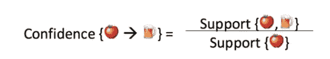

# 市场篮子分析的理论和实践方面

> 原文：<https://medium.com/analytics-vidhya/theoretical-and-practical-aspect-of-market-basket-analysis-c21bd74f8f22?source=collection_archive---------10----------------------->

# 为什么要进行购物篮分析？(理论方面):

假设你去超市为你今晚的晚餐买食用油和一些蔬菜。当你在那里的时候，你也有你最喜欢的巧克力、薯条、咖啡和饮料。现在当你回到家，你开始思考是什么让你买了这些额外的东西。你只是去他们那里买油和蔬菜。

这就是放置合适的产品和交叉销售对你的影响。:)

在我们跳到代码之前，让我们回顾一下为什么公司做市场篮子分析的商业原因。

# 有两个主要原因:

1.  企业投入巨资了解客户的购买模式，这反过来有助于他们增加公司的销售额。
2.  促进各种不同产品的交叉销售。

对于那些不知道交叉销售这个词的人来说，**交叉销售**是向现有客户销售额外产品或服务的做法。

像亚马逊这样的公司使用这个概念来完善他们产品建议页面上的一起购买商品列表。网飞用这个概念来提炼他们的电影建议。简而言之，这个概念有很多应用，取决于不同的业务。

# 主要概念是:

如果有一对经常一起购买的物品 X 和 Y:那么

1.  X 和 Y 可以放在同一个货架上，这样一个商品的购买者就会被提示购买另一个。
2.  商家也可以对这两种商品中的一种进行促销折扣。
3.  X 上的广告可以针对购买 y 的买家。
4.  x 和 Y 可以组合成一个新产品，比如在 x 的味道中有 Y。

现在，即使我们进行市场购物篮分析并找到不同产品之间的关联，您将如何理解项目之间的关系，因为模型给出的关系是一个数值，不能绘制在图表上。

为了理解这些数值，我们需要理解 3 个概念，通过它们我们可以衡量不同产品之间的关系。

# 有三种方法来衡量关联性:

**支持:**这是物品的频率。这说明一个项目/项目集有多受欢迎，它是一个项目在总交易数中出现的次数。

**置信度:**它告诉我们在购买物品 A 时，购买物品 B 的可能性有多大，表示为{A - > B}。这是通过与项目 A 交易的比例来衡量的，其中项目 B 也出现了。

**Lift:** 它会告诉我们当 A 商品被购买时，B 商品被购买的可能性有多大。大于 1 的提升值意味着如果购买了物品 A，物品 B 很可能*被购买，而小于 1 的值意味着如果购买了物品 A，物品 B 不太可能*被购买。**

现在我们已经完成了购物篮分析的理论方面，让我们看看实际的 ML 代码是如何帮助商店实现这一点的！

# 代码(实用方面) :

关联规则通常是这样写的:{ A }--> { B }，这意味着在同一笔交易中购买了 A 和 B 的客户之间有很强的关系。在上面的例子中，**{ A }是前件，{B}是后件**。前因和后果都可以有多个项目。换句话说，{A，C} - > {B，D}是有效规则。

## 步骤 1:安装所需的软件包

！pip 安装 mlxtend

步骤 1 的输出

## 步骤 2:加载所需的包

从 mlx tend . frequency _ patterns 导入 apriori
从 mlx tend . frequency _ patterns 导入 association_rules

## 步骤 3:加载数据集

[数据集链接](https://archive.ics.uci.edu/ml/datasets/online+retail)

df = PD . read _ excel(r ' c:\ Users \ Downloads \ Online retail . xlsx ')
df . head()

步骤 3 的输出

## 步骤 4:数据清理

***#检查国家***
df['国家']的不同值。值计数()

***#由于数据量较大，空间有限，因此选择记录数最少的国家以便于处理***
df=df[df['国家] == "沙特"]

***#数据清理:
#1。从描述中删除多余的空格
#2。删除空白发票号***
df[' Description ']= df[' Description ']. str . strip()
df . dropna(axis = 0，subset=['InvoiceNo']，in place = True)
df[' invoice no ']= df[' invoice no ']。astype('str ')

输出步骤 4

## 步骤 5:创建购物篮

清理之后，我们需要将项目合并到每行 1 个事务中，每个产品进行一次热编码。数据中有很多 0，但我们还需要确保任何正值都被转换为 1，任何小于 0 的值都被设置为 0。

basket = (df.groupby(['InvoiceNo '，' Description'])['Quantity']。sum()。解散堆叠()。reset_index()。菲尔娜(0)。set_index('InvoiceNo '))

def encode_0_1(x):
如果 x < = 0:
返回 0
如果 x > = 1:
返回 1

basket _ sets = basket . apply map(encode _ 0 _ 1)

篮子 _ 套

步骤 5 的输出

既然我们已经正确地构造了数据，我们就可以生成支持度至少为 1%的频繁项集(选择这个数字是为了让我能够获得足够多的有用例子)。

frequent _ items ets = apriori(basket _ sets，min_support=0.01，use_colnames=True)

## 步骤 6:生成规则

最后一步是生成规则及其相应的支持、信心和提升。

rules = association _ rules(frequent _ items ets，metric="lift "，min _ threshold = 1)
rules . head()

步骤 6 的输出

## 瞧啊。！这就是全部了！用 apriori 算法建立频繁项，然后用关联规则建立规则。

# 可选步骤:可视化

为了更好地理解，我们总是建议将我们的数据可视化。以下是一些可视化数据的方法:

# 1.词云:

导入 matplotlib.pyplot 作为 plt
导入 seaborn 作为 sns

从 wordcloud 导入 WordCloud

PLT . RC params[' figure . figsize ']=(15，15)
word cloud = word cloud(background _ color = ' white '，max_words = 121)。generate(str(df[' Description '])
PLT . im show(word cloud)
PLT . axis(' off ')
PLT . title('最受欢迎的商品'，fontsize = 20)
plt.show()

词云输出

# 2.条形图

PLT . RC params[' figure . figsize ']=(18，7)
color = PLT . cm . copper(NP . Lin space(0，1，40))
df['Description']。value_counts()。head(40). plot . bar(color = color)
PLT . title('最受欢迎项目的频率'，font size = 20)
PLT . x ticks(rotation = 90)
PLT . grid()
PLT . show()

条形图输出

# 3.图表绘图

将 networkx 作为 nx 导入
将 matplotlib.pyplot 作为 plt 导入

def draw_graph(rules，rules_to_show):
G1 = nx。di graph()
color _ map =[]
N = 50
colors = NP . random . rand(N)
strs =[' R0 '，' R1 '，' R2 '，' R3 '，' R4 '，' R5 '，' R6 '，' R7 '，' R8 '，' R9 '，' R10 '，' R11']

for I in range(rules _ to _ show):
G1 . add _ nodes _ from([" R"+str(i)])
for a in rules . iloc[I][' antecedents ']:
G1 . add _ nodes _ from([a])
G1 . add _ edge(a，" R "+str(I)，color=colors[i]，weight = 2)
for c in rules . iloc[I][' consequents ']:
G1

对于 G1 的节点:
found_a_string = False
对于 str 中的项目:
if node = = item:
found _ a _ string = True
if found _ a _ string:
color _ map . append(' yellow ')
else:
color _ map . append(' green ')

edges = G1 . edges()
colors =[G1[u][v][' color ']for u，v in edges]
weights =[G1[u][v][' weight ']for u，v in edges]

pos = nx.spring_layout(G1，k=16，scale=1)
nx.draw(G1，pos，edges=edges，node_color = color_map，edge_color=colors，width=weights，font_size=16，
with_labels=False)

对于位置中的 p:#提升文本位置
位置[p][1]+= 0.07
NX . draw _ networkx _ labels(G1，位置)
#plt.show()

draw_graph(规则，10)

图表输出

希望你喜欢这篇文章。非常感谢你的阅读！！