# 线性回归的理论与实现

> 原文：<https://medium.com/analytics-vidhya/theory-and-implementation-of-linear-regression-2283be73337f?source=collection_archive---------20----------------------->

在本文中，我们将解码线性回归。本文将包含以下部分:-

1)什么是线性回归？

2)样本示例

3)梯度下降

4)波士顿房价示例

5)结论

**1)什么是线性回归？**

这是一种受监督的机器学习形式，其中特征之间的潜在关系是线性的。

试猜线性回归的例子:-

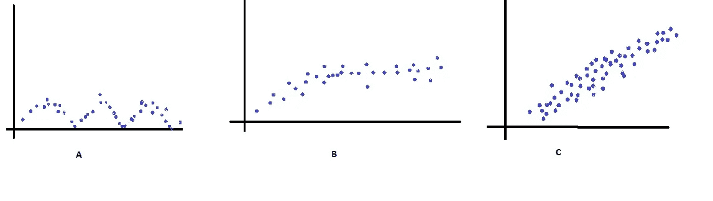

正确答案是。

现在让我们以一个包含两个特征 x1 和 x2 的数据集为例。

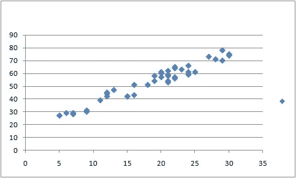

在这种情况下，特征 x1 和 x2 之间的基本关系是线性的。

现在，我们的任务是在这个数据集中拟合一条线，这条线可以很好地概括我们的数据集，并在用看不见的特征 x1 和 x2 处理时给我们准确的结果。

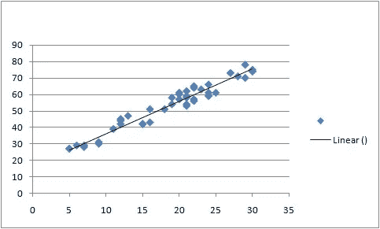

这似乎很适合数据点。

在线性回归中，我们以一阶线性方程的形式表示我们的模型。

h(x)=w0+w1*x1+w2*x2

权重数(w)由特征数+1 定义(对于 w0 或偏差)。

试着这样想象，假设有一些人(相当于特征的数量)，每个人都说了些什么，他们的合作说的是唯一出来的。

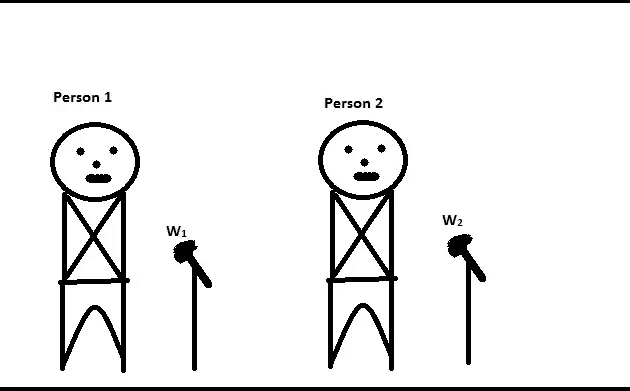

通过调整 w1 和 w2 的设置，可以产生完美的声音。

尝试将相同的类比应用到我们的机器学习算法中，即特征 x1 的贡献很小，x2 的贡献也很小。如果我们简单地将它们相加，即 x1+x2=y，那么谁的值更大，谁对 y 的值的贡献就更大，但是这几乎没有错(即谁更重要，谁就应该得到相关的权重值)。考虑房子的价格取决于两个因素(特征)房间数量和土地面积，比如说 1275+2 = 1277 美元。现在考虑将 1275+6=1281 房间的数量增加两倍。我们已将房间数量增加了两倍，但价格上涨幅度可忽略不计。(回到人的例子)因此，为了处理这个问题，我们粘贴权重(w ),这将使每个特征的语音根据它们的相关性而不是它们的值来决定最终的答案。

对于 w0，想象这是房价中土地的基础价格。

现在让我们定义线性回归的逐步过程(或伪代码)。

鉴于，

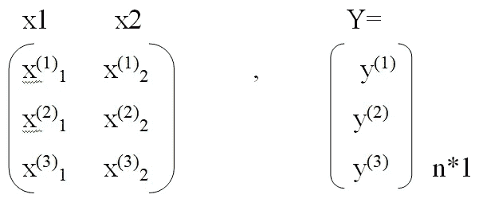

加一列 1 调整 w0。

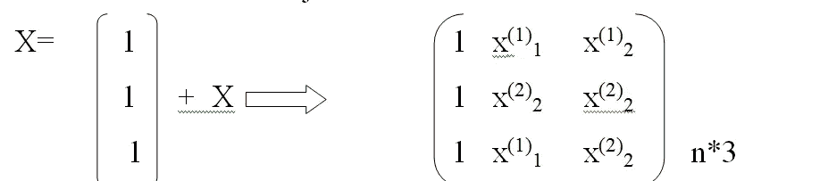

猜测重量 w0、w1、w2

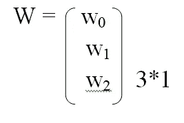

取 w 和 x 的点积

h(x) = xͼw (n*3 ͼ 3*1=n*1)

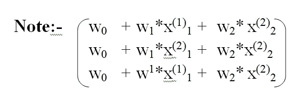

# **步骤:——**

1.  根据权重的猜测值和实际答案计算我们的答案之间的差异。

2.将这种差异传递给优化算法(梯度下降)并改进我们的猜测。

3.更新权重值。

4.重复，直到我们得到的差异接近零或最小(全局或局部)。

# **梯度下降和成本函数:** -

**成本函数或损失函数—** 在上面定义的算法中，我们不采用传递到梯度下降的直接差分。我们使用平均绝对误差、均方误差等损失/成本函数来计算这种差异。这些成本函数告诉我们，如果将特定的预测值考虑在内，需要支付的成本是多少。

考虑一个简单的例子，假设我们开发了一个预测一个人是否患有癌症的 ML 模型。如果我们的模型预测一个人有 90%的机会患癌症，而实际上这个人只有 10%的机会患癌症。因此，在这种情况下，由于我们机器的错误预测，这个人由于错误预测而不得不支付的成本是如此之高(80%)。

注意，上面的解释只是一个理论背景，只是为了让你了解成本函数是什么，下面是数学上的成本函数。

设 y_pred(或 h(w))为预测值，y_actual 为真实标签。

然后，

均方差:-

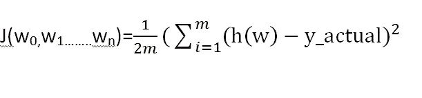

现在我们知道了代价函数是什么，我们来定义梯度下降。

**梯度下降** : —梯度下降是一种优化算法，可用于达到成本函数的最小值。

这意味着，当梯度下降与成本函数值一起传递时，它会相应地更新权重，以便在几次迭代后达到成本函数值的最小值。

假设你站在一座小山上，想尽快下山。你决定在你站的地方向最陡的方向迈出一小步(由 alpha 定义)。什么样的梯度下降能告诉我们最陡的方向。

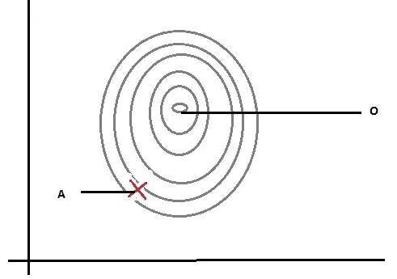

轮廓

假设我们在 A 点，我们必须到达 O 点，梯度下降有助于到达那里。

为了更好地理解这个问题，我们举一个只有一个权重需要最小化的数据集为例。

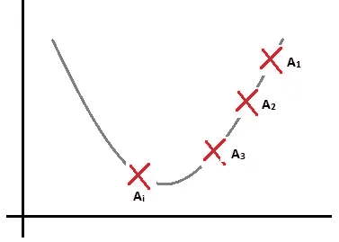

比方说，我们已经从点 A 开始计算梯度，更新权重让我们到达 A1、A2、A3，最后是 Ai。

现在，对于多个特征，将多个权重想象为多个维度，梯度下降让我们达到最小值。

到目前为止，我们还没有看到梯度下降的数学面貌。

因此，从数学上来说，

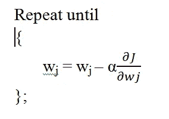

α被称为学习率，它是我们给 ML 模型的超参数之一。

更清晰的图片，对于 n 个特征，我们有我们的假设:—

h(w)=w0x0+w1x1+w2x2+………..+wnxn

因此，成本函数变成(MSE):-

因此，

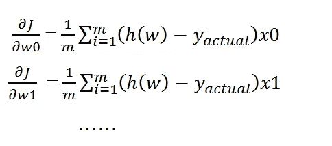

因此，更新如下所示

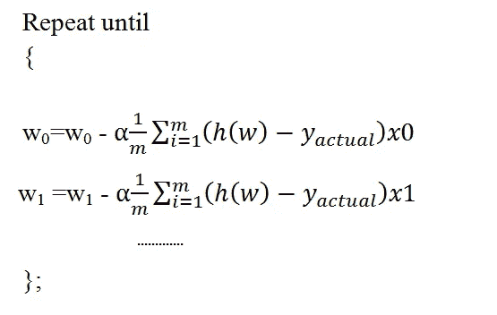

# **波斯顿房价举例:——**

现在，在文章的这一部分，我们将讨论线性回归的编程实现。有一点需要注意，我们将使用 sckit-learn 库来实现线性回归。我们采用的数据集是波士顿房价数据集，其中的目标变量是房价。所以让我们开始吧。

注意:-我将讨论程序的片段。

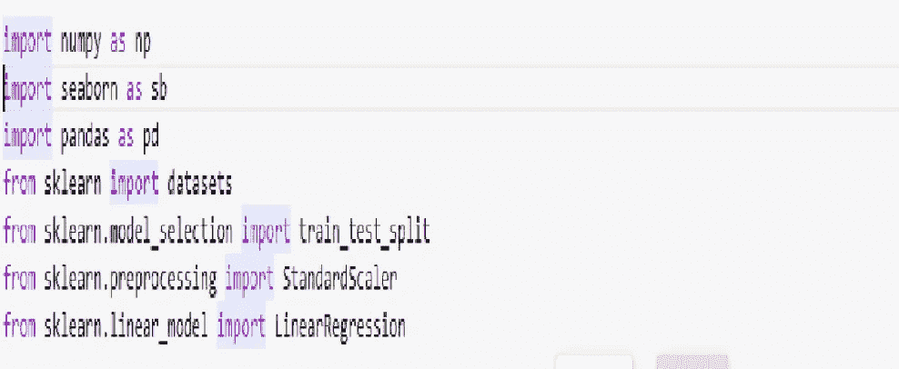

这段代码加载了我们在程序中需要的所有库。

1.Numpy 用于将我们的数据集组织成 NumPy 数组，我们使用这些数组将数据输入到线性回归中。

2.Seaborn 在我们的程序中用于绘制 pairplot，它给出了每个特性相对于每个特性的图。

3.Pandas 用于将我们的数据集转换为 dataframe，以便更好地呈现数据集。

4.Sklearn 的数据集导入是为了导入一个数据集。

5.Train_test_split 用于将数据集拆分成测试和训练数据集。

6.标准缩放器用于缩放数据集的每个要素。

7.LinearRegression 用于实现线性回归算法。

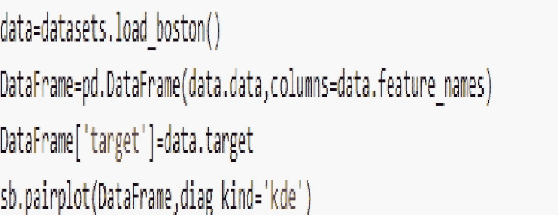

1.dataset.load_boston()将波士顿房价数据加载到名为 data 的变量中。

2.pd.DataFrame(data.data，columns=data.feature_names)创建数据框。

3.第三行在数据集中创建另一列，并在每个单元格中分配 y 值。

4.根据每个可能的特征绘制配对图

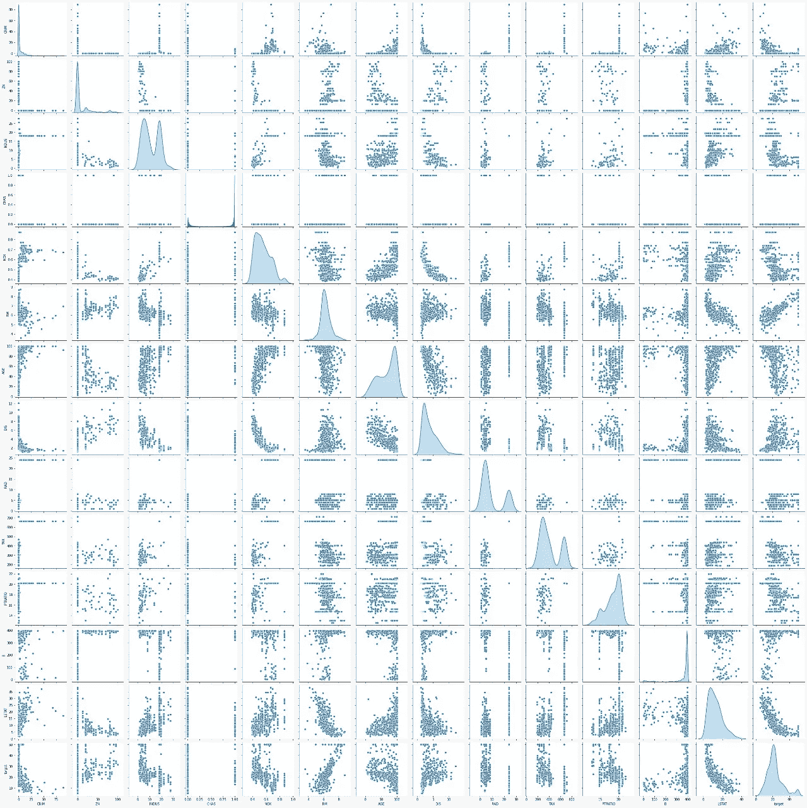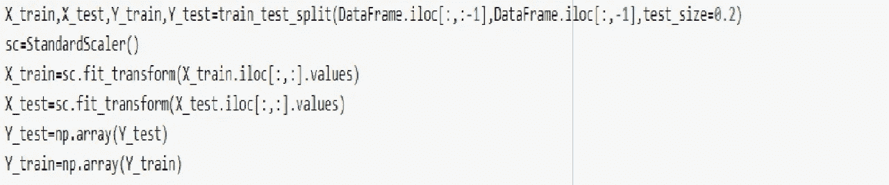

1.第一行将数据集分为训练和测试数据集。测试规模的大小是数据集的 20%。

2.这一行启动一个 StandardScaler 类的对象，以便它可以用于在相同的比例上扩展数据集。

3.这条线与 X_train 成比例。

4.这会缩放 X_test。

5.第 5 行和第 6 行将 Y_test 和 Y_train 从数据帧转换为 NumPy 数组。

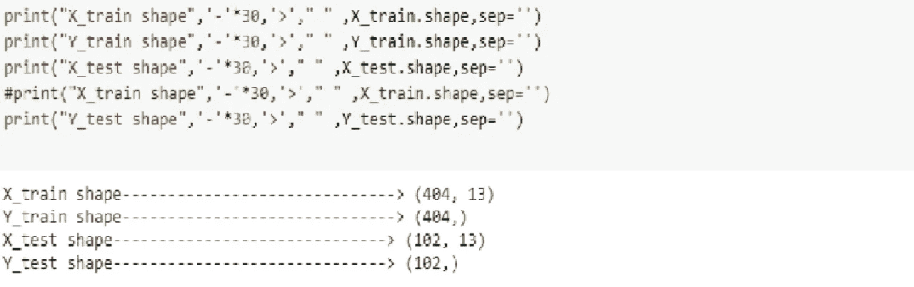

1.  此部分打印每组中的项目数(培训和测试)。

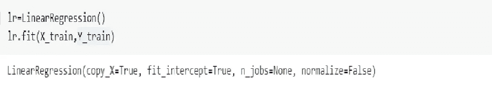

1.这一行实例化了类线性回归的对象。我们对矩阵乘法等的所有解释。正在这里自我实现。

2.Lr.fit(X_train，Y_train)这条线将训练数据拟合到线性回归模型中。这叫训练。

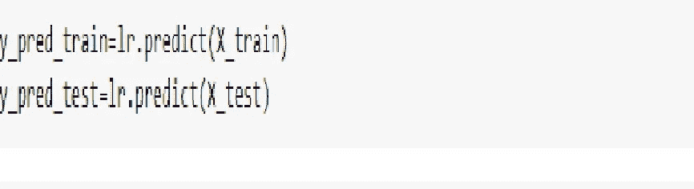

1.这条线使用从训练数据本身学习到的参数来预测训练数据集的目标值。

2.这条线使用相同的学习数据集预测测试数据集的目标值。

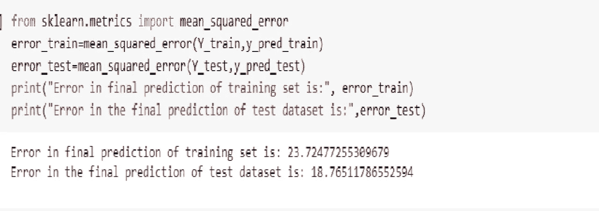

1.该行加载均方误差成本函数。

2.这条线比较了我们在训练数据集中的预测有多好。

3.这一行测试了测试数据集上的预测，我们只是为了测试的目的而单独发布的。

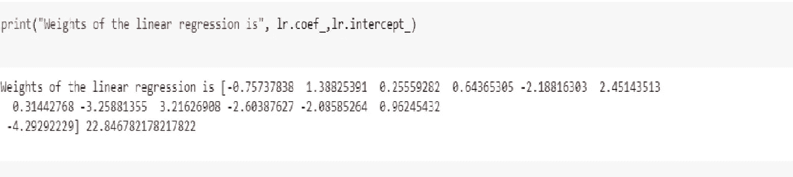

1.  该行给出了学习参数的值

# **结论:-**

在这篇文章中，我们讨论了可能是最基本的机器学习算法。在接下来的系列文章中，我们将处理一些复杂的机器学习算法。此外，请注意，我们没有使用纯数字实现线性回归，这是因为在实际应用中，我们通常不会使用纯数学实现算法。无论如何，我们都要使用为我们工作的库。

希望你喜欢这篇文章，非常感谢你的宝贵反馈。

谢谢你

雅利安·施里瓦斯塔瓦