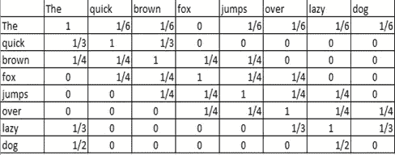
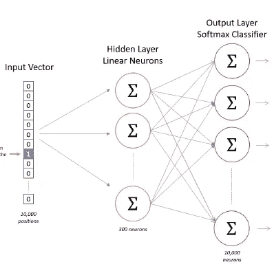
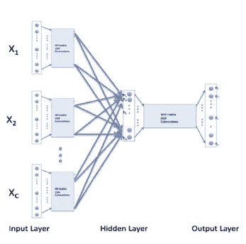
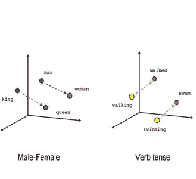

# Word2Vec 中单词嵌入背后的理论

> 原文：<https://medium.com/analytics-vidhya/theory-behind-word-embeddings-in-word2vec-858b9350870b?source=collection_archive---------5----------------------->

在 Google 最近通过其名为 BERT(来自变压器的双向编码器表示)的开创性预训练 NLP 模型取得的进展中，基础广泛地是 Word2Vec 和 GloVe(向量的全局表示)模型中单词嵌入的复制。在一系列的文章中，我们将会从不同的概念角度出发，最终让我们更好地理解 BERT。

**内容:**

1.介绍

2.Word2Vec —跳过程序

3.Word2Vec — CBOW 模型

4.Word2Vec 的优势

**简介:**

在这篇文章中，我们将仔细看看如何把一个单词表示成一个向量。在任何文本挖掘和文本分类问题中，总是需要对文本进行预处理，以使模型性能更好。换句话说，为了让机器理解作为输入给出的文本，它必须被投影到一个向量空间。此外，每位数据科学家都需要注意的一点是

*“你的模型和你的数据一样好。您对其进行的预处理越好，为模型构建做的准备越充分，您的模型性能就越好。”*

因此，在文本分类中，处理文本以更好地对其进行分类变得更加重要。那么，你是怎么做的呢？…继续读下去…我们会让它变得越简单越好！

**Word2Vec -Skip-Gram**

将单词表示为向量的一个突出技术是 Word2Vec。它是由托马斯·米科洛夫领导的谷歌研究团队创造的。它是一种无监督学习的神经网络算法，用于获取单词的矢量表示。它是在大型文本数据语料库(维基百科)上训练的，这有助于我们识别词向量空间的线性子结构。(一旦我们掌握了构建向量表示的方法，我们将会谈到这一点)

让我们考虑下面的陈述，然后一步一步地为给定序列中的单词构造一个向量表示。

“敏捷的棕色狐狸跳过懒惰的狗”

现在，我们建立单词的概率矩阵，每个单词出现在固定的窗口大小中。这里，窗口大小意味着特定单词的环境。因此，如果窗口大小为 4，在构建概率矩阵时，我们考虑特定单词两侧的四个单词。

Word2Vec 模型的这种变体是跳格模型。这个模型帮助我们理解整个句子的上下文信息。在这个模型中，我们一次只考虑一个单词，并围绕这个单词建立所有这些单词出现在固定窗口大小中的概率。

因此，在我们的示例中，让我们通过计算出现在单词“the”周围的所有其他单词的概率来构建单词“THE”的概率向量，然后对其余的单词进行同样的操作。为此，我们需要考虑两件事:

1.考虑的窗口大小和

2.单词“The”周围出现的唯一单词的数量。

这里，为了方便起见，我们认为窗口大小为 2。现在，在我们的小语料库中，出现在“the”这个词周围的特有词有: *quick，brown，jumps，over，lazy，dog* 。因此，出现在“the”周围的独特单词中的每个单词的概率变成 1/6，而单词“quick”的概率向量是通过考虑独特单词来计算的:*、布朗和福克斯*，因此对于这些单词中的每一个都变成 1/3。这样，为语料库中的所有其他单词构建矩阵。

所考虑的语料库的概率矩阵

在训练神经网络时，语料库中每个单词的这个概率向量成为目标，并且一个热嵌入向量成为模型中的输入层。

Word2Vec 模型的架构

一旦模型收敛，这意味着它能够以良好的准确性预测给定单词的概率向量。

模型收敛后隐层神经元的权值成为我们的嵌入向量。此外，我们可以通过在训练时决定隐藏层中神经元的数量来固定向量的长度。

**Word2Vec -CBOW**

Word2Vec 模型的另一个变体工作在这些相同的行上，但是方法略有不同。在这种情况下，输入层不是仅仅一个单词的一个热嵌入向量，而是两三个单词放在一起，即一个序列。然后，该模型被训练以预测概率向量，与跳格模型中的一样。一旦模型收敛，我们就可以得到隐含层神经网络的权值，它是特定单词的必要嵌入。因为，我们考虑一个输入序列，它被称为'*连续单词包或 CBOW'* 。这个变体帮助我们以良好的准确度预测给定输入序列的下一个单词。

CBOW 模型的架构

虽然我们已经介绍了 Word2Vec 模型的几乎所有方面，但是仍然有一些问题需要解决。你可能会有很多问题，比如，给定单词的嵌入向量的长度是多少？或者可以提取的线性子结构有哪些？

嗯…

.

.

.

.

通常，嵌入向量的长度取决于我们的用例，因此是一个超参数，可以用来限制我们在“gensim”python 包中想要的长度。

线性子结构意味着在向量空间中提取如下几个关系:

模型的线性子结构

这里，国王和男人的嵌入向量将分别类似于男人和女人的嵌入向量。动词时态向量也是如此。

此外，我们可以捕捉如下语言规律:

*Vec('罗马')= vec('巴黎')— vec('法国')+ vec('意大利')*。

这基本上意味着，罗马和意大利的关系就像巴黎和法国的关系一样。

此外，Word2vec 模型的另一个优点是，它消除了语言障碍，即不同语言中单词的嵌入向量将具有非常相似的嵌入向量。也许，唯一可能改变的是矢量的大小。

通过这种方式，Word2Vec 模型为 NLP 中的迁移学习铺平了道路，这进一步为 Google 的 BERT 等前沿方法奠定了基础。