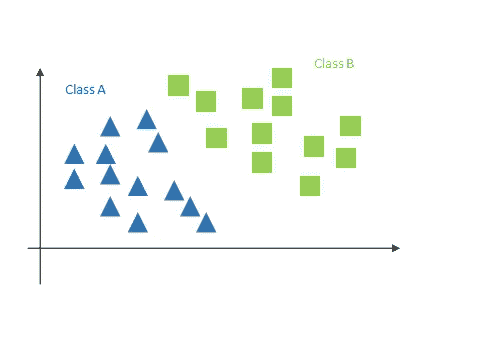
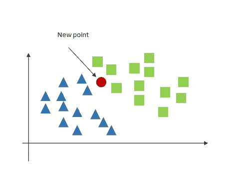
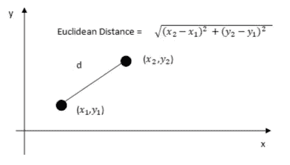
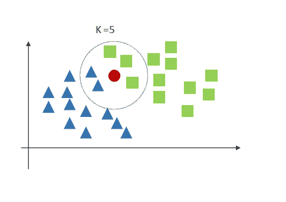
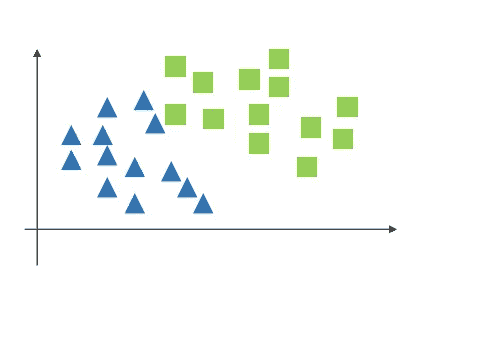
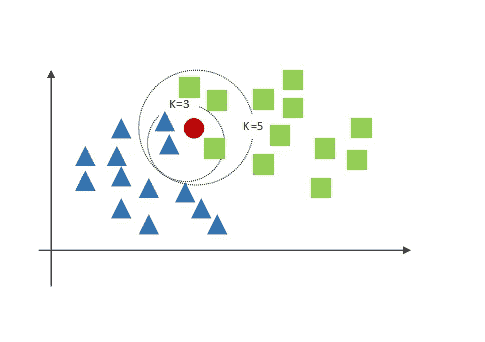

# K 近邻理论(KNN)

> 原文：<https://medium.com/analytics-vidhya/theory-of-k-nearest-neighbors-knn-234654826c50?source=collection_archive---------7----------------------->

本文回顾了 K-最近邻算法背后的直觉。KNN 是监督机器学习算法，可用于分类和回归问题。在分类的情况下，K _ nearest neighborhood 既可用于二元分类，也可用于多类分类。考虑以下二进制分类:

图 1，二元分类

现在我们向数据集添加一个新点，我们需要确定这个新点属于哪个类。

图 2，添加新数据

首先，我们需要选择邻居的数量(K)，然后根据新点到这些邻居的欧几里德距离来识别最近的邻居。欧几里德距离或欧几里德度量的计算如图 3 所示。

图 3，欧几里德距离

因为 KNN 基于欧几里得距离工作，所以数据需要被缩放。我们选择 K =5，并找到 5 个最近的邻居。

图 4，k =5 和新点的邻居

新点属于具有最高邻居的类，在本例中，A 类有 2 个点，B 类有 3 个点，因此新点将被分配给 B 类

图 5 实施 KNN 后的 A 类和 B 类

如何选择 K 的最佳值:

k 的值应该选择为奇数，因为我们需要选择新点的邻居数量最多的区域，而在偶数的情况下，我们可能会得到相同数量的邻居。

随着 K 的数量增加，所选择的区域可能改变，例如在图 6 中，如果我们选择 k =3，那么 A 类(蓝色)将是新点所属的类，然而通过将 K 增加到 5，所选择的区域将是 B 类(绿色)。

图 6，k 值和选择区域的影响

如果 K 太小，噪声对结果的影响会更大。如果 k 太大，计算将更加复杂和冗长。K 的值可以选择为训练样本数量的平方根，然而 K 的最佳值可以通过 K 重交叉验证来计算。

KNN 的一个缺点是，它适用于小数据集，而对于大数据集，计算变得更加复杂和耗时。