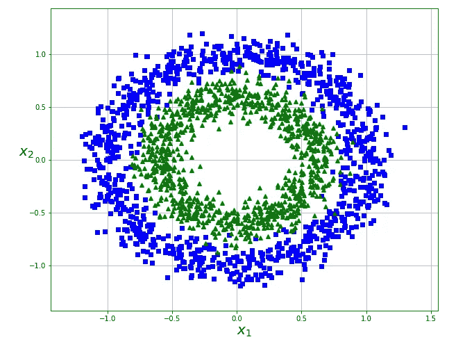
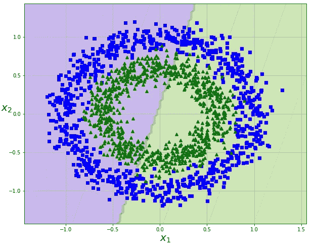
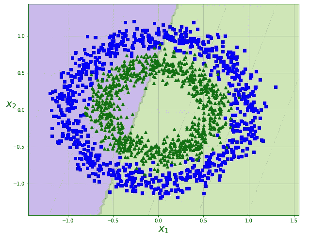
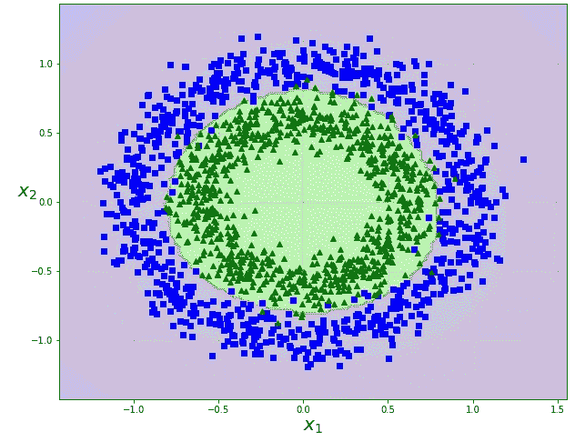
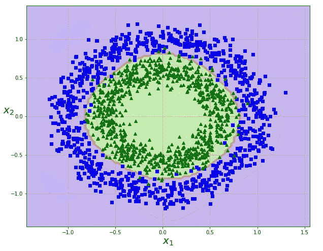
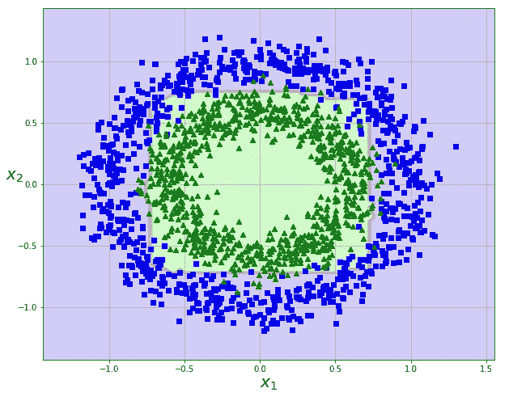
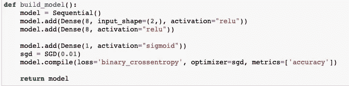
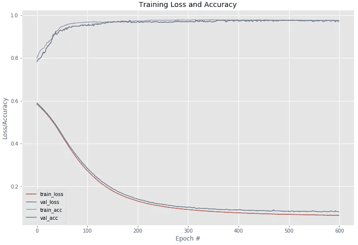
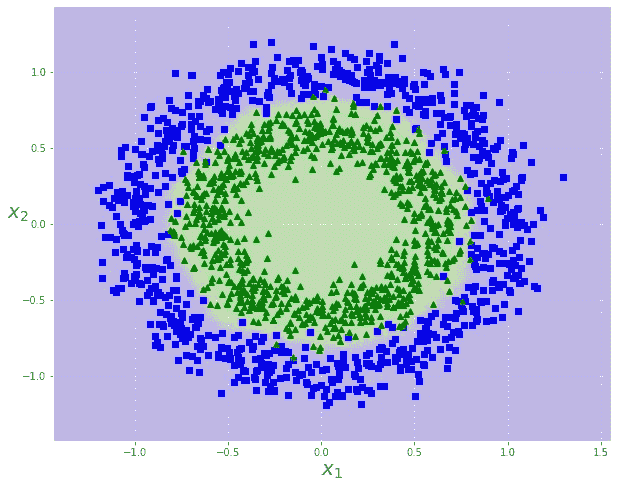

# 自然界没有直线

> 原文：<https://medium.com/analytics-vidhya/there-are-no-straight-lines-in-nature-3b255de19319?source=collection_archive---------23----------------------->

照片由[蒙](https://unsplash.com/@ideasboom?utm_source=medium&utm_medium=referral)在 [Unsplash](https://unsplash.com?utm_source=medium&utm_medium=referral)

这意味着使用线性机器学习模型可能不会很好地模拟真实世界。

本文将研究非线性数据集同心圆，并了解我们如何应用几个机器学习和深度学习模型来创建分类模型。

有许多方法可以解决这个问题，这篇文章并不意味着是关于这个主题的一篇完整的文章，而是对如何解决这个问题的一个比较随意的看法。

# 资料组

scikit-learn: make_circles

数据集是用 Scikit-Learns，make_circles，函数创建的。这就产生了一个 2 级分类数据，它显然不能被一条线分开。在这种情况下，我们需要在模型中加入一些非线性因素。

首先，让我们看看当我们尝试使用线性模型来分离这些数据时会发生什么。

# 物流回收

物流回收

如您所见，LogisticRegression 只能沿直线尽可能好地分离数据。这种型号不行。

# 线性 SVM

让我们看看线性支持向量机。因为这也是一个线性模型，我们不会期望它表现得更好。然而，我们也将看到，我们可以使支持向量机表现非常好。

线性 SVM

正如所料，这也表现不佳。

支持向量机有一个“核”参数，允许模型对数据进行更高维度的分析。通过向现有数据添加更高维度的特征，允许分离。我们将研究两个内核:poly 和 rbf。

# 多核支持向量机

支持向量机—核=“多”，度=3

使用具有多边形内核和度参数“3”的支持向量分类器，我们可以看到该模型能够很好地分离数据，并且具有大约 98%的保持精度。

# 具有径向偏置函数核的支持向量机

支持向量机—核='rbf '

使用具有“rbf”核的支持向量分类器也表现得非常好，保持精度约为 98%。

# 随机森林分类器

RandomForestClassifier-n _ estimators = 100，max_depth=5

RandomForestClassifiers 是另一个可以处理非线性数据的模型。正如我们在这个数据集中看到的，虽然它做得很好，但它很难将一个方形的钉子准确地放入一个圆孔中。该模型的保持精度约为 90%。调整超参数可以获得更高的精度，但必须小心过度拟合。

# 深度学习神经网络

根据定义，神经网络处理非线性数据。使用简单的 Keras，如下所示:

Keras 模型

600 个时期的训练显示了如下的损失/准确度图:

损失/精度曲线

其结果如下:

Keras 序列神经网络— Epochs=600

正如我们所预期的，神经网络能够用足够多的历元来处理数据集中的非线性。

# 摘要

要查看用于本文的笔记本，请查看我的 [Github Repo](https://github.com/youngsoul/circles-svm-nn) 。

本文使用了同心圆的非线性数据集，并研究了可用于分离数据的几种不同模型。对于中小型数据集，支持向量机可能是一个很好的选择。对于较大的数据集，如果有足够的训练时间，神经网络会工作得很好。