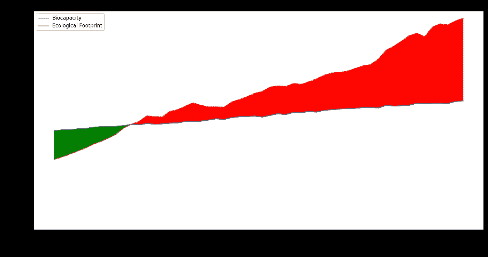
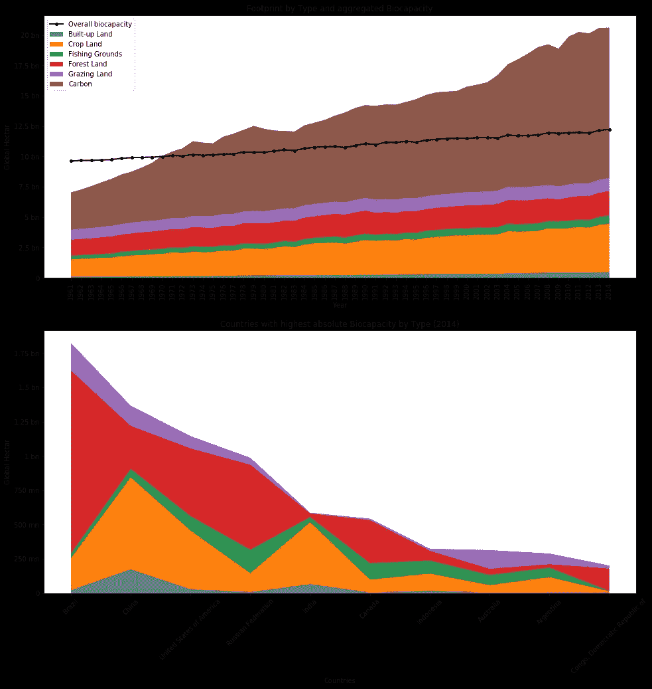
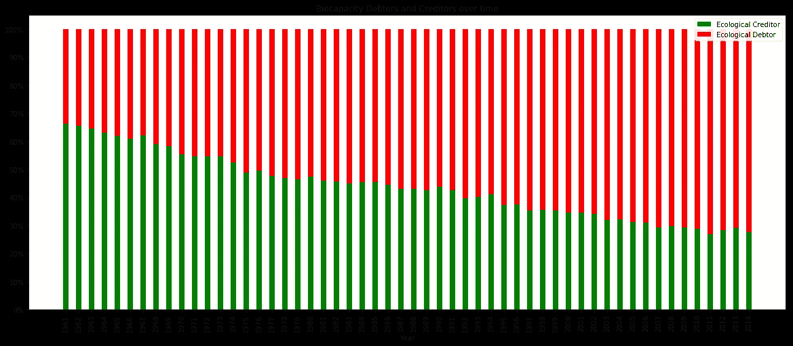
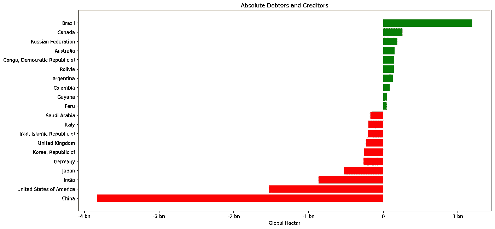
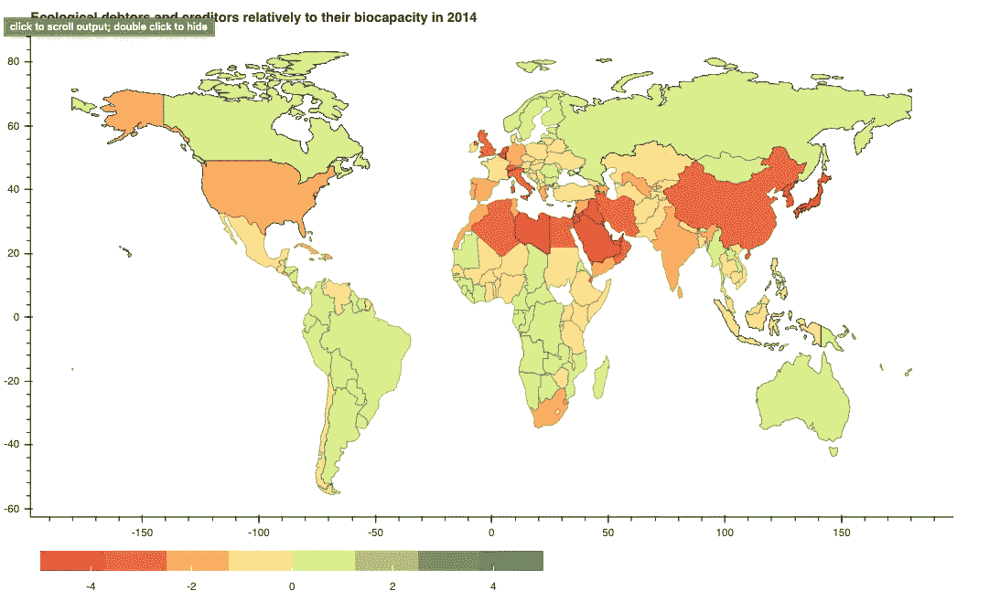
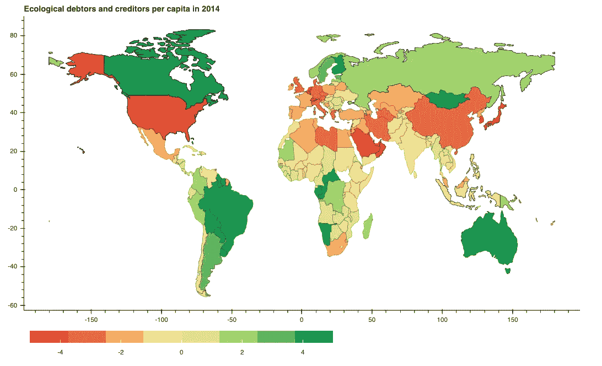
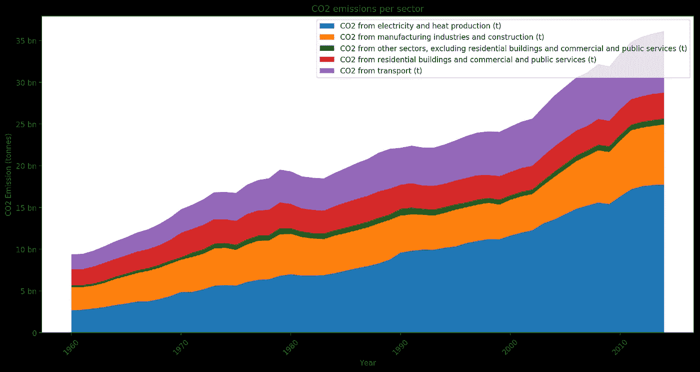
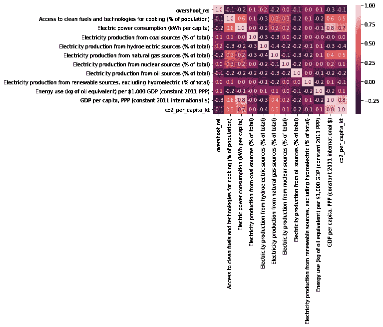
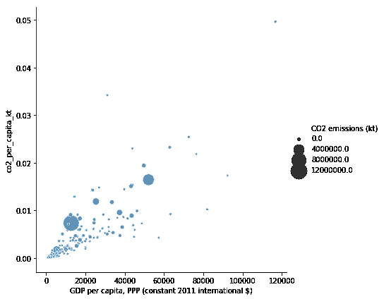
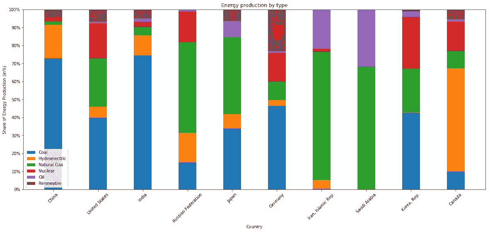

# 这些见解会让你明白人力资源消耗到底有多严重

> 原文：<https://medium.com/analytics-vidhya/these-insights-will-make-you-understand-how-severe-human-resource-consumption-really-is-787651269e29?source=collection_archive---------12----------------------->

嗯，是的，自 1970 年以来，我们一直骄傲地浪费我们的地球资源

在过去的几年里，环境保护和更加自觉地看待我们如何消耗自然资源在公众讨论中变得越来越重要，甚至引发了一场新的国际青年行动主义运动。

讨论主要集中在二氧化碳排放和相应的碳足迹上，但是还有一个更全面的方法:生态足迹。它提供了一个可以揭示溢出效应的总体视角，例如，一个地区需求的减少何时会导致其他地区需求的增加。例如，从化石燃料转向生物质燃料会减少还是增加人类对地球生物能力的总体需求？增加生物质燃料的使用比退耕还林更有效还是更无效？

全球足迹网络( [GFN](https://www.footprintnetwork.org/) )开发和推广用于推进可持续发展的工具，包括生态足迹和生物能力，这两项指标衡量我们使用的资源量和我们拥有的资源量。最初，GFN 是一个独立的智库，并提供了一个广泛的数据库，你可以在我的[项目笔记本](https://nbviewer.jupyter.org/github/fewekoe/eco_footprint/blob/master/analysis.html)和 [Github 资源库](https://github.com/fewekoe/eco_footprint)中查看。

## 生态足迹是如何计算的？

生态足迹是通过追踪为满足人们的所有竞争需求而需要多少生物生产面积而得出的。

这些需求包括用于粮食种植、纤维生产、木材再生、吸收化石燃料燃烧产生的二氧化碳排放以及容纳已建基础设施的空间。一个国家的消费量是通过从其国民生产中加上进口和减去出口来计算的。

> “生态足迹是一个可持续性指标，它不仅量化了二氧化碳平衡，还定性地表示了吸收二氧化碳的土地需求。”([德国莱比锡自然学校](https://www.bund-leipzig.de/themen-und-projekte/postwachstum/oekologischer-fussabdruck/))

## 足迹有哪些类型，它们是如何随着时间的推移而发展的

根据 [GFN](https://www.footprintnetwork.org/resources/glossary/) ，人类足迹可以分解为 6 个层次:

1.  *牧场*用来饲养牲畜，获取肉类、奶制品、皮革和羊毛制品。
2.  *林地*提供两种服务:森林产品足迹，根据一个国家每年消耗的木材、纸浆、木材产品和薪材的数量来计算。它还用来抵消碳足迹，碳足迹代表燃烧化石燃料产生的二氧化碳排放量。
3.  *渔场*是根据对各种鱼类的最大可持续渔获量的估计计算出来的。
4.  耕地是所有土地利用类型中最具生物生产力的，包括用于生产人类消费的食物和纤维、牲畜饲料、油料作物和橡胶的区域。
5.  *建设用地*是根据人类基础设施——交通、住房、工业建筑和水力发电水库——覆盖的土地面积计算的。建设用地可能会占用以前的农田。
6.  *碳足迹*测量与化石燃料使用相关的二氧化碳排放量。在足迹账户中，这些数量被转化为吸收这些 CO2 所必需的生物生产面积。碳足迹被添加到生态足迹中，因为它是对生物生产空间的竞争性使用，因为大气中二氧化碳浓度的增加被认为是生态债务的积累

此处显示的所有数据和图表均基于全球足迹账户和世界银行的数据。

在下图的第一部分，我们可以观察到，随着时间的推移，碳足迹和对耕地的需求显著增加。黑线是地球的生物容量，它在 1970 年被超越。让我们看看提供了地球 70%生物能力的 10 个国家:巴西、中国和美国是森林和耕地得分最高的 3 个国家之一。你可能认为这里缺少碳，但是作为碳排放的问题——不像其他杠杆——不能成为生物能力的一部分。

随着时间的推移，碳足迹翻了两番，总体生物能力基本持平。

## 生态赤字和盈余呢？

基于生物能力和生态足迹/消费的差异，可以计算赤字或盈余。如果我们看一下汇总数据，我们会发现，自 1970 年以来，全球一直处于巨额赤字之中。如上所述，这主要是由于耕地和碳足迹的增加。

如果我们观察一段时间的发展，也可以看出这一点:在 20 世纪 60 年代，近 70%的国家是生态债权人，这种关系在 2014 年发生了逆转，只有 30%的国家是债权人。

如果我们看一下十大债务人和债权人，我们可以看到中国以及美国和印度是最大的债务人，而巴西、加拿大和俄罗斯是债权人，但远远不能弥补前三大债务人。

到目前为止，中国是最大的绝对生态债务人，全球生态负债近 40 亿欧元

如果我们把它放在相对的背景下，也就是说盈余/赤字与生物能力的比值，我们可以看到，特别是中东国家，中国和日本得分很低。

如果我们将此细分为人均水平，我们可以看到美国、日本和沙特阿拉伯的得分非常低。

## 二氧化碳呢？

显然，我们在本文的第一部分已经看到，不断增加的二氧化碳排放是生物足迹最严重的组成部分之一。让我们仔细看看，并尝试根据国际能源署提供的部门来分解二氧化碳排放:

发电和供热占全球二氧化碳排放量的 40%以上。

从 1960 年到 2014 年，三大行业的二氧化碳排放量增长如下:

*   电和热生产系数~7
*   按系数~4 运输
*   按因子 3 划分的制造业、工业和生产

现在，让我们看看使用电力生产来源和人均 GDP 的多个变量的相关矩阵:

该矩阵将每个变量与其他变量相关联，并对系数进行颜色编码(深色表示相关性很小或没有相关性，浅色表示强至完全线性相关)。

我们可以观察到的是，人均 GDP 和人均二氧化碳排放量显示出 0.8 的强相关性。考虑到 GDP 是衡量一个国家经济产出的指标，我们可以谨慎地假设，一个国家经济越“成功”，它排放的二氧化碳就越多。

但是这种关系背后的驱动力是什么呢？我们可以观察到人均 GDP 和电力消耗(人均千瓦时)也与 0.8 相关。因此，让我们看看最大的生态债务人(如上所述)是如何产生能量的:

显然，大多数国家都是以化石为基础生产能源:煤、天然气或石油。不幸的是，碳友好的替代能源，如可再生能源、水电或核能(后者也有很大的缺点)在能源组合中较少出现。

# 结论

那么，这其中的三个要点是什么呢？

## 1.全球足迹网络的生态足迹数据可用于全球环境成本的内部化

足迹网络的数据和概念是社会和政治讨论的宝贵资源。一个国家目前的生态可持续性如何？我们是否应该在一个基金的基础上，资助较贫穷但新兴的国家向更绿色的电力生产转型？在这个基金中，较富裕国家的财政贡献反映了它们的生态赤字。这一概念非常适合在这类问题上提供更多的指导。

## 2.能源和热能生产是二氧化碳排放的一个重要驱动因素，主要的生态债务人能源生产正在向基于化石的生产类型倾斜

目前，随着经济活动/产出成为大多数现代社会的主要目标，CO2 排放将会增加。通过经济崛起增加新兴市场数十亿人福利的承诺有一个重大不利因素:由于电力生产主要基于化石燃料，这一承诺将不可避免地导致更多的二氧化碳排放。能源革命对于大规模增加可再生能源的渗透至关重要。在这种情况下，现代核能发电(如比尔·盖茨的 TerraPower 公司目前开发的新型反应堆[类型](https://en.wikipedia.org/wiki/Traveling_wave_reactor))可以被视为一个可行的选择。

## 3.地球长期处于生态赤字状态，生态足迹提供了一个更全面的分析方案

数据清楚地表明，自 20 世纪 70 年代以来，人类消耗的自然资源超过了提供的自然资源，赤字越来越大，现在是地球提供的资源的两倍。生态足迹的概念使用单一的可比测量方法，有助于理解基础层随时间的发展，并为权衡提供更多的透明度，如使用森林/农作物土地作为友好的生物燃料。