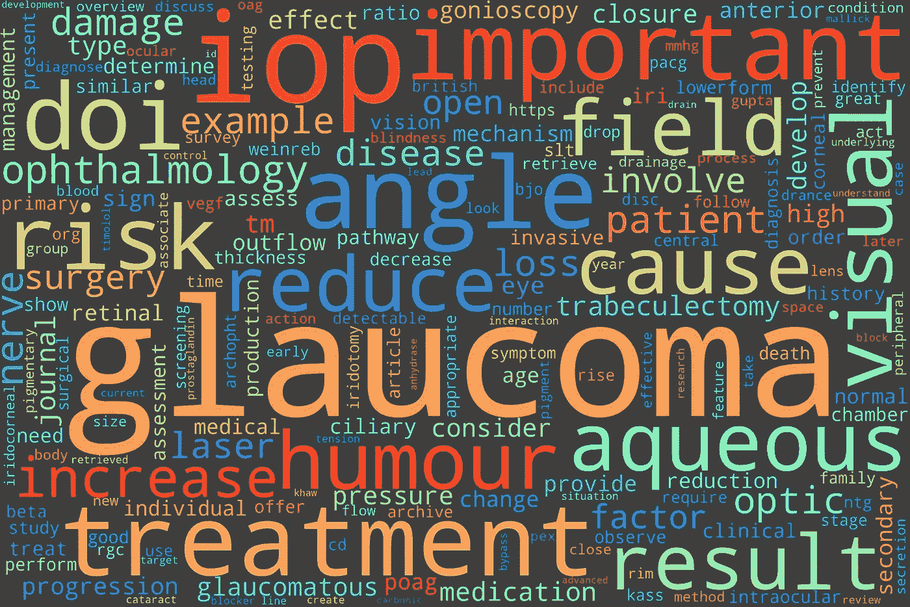
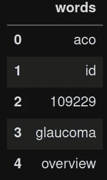
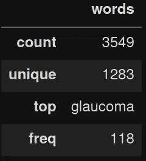
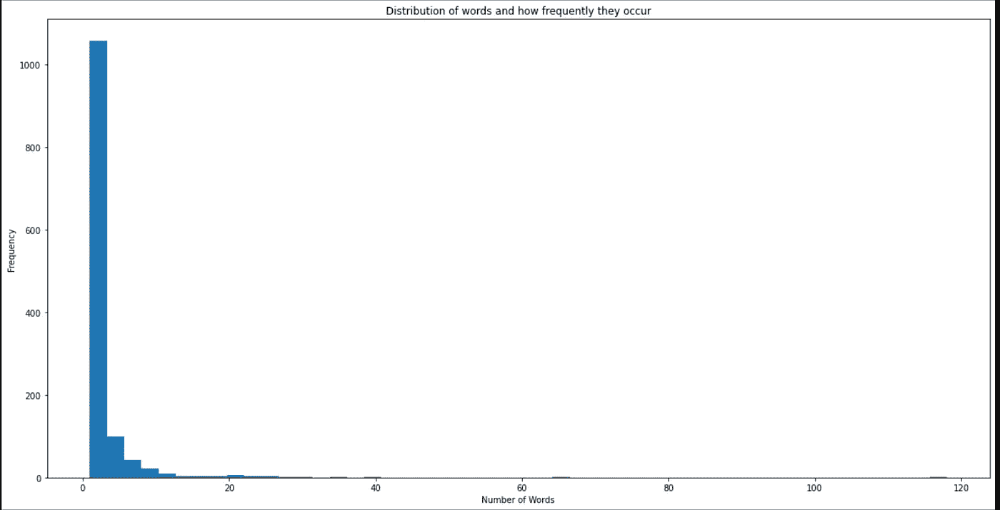
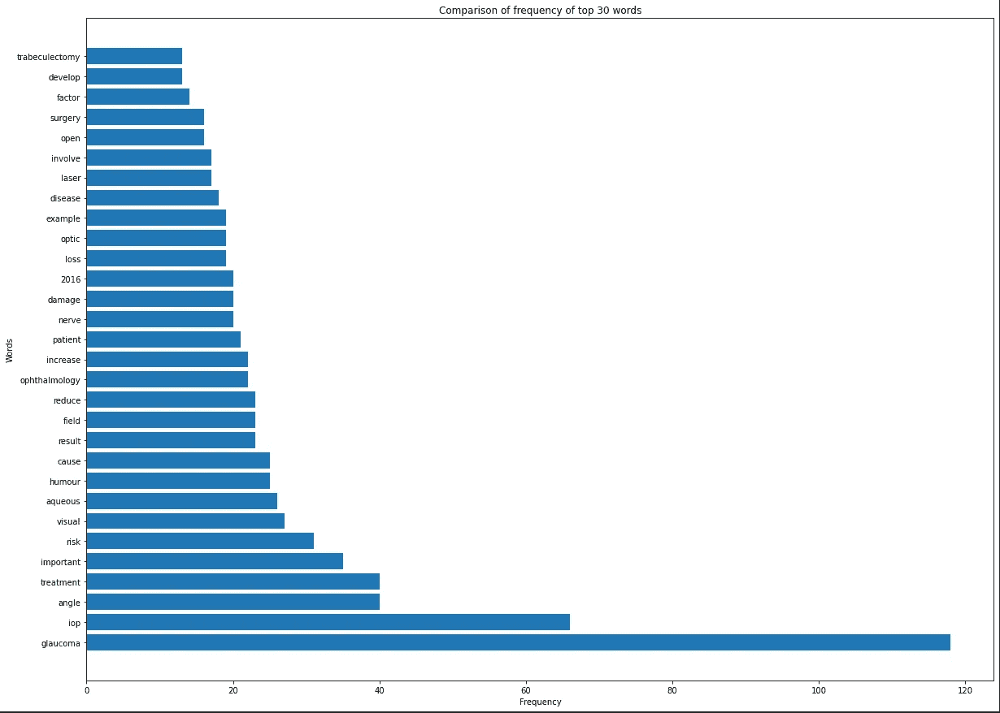
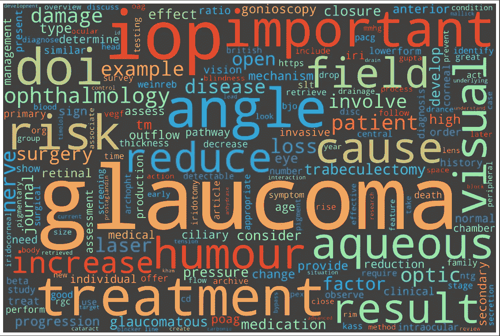
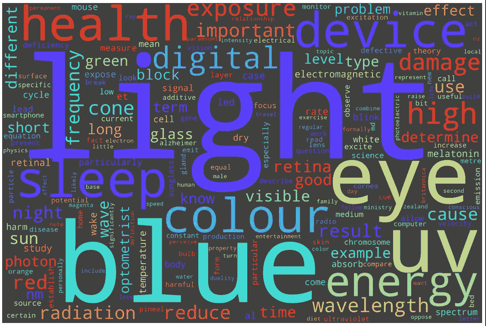

# 毕业论文 Wordcloud 项目

> 原文：<https://medium.com/analytics-vidhya/thesis-wordcloud-project-5fe9d92694ac?source=collection_archive---------17----------------------->

受我朋友完成博士论文的启发，这个简单的项目庆祝了他们多年来的艰难跋涉(我想是四年吧？).我们将为他们的论文生成一个文字云…不是他们的论文，因为我们必须保护他们的隐私，但我们将使用类似的东西。

但是首先，你可能会问什么是词云？

单词云是文本数据的可视化表示。简而言之，想象一幅单词图，给定文本中出现的单词频率越大，它就越大。下面是我们将要构建的一个示例。



我们将使用什么？

参观我们的工具带将包括:

*   [当然是 Python 3.8](https://www.python.org/)
*   Jupyterlab

我们将使用两个主要的库:

*   [空间](https://spacy.io/) —用于单词的符号化(当我们开始摆弄单词时，这将是有意义的)
*   [word cloud](https://peekaboo-vision.blogspot.com/2012/11/a-wordcloud-in-python.html)——恰如其名

这里还有一些其他的图书馆可以帮忙:

*   [matplotlib](https://matplotlib.org/)
*   熊猫
*   [回复](https://docs.python.org/3/library/re.html)

让我们开始吧。

[点击此处查看原文](https://shivansivakumaran.com/data-science/thesis-wordcloud-project/)。

# 安装非标准库

在我们继续之前，我们需要安装额外的非 Python 甚至 Anaconda/Miniconda 标准库。

首先让我们安装`spaCy`，这比你的标准 python 包需要更多的安装工作。

在他们自己的网页上，他们有关于如何安装包的优秀文档。

我在自己的环境中使用 conda 和 Jupyterlab。以下命令在输入 Jupyterlab 终端时安装`spaCy`。

```
conda install -c conda-forge spacy
conda install -c conda-forge spacy-lookups-data
python -m spacy download en_core_web_sm
```

接下来是安装`wordcloud`，这就简单多了。

```
conda install -c conda-forge wordcloud
```

`wordcloud`有一些依赖项，可以安装:

```
conda install -c conda-forge pillow
conda install -c conda-forge numpy
```

我们找到了。我们应该都准备好了。

# 导入库

开始编码吧。

```
# importing and setting up libraries
import random as r
import pandas as pd
import reimport matplotlib.pyplot as plt
%matplotlib inline
plt.rcParams.update({'font.size': 22})from wordcloud import WordCloud, STOPWORDSimport spacyspacy.prefer_gpu()
nlp = spacy.load("en_core_web_sm") # setting up for the English language
```

# 打开文件

之前我们在讨论我朋友的论文，我们打算用我写的来代替。这是一部关于[青光眼](https://shivansivakumaran.com/glaucoma/)的精彩杰作。我在谷歌文档上写的。所以我做的第一件事是将文章保存为文本文件(`.txt`)。将它保存为文本文件，这将使使用 Python 变得更加容易，而不需要使用另一个库。

让我们打开文件，看看文本文件的一些字符。

```
file = 'shivanglaucomaessay.txt'with open(file, 'r') as f:
    text = f.read()

text[1000:1500]>>> 't is important to identify the type of glaucoma to offer appropriate treatment.\nMechanism of Glaucoma\nIntraocular pressure (IOP) has an important role in glaucoma. To understand its mechanism of action, it is very important to look at aqueous humor production and drainage (Kass, 2005). Aqueous humour is primarily produced by active secretion at the ciliary processes of the ciliary body, mediated by aquaporins and carbonic anhydrase; the prior requiring energy and the latter requiring enzymatic a'len(text)>>> 37519
```

你可以看到这里只有区区 37519 个字符。我无法想象一篇论文会有多少篇！

# 符号化

为了计算所有的单词，我们需要把我的文章变成“记号”。我们将使用[空间](https://spacy.io/)来使用它。

`spaCy`主要用于[自然语言处理](https://en.wikipedia.org/wiki/Natural_language_processing) (NLP)。NLP 是计算机理解文本的一种方式。

你可以用`spaCy`做很多事情，但是为了这个项目的目的，我们将解析这篇文章中的文本。

```
doc = nlp(text)tokens = [token for token in doc]r.seed(42) # ensure we get the same random selection everytime this is executedrand_select = r.choices(tokens, k=50)
rand_select>>> [PACG,
 Once,
 field,
 (,
 ,
 required,
 cyclophotocoagulation,
 ,,
 glaucoma,
 important,
 Kass,
 underlying,
 to,
 2017,
 gold,
 iris,
 of,
 .,
 (,
 a,
 Current,
 and,
 of,
 indicates,
 .,
 visual,
 loss,
 early,
 Silva,
 resulting,
 of,
 Vision,
 .,
 ,,
 ,,
 and,
 2007,
 treatment,
 of,
 adverse,
 beta,
 angle,
 to,
 times,
 loss,
 although,
 detectable,
 important,
 dynamics,
 on]
```

# 清理

您可能会注意到这里的一些问题:

*   单词里的情况都不一样。当我们希望“大小”和“大小”相同时，Python 会将它们视为不同的单词。
*   我们有标点符号作为标记，这对我们来说并不重要
*   我们有需要删除的' \n '或换行符
*   我们有诸如“the”、“a”、“an”等停用词。这些词并不有趣，但出现频率很高，会淹没我们关心的词
*   最后，这可能很难用这么少的词来区分，但是复数和不同

让我们通过首先使文本小写来解决这个问题。

```
lower = [_.text.lower() for _ in rand_select]
lower>>> ['pacg',
 'once',
 'field',
 '(',
 '\n',
 'required',
 'cyclophotocoagulation',
 ',',
 'glaucoma',
 'important',
 'kass',
 'underlying',
 'to',
 '2017',
 'gold',
 'iris',
 'of',
 '.',
 '(',
 'a',
 'current',
 'and',
 'of',
 'indicates',
 '.',
 'visual',
 'loss',
 'early',
 'silva',
 'resulting',
 'of',
 'vision',
 '.',
 ',',
 ',',
 'and',
 '2007',
 'treatment',
 'of',
 'adverse',
 'beta',
 'angle',
 'to',
 'times',
 'loss',
 'although',
 'detectable',
 'important',
 'dynamics',
 'on']
```

现在全部小写。现在让我们再次回到我们的随机选择，去掉标点符号。

```
nopunc = [_.text for _ in rand_select if _.pos_ != 'PUNCT']
nopunc>>> ['PACG',
 'Once',
 'field',
 '\n',
 'required',
 'cyclophotocoagulation',
 'glaucoma',
 'important',
 'Kass',
 'underlying',
 'to',
 '2017',
 'gold',
 'iris',
 'of',
 'a',
 'Current',
 'and',
 'of',
 'indicates',
 'visual',
 'loss',
 'early',
 'Silva',
 'resulting',
 'of',
 'Vision',
 'and',
 '2007',
 'treatment',
 'of',
 'adverse',
 'beta',
 'angle',
 'to',
 'times',
 'loss',
 'although',
 'detectable',
 'important',
 'dynamics',
 'on']
```

现在，让我们删除' \n '或换行符。你可能没见过这个，但是有些是捆在一起的，就像这个'/n/n/n/n '在一个字符串里。所以我们需要一些去除这些的方法。

```
nonewline = [_.text for _ in rand_select if not '\n' in _.text]
nonewline>>> ['PACG',
 'Once',
 'field',
 '(',
 'required',
 'cyclophotocoagulation',
 ',',
 'glaucoma',
 'important',
 'Kass',
 'underlying',
 'to',
 '2017',
 'gold',
 'iris',
 'of',
 '.',
 '(',
 'a',
 'Current',
 'and',
 'of',
 'indicates',
 '.',
 'visual',
 'loss',
 'early',
 'Silva',
 'resulting',
 'of',
 'Vision',
 '.',
 ',',
 ',',
 'and',
 '2007',
 'treatment',
 'of',
 'adverse',
 'beta',
 'angle',
 'to',
 'times',
 'loss',
 'although',
 'detectable',
 'important',
 'dynamics',
 'on']
```

现在我们已经有了移除换行符的方法，接下来我们要移除像“a”、“an”、“the”等停用词。

```
nostopwords = [_.text for _ in rand_select if not _.is_stop]
nostopwords>>> ['PACG',
 'field',
 '(',
 '\n',
 'required',
 'cyclophotocoagulation',
 ',',
 'glaucoma',
 'important',
 'Kass',
 'underlying',
 '2017',
 'gold',
 'iris',
 '.',
 '(',
 'Current',
 'indicates',
 '.',
 'visual',
 'loss',
 'early',
 'Silva',
 'resulting',
 'Vision',
 '.',
 ',',
 ',',
 '2007',
 'treatment',
 'adverse',
 'beta',
 'angle',
 'times',
 'loss',
 'detectable',
 'important',
 'dynamics']
```

我们已经去掉了无趣的停用词。

接下来是使用[引理满足](https://en.wikipedia.org/wiki/Lemmatisation)组合屈折词。

```
lemmas = [str(_.lemma_) for _ in rand_select]
lemmas>>> ['PACG',
 'once',
 'field',
 '(',
 '\n',
 'require',
 'cyclophotocoagulation',
 ',',
 'glaucoma',
 'important',
 'Kass',
 'underlying',
 'to',
 '2017',
 'gold',
 'iris',
 'of',
 '.',
 '(',
 'a',
 'current',
 'and',
 'of',
 'indicate',
 '.',
 'visual',
 'loss',
 'early',
 'Silva',
 'result',
 'of',
 'Vision',
 '.',
 ',',
 ',',
 'and',
 '2007',
 'treatment',
 'of',
 'adverse',
 'beta',
 'angle',
 'to',
 'time',
 'loss',
 'although',
 'detectable',
 'important',
 'dynamic',
 'on']
```

由于我们选择的单词很少，所以很难看出对词条满足的影响。

在前面的例子中，我们已经单独完成了所有这些操作。我们实际上可以一次完成。

```
cleaned_doc = [_.lemma_.lower() for _ in doc if _.pos_ != 'PUNCT' 
                                            and '\n' not in _.text 
                                            and not _.is_stop]
r.seed(43)r.choices(cleaned_doc, k=20)>>> ['ultrafiltration',
 'science',
 '2007',
 'tham',
 'line',
 '223',
 'use',
 'important',
 'factor',
 'sign',
 'speak',
 '2015',
 '2016',
 'value',
 'optic',
 'able',
 'murthy',
 '22',
 'medication',
 'act']
```

# 趣味统计

现在我们已经尽最大努力清理了文档。总会有一些小瑕疵，但我认为我们已经解决了大部分问题。

让我们把这个放到一个数据框架中，这样我们就可以制作一些有趣的情节。我们还可以得到一些统计数据，这是不言自明的。

```
words = pd.DataFrame(cleaned_doc, columns=['words'])
words.head()
```



```
words.describe()
```



```
words.value_counts().head(30) # gives the first 30 results>>> words        
glaucoma         118
iop               66
treatment         40
angle             40
important         35
risk              31
-                 28
visual            27
aqueous           26
/                 26
cause             25
humour            25
&                 24
field             23
result            23
reduce            23
m.                22
increase          22
ophthalmology     22
patient           21
nerve             20
damage            20
2016              20
optic             19
loss              19
example           19
disease           18
j.                17
a.                17
laser             17
dtype: int64
```

我仍然对我们之前提出的单词排除法不满意。我们仍然会得到一些以句号结尾的'-'、'/'、' & '和字母(比如' m . ')。

这些对我们都没用，我们再做一些进一步的剔除。

我们将创建一个我们想要排除的字符列表`['-', '/', '&']`。我们还将使用[正则表达式](https://www.w3schools.com/python/python_regex.asp)(`re`模块)来消除字母加号。

```
exclude_char = ['-', '/', '&']cleaned_doc_again = [_.lemma_.lower() for _ in doc if _.pos_ != 'PUNCT' 
                                            and '\n' not in _.text 
                                            and not _.is_stop
                                            and _.text not in exclude_char
                                            and not bool(re.search(r'^\w\.$', _.text))]words_cleaned = pd.DataFrame(cleaned_doc_again, columns=['words'])
words_cleaned.value_counts().head(30)>>> words         
glaucoma          118
iop                66
angle              40
treatment          40
important          35
risk               31
visual             27
aqueous            26
humour             25
cause              25
result             23
field              23
reduce             23
ophthalmology      22
increase           22
patient            21
nerve              20
damage             20
2016               20
loss               19
optic              19
example            19
disease            18
laser              17
involve            17
open               16
surgery            16
factor             14
develop            13
trabeculectomy     13
dtype: int64
```

这好多了，我想我对结果更满意了。

现在，我们可以把它绘制成图表来显示数据。

```
x = words_cleaned.value_counts()fig = plt.figure(figsize=(20,10))
graph = plt.hist(x, bins=50)
ylab = plt.ylabel('Frequency')
xlab = plt.xlabel('Number of Words')title = plt.title('Distribution of words and how frequently they occur')
```



这个图表告诉我们，大多数单词并不像我们预期的那样频繁出现，其中有一些异常值。让我们用每个单词做一个条形图，然后互相比较。

```
x_30 = words_cleaned.value_counts().head(30)fig = plt.figure(figsize=(20,15))
graph = plt.barh([i[0] for i in x_30.index], x_30.values)
ylab = plt.ylabel('Words')
xlab = plt.xlabel('Frequency')title = plt.title('Comparison of frequency of top 30 words')
```



# 单词云

最后，我们有了一个干净的单词列表，我们可以把它制作成一个单词云！

这使用了特殊的模块，`wordcloud`和`matplotlib`的元素来产生这个。

然后，我们可以将它作为图像保存到本地磁盘。

```
wordcloud = WordCloud(width = 3000, height = 2000,
                        random_state=1, background_color='#3F3F3F',
                        colormap='rainbow', collocations=False).generate(' '.join(cleaned_doc_again))fig = plt.figure(figsize=(20, 15))
imshow = plt.imshow(wordcloud)
axis = plt.axis('off')saveimage = wordcloud.to_file('shivanglaucomaessay.png')
```



现在我们有了。我的青光眼论文的文字云。

我们可以更进一步，将它制作成一个名为`ThesisWC.py`的单独的 python 文件，并将其作为一个函数传递。[这里是代码](https://github.com/ShivanS93/ThesisWordcloud/blob/master/ThesisWC.py)。

我已经下载了一个我写的关于蓝光保护的博客，我们可以通过我创建的函数来执行相同的结果。

```
import ThesisWCThesisWC.ThesisWC('shivanbluelightblog.txt')>>> Text Length (char):  19931
```



# 结论

完成博士论文绝非易事。有趣的是用一大段文字制作文字云。

首先，我们使用一个自然语言处理库`spaCy`，来分解文本，删除不需要的元素，并清理要放入单词云的单词。

然后，我们使用名副其实的模块`wordcloud`来制作艺术品。

我希望您已经发现这很有趣并且很有用，我鼓励您尝试一下！

我一直在寻求改进，因此如果您有任何反馈，[请联系](https://shivansivakumaran.com/contact/)。如果你觉得这很有趣，请把它分享给同样感兴趣的人。