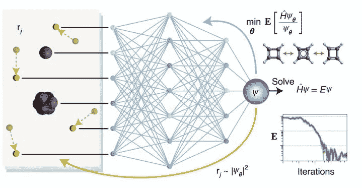

# 他们在人工智能的帮助下解决了薛定谔方程

> 原文：<https://medium.com/analytics-vidhya/they-solve-the-schr%C3%B6dinger-equation-with-the-help-of-artificial-intelligence-b9b7d8b0ec7?source=collection_archive---------21----------------------->

*这是对本周发生的一些人工智能新闻的回顾*

【https://www.nature.com/articles/s41557-020-0544-y 号

量子化学旨在根据分子的原子在空间中的排列来预测分子的化学和物理性质，而无需耗时和资源密集型的实验室实验。这可以通过求解薛定谔方程来实现，但实际上这太难了。来自柏林自由大学的科学家团队开发了一种深度学习算法，可以实现精度和计算效率的结合。领导这项研究的教授认为，这种方法可能对量子化学的未来产生重大影响。

## 用人工智能绘制月球环形山

【https://www.nature.com/articles/s41467-020-20215-y 

中国、意大利和冰岛的研究人员使用一种机器学习人工智能应用程序来计数和标注月球上 10 万多个陨石坑的位置。他们描述说，通过用中国月球轨道飞行器收集的数据训练系统，他们的系统可以识别环形山，识别和绘制月球上的环形山是一个缓慢的过程，通常是手工完成的，研究人员研究照片，并将这些观察结果转移到地图或月球地球仪上。。在这项新的努力中，他们发现了一种方法，通过教会计算机识别陨石坑，然后对它们进行计数，从而大大加快这一过程。

## 大象的卫星探测

[https://www.biorxiv.org/content/10.1101/2020.09.09.289231v1](https://www.biorxiv.org/content/10.1101/2020.09.09.289231v1)

利用 Maxar Technologies 和 deep learning 目前提供的最高分辨率卫星图像，牛津大学野生动物保护研究小组和机器学习研究小组的研究人员从太空中探测到了大象，其精确度与人类的探测能力相当。在过去的一个世纪里，由于偷猎，报复性杀害作物盗窃和栖息地破碎，非洲象的数量急剧下降。保存它们需要知道它们在哪里以及有多少，这就是为什么精确的监控是至关重要的。

## MuZero 通过 DeepMind 自主学习规则

[https://www.nature.com/articles/s41586-020-03051-4](https://www.nature.com/articles/s41586-020-03051-4)

deep mind(Alphabet 的子公司)已经取得了突破性的进展，使用强化学习来教授程序掌握棋盘游戏 Go 和策略游戏 Shogi，以及国际象棋和具有挑战性的雅达利视频游戏。在所有这些案例中，电脑都被赋予了游戏规则。一份新的报告称，DeepMind 的 MuZero 已经完成了同样的壮举，在某些情况下，在没有先学习规则的情况下，超越了以前的程序。DeepMind 程序员依赖于一种叫做前瞻的原理。通过这种方法，MuZero 根据对手的反应来评估一系列潜在的行动。虽然在像国际象棋这样的复杂游戏中，可能有数量惊人的潜在棋步，但穆泽罗优先考虑最相关和最可能的棋步，从成功的战术中学习，避免失败的战术。

感谢你的阅读，我希望你已经了解了一些新的东西。下一期再见。