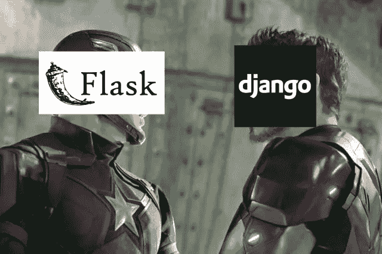

# 关于“姜戈大战弗拉斯克”你应该知道的事情

> 原文：<https://medium.com/analytics-vidhya/things-that-you-should-know-about-django-vs-flask-48091eea1183?source=collection_archive---------12----------------------->

每当我听到“Django vs Flask”的时候，我就会想象这幅画面。

就像字面上的这张图，字面上的“美国队长”的“烧瓶”和“钢铁侠”的“姜戈”。美国队长是一个老派和简单风格的英雄，这并不意味着他不值得😜).钢铁侠更多的是现代和高科技类型的英雄，这并不意味着他擅长一切。

这两个 Rest APIs 几乎完成相同的任务，它们的功能没有区别。这种差异只会在某些情况下出现，让我们在本文中讨论一下。

Flask 是一个微框架，它提供了使你的服务器运行所需的最少的东西。它不附带任何额外的数据库层或表单验证。所需的额外组件必须单独安装，其中。 **Django 是一个完整的高级框架，附带了额外的组件，如数据库层和其他一些东西。**基本上，拥有 django 就像拥有一切，这也是 django 是一个庞大的工作或学习框架的原因。

所以让我们讨论一下这两个框架假设下的一些情况:

**易用性:**如果考虑到实现的易用性，那么 flask 会更容易实现，比如说你要实现一个由 2 个页面组成的网站，其中一个页面重定向到另一个页面。这个任务可以很容易地用烧瓶来完成。在 flask 中，你只需要两个被重定向的模板，在主脚本中，你只需要为这两个页面添加带有路由 ID 的装饰器。而在 django 中，这个过程会稍微长一点，这里的 django 是 [*MVT*](https://djangobook.com/mdj2-django-structure/) 架构，可以让你为每个页面创建单独的应用。

**注意**:如果应用程序很大，并且有很多页面需要与数据库持续交互，那么 Django 更容易使用。因为它可以让您轻松设置基本配置。

**容易学习:**两个框架都有相同的功能，所以两个框架都有相同的概念需要学习。在这里学习 flask 会更容易，因为做事情的方法非常简单，但是如果你正在处理表单验证或数据库管理，还需要做一些额外的事情。如果你不了解**，*MVT，姜戈一开始会有点困惑，但是一旦你了解了 MVT，和姜戈一起工作就会变得非常容易。*

***注意:** Django 和 Flask 将在模板端使用相同的 jinja 语言，因此模板和后端之间的数据共享将是相同的。*

***强大且可扩展:**django 是一个更强大且可扩展的框架，毫无疑问，django 的架构会让它变得更强大。Django 将默认拥有 SQLite，并且它将进一步支持 PostgreSQL、MySQL 和 Oracle。Django 的 [*ORM*](https://djangobook.com/mdj2-models/) 相比 flask 会给开发者更大的优势。在这里创建和操作数据库会更容易。即使 flask 附带了 SQLite，但它不是 ORM 系统，所以基本上只能通过 SQLAlchemy 来创建和操作。*

*与 flask 相比，使用 django 构建的网站具有很高的可扩展性。django 可以支持 240 个并发请求，这在今天的网络流量中要快得多，而且性能没有任何下降。而 flask 只能处理 8 个并发请求，其中 2 个进程各有 4 个线程。因此，当网络中出现更多流量时，用 flask 构建的网站的性能会受到影响。*

*这些是 django 和 flask 之间的主要区别，如果你对选择哪个框架感到困惑，那么可以在下面的例子中找到更多的解释。*

***问:如果你是一名 web 开发人员，你想使用 python 作为你项目的后台，那么应该使用哪个 Rest API 呢？***

*Django 将是一个很好的选择，因为它带有许多预安装的组件，并且可扩展，使网站更加强大。*

***问)如果你是一名机器学习工程师，想要在互联网上部署一个简单的 web 应用程序？***

*A) Flask 将是一个很好的选择，因为它是一个简单而轻便的框架，更适合像你的糖尿病预测项目这样的简单网站。*

***问)不知道 python 的任何 Rest APIs，先学哪个？***

*烧瓶会是很好的选择。这真的是一个简单易行的学习框架。youtube 上任何一个 45 分钟的“烧瓶速成班”教程都足够学习了。学完之后，拿起 django 就容易多了。*

***问)想学习任何一种框架吗？***

*答案是 django，与 flask 相比，学习 Django 肯定需要一点额外的时间，但是学习 Django 中的 MVT 和 ORM 将会把一切都提高到另一个水平，最终使网站更加强大和可伸缩。*

*最后，如果要我把《Django VS Flask》的一切都用一句话来说。然后我会说，*

*“如果你想建立一个只有 3-5 页的简单的 web 应用程序，并尽可能减少与数据库的交互，那么使用 FLASK 或 DJANGO 将是一个明确的选择。”*