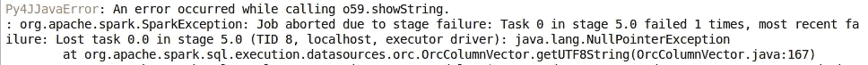

# “生产”Apache Spark 之前需要注意的事项

> 原文：<https://medium.com/analytics-vidhya/things-to-care-before-productionizing-apache-spark-816a6bed3c6a?source=collection_archive---------11----------------------->


自 2015 年 Apache Spark 问世以来，它一直没有停止，大多数科技巨头都采用了这项技术，它已经成为统一数据处理的最先进技术。此外，它还附带了 Spark Mllib 库，这使它成为大规模数据分析的数据工程和数据科学项目的一站式服务。但是，除了 spark 快速、强大和非常酷之外，它还有一些漏洞，这让我在工作中遇到了困难，所以我决定列出我们在 Spark 中面临的挑战，如果事先知道，大多数障碍都可以轻松克服。

## 空指针异常

这个例外是我最糟糕的噩梦，我是认真的，我们中的许多人都会面临这个例外。我花了将近 3 天的时间来调试并找到确切的问题，但代码中的一个小错误仍然会导致这个问题。让我向您展示这个问题是如何出现在日志中的:



遇到这个问题时，我的第一个想法是检查空行或不允许空的列中的一些空数据。但是，经过这么多的辛劳和麻烦，我想到了去文件结构和检查文件。经过一些调试，我知道当列中的数据类型不匹配时，问题就来了。为了更好地说明这个问题，让我展示一下我用来重新创建异常的代码

```
import pyspark.sql.functions as fndf = spark.range(1,5)df.write.orc("/mnt/data/nullPointer")df1 = df.withColumn("id", fn.lit("id").cast("String"))df1.write.orc("/mnt/data/nullPointer", mode="append")new = spark.read.orc("/mnt/data/nullPointer")new.show()
```

因此，基本上我创建了一个数据帧，其中列包含整数数据，并覆盖到一个文件夹中，在相同的数据上，我附加了相同的列，数据类型为“String ”,在写入时，Spark 没有给我任何问题，因为 Spark 遵循“读取时的模式”,不关心什么类型的数据进入数据湖。当我读取数据时，它没有给我带来任何问题，即使在执行一些像 count()、show()这样的操作时，它也不会给你带来任何问题，因为 show()可能只从一个分区获取数据，而 count()只会对行数进行计数。但是，当您尝试聚合该列的数据或显示更多行时，可能会出现问题，在这种情况下，您可能会遇到这种异常，您可能会像我一样一无所知，并开始干预数据，这不会让您接近真正的问题，即数据损坏的存储级别。

*解决方案:*当您有增量加载并且数据在不同的脚本中处理时，可能会出现这种问题，所以每次都要确保您的变量和每列的数据类型是同步的。一旦你面临这个问题，即使我不知道如何取回数据，我得到的唯一解决办法是在 Hive 中重新创建表，因为 Hive 将能够读取数据，即使数据类型与文件不匹配。

## 广播异常

如果您正在处理小型数据集，这个问题非常罕见。我很少遇到这种问题，但是当一个东西要投入生产时，我们必须确保它的每一部分都在正确的位置上。当您广播 join 表并且广播需要很长时间时，就会出现这个问题。有一个默认的阈值时间，如果超过这个时间，您的脚本将引发一个异常。

*解决方案*:如果您怀疑正在广播的数据帧很大，最初可以增加广播超时时间

`spark.conf.set("spark.sql.broadcastTimeout", valueAsPerYourNeed)`

您可以将它设置为“-1”无限期使用。

## OutOfMemoryError: Java 堆空间

考虑到我处理的数据集，这个问题对我来说很常见。看到这个问题的第一个显而易见的解决方案是:


答案并非完全不正确，我为我的工作增加了内存，这很有效，但几天后我又遇到了同样的问题，在一定程度上，您可以为单个工作增加资源，所以我找到了另一个解决方案。

*解决方案:*首先，你可以尝试使用以下命令增加内存

```
spark-submit --num-executor 5 --total-executor-cores 30 --driver-memory 5G(to be increase) --executor-memory 5G(to be increased)
```

另一种解决方案是，您可以调试并找到其转换出现问题的数据帧，并使用以下命令增加分区数量:

```
df_repart = df.repartition(500) #as per you requirement
```

默认值为“200”，可以根据您的需要增加。增加分区数量将减少每个执行器的负载，从而使作业执行更加稳定。

除此之外，下面是在投入生产之前要确定的问题列表:

*   Spark 不允许覆盖同一个文件，它会删除你的数据，然后给你一个异常(有时非常令人沮丧！).
*   在空文件上追加将引发异常。
*   为你的 url 创建一个单独的配置文件，否则当你进入一个新的环境时，你会死于改变它。

总之，Apache Spark 是一个非常强大的工具，将它作为项目的一部分将有助于提高性能，但它也有一些缺陷，我列出的列表并不详尽。因此，我们必须灵活和先发制人，创造无缝火花就业机会。

此外，随着三角洲湖从 2019 年开始进入画面，一些问题现在得到了解决，给 Spark 的酸性作业带来了新的曙光。如果你想了解它，看看这篇文章。

[](/@merchantabid4/spark-delta-lake-d05dd480287a) [## 火花三角洲湖

### 嘿伙计们，

medium.com](/@merchantabid4/spark-delta-lake-d05dd480287a) 

所以这就是所有的人，如果你喜欢我的文章，不要忘记给它一个掌声，并关注我更多令人兴奋的文章。到那时再见！