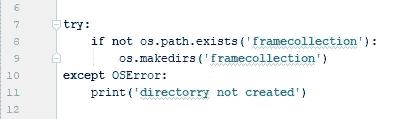

# 使用 OpenCV 逐帧保存来自网络摄像头的图像

> 原文：<https://medium.com/analytics-vidhya/this-article-is-a-quick-tutorial-on-opencv-on-how-to-saving-images-from-a-webcam-feed-frame-by-b6c20ff44c6e?source=collection_archive---------10----------------------->

这篇文章是 OpenCV 上的一个快速教程，讲述了如何从网络摄像头一帧一帧地保存图像。

在 OpenCV 的这个程序中，我会告诉你如何一帧一帧地保存你的摄像机画面。这个方法也可以用来收集数据集。

# 什么是 OpenCV

OpenCV ( *开源计算机视觉*)是一个面向实时计算机视觉的编程函数库，最初由英特尔开发。

这是一个开源库，有很多人对它做出了贡献。

OpenCV ( *开源计算机视觉*)

所以不浪费我们宝贵的时间，让我们开始吧

1.  首先，我们导入库 OpenCV，OS，Time。

导入库

2.然后，我们使用 VideoCapture(0)函数来捕获网络摄像头的馈送，这里 0 表示网络摄像头的默认值。

将视频捕捉的结果保存在相机中

3.现在我们将创建一个存储图像的目录(文件夹)。

框架集合是目录的名称

4.在这里，我们将总屏幕时间设置为 10 秒，即相机将在 10 秒后关闭。

5.现在我们用条件运行 while 循环

time.time() =时钟的当前时间

start _ time = time 循环开始的时间

如果(当前时间-开始时间< total time ) then the loop will be executed otherwise

will stop

6\. Now read the frame of the camera frame by frame here

**ret** 是检查相机是否打开的布尔变量

**帧**是一个变量，其中保存了所有的摄像机输入

7.在这里，我们检查图像是否正在被检索，如果 ret 在那里，那么我们同样的图像，否则我们不

这里，

cv2.imwrite 用于以 jpg 格式在 framecollection 位置保存 name count+currentframecount 的图像

8 .在这里，我们关闭循环，破坏所有的窗口，并释放摄像头。

可以在这个 Github 资源库中找到代码，以及相同内容的视频链接。

 [## shantamsultania/逐帧使用 opencv

### 在这个过程中，我们一帧一帧地收集摄像机输入，并保存在本地电脑中…

github.com](https://github.com/shantamsultania/frame_by_frame_using_opencv/blob/master/frame_by_frame_in_OpenCV.py) 

由...所写

 [## shantam Sultania——校园代表——谷歌开发团队昌迪加尔| LinkedIn

### 查看 Shantam Sultania 在世界上最大的职业社区 LinkedIn 上的个人资料。Shantam 有一份工作列在…

www.linkedin.com](https://www.linkedin.com/in/shantam-sultania-737084175/)