# 深度学习中的优化器

> 原文：<https://medium.com/analytics-vidhya/this-blog-post-aims-at-explaining-the-behavior-of-different-algorithms-for-optimizing-gradient-46159a97a8c1?source=collection_archive---------2----------------------->

这篇博文旨在解释优化梯度参数的不同算法的行为，这将有助于你将它们投入使用。

在神经网络的训练过程中，我们的目标是通过更新参数(权重)的值来尝试最小化损失函数，并使我们的预测尽可能准确。但是你具体是怎么做的呢？接下来的问题是，如何改变模型的参数，改变多少？

现在，如果你使用蛮力方法来确定你的深度神经网络的最佳参数，世界上最快的超级计算机 [*Sunway Taihulight*](https://en.wikipedia.org/wiki/Sunway_TaihuLight) 以 93 pFLOPS(PETA fluid operations/sec)的速度运行大约需要 3.42*10⁵⁰年，而普通计算机的工作速度为几千兆 flops。

这就是优化器发挥作用的地方。它试图通过响应损失函数的输出更新模型参数来降低损失函数。从而有助于以最低的损失和最精确的输出达到全局最小值。

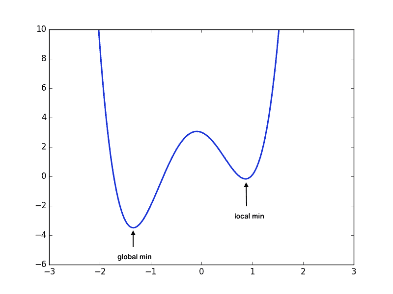

这显示了全局和局部最小值，Y 轴表示损失，X 轴表示权重

***更新权重:***

在深入研究各种类型的优化器之前，知道优化器最重要的功能是更新学习算法的权重以达到最小代价函数是非常必要的。这里是所有优化器使用的公式，用于用 [*学习率*](https://en.wikipedia.org/wiki/Learning_rate) *的某个值更新权重。*

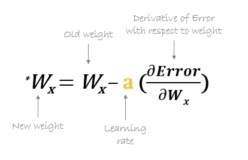

更新权重的公式

*让我们深入探讨不同类型的优化算法。*

> **优化器的类型:**

1.  梯度下降
2.  随机梯度下降
3.  阿达格拉德
4.  阿达德尔塔
5.  RMSprop
6.  圣经》和《古兰经》传统中）亚当（人类第一人的名字

G ***血统:***

这是神经网络中使用的最古老和最常用的优化器之一，最适用于数据以拥有凸优化问题的方式排列的情况。它将通过更新学习算法的权重来尝试找到最小成本函数值，并得出与全局最小值相对应的最适合的参数值。

这是通过以负斜率向山下移动，增加旧的重量，而正斜率减少旧的重量来实现的。

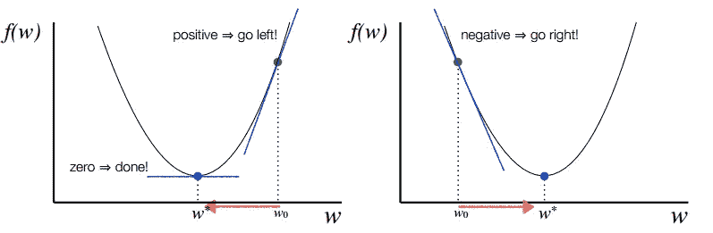

决定下降的方向

尽管在使用这种优化器时存在挑战，但是假设数据以具有非凸优化问题的方式排列，那么它可能落在局部最小值而不是全局最小值上，从而为参数值提供更高的成本函数。

还有一个鞍点问题。这是一个梯度为零的点，但不是最佳点。这仍然是一个活跃的研究领域。

在某些情况下，由于参数初始化不正确，也可能会出现消失渐变或爆炸渐变等问题。这些问题是由于非常小或非常大的梯度而发生的，这使得算法难以收敛。

用梯度下降法寻找凸优化问题的全局极小值

S**to chastic 渐变下降:**

这是梯度下降优化器的另一种变体，具有处理非凸优化问题的数据的额外能力。这种数据的问题是，成本函数的结果停留在局部最小值，这不适合你的学习算法。

这个优化器不进行批处理，而是专注于一次执行一个更新。因此，它通常要快得多，并且在每次迭代(历元)之后成本函数最小化。它执行具有高方差的频繁更新，这导致目标函数(成本函数)剧烈波动。由于这个原因，它使得梯度跳到潜在的全局最小值。

但是，如果我们选择的学习率太小，可能会导致收敛速度非常慢，而较大的学习率会导致难以收敛，并导致成本函数在最小值附近波动，甚至远离全局最小值。

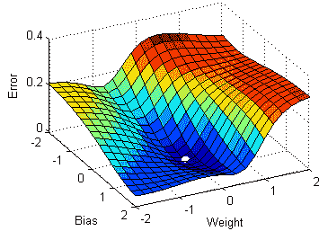

对非凸数据使用 SGD 收敛于全局极小值

一个 ***达格拉:***

这是自适应梯度优化算法，其中学习速率在确定更新的参数值中起着重要作用。与随机梯度下降不同，该优化器对每次迭代(时期)使用不同的学习速率，而不是使用相同的学习速率来确定所有参数。

因此，它对对应于高频特征的权重执行较小的更新(较低的学习率),而对对应于低频特征的权重执行较大的更新(较高的学习率),这又有助于以更高的精度获得更好的性能。Adagrad 非常适合处理稀疏数据。

因此，在每次迭代中，首先会计算 t 时刻的α，随着迭代次数的增加，t 的值也会增加，因此αt 会开始增加。

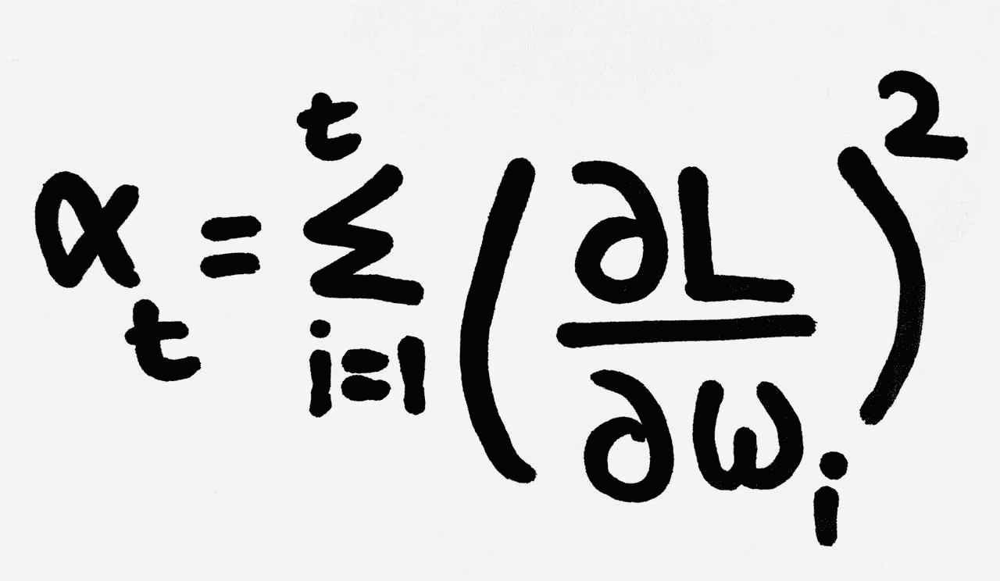

α项增加，因为在时间步长 t 对损失相对于重量的导数求平方

现在，在每个时间步计算学习率。由...给出，

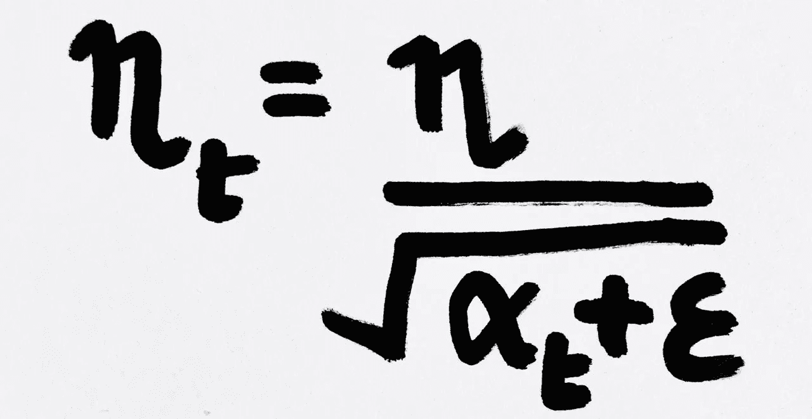

这里，ε是加到α上的一个小正数，以避免在任何情况下α变为零时的误差

因此，随着时间步长 t 处的α增加，它使得学习率逐渐降低。

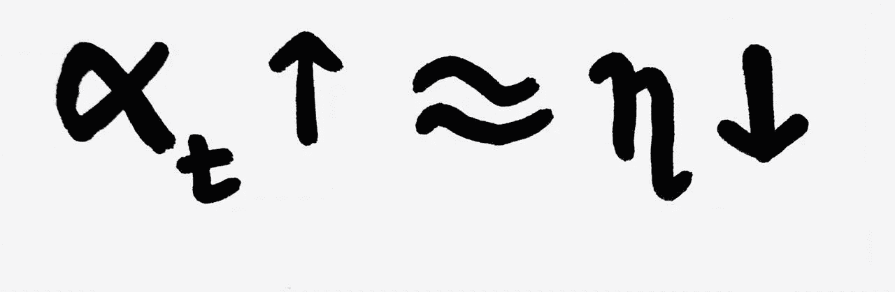

随着每次迭代的学习速率的改变，用于更新权重的公式也改变。由...给出，

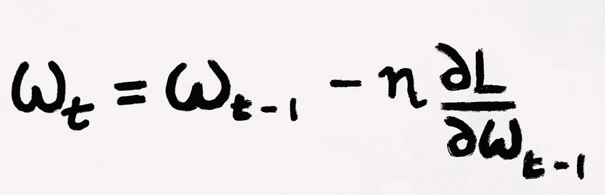

这决定了每次迭代的更新权重

然而，陷入 [*消失梯度*](https://en.wikipedia.org/wiki/Vanishing_gradient_problem) 的问题有一个缺点，因为在许多次迭代之后，阿尔法值变得非常大，使得学习率非常小，导致新旧权重之间没有变化。这反过来导致学习率缩小，最终变得非常小，算法无法获得任何进一步的知识。

一个 ***一个***

这是自适应梯度优化器的一个扩展，考虑到了它无限减小学习速率的积极本质。这里不使用先前的平方梯度，梯度的总和被定义为所有过去的平方梯度的递减加权平均值(加权平均值),这将学习速率限制为减小到非常小的值。

新权重的公式与 Adagrad 中的公式相同。然而，对于每次迭代，在确定时间步长 t 的学习速率时有一些变化。

在每次迭代中，首先计算加权平均值。这里我们有限制项(gamma = 0.95)，它有助于避免 [*消失梯度*](https://en.wikipedia.org/wiki/Vanishing_gradient_problem) 的问题。

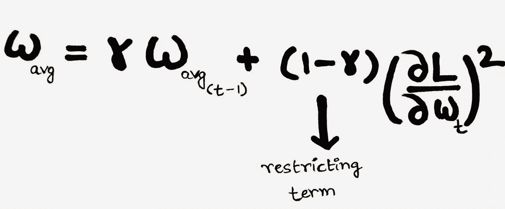

计算加权平均值的公式

之后使用公式计算学习率，

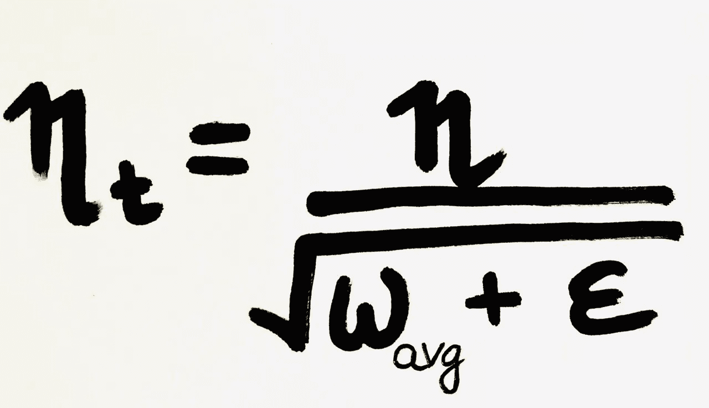

时间步长 t 的学习率计算公式

因此，由于约束项的存在，加权平均值将以较慢的速率增加，使得学习速率缓慢降低，以达到全局最小值。

RT16*ms prop:*

RMSprop(均方根传播)和 Adadelta 这两种优化算法几乎是同时开发的，目的都是为了解决 Adagrad 的破坏性学习率问题。然而，两者都使用相同的方法，该方法利用指数加权平均来确定每次迭代在时间 t 的学习速率。

RMSprop 是由 Geoffrey Hinton 提出的一种自适应学习速率方法，它通过平方梯度的指数加权平均来适当地划分学习速率。建议将 gamma 设置为 0.95，因为它在大多数情况下都显示出良好的效果。

***大坝:***

这是自适应矩估计算法，它也基于在每次迭代中为每个参数计算自适应学习率的方法。它使用带有动量 的 [*梯度下降和 RMSprop 的组合来确定参数值。*](https://engmrk.com/gradient-descent-with-momentum/)

当引入该算法时，在非凸优化问题上使用 Adam 有一系列吸引人的好处，这使它成为最常用的优化器。

它结合了动量梯度和 RMSProp 的优点，具有几个优点，如低内存需求，适用于非静态目标，最适合处理大量数据和参数，计算效率高。除了存储相对于时间 t-1 的权重的损失的过去平方导数的指数加权平均值之外，这使用自适应学习率的相同方法工作。

它带有几个参数，分别是β1、β2 和ε(ε)。其中β1 和β2 分别是动量和 RMSprop 的初始限制参数。这里，β1 对应一阶矩，β2 对应二阶矩。

为了在迭代 t 用自适应学习率更新权重，首先，我们需要计算由以下公式给出的第一和第二矩，

VdW = β1 x VdW + (1-β1) x dW — —有动量的 GD(第一)

SdW =β2 x SdW+(1-β2)x dW--rms prop(2nd)

校正后的 VdW 和 SdW 由下式给出:

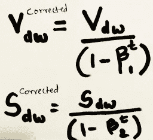

因此，将使用公式更新新的权重，

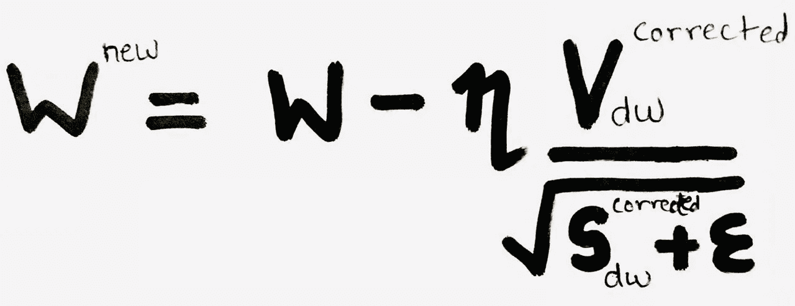

n 的初始值将被调整以获得更好的结果。

Adam 相对容易配置，默认的配置参数在大多数问题上都做得很好。建议默认值为β1=0.9，β2 = 0.999，ε =10E-8。研究表明，与其他自适应学习算法相比，Adam 在实践中表现良好。

> 这篇博文旨在以更简单的方式阐述这些知识，让读者更容易理解。我将发布下一篇文章，讨论神经网络中使用的不同类型的权重初始化器。

> 请关注我，获取更多关于数据科学的文章。感谢阅读。