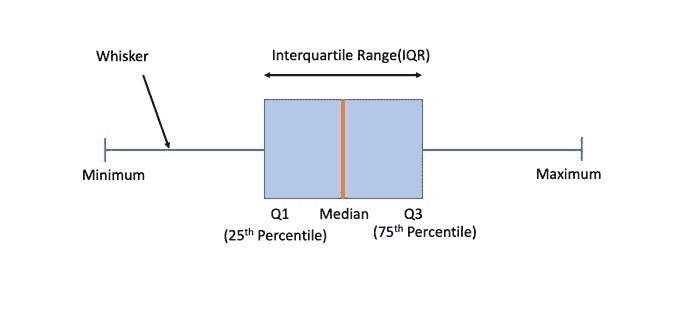
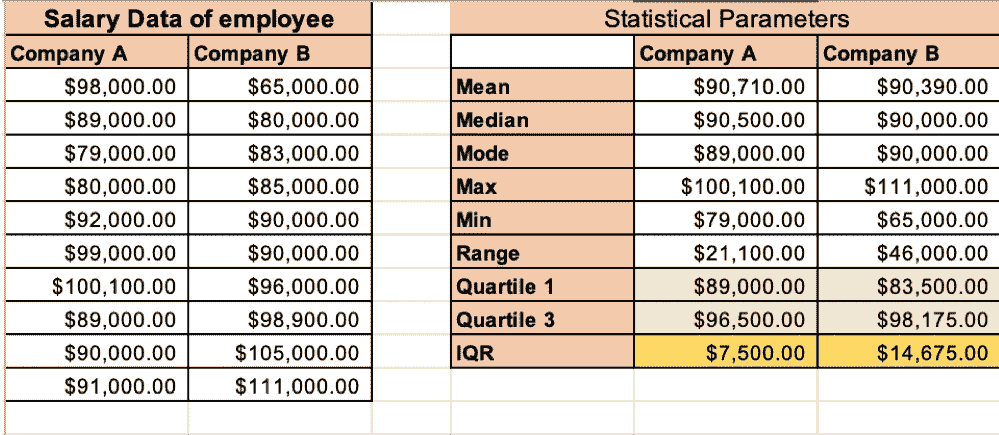
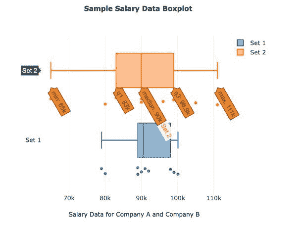
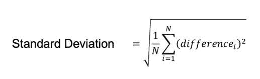
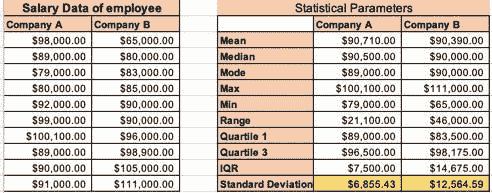
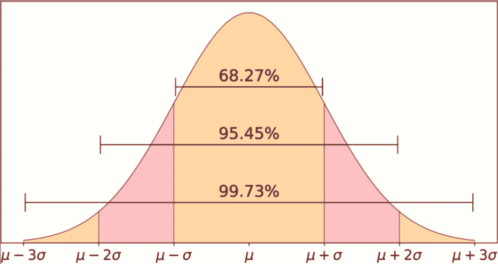
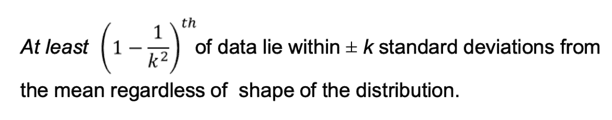
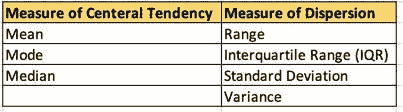

# 箱线图和 68–95–99.7 规则

> 原文：<https://medium.com/analytics-vidhya/this-is-article-3-in-this-series-of-business-statistics-6efd37fb4476?source=collection_archive---------7----------------------->

这是商业统计系列的第三篇文章。如果您需要复习本系列的上一篇文章，请参考下面的链接:

 [## 计算离差的度量

### 这是商业统计系列的第二篇文章

medium.com](/@jain.nikhil04/calculating-measure-of-dispersion-da8e9fa7ef83) 

# 箱线图

箱线图是我们到目前为止研究过的各种描述性统计方法的直观表示，如中位数、四分位数等。在统计语言中，箱线图是基于五个不同参数呈现数据集分布的标准方式。箱线图还可以告诉你数据集中的偏斜度，以及数据是否对称。

箱形图也称为须状图。顶部和底部的两个胡须是你的数据的最大值和最小值。矩形框是您的四分位数范围(IQR)，以第一个和第三个四分位数为界。盒子里面的垂直线是中间值。因此，在一个视图中，你可以很好地总结数据。当您比较两个数据集时，这样的视觉效果非常有用。

让我们再次回顾一下用于计算箱线图中不同参数的所有公式:

最小值/四分位数 0 (Q0) = **“最小(数组)”**

四分位数 1 (Q1) = **“四分位数(数组，1)”**

中位数/四分位数 2(Q2) = **“中位数(数组)”**

四分位数 3 (Q3) = **"四分位数(数组，3)"**

最大值/四分位数 4 (Q4) = **“最大值(数组)”**

> ***四分位距(IQR) = Q3- Q1***

在这里，我们以之前讨论的同一个例子为例，通过比较 A 公司和 B 公司的工资数据，我们还在 Excel 的帮助下计算了以下关键参数:

让我们在 Boxplot 的帮助下可视化同一个例子。这里，集合 1 代表公司 A 数据集，集合 2 代表公司 b。正如我们已经知道的，集合 2 的 IQR 范围高于集合 1。同样，我们也可以使用箱线图进行验证。最小值、Q1、中值、Q3 和最大值也符合相同的计算。

*总结箱线图:它是集中趋势和分散趋势参数关键特征的可视化表示。*现在让我们介绍一个更常用的概念，即描述性统计，用于描述数据中的分散或扩散。

# 标准偏差:

在统计世界中，标准差是一组值的变化或分散的度量。低标准偏差表示这些值倾向于接近数据集的平均值，高标准偏差表示这些值分布在更大的范围内。标准偏差一般用符号 sigma (σ)表示。计算标准偏差公式如下:

这里；n 表示总观察值，difference(i)表示平均值减去数据集中的每个数据点。

标准差公式对差的平方求和，除以 N，然后取结果的平方根。Excel 命令也如下所示:

Excel Command = **"STDEV。p(数字 1，数字 2，…)"**为总人口

Excel Command = **"STDEV。S(number1，number2，...)"**为样本

现在，让我们用公司 A 和公司 B 的相同工资数据集来计算标准差(SD)参数:

公司 A 和公司 B 的标准偏差计算值分别为 6，855.43 美元和 12，564.59 美元。请注意，SD 测量与数据点是相同的单位。

我们已经有了这么多参数，那么计算标准差的目的是什么？通过计算这个数字我们得到了什么？最简单的答案在于统计学中的经验法则。

*“在统计学中，68–95–99.7 规则，也称为经验规则，是一种速记，用于记住位于正态分布均值附近的一个带内的值的百分比，该带的宽度分别为两个、四个和六个标准差；更准确地说，68.27%、95.45%和 99.73%的数值分别位于平均值的一个、两个和三个标准偏差内。”*(维基百科)

用简单的数学术语来说，这可以概括为:

平均(μ) +/- 1SD (σ) ~ 68.27%数据总体

平均(μ) +/- 2SD (σ) ~ 95.45%数据总体

平均(μ) +/- 3SD (σ) ~ 99.73%数据总体

标准差的计算比 IQR 稍微复杂一点，但却是分析数据集的一种更强大的测量方法。因此，测量 SD 统计参数有助于我们更容易地总结数据。我们研究的 68–95–99.7 规则仅在数据集遵循正态分布时成立。对于任何形状的分布，标准偏差的应用可以用下面的定理来解释:

# 切比雪夫定理；

切比雪夫定理是一个定理，它允许我们近似地知道有多少百分比的数据集位于数据集平均值的一定数量的标准偏差内。计算切比雪夫定理的数学方程如下所示。

切比雪夫定理计算出，无论分布的形状如何，至少 75%的所有值都在平均值的 2 个标准差以内。这个数字也可能更大。可能是全部，100%，但至少是 75%。切比雪夫定理是一个伟大的统计度量，因为它可以用于任何类型的数据集中进行统计计算。

在离差测量中，我们还有一个参数要讨论，即:

# 差异:

统计学中的方差(σ)是对数据集中数字之间的分布的度量。它衡量数据集中的每个数字与平均值以及数据集中的每个其他数字之间的距离。换句话说，变化是可变性的度量。

根据标准偏差计算方差:

*方差(σ ) =(标准差)*

方差是统计计算中的一个关键参数，但我们将在后面详细讨论其适用性。

最后，我们可以将集中趋势和分散的度量总结如下:

在下一篇文章中，我们将学习协方差、相关性、概率、随机变量和统计分布的应用。

到时候…学习愉快！我希望到目前为止你喜欢学习。请在评论区告诉我你的反馈。

#数据分析#统计#统计分析#业务分析#回归#数据科学# excel #数据驱动业务#数据驱动决策#分析#分析#隔离时间#数据#数据科学家#优秀培训#数据分析#学习#产品管理#数据分析#学习#产品管理#标准偏差# IQR #方差#范围