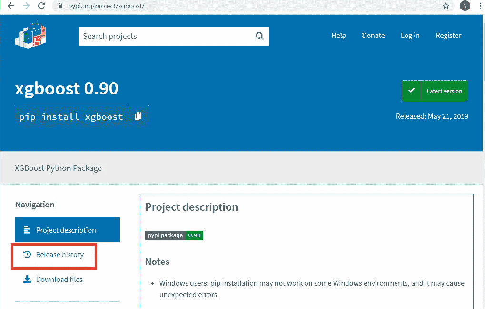
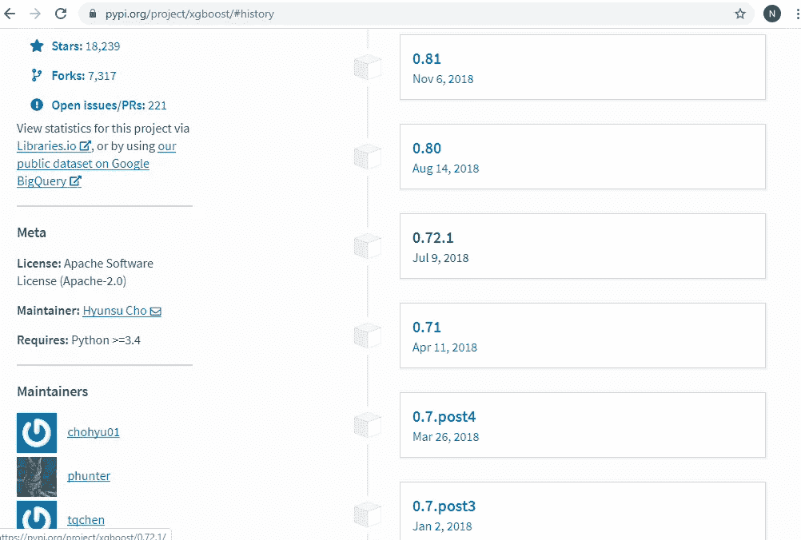
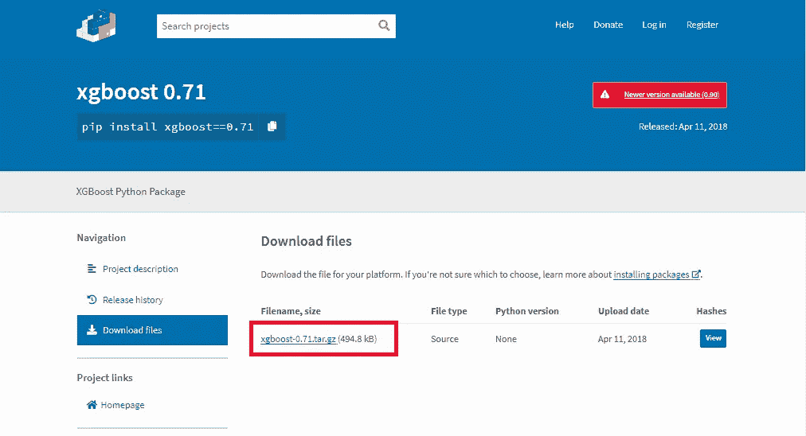
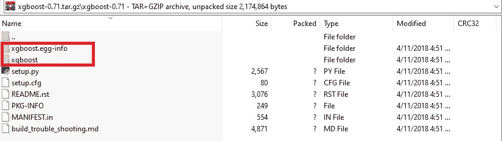

# 如果您无法在 Windows 机器上安装最新或旧版本的 XGBoost，您应该这样做

> 原文：<https://medium.com/analytics-vidhya/this-is-what-you-should-do-if-you-fail-to-install-the-latest-or-an-older-version-of-xgboost-on-7942a7641eee?source=collection_archive---------2----------------------->

在交付我的数据科学培训课程时，我的学生总是在 Windows 机器上使用 Anaconda 安装 XGBoost 包时遇到困难。是的，大多数数据科学家都会同意，Windows 操作系统永远不应该是运行数据科学项目的首选。然而，令人痛心的事实是，大多数人(即非程序员)仍然使用微软视窗作为他们笔记本电脑的主要操作系统。事实上，我的大多数学生都没有或者只有很少的 Python 编程经验。

根据我的经验，在 Windows 上安装 XGBoost 时可能会遇到太多不同类型的安装错误。这多少让我第一天培训课的头几个小时变得毫无收获，因为我倾向于花更多的时间调试学生的安装问题。

通常，当出现安装问题时，StackOverflow 总是我寻求帮助的首选。不幸的是，XGBoost 在每次版本更新中都经历了如此多的重大变化，因此即使在 StackOverflow 或官方 XGBoost 论坛上找到一个可靠而快速的解决方案也是极具挑战性的。

因此，在本文中，我将讨论一些我在与学生一起上培训课时通常会遇到的安装问题。在讨论了我通常面临的常见安装错误之后，我将最后描述一个简单的解决方案，在这个方案中，我能够解决大多数学生的 Windows 机器上的 XGBoost 安装问题。

**使用“conda 安装”的尝试失败**

在我的班上，Anaconda 是我通常要求学生安装的工具包的首选。这仅仅是因为 Anaconda 提供了所有关键的数据科学包，如 jupyter notebook、pandas、scikit-learn、scipy 和其他几个包。因此，安装 XGBoost 的显而易见的方法就是使用 conda install 命令。

> (基本)C:\>conda 安装 py-xgboost=0.71

上面的命令只是尝试下载特定版本的 XGBoost 包。在这种情况下，我打算下载并安装 0.71 版的 XGBoost，因为我使用了一些依赖于 XGBoost APIs 的代码，这些 API 现在已经被最新版本的 XGBoost 否决了。此外，github 或 Kaggle 存储库中的大多数数据科学代码通常都有类似的问题，您经常需要使用特定版本的 XGBoost 来编译和运行它。

不幸的是，使用 **conda install** 命令，我多次遇到**“解决环境”**错误，然后 conda 最终显示一个关于与我的 python 安装的包冲突的错误。它建议我应该将我的 Python 版本 3.7 降级到 3.6，这对于我的情况来说并不实际。

> (base)C:\ > conda install py-xgboost = = 0.71
> 收集包元数据(current_repodata.json): done
> 求解环境:初始冻结求解失败。使用灵活求解重试。
> 收集包元数据(repodata.json): done
> 求解环境:初始冻结求解失败。使用灵活求解重试。
> 解决环境:/
> 发现冲突！寻找不兼容的包。
> 这可能需要几分钟时间。按 CTRL-C 中止。
> 失败
> 
> UnsatisfiableError:发现以下规范|
> 与您环境中的现有 python 安装不兼容:
> 
> 规格:
> 
> -py-xgboost = = 0.71-> python[version='>=3.5,❤.6.0a0|>=3.6,❤.7.0a0']
> 
> 你的 python: python=3.7
> 
> 如果 python 在链的最左边，那就是你要的版本。
> 当 python 出现在右边时，这表明左边的东西不知何故
> 对您所受限的 python 版本不可用。请注意，conda 不会
> 将您的 python 版本更改为不同的次要版本，除非您明确指定
> 。
> 
> 发现以下规格相互不兼容:
> 
> py-xgboost = = 0.71->python[version = '>=3.5,❤.6.0a0']->pip->requests->certif[version = '>= 2016.09 |>= 2016 . 9 . 26 |>= 2017 . 4 . 17 ']
> python = 3.7->pip->set..

**尝试使用“pip 安装”失败**

我的下一个尝试是使用 pip 安装 XGBoost 版本 0.71。标准方式是以下命令:

> (base)PS C:\ aurak \ python > pip install xgboost = = 0.71

不幸的是，pip 也无法安装旧版本的 XGBoost。如果只使用“XGBoost”而不使用“the==0.71”选项来运行该命令，那么 XGBoost 似乎可以完美地安装。在某些情况下，我的学生无法安装 XGBoost，即使只有一个简单的“pip install xgboost”命令，没有额外的选项。但是，在我的例子中，我需要安装旧版本的 XGBoost(即 0.71 版)，这是上面的 pip 命令无法实现的。

翻了一遍 StackOverflow 和 XGBoost 官方论坛，发现`pip install`命令在 Windows 平台上并不好用(看这里:[https://discuse . XGBoost . ai/t/pip-install-XGBoost-uns-working-on-Windows-x64/57/2](https://discuss.xgboost.ai/t/pip-install-xgboost-isnt-working-on-windows-x64/57/2))。因此，我决定不再进一步探索这种方法。

**最终成功的尝试**

我通过简单地从官方 PyPi 网站(即[https://pypi.org/](https://pypi.org/))下载我需要的实际 XGBoost 二进制文件来解决这个问题，并将下载的 XGBoost 文件夹放在我的 Anaconda 安装 python 包中。

在 Anaconda 中，所有安装 python 包通常存储在一个目录下，该目录通常被命名为**站点包**。因此，可以下载 XGBoost 版的 windows 二进制文件，并将它们放在站点包中。我将在下面解释这些步骤。

首先，您需要确定 Windows 目录中站点包目录的路径。为此，只需在 Python shell 中运行以下代码。

> (base)PS C:\ aurak \ Python > Python
> Python 3 . 7 . 3(默认，2019 . 04 . 24，15:29:51)[MSC v . 1915 64 bit(AMD64)]::Anaconda，Inc. on win32
> 键入“help”、“copyright”、“credits”或“license”了解更多信息。
> > > >从 distutils.sysconfig 导入 get _ python _ Lib
> >>>print(get _ python _ Lib())
> **C:\ Users \ Nur man \ AppData \ Local \ Continuum \ anaconda 3 \ Lib \ site-packages**

如上所述，我的 **site-packages** 目录位于以下路径:C:\ Users \ nurman \ AppData \ Local \ Continuum \ anaconda 3 \ Lib \ site-packages。

一旦你在你的 Windows 机器上找到了你自己的 **site-packages** 目录，就该从 pypi.org 官方网站下载 XGBoost 文件了。在官网上，输入 XGBoost 作为搜索关键词。该网站会将您带到 XGBoost Python 包网站。

您可以观察到，在撰写本文时，XGBoost 的最新版本是 0.90。如果您需要查找旧版本，点击**发布历史**按钮。

如果你向下滚动，你应该能找到你想要的版本。在我的例子中，我找到了我需要的版本 0.71。点击链接会带我到一个网页，在那里我可以下载 XGBoost 版本的 tar.gz 文件。

继续下载 tar.gz 的文件。下载完成后，您需要提取并复制两个重要的文件夹，即 **xgboost** 和 **xgboost.egg-info** 到您的 **site-packages** 目录。

仅此而已。现在，您可以从 Python shell 中验证 XGBoost 安装是否正常工作。

> Python 3.7.3(默认，2019 . 04 . 24，15:29:51)[MSC v . 1915 64 bit(AMD64)]:Anaconda，Inc. on win32
> 键入“help”、“copyright”、“credits”或“license”了解更多信息。
> > > >导入 xgboost 为 xgb
> > > > xgb。_ _ version _ _
> **‘0.71’**

瞧啊。您在 Windows 机器上的 XGBoost 安装已成功完成。干得好。