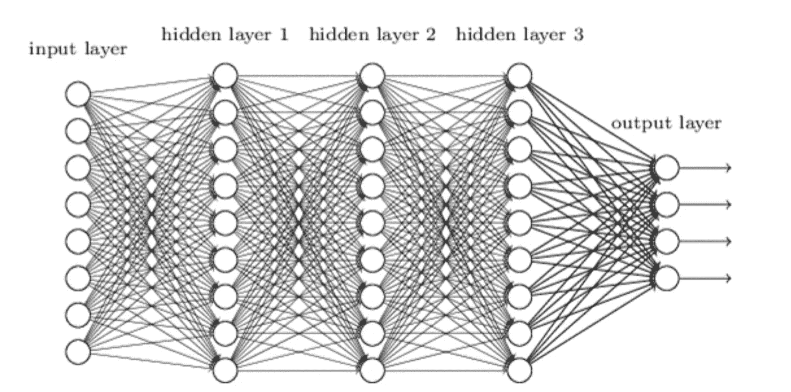
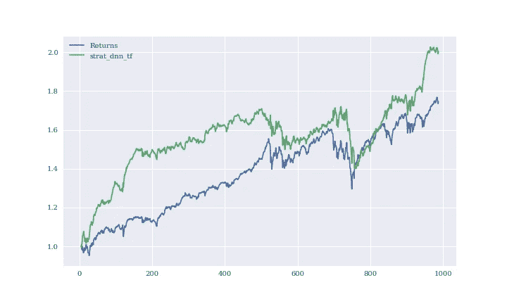
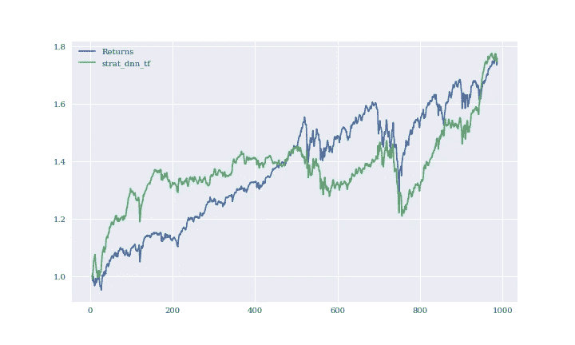
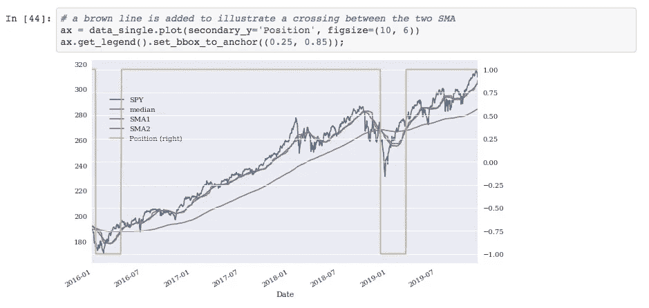
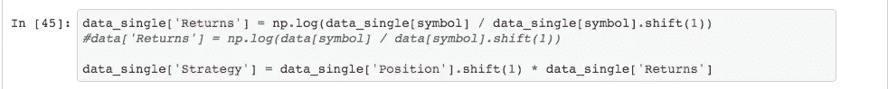
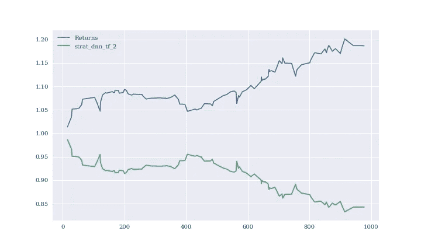
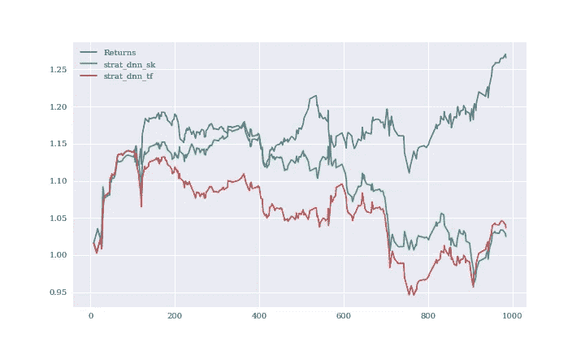
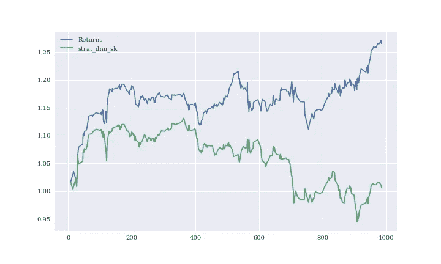
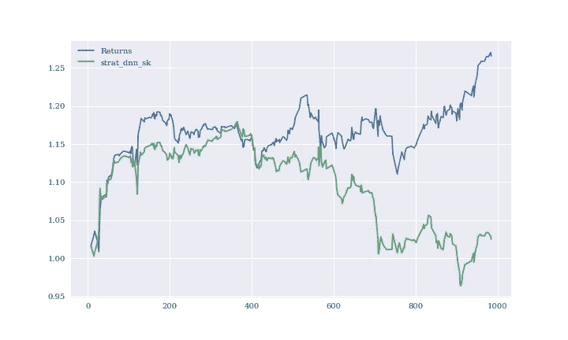

# 这将使你在向机器学习模型投资时三思而行…

> 原文：<https://medium.com/analytics-vidhya/this-will-make-you-think-twice-on-putting-money-in-a-machine-learning-model-27ef5f3ed799?source=collection_archive---------18----------------------->

来源:谷歌图片

想象你处于两种情景中的*之一:*

> 1.一位投资者给你发电子邮件，声称他的新股票预测算法可以让你赚很多钱。他认为你应该投资，还说你不投资就太可笑了。
> 
> 2.你是一名程序员，你遇到了这个很酷的算法，它可以预测你的股票未来的上涨或下跌。你觉得它很酷，你很想赚钱，所以你复制了一只不同股票的代码，然后注入资金。

我将解释这两个场景中的缺陷，也将解释修改的机会。我将通过一个框架，使用三个编码模型来解释我用一种叫做深度神经网络(DNN)的机器学习类型做的。

但是首先，什么是深度神经网络(DNN)？DNN 是一种人工神经网络，在输入层和输出层之间有多层。这个合成过程模拟了人脑的思维过程。在编码中，DNN 包含隐藏层，有助于简化复杂的关系，以建立一个模型。这里有一张照片可以说明:

DNN 可以包含任意数量的隐藏图层。各层中的圆圈代表添加到另一层以形成下一层的节点。(来源:谷歌图片)

在我用更多细节让你厌烦之前，让我们继续吧…

如果你感到困惑，我正在使用机器学习的过程来学习数据关系，并根据部分数据建立模型，同时保留其余部分。其余的数据将根据这个模型进行测试，看看它的性能如何。

## 回顾之后，让我们简要指出场景 1 中的缺陷和可能出错的地方。

*缺陷一，模型预测可能会偏离太远，你会损失很多钱:*

尽管模型很好，但即使有确切的参数，该模型也可以预测高于或低于某个限制，该限制不同于相同执行的另一个实例。例如，当我意外刷新我的内核(执行代码的东西)时，数字和预测图实际上发生了变化。没有预测是精确的。这里有两个图表来说明刷新后的内核:

执行 1 和相同的代码。

执行 2 和相同的代码。请注意，策略(绿线)与上图不同。

*缺陷二投资者的模型没有内置的记分卡，记分卡也可以带来修正的机会:*

通过对表现进行评分而建立的模型的基础确实很重要。例如，该算法是否仅查看价格之间的变化率，或者该模型是否内置了用于评分的财务定义，例如简单移动平均线、回报率和标准差。对于我建立的模型，我使用了一个记分卡，其中包含调整后收盘价的回报和从短期移动平均线穿过长期移动平均线的策略变化。

寻找从简单移动平均线 1 到简单移动平均线 2 的交叉点。这个交叉点被标记为“位置”。

定义度量标准，并在“战略”定义中使用“定位”。

此外，模型是否还包括其他数据以进行交叉引用？不幸的是，对于我的小型研究，我没有数据能力或时间来添加额外的交叉参考数据进行预测。

*股价不好和股价好的破绽和机会:*

导入到模型中的股票价格类型确实很重要。“调整关闭”不同于“关闭”。股息和公司股票分割的调整后结算账户。“调整收盘”也不同于“高”和“低”。这是显而易见的，所以我就不赘述了。

*机器学习编码平台和包类型的缺陷和机会:*

外面有那么多。我研究了三个 DNN 机器学习器:带有 Scikit-learn 的 MLPClassifier，以及 Google 的 TensorFlow DNNClassifier 和 TensorFlow 的 DNNRegressor。让我们希望他没有选择 DNNRegressor，否则你会亏钱，正如我的研究显示的那样:

这个策略(绿线)是这个 DNNRegressor 的结果

但如果他选择 DNNClassifier，你可能会没事:

这个 DNNClassifier 导致的策略(绿线)。红线是 Scikit-learn 制造的另一个模型的策略。

## 让我们简要指出场景 2 中的缺陷和可能出错的地方。

一些缺陷和机会与过去的场景非常相似，所以我不会再赘述。*但是缺陷一，模型的参数在每只股票上的表现不一样:*

模型的张量隐藏层数(快速解释见上图)对不同股票的反应不同。我参考了教科书中的代码结构，并将其用于不同的股票。张量的数量对教科书中的股票有很好的表现，但对我项目中的不同股票却没有。我换了张量数，股票其实表现更好。一个变化的两个图表:

策略(绿线)是教科书中的代码，但股票不同。

现在，代码中的节点数量发生了变化，图表反映了更好的变化。

*其次另一个缺陷是代码中有一个 bug:*

不为人知或者显而易见但是痛苦的:*必须修复 bug* ！复制、粘贴和编辑总是会导致错误的发生。

*另一个缺陷和机会是，作为一个编码人员，您必须修正数据集，使其被正确格式化，以便输入到模型中:*

这意味着数据集不应有缺失值(在编码专业中通常称为 NaNs 或 0)。否则，你的数据将会被歪曲，并会做出不同的预测。然而，在股票值为 0 的情况下，它们有时是没问题的，因为股票是按时间线走的。有时用平均值或其他值填充会更糟。

*同样，代码的结构和数据类型也很重要*。当我在 TensorFlow 上使用 DNN 做项目时，我不得不尝试许多代码结构，只是为了以 TensorFlow 可以接受和喜欢的正确格式导入数据。仅此一项就花了我一天时间。TensorFlow 的输入必须在矩阵/向量中，并且必须有两个输入。

这篇文章的寓意是要小心你的钱和你的代码。总之，看看 ML 算法模型的框架和评分标准。看看进入模型的数据类型和输入标准。而且看编码包的类型。快乐编码和快乐收益！

欲了解更多关于代码包含三个由作者做的 DNN 测试股票预测模型的信息，请访问:【https://github.com/studybug/DNN_ML_Stock_Predict】T2

*Caleb M 是惠顿学院的毕业生，即将毕业于 Udacity 的数据科学纳米学位项目。*