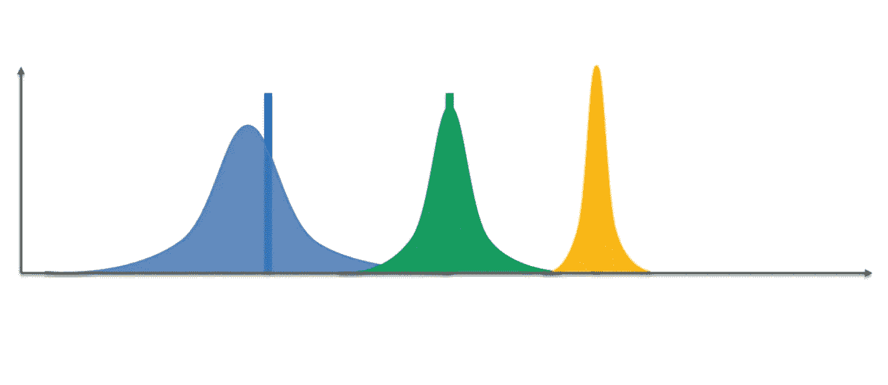
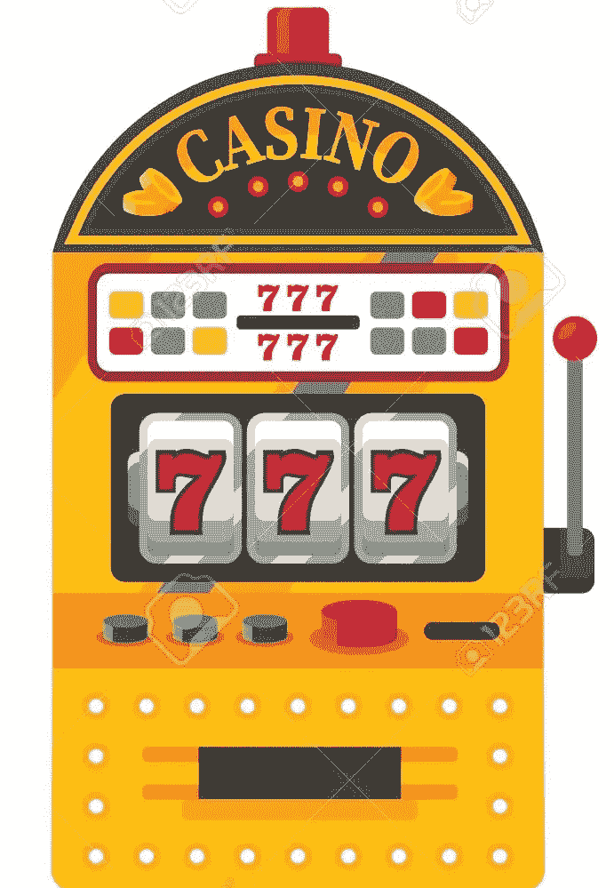
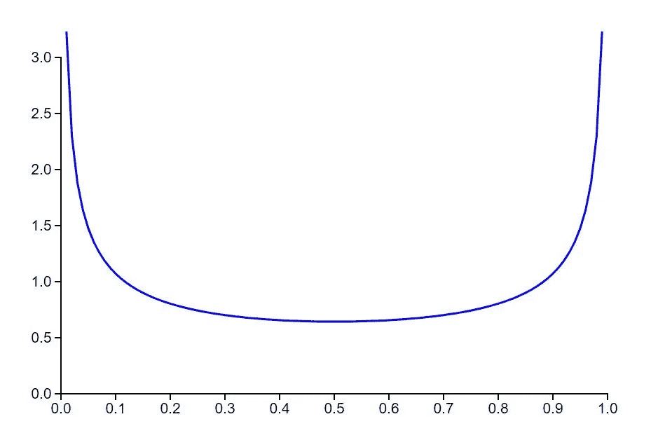
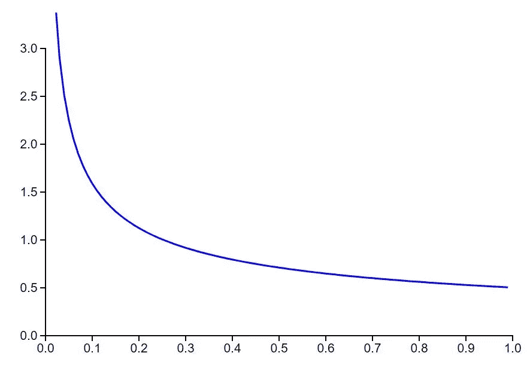
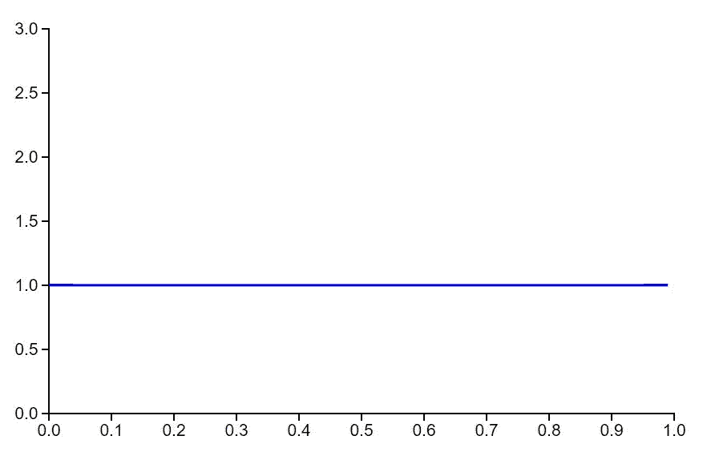
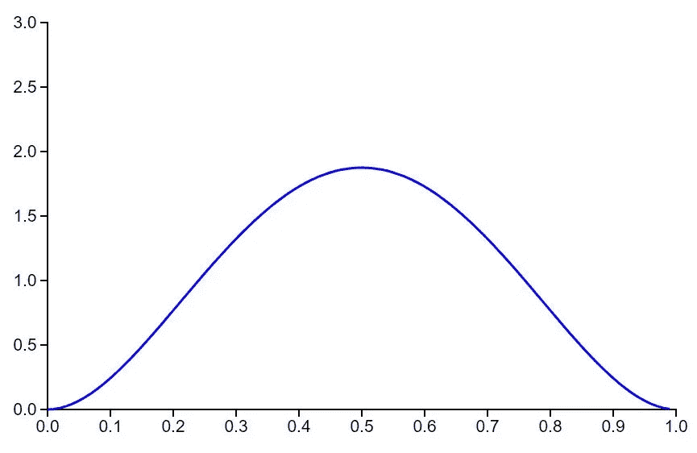
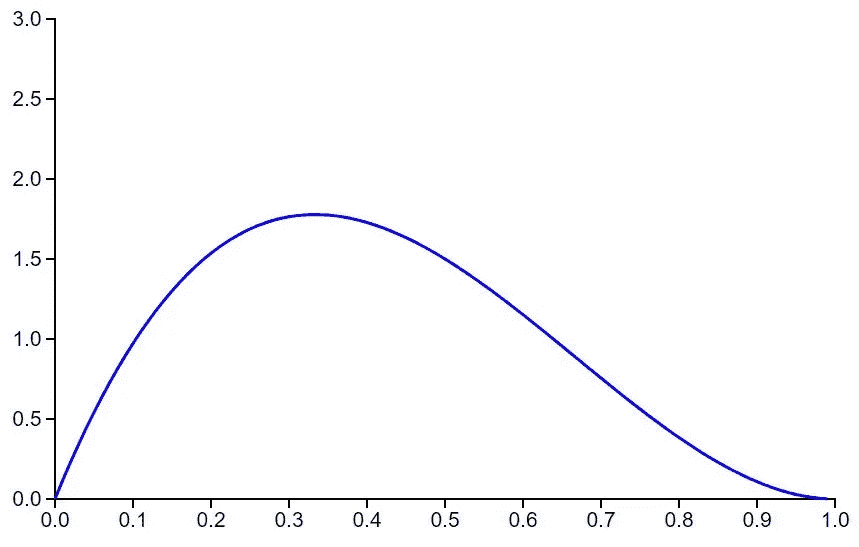
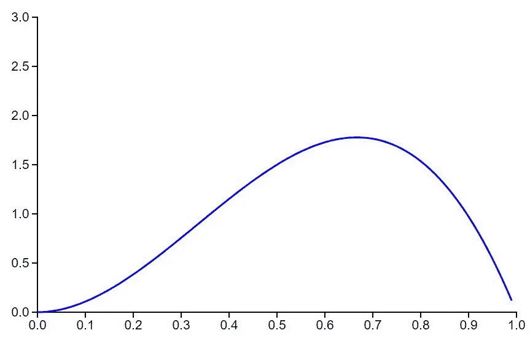
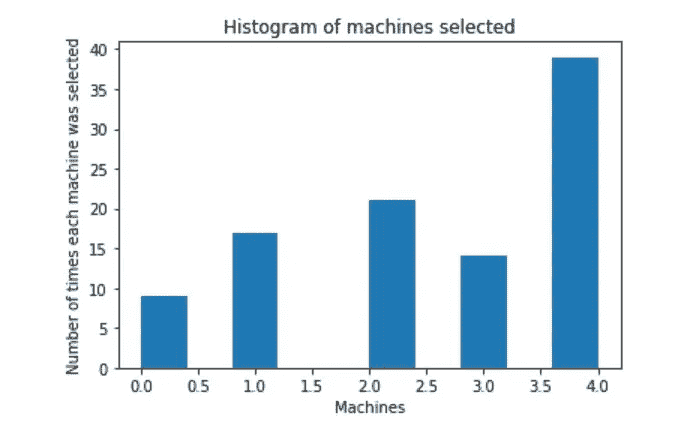
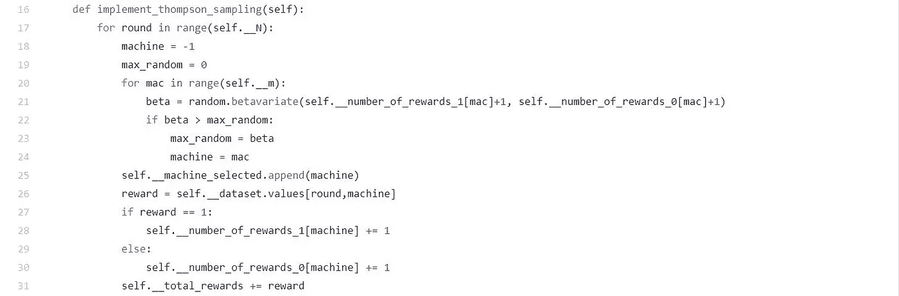

# 多臂土匪问题的 Thompson 抽样

> 原文：<https://medium.com/analytics-vidhya/thompson-sampling-for-multi-armed-bandit-problem-68e4d367a21e?source=collection_archive---------7----------------------->

在本文中，我们将了解汤普森采样，它的算法和实现。还会有一些关于汤普森采样算法中使用的贝塔分布的讨论。

## 坚果壳中的多臂土匪问题

多臂土匪问题是强化学习中的一个经典问题，其中一个赌徒走进赌场，在多个单臂吃角子老虎机上赌博。他最初尝试探索机器以找到最佳奖励给予机器，并且在一些初始回合之后，他利用给予最大奖励的机器。

来源:[https://www . 123 RF . com/photo _ 99072826 _ 股票-矢量-老虎机-独臂-土匪-游戏装置-轮盘赌-赌博-视频-游戏-矢量-插图-。html](https://www.123rf.com/photo_99072826_stock-vector-slot-machine-one-armed-bandit-game-device-roulette-gambling-video-games-vector-illustration-.html)

## 汤普森取样

Thompson 采样是一种随机化算法，最有效地用于解决这个经典的多臂土匪问题。它通过在其他机器中选择具有最佳采样均值(从 beta 分布生成)的机器来实现探索。随着赌博回合数的增加，贝塔分布越来越集中在经验平均值周围。

如果你不太明白，那么只要记住，基本的想法是根据机器成为最佳奖励机器的概率来选择机器。

如果你已经知道 Beta 发行版，你可以跳过这一部分。

## 贝塔分布

贝塔分布是根据θ**θ** 的
定义的连续分布，θ是两个参数 **a** 和 **b** 的函数。

数学上，
**P(θ | a，b) = (θ ^(a -1)) *((1 — θ)^(b-1)) / B( a，b )**

这里， **B(a，b)** 是归一化常数，它是 **a** 和 **b** 的β函数
。这个分母不是变量 **θ** 的函数。它只是确保概率分布整合为 1。

所以，我们可以说 **P(θ | a，b)****∝θ^(a-1)*(1-θ)^(b-1)**其中**θ****∈【0，1】**。

## 贝塔分布如何随参数 a 和 b 变化？

**情况 1** :当 *a = 0.5* 和 *b = 0.5* 时

*P(θ | a，b) = (θ ^(a -1)) *((1 — θ)^(b-1)) / B( a，b )* = > P(θ | 0.5，0.5)**∞**θ^(0.5–1)*(1-θ)
=>p(θ| 0.5，0.5)**∧**θ^(-0.5)*(1-θ)^(-0.5)
=

a = 0.5，b = 0.5

我们可以清楚地看到，对于θ = 0 或 1，贝塔分布趋向于∞(无穷大)。

**情况二**:当 *a = 0.5* 和 *b = 1* 时

*P(θ | a，b) = (θ ^(a -1)) *((1 — θ)^(b-1)) / B( a，b )* = > P(θ | 0.5，1)**∧**θ^(0.5–1)*(1-θ)^(1–1)
=>p(θ| 0.5，1)**∧**θ^(-0.5)* 1
=

a = 0.5，b = 1

我们可以清楚地看到，如果θ = 0，β分布趋于∞(无穷大),如果θ= 1，β分布与常数 1 成比例

**情况二**:当 *a = 1* 且 *b = 1* 时

*P(θ | a，b) = (θ ^(a -1)) *((1 — θ)^(b-1)) / B( a，b )* = > P(θ | 1，1)**∞**θ^(1–1)*(1-θ)
=>p(θ| 1，1)**∞**1 * 1
=>p(θ| 1，

a = 1，b = 1

我们可以清楚地看到，对于任何θ值，贝塔分布与常数 1 成正比。

**情况 4** :当 *a > 1* 、 *b > 1 且 a = b* 时

*P(θ | a，b) = (θ ^(a -1)) *((1 — θ)^(b-1)) / B( a，b )* 分布有最大值 0.5。即使我们进一步增加 a 和 b 甚至
，分布也更加指向 0.5。

a = 3，b = 3

**情况 5** :当 *a > 1* 、 *b > 1 和 a！= b*

*P(θ | a，b) = (θ ^(a -1)) *((1 — θ)^(b-1)) / B( a，b )* 我们不必同时增加 a 和 b .如果我们计算
Beta 分布的均值那么θ的期望值

e[θ]= a/(a+b)

所以，如果我们增加 b，那么分布会向左移动。如果我们增加 a，那么分布将向右移动。

a = 2，b = 3

a = 3，b = 2

## 汤普森采样算法

步骤 1:在每一轮 n，考虑每台机器 m 的两个数字
→nᵢ(n)——机器 m 到第 n 轮得到奖励 1 的次数
→nᵢ⁰(n)——机器 m 到第 n 轮得到奖励 0 的次数

第二步:对于每台机器 m，我们从下面的分布中随机抽取:
θᵢ(n) = β( Nᵢ (n) + 1，Nᵢ⁰(n) + 1)

步骤 3:选择θᵢ(n).最高的机器

## 求解多臂土匪问题的 Thompson 采样算法实现

假设一个娱乐场有 5 台吃角子老虎机，一个赌徒带着 100 个硬币来赌博并从机器中获得最大回报。

我使用了这个 [MultiArmedBandit.csv](https://drive.google.com/file/d/1fScH4hOaVBFmPAanGWQV87XFi1W0CruJ) 数据集和以下代码:

我得到了以下的视觉化图像:

机器 5 给出更高的回报

可以清楚地看到，如果游戏者将他的钱赌在机器 5 上，那么他将获得最大回报。

## 它到底是怎么发生的？

让我们一步步了解。在此之前，我希望你在另一个[选项卡](https://drive.google.com/file/d/1ADKfE1sulbIc0Y46CoiJOJvs8SSMr2ix/)中打开算法步骤。

1.  ***__init__* 方法:** 在这个方法中我们已经完成了算法的步骤 1，并定义了某些属性。
    *自我。__N* →总回合数
    *自身。__m* →机器总数
    *自身。_ _ machine _ selected*→100 台机器列表，每轮选择一台
    *self。__number_of_rewards_0* →机器 m 获得奖励 1 的次数到回合 n.
    *self。__number_of_rewards_1 →* 机器 m 获得奖励 1 的次数，直到回合 n。
2.  ***implement _ Thompson _ sampling*方法** :
    在这个方法中，我们实现了步骤 2 和步骤 3 的结合。

在第 21 行，β的值将在 0 和 1 之间生成。这是第二步。

在第 22 行，我们选择了 beta 值最高的机器，即步骤 3。

汤普森采样就是这样实现的。可以有多种方法来实现。如果你用另一种方法解决，请随意分享。

*参考文献:*

1.  [https://www . udemy . com/course/machine learning/learn/lecture/19875776 #问题](https://www.udemy.com/course/machinelearning/learn/lecture/19875776#questions)
2.  [http://eurekastatistics.com/beta-distribution-pdf-grapher/](http://eurekastatistics.com/beta-distribution-pdf-grapher/)
3.  [https://web.stanford.edu/~bvr/pubs/TS_Tutorial.pdf](https://web.stanford.edu/~bvr/pubs/TS_Tutorial.pdf)
4.  [https://www.youtube.com/watch?v=v1uUgTcInQk](https://www.youtube.com/watch?v=v1uUgTcInQk)