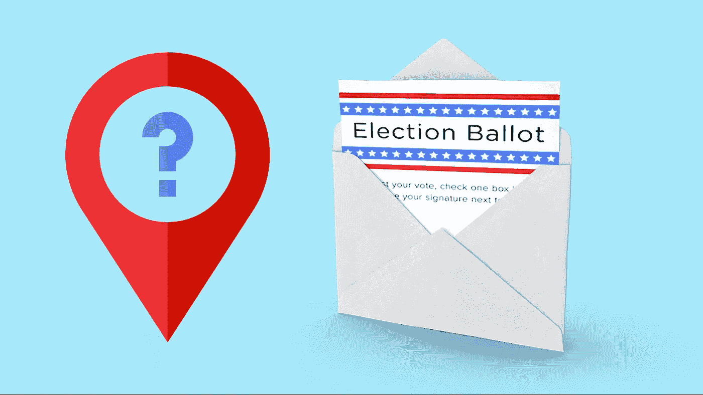

# 成千上万的美国邮政信箱被悄悄地移走了。🤫

> 原文：<https://medium.com/analytics-vidhya/thousands-of-usps-boxes-were-quietly-removed-455bde9807e8?source=collection_archive---------19----------------------->

## 确保你的投票被计算在内。

照片由[晨酿](https://unsplash.com/@morningbrew?utm_source=unsplash&utm_medium=referral&utm_content=creditCopyText)在 [Unsplash](https://unsplash.com/s/photos/vote?utm_source=unsplash&utm_medium=referral&utm_content=creditCopyText) 拍摄

80 [百万美国人将在今年 11 月尝试邮寄选票，但有些人可能找不到邮箱。](https://www.nytimes.com/interactive/2020/08/11/us/politics/vote-by-mail-us-states.html)

像拆除邮件分拣机和限制晚班的大胆措施引起了民主党人的强烈抗议。20 个州起诉特朗普，众议院正在投票表决…