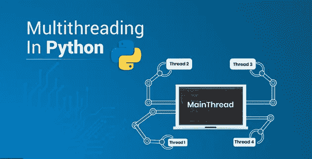
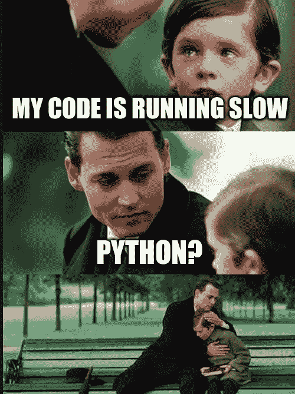
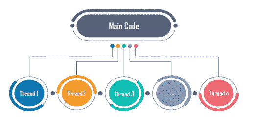
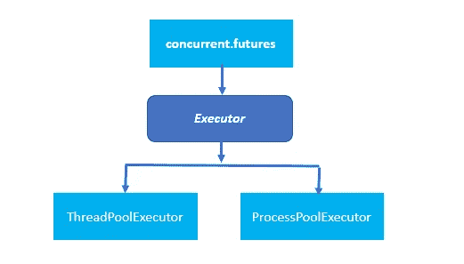

# Python 中的线程

> 原文：<https://medium.com/analytics-vidhya/threading-in-python-b3b9c060f28?source=collection_archive---------20----------------------->



所以在学习 python 的时候，你可能听说过 python 的一个主要缺点，那就是与其他编程语言相比，它有点慢。



由于 python 是单线程的，这意味着 Python 自然只会在单线程上运行。您可能已经发现 Python 需要很长时间才能找到解决方案，然而，您的处理器可能只有 5%的使用率，甚至更低。但这并不是我们要拯救的线程、多处理和 GPU 编程的全部。许多 python 库也起源于 C 和 C++。

**什么是线程？**



线程是一个独立的执行流。这意味着您的程序将同时运行多个进程。多个线程可以在一个 CPU 上同时执行，因为所有线程共享内存，从而降低了资源消耗。

在适当的环境下，为应用程序添加线程有助于显著提高应用程序的速度。通过使用多线程，我们可以加速面临输入/输出瓶颈的应用程序，一个很好的例子就是网络爬虫。

在 python 中，线程模块为在程序中生成多线程提供了一个非常简单直观的 API。

## 让我们创建一个线程:)

python 中线程的实现

我们也可以通过使用一个 **ThreadPoolExecutor** 将多个线程组合在一起，它在标准库`concurrent.futures`中可用



# **Python 中的线程对象:**

## 1.信号量:

信号量是具有一些特殊属性的计数器，这里的计数是原子性的，这意味着操作系统不会在递增或递减计数器的过程中换出线程。

另一个重要的属性是如果一个线程调用。当计数器为零时，该线程将阻塞，直到另一个线程调用。释放()并将计数器加 1。

信号量经常用于保护容量有限的资源。

**2。定时器:**

一个穿线。Timer()是一种安排函数在一定时间后被调用的方法。您可以通过传入等待的秒数和要调用的函数来创建计时器:

```
t = threading.Timer(25.0, function1)
```

你可以通过呼叫`.start()`来启动`Timer`。该函数将在指定时间后的某个时刻在新线程上被调用。如果你想停止已经开始的`Timer`，你可以通过调用`.cancel()`来取消它。在`Timer`触发后调用`.cancel()`不会做任何事情，也不会产生异常。

**3。障碍:**

一个`threading.Barrier` 用于保持固定数量的线程同步。当创建一个`Barrier`时，调用者必须指定将在其上同步的线程数量。每个线程在`Barrier`上调用`.wait()`。它们都将保持阻塞状态，直到指定数量的线程正在等待，然后所有线程同时被释放。

# 赞成和反对的时间到了:

1.  线程为 I/O 绑定的程序提供了更快的执行时间。
2.  所有线程共享内存，从而提高资源利用率。
3.  对于繁重的计算任务，线程不应该是首选。
4.  线程增加了代码的复杂性，使调试变得困难。
5.  如果其中一个线程在进程中挂起，就会导致整个进程崩溃。

在 [Github](https://github.com/Mishra-raja) 上关注我，因为我一直在贡献开源并帮助社区，在那里我学到了很多。

请在 Linkedin 上关注我，了解更多精彩内容:-

[](https://www.linkedin.com/in/rajamishraa/) [## Raja Mishra - Python 开发者- HiPaaS Inc. | LinkedIn

### 查看拉贾·米什拉在全球最大的职业社区 LinkedIn 上的个人资料。Raja 有 4 份工作列在他们的…

www.linkedin.com](https://www.linkedin.com/in/rajamishraa/) 

如果你喜欢这个博客，请鼓掌。关注更多精彩内容:)