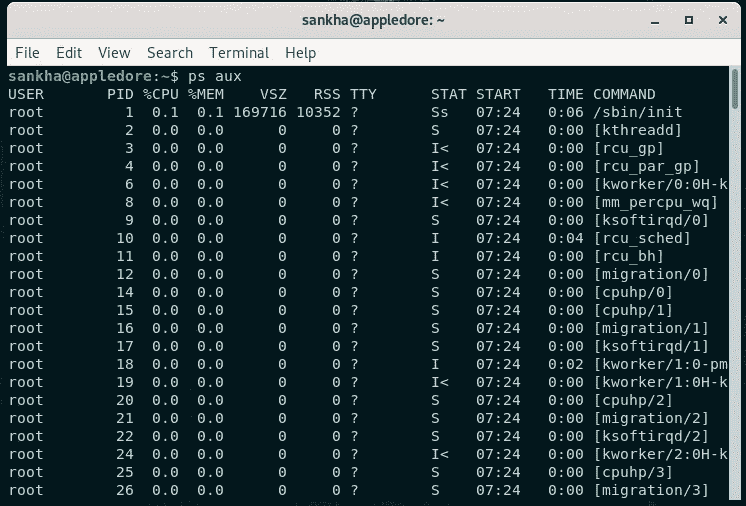
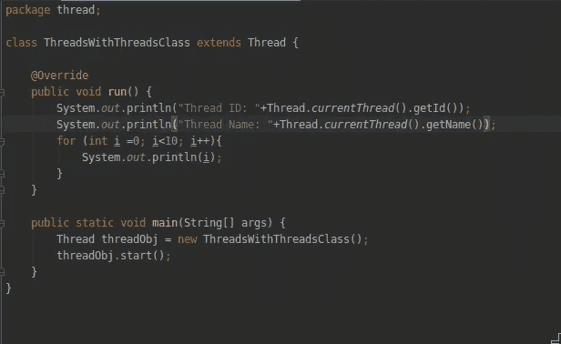
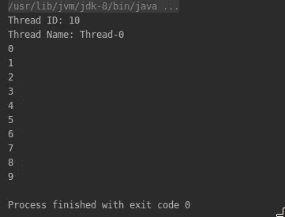
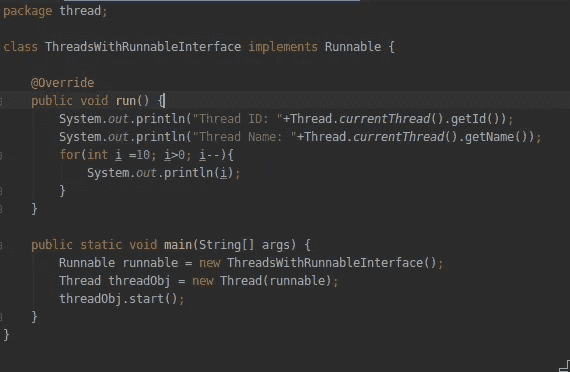
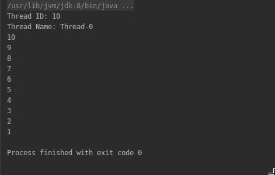
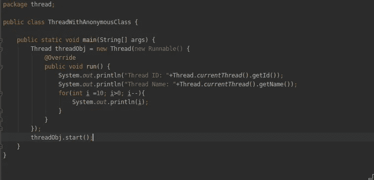
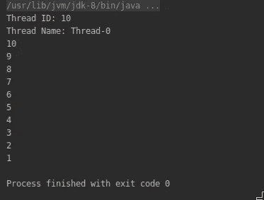

# 什么是 Java 中的线程

> 原文：<https://medium.com/analytics-vidhya/threads-in-java-b4e09f282c6c?source=collection_archive---------28----------------------->

基本答案是线程是程序中的一个执行序列。但是让我们做一些基础工作。

## 什么是过程？

流程是怎样的？它是一组在处理器中运行的指令，有自己的地址空间。简单地说，它是你机器上正在运行的程序。最常见的例子就是你用来阅读这篇文章的浏览器。在 Linux 中，我们可以通过命令“ps aux”获得活动进程的列表，而在 windows 中，我们可以使用任务管理器来查看它们。

Linux 终端中的进程列表

## 什么是线程？

没有流程，我们就无法理解线程。线程存在于进程中。线程是程序中执行的单一路径。每个进程至少有一个线程，它被称为主线程。主线程可以在进程中创建其他线程。进程有自己的地址空间，调用栈和线程共享进程的地址空间。但是每个线程都有自己的调用堆栈。基于 web 浏览器的例子。当我们在网络浏览器中打开一个新标签页时，我们所做的是创建一个新主题。

## 在 java 程序中创建线程。

在 java 中有两种创建多线程的方法

1.  从线程类子类化。
2.  使用 java 接口— Runnable。

## 使用线程类。

我们可以创建一个类，并使其成为 Thread 类的子类，然后覆盖 run 方法。在 run 方法内部，我们必须编写需要在新线程内部执行的代码。一旦线程被创建，我们就可以通过 start 方法来执行它。

使用 thread 类创建新线程的 Java 代码。

输出

## 使用 Runnable 接口。

runnable 接口是一个模板，用于实现它们的类，以创建由线程执行的实例。它只有一个方法运行(如在 Thread 类中)，我们必须覆盖它，包括需要由新线程执行的代码。

我们可以创建一个新的线程，首先通过 Runnable 接口实现我们的类，然后创建该类的一个对象。我们必须将它传递给*线程(可运行目标)*构造器*。*

使用 Runnable 接口创建新线程的 Java 代码。

输出

但是要创建一个单独的线程，我们不必使用这段冗长的代码。有一个更简单的方法。为此，我们可以使用匿名类。在匿名类中，我们首先指定对象，然后实现它。所以这里我们不需要在外面额外创建一个类。我们可以通过匿名类(没有名字的 java 类)来实现。

使用匿名类创建新线程的 Java 代码。

输出

## 为什么在 java 中使用线程？

线程允许我们在程序中实现并行。简单来说，线程有助于同时做多件事情。而且它也使应用程序更快。使用线程还有其他几个主要原因。

1.  与进程相比，线程是轻量级的
2.  两个线程之间的相互通信比两个进程之间的开销要小。
3.  让用户界面反应更快。
4.  更容易取消某些任务，因为它们是自己运行的。
5.  充分利用 CPU 的能力。

使用线程还有很多其他的好处。但是多线程也有一些问题，比如死锁、活锁、饥饿等。