# 学习贝叶斯定理的三个步骤

> 原文：<https://medium.com/analytics-vidhya/three-steps-to-learn-bayes-theorem-97d11b6b72d4?source=collection_archive---------0----------------------->

当我从计算机科学的背景开始进入机器学习领域时，我总是需要一段时间来掌握统计概念并回忆我在学校期间所学的知识。但是，我也得出一个结论，我的基础越清晰，我就越容易理解面前的问题。

在通往[机器学习](https://courses.analyticsvidhya.com/courses/applied-machine-learning-beginner-to-professional?utm_source=medium&utm_medium=ThreeStepsToLearnBayesTheorem)的道路上，有一些极其重要的里程碑，人们必须达到这些里程碑才能加速自己的旅程。一个这样的里程碑是概率和条件概率。在本文中，我们将快速浏览概率的基础知识，继续学习条件概率，最后讨论贝叶斯定理。我们还将看一些例子来研究贝叶斯定理的应用。

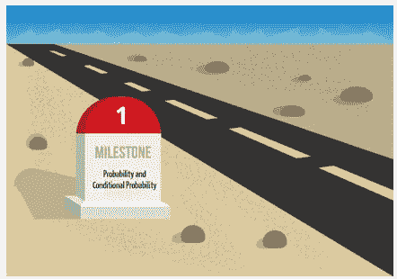

# 第一步:概率

让我们回忆一下一些基本的概率。例如，我们面前有一个盒子，盒子 A。它有 6 块粉笔和 5 块奶酪。

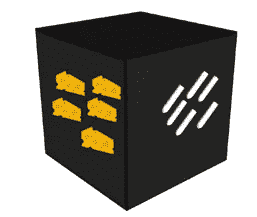

我选择粉笔的概率= *粉笔总数/物体总数= 6/11*

因此， *P(粉笔)= 6/11* 。同样， *P(奶酪)= 5/11*

让我们试着在有条件的情况下从盒子里再抽出一件物品。

如果我已经选择了粉笔，我从盒子里选择奶酪的概率是多少？我可以用上面的公式来计算这个吗？号码

这就是条件概率的用武之地。

# 第二步:条件概率

以上面的例子为例，我们可以把问题分成两部分。

1.第一部分:如果我已经选择了粉笔

2.第二部分:我选择奶酪的概率。

因此，第一部分是条件，第二部分是概率。这叫做条件概率。

批注: *P(选择奶酪|鉴于我已经选择了粉笔)*。

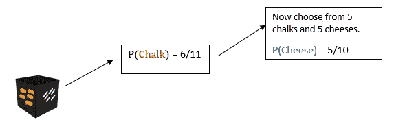

因此，根据乘法法则，

P(选择奶酪|假设我已经选择了一支粉笔)= 5/10

让我们进一步扩展这个问题。按照那个顺序选择粉笔和奶酪的概率有多大？

*P(粉笔和奶酪)= P(粉笔)* P(奶酪|粉笔)= 6/11 * 5/10 = 6/22*

如果你还记得，这是两个相互依赖的事件 A 和 B 的乘法法则

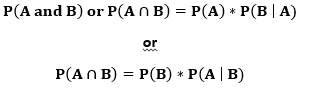

现在让我们试着用粉笔和奶酪的例子来推导条件概率的公式。

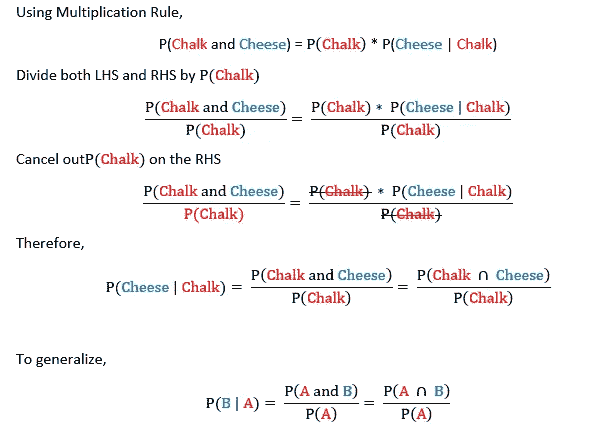

我们现在已经推导出了条件概率的公式。

让我们再举一个例子，增加另一个盒子 B，和盒子 a 有同样数量的粉笔和奶酪。

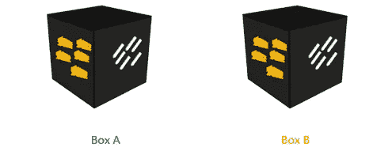

现在我们有两个盒子，我选择了一支粉笔，我从盒子 B 中选择这支粉笔的概率是多少？

这个答案可以通过一个叫做贝叶斯定理的定理得到。

# 第三步:贝叶斯定理

**第一部分**

以上述问题为例，让我们计算更多的概率。

1. *P(框 A) = 1/2*

2. *P(方框 B) = 1/2*

3. *P(粉笔|方框 A) = P(来自方框 A 的粉笔)* P(方框 A) = 5/11 * 1/2 = 5/22*

同样的，

4. *P(粉笔|方框 B) = P(来自方框 B 的粉笔)* P(方框 B) = 5/11 * 1/2 = 5/22*

接下来，让我们制作一个表格来组织我们所知道的内容:

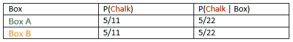

**第二部分**

回到我们的问题:如果我们有两个盒子，我选择一支粉笔，我从盒子 B 中选择这支粉笔的概率是多少？

为了简化这个问题陈述，假设我选择了粉笔，我必须计算盒子是盒子 B 的概率。根据我们对条件概率的符号，这是 *P(方框 B |粉笔)*

根据我们的条件概率公式，

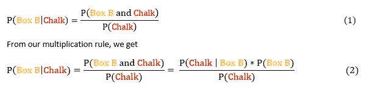

**第三部分**

我们如何得到 *P(粉笔)*？我们可以用两种方式选择粉笔。我们选择的对象可能是(盒子 A 中的粉笔)或(盒子 B 中的粉笔)。

因此，

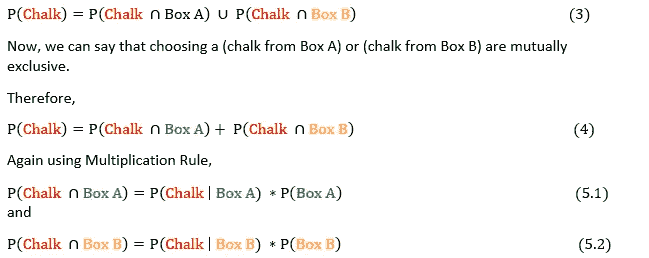

在(2)的分母中插入(5.1)和(5.2)的值，

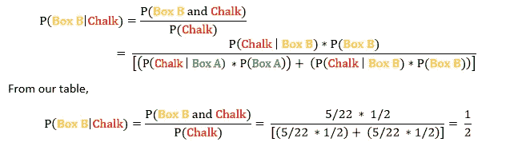

同样，我们也可以发现以下事情:

1.如果我选择一支粉笔，来自盒子 A 的概率是多少？

2.如果我在选择一种奶酪，那么来自盒子 A 的概率是多少？

3.如果我在选择一种奶酪，来自盒子 B 的概率是多少？

试试吧！

如果我们观察上面得到的表格和答案，我们可以看到我们已经知道了 *P(粉笔|方框 B)* 并且我们计算了 *P(方框 B |粉笔)。本质上，我们颠倒了我们所知道的和我们想要发现的。*

来自第一列的概率，给出了来自框 A 的 *P(粉笔)*和来自框 B 的 *P(粉笔)*被称为**先验概率**，因为我们已经预先知道/计算了它们。我们计算的概率，如 *P(Box B | Chalk)* 被称为**后验概率**，因为我们是在获得更多信息后计算的。

让我们试着从上面的计算中得到一个通用公式。

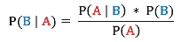

更多关于他的信息可以在这里找到:[https://en.wikipedia.org/wiki/Thomas_Bayes](https://en.wikipedia.org/wiki/Thomas_Bayes)

这个定理对于大量更高级的定理来说是极其重要的，并且被用于最广泛使用的分类技术之一，称为朴素贝叶斯分类。

这个定理以及我们得到的先验和后验概率被用来将它们扩展到一个假设和证据类型的模型。这就是所谓的贝叶斯推断。这个定理也启发了一种叫做贝叶斯统计的统计哲学。

因此，我们看到了学习贝叶斯定理的三个步骤。在下一部分中，我们将采用一个数据集，并应用上述定理和条件概率在实践中观察它。

感谢阅读！