# 数据科学中三件重要的事情——什么？怎么会？为什么？

> 原文：<https://medium.com/analytics-vidhya/three-things-that-matter-in-data-science-what-how-why-614bdccdfd8a?source=collection_archive---------31----------------------->

在我之前的文章([https://medium . com/@ Deepak sekar _ 67405/Data-Science-mystery-how-to-move-from-Death-in-Dev-to-Prove-in-Prod-9b 17 DD 554 BF 3](/@deepaksekar_67405/data-science-mystery-how-to-move-from-death-in-dev-to-prove-in-prod-9b17dd554bf3))中，我讨论了数据科学的生命周期、企业需求以及从“在开发中死亡”到“在生产中证明”的转变。

在本文中，我们将看到数据科学过程中最重要的三件事。


1.  什么—业务需求是什么？数据来源和特点是什么？结局如何？
2.  如何——如何建立模型？模型有多好？需要多长时间？
3.  为什么——为什么这个模型会预测到这样的结果？

我们将通过一个简单的用例来理解为什么？

> 注意:基础 Python，数据科学知识预期！


# 什么？

X 公司服务于一个庞大的客户群，最近面临着不断增加的流失率(客户迁出的比率)。因此，首席信息官要求数据科学负责人创建一个客户流失预测模型，并为现有客户创建一个风险概况。


目标只是一个变量，它表明客户是“有风险”还是“没有风险”

然后，数据科学主管与数据所有者/业务人员互动，以了解数据和来源的分布情况。X 公司在 Oracle 的自治数据库中拥有所有相关数据。


# 怎么会？

数据科学负责人提出了一个计划！

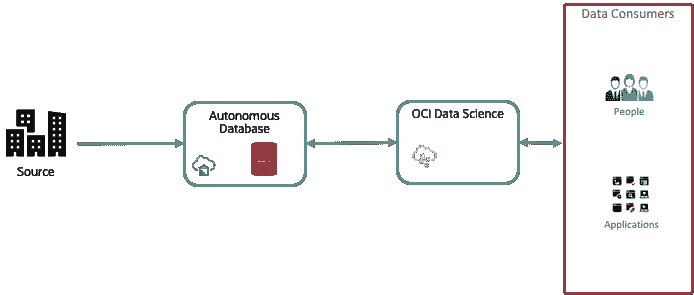

*   *自治数据库—【https://www.oracle.com/au/database/autonomous-database.htm l
*   *甲骨文云基础设施数据科学平台—[https://www . Oracle . com/Data-Science/Cloud-infra structure-Data-Science-product . html](https://www.oracle.com/data-science/cloud-infrastructure-data-science-product.html)

1.  ***只需点击两下，即可在 Oracle Cloud 中设置数据科学环境！***

a.启动一个数据科学实例并创建一个项目

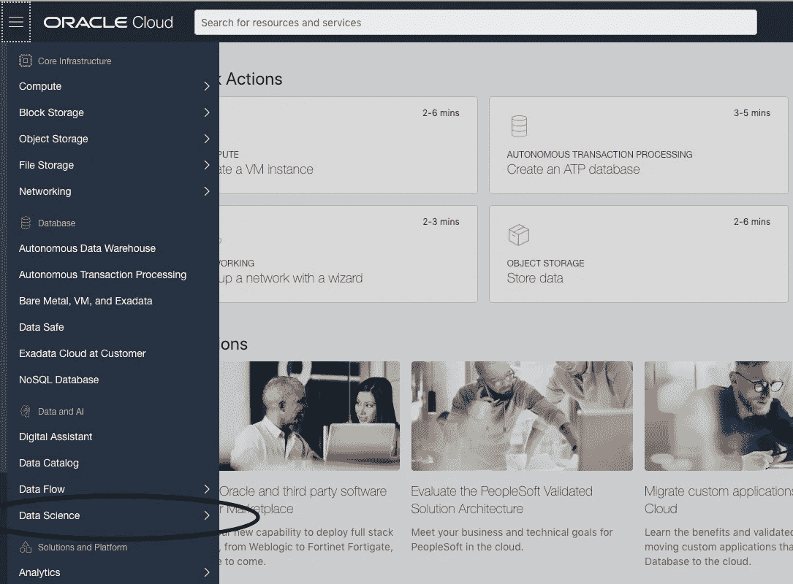

b.创建一个 Jupyterlab 笔记本会话并选择所需的基础架构。

(我将在专用子网内使用一个具有 100 GB 块存储的英特尔至强 2 OCPU 虚拟机(每个 OCPU 包括完整的处理器内核以及超线程单元)

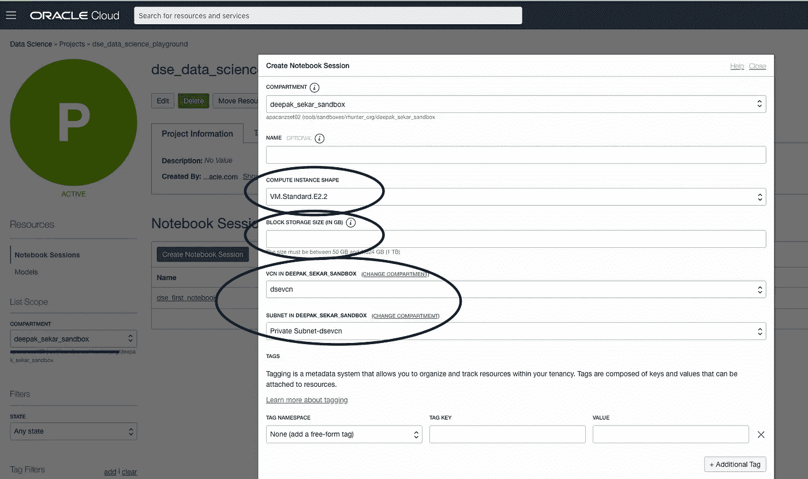

它就在那里——随时可以使用！

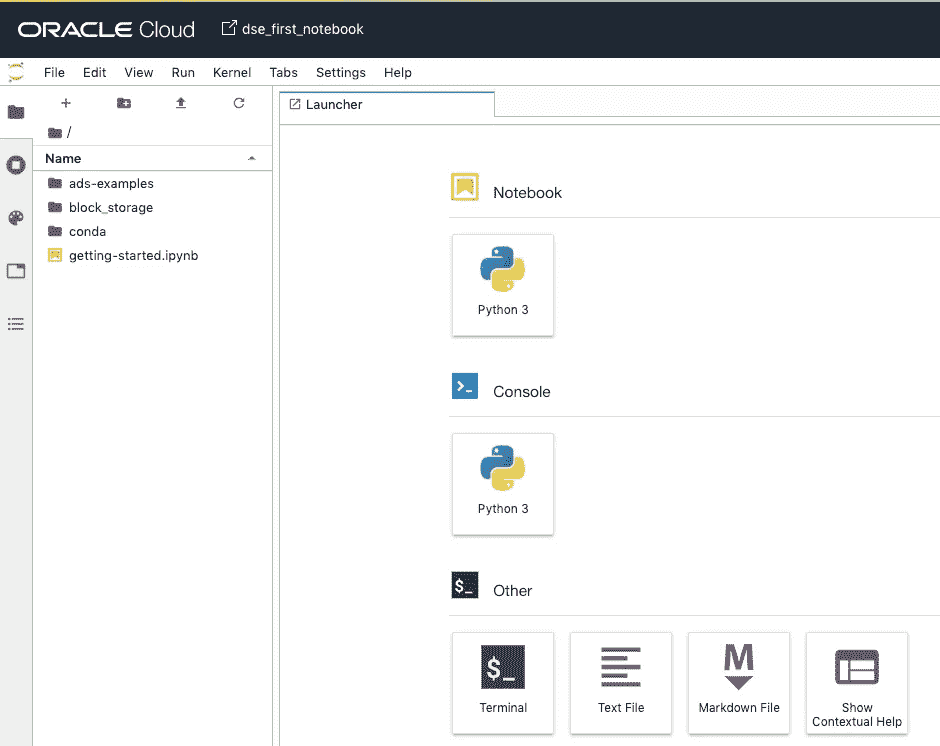

***2。在 JupyterLab 笔记本中连接到云中的 Oracle 自治数据仓库(ADW)(您将需要本地存储的 ADW 数据库钱包进行身份验证)***

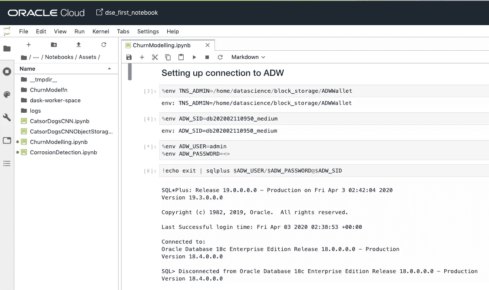

```
**%**env TNS_ADMIN**=/**home**/**datascience**/**block_storage**/**ADWWallet
**%**env ADW_SID**=**<>
**%**env ADW_USER**=**<>
**%**env ADW_PASSWORD**=<>
!**echo exit **|** sqlplus $ADW_USER**/**$ADW_PASSWORD**@**$ADW_SID
```

***3。从 ADW*** 表中加载数据

使用 [Dask](https://dask.org/) ,您可以分析计算图形，还可以可视化分析器输出。JupyterLab 的散景扩展允许你在你的笔记本上渲染可视化效果。ADS 为您提供了一个装饰器，它利用 Dask profiler 来帮助您可视化所支持操作的 CPU 和内存利用率。

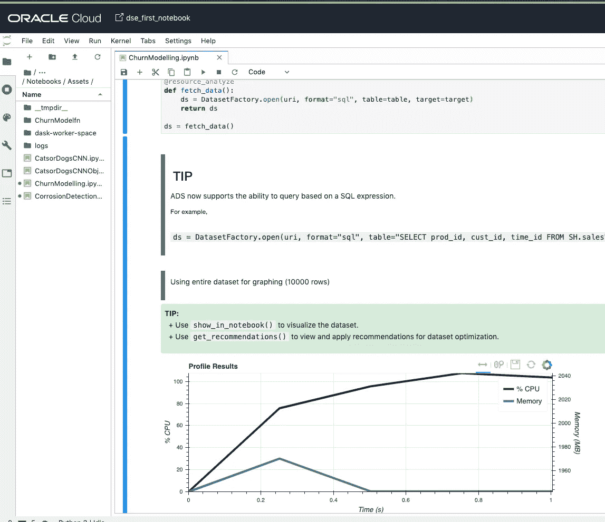

```
**from** ads.common.analyzer **import** resource_analyze
**from** ads.dataset.factory **import** DatasetFactory@resource_analyze
**def** fetch_data():
ds **=** DatasetFactory.open(uri, format**=**"sql", table**=**table, target**=**target)
**return** dsds **=** fetch_data()
```

一件很酷的事情是，您可以在加载数据时指定目标变量！

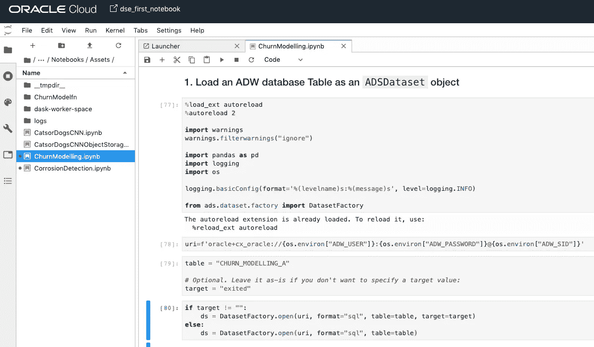

```
**%**load_ext autoreload
**%**autoreload 2
**import** warnings
warnings.filterwarnings("ignore")
**import** pandas **as** pd
**import** logging
**import** oslogging.basicConfig(format**=**'%(levelname)s:%(message)s', level**=**logging.INFO)**from** ads.dataset.factory **import** DatasetFactoryuri**=**f'oracle+cx_oracle://{os.environ["ADW_USER"]}:{os.environ["ADW_PASSWORD"]}@{os.environ["ADW_SID"]}'
table = "<>"# Optional. Leave it as-is if you don't want to specify a target value:  
target = "<>"
if target != "":
    ds = DatasetFactory.open(uri, format="sql", table=table, target=target)
else: 
    ds = DatasetFactory.open(uri, format="sql", table=table)
```

**4*。*了解数据**

使用 DatasetFactory 中的一种方法“show_in_notebook()”可以给出数据概要、特征权重和相关性摘要。

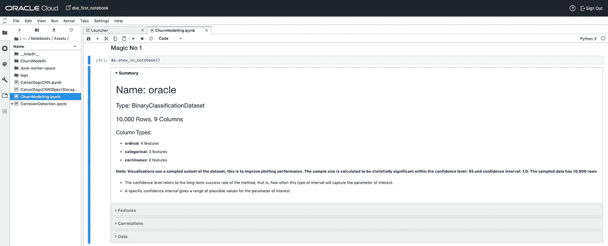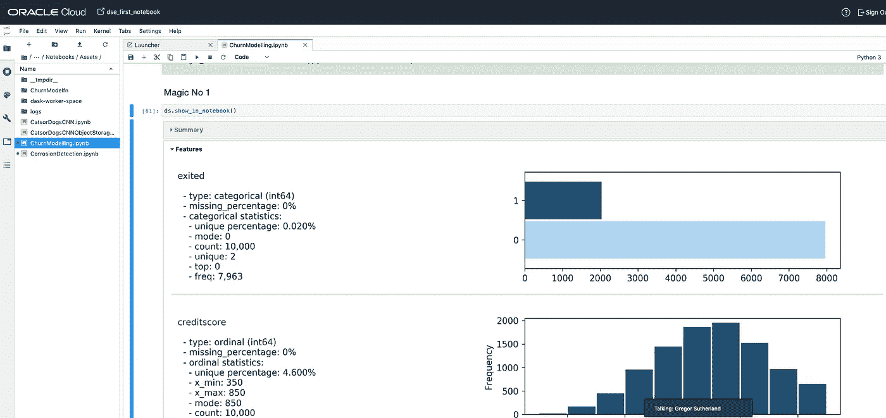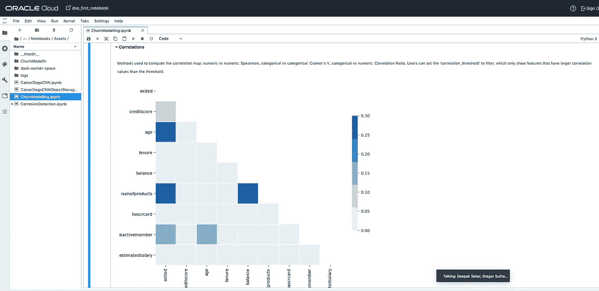

***5。准备数据***

使用 DatasetFactory 中的方法“get_recommendations()”建议进行数据转换

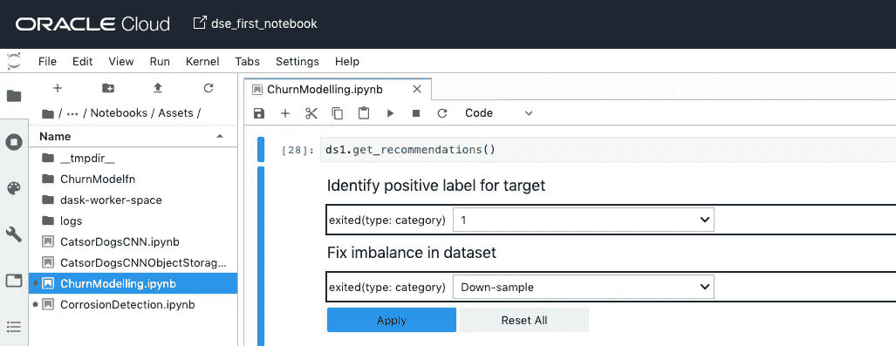

***6。模型构建***

***a .构建用于二分类的自定义 SVM (RBF 核)模型***

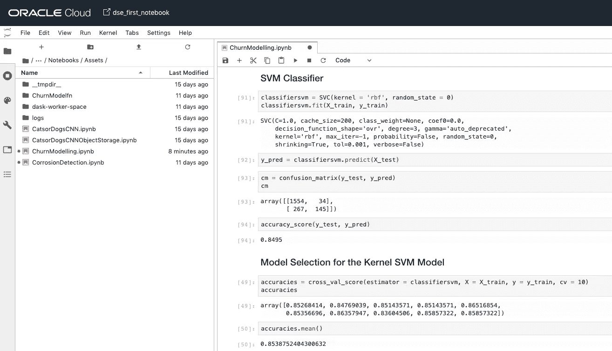

```
*# Importing the libraries***import** numpy **as** np
**import** matplotlib.pyplot **as** plt
**import** pandas **as** pdfrom sklearn.preprocessing import StandardScaler
from sklearn.svm import SVC
from sklearn.metrics import *
from sklearn.model_selection import cross_val_score
from sklearn.model_selection import train_test_split*# Converting ADS Dataset object to Pandas Dataframe* dataset **=** ds.to_pandas_dataframe()
X **=** dataset.iloc[:,0:7].values
y **=** dataset.iloc[:,8].values# Splitting the dataset into the Training set and Test set
X_train, X_test, y_train, y_test = train_test_split(X, y, test_size = 0.2, random_state = 0)# Feature Scaling
sc = StandardScaler()
X_train = sc.fit_transform(X_train)
X_test = sc.transform(X_test)#SVM Classifier
classifiersvm = SVC(kernel = 'rbf', random_state = 0)
classifiersvm.fit(X_train, y_train)
y_pred = classifiersvm.predict(X_test)#Confusion Matrix
cm = confusion_matrix(y_test, y_pred)
cm
accuracy_score(y_test, y_pred)#K-fold Cross Validation
accuracies = cross_val_score(estimator = classifiersvm, X = X_train, y = y_train, cv = 10)
accuracies
```

***b .利用 ADS Auto ML 建立预测模型***


这很容易，我们已经在加载数据时指定了目标变量。AutoML 可以接受许多参数，如时间限制、最小特性、算法列表、强制特性..等等。

```
**from** ads.automl.driver **import** AutoML
**from** ads.automl.provider **import** OracleAutoMLProvider
train, test **=** ds.train_test_split()
model, baseline **=** AutoML(train, provider**=** OracleAutoMLProvider()).train(model_list**=**["LGBMClassifier", "RandomForestClassifier"])
```

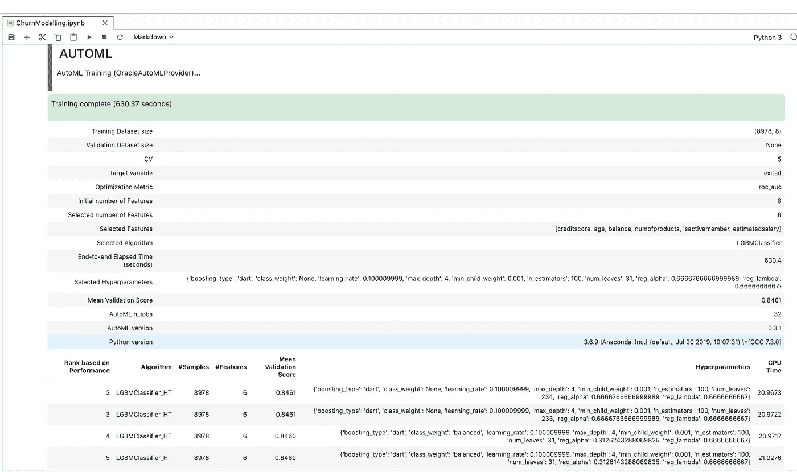

您可以使用“automl.visualize_tuning_trials()”可视化 automl 超参数调整轨迹！

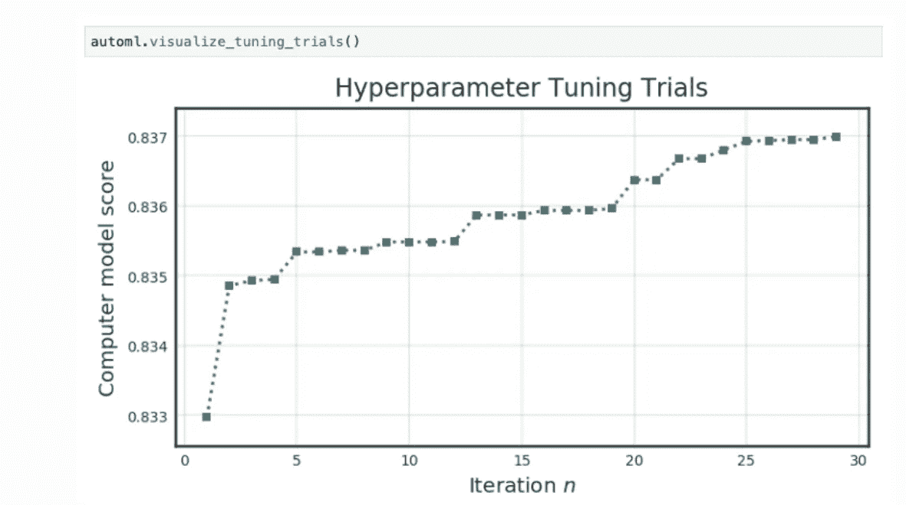

AutoML 构建的输出为我们提供了性能最佳的算法，以及经过调优的超参数的特性和细节。

因此，使用 AutoML 将定制模型构建的 6 阶段过程简化为 2 阶段过程。

7。评估模型

评估可以帮助机器学习开发者:

*   *跨多个行业标准指标快速比较模型。*

*例如，我的二元分类模型的准确度和 F1 值是多少？*

*   *发现模型在未来模型开发中缺乏反馈的地方。*

*例如，虽然准确度高，但精度低，这就是我关心的例子失败的原因。*

*   *增加对各种模型类型的权衡的理解。*

评估可以帮助机器学习算法的最终用户:

*   *从视觉上和数字上理解模型在哪些地方表现良好，在哪些地方可能失败。*

*例如，模型 A 在天气晴朗时表现良好，但在恶劣条件下则更加不确定。*

ADS 评估类有三种风格:二元分类、多类分类和回归。

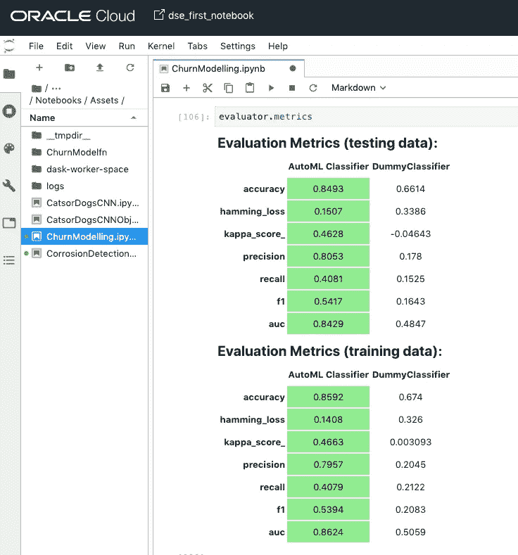

```
**from** ads.evaluations.evaluator **import** ADSEvaluator
**from** ads.common.data **import** MLData
evaluator **=** ADSEvaluator(test, models**=**[model, baseline], training_data**=**train)evaluator.metrics
```

“evaluator.show_in_notebook()”产生 PR 曲线、ROC 曲线、提升图、增益图、混淆矩阵。

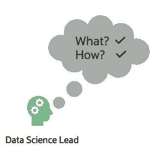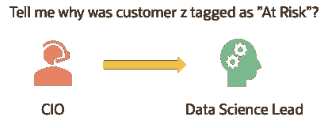

# 为什么？

机器学习可解释性(MLX)是解释和诠释机器学习和深度学习模型的过程。

一些对 MLX 有用的术语:

*   **可解释性**:解释机器学习模型预测背后原因的能力。
*   **可解释性**:人类能够理解解释的程度。
*   **全局解释**:从整体上理解机器学习模型的一般行为。
*   **局部解释**:理解机器学习模型为什么会做出特定的预测。
*   **模型不可知的解释**:解释将机器学习模型(和特征预处理)视为黑盒，而不是使用模型的属性来指导解释。

ADS 解释模块提供可解释的、与模型无关的、本地/全球的解释。

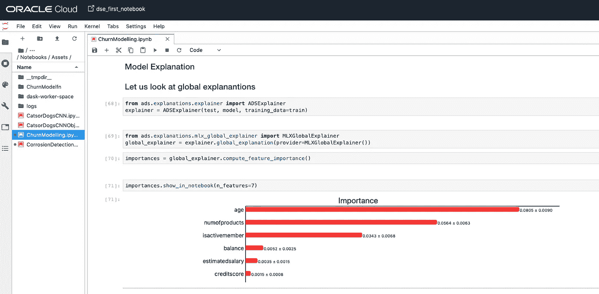

但是，由于 CIO 在测试集中对特定的客户进行了详细说明，所以我们需要当地的解释。“sample=31 客户 z 在这里吗”

局部“年龄”影响了预测结果。

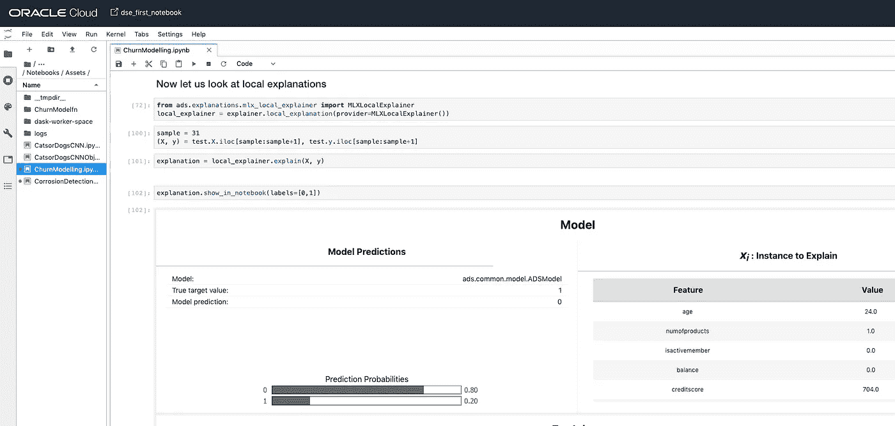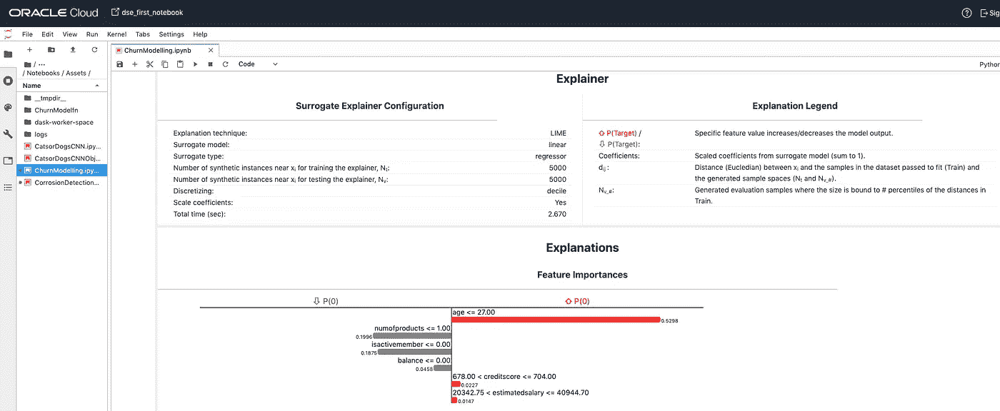

```
**from** ads.explanations.explainer **import** ADSExplainer
explainer **=** ADSExplainer(test, model, training_data**=**train)
**from** ads.explanations.mlx_global_explainer **import** MLXGlobalExplainer
global_explainer **=** explainer.global_explanation(provider**=**MLXGlobalExplainer())
importances **=** global_explainer.compute_feature_importance()
importances.show_in_notebook(n_features**=**7)**from** ads.explanations.mlx_local_explainer **import** MLXLocalExplainer
local_explainer **=** explainer.local_explanation(provider**=**MLXLocalExplainer())
sample **=** 31
(X, y) **=** test.X.iloc[sample:sample], test.y.iloc[sample:sample]
explanation **=** local_explainer.explain(X, y)
explanation.show_in_notebook(labels**=**[0,1])
```

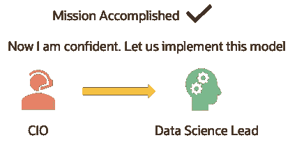

我希望这很有趣——如果是的话，那么我的任务就完成了！

欢迎来到数据科学的世界！

如果你喜欢这篇文章，请不要忘记鼓掌:)

所表达的观点仅代表作者的观点，不一定代表甲骨文的观点。联系[迪帕克·塞卡尔](https://medium.com/u/73b0ba580367?source=post_page-----9b17dd554bf3----------------------)

**附加资源**

 [## 概述— ADS 1.0.0 文档

### Oracle 加速数据科学(ADS) SDK 是一个 Python 库，是 Oracle 云的一部分…

docs.cloud.oracle.com](https://docs.cloud.oracle.com/en-us/iaas/tools/ads-sdk/latest/user_guide/overview/overview.html)  [## 面向数据科学的云基础架构| Oracle

### 未找到结果您的搜索没有匹配任何结果。我们建议您尝试以下方法来帮助找到您想要的…

www.oracle.com](https://www.oracle.com/data-science/cloud-infrastructure-data-science-product.html)  [## 数据科学

### Oracle Data Science 是数据科学家在 Oracle 云基础架构上构建、培训和管理模型的平台…

docs.cloud.oracle.com](https://docs.cloud.oracle.com/en-us/iaas/data-science/using/data-science.htm)