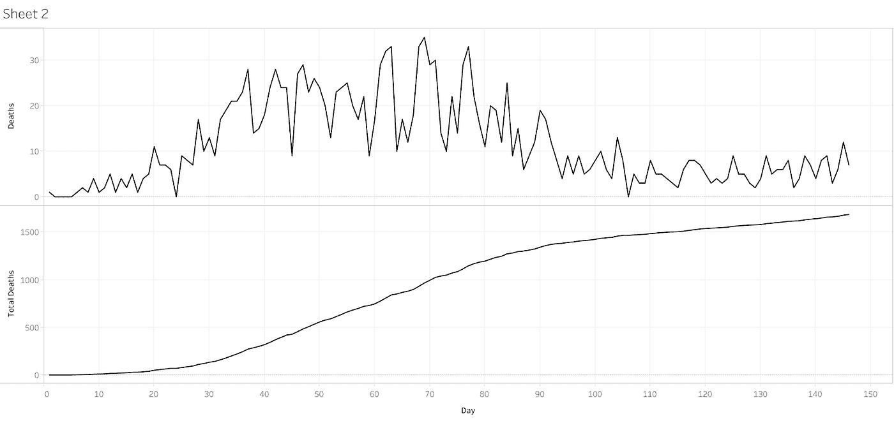
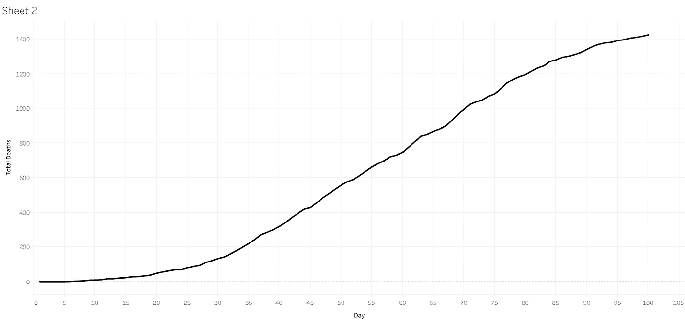
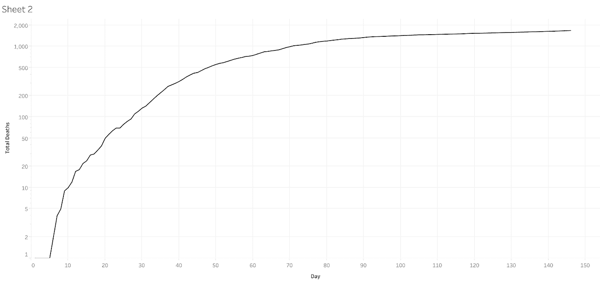
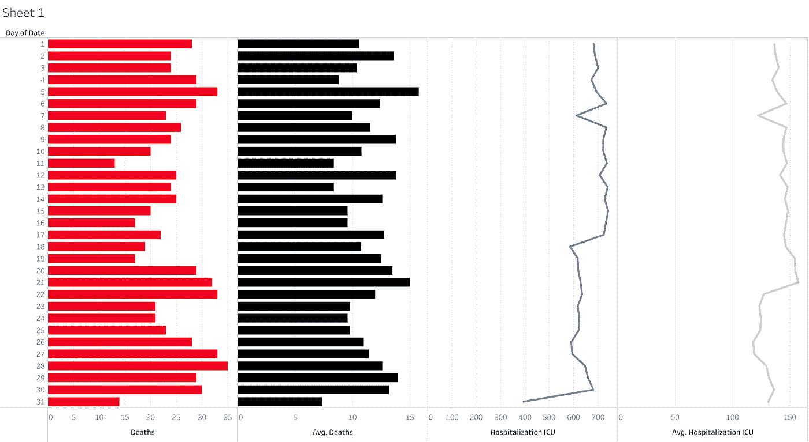

# 统计数据欺骗你的三种方式

> 原文：<https://medium.com/analytics-vidhya/three-ways-statistics-are-lying-to-you-3e015b8815ee?source=collection_archive---------28----------------------->

马克·吐温曾经说过*“事实是顽固的东西，但统计数字是柔韧的。”*

在统计学中，真理存在于分析中，而且这一真理是流动的，因为有许多技术可以用来切割和绘制信息！但是并不是所有的调查都是平等的。统计研究为分析师提供了大量绘制数据图的机会，偶尔还会歪曲数据。随着社交媒体上的所有信息和每分钟的新闻，识别欺诈或无能的诡计是至关重要的。

例如，这是疫情前 150 天明尼苏达州冠状病毒死亡的图表，使用的是明尼苏达州[卫生部](https://www.health.state.mn.us/diseases/coronavirus/situation.html#hosp1)提供的数据。上面的图表统计了每天的死亡人数。下图汇总了疫情前 150 天的所有冠状病毒死亡病例。

明尼苏达冠状病毒死亡

乍一看，冠状病毒死亡的统计数据只是随机的和逐渐减弱的噪音。然而，随着时间的推移，这些数据清楚地显示出一条平坦的曲线。然而，有如此多的选项可用于旋转或绘制数据。

1.  **样本偏差**

冠状病毒死亡的样本偏倚

旋转数据的第一个选项是[采样](https://thenextweb.com/contributors/2018/10/27/4-human-caused-biases-machine-learning/)偏置。这种偏见的存在是因为研究者挑选信息来支持半真半假。在这个例子中，我已经排除了 50 天的死亡数据。《每日新闻》最近查阅了《纽约时报》,发现它没有将纽约列入冠状病毒新增阳性病例增长的图表中。但并非所有的偏见都是半真半假的结果。例如，新闻电台偶尔喜欢就各种话题对观众进行民意调查。然而，这些民意调查往往是有缺陷的，因为它们是观众的自愿反应。调查结果可能会因报道不足甚至问题中的措辞选择而进一步失真。

**2。错误的比例**

日志中错误的死亡比例

比例偏差是半真半假研究者的另一个工具。这种偏差是通过简单地重新调整图表来实现的。在这幅图中，我把左边轴上早先的线性刻度改成了一个更加惊人的对数刻度。通过左轴标度的不言而喻的非零开始，欺骗仍然是明显的。新闻机构可以使用这种方法来掩盖显而易见的真相，因为他们知道他们的观众很少阅读这些尺度，或者他们可以完全排除这些尺度。

在金融市场中，对数标度仍然被合法地用于表示百分比。对数标度很有吸引力，因为分析师可以方便地表示股票或商品价格的 100%的上涨或下跌。

**3。统计不相关**

死亡的统计非相关性

在统计学的研究中，研究人员的任务是证明变量 X 与变量 Y 相关联。变量 Y 应该随着变量 X 的增加而增加，或者随着变量 X 的增加而减少。同样，变量 Y 可以随着变量 X 的增加而减少。还有一种可能性是，变量 X 和 Y 取决于第三个变量 z。例如，X 和 Y 可以是取决于燃烧速率 z 的热和压力。最后一种选择是变量完全不相关。

在上面的图表中，明尼苏达州每天冠状病毒死亡人数显示在左侧，紧挨着中右侧的重症监护病房(ICU)住院治疗。同样，为了清楚起见，中间左侧的平均死亡人数与右侧的 ICU 住院平均人数进行了比较。从表面上看，ICU 住院治疗可能与冠状病毒死亡相关，对于未经训练的观察者来说，它们是相关的。这是一种虚假的关联。

统计学的问题在于，它是几个世纪以来为了寻找信息的相关性而精心制作的；有时这种关联是虚构的。除了错误的相关性，数学家还必须与辛普森悖论的假象作斗争。 [Simpson 的](https://www.kdnuggets.com/2017/12/4-common-data-fallacies.html)悖论趋势可能出现在一组单独的数据中，但当它与另一组数据结合时就会消失。例如，伯克利大学曾被指责重男轻女。然而，当他们分析特定学科的录取统计数据时，女性比男性做得更好。

我的欺骗是显而易见的，在随后的图表中添加了趋势线。

死亡的调整相关性

正是这些解释将这门学科推向无能、欺诈和对科学过程的普遍破坏。

**智取假新闻**

在假新闻的时代，人们很容易被操纵，但你不必成为一个傻瓜。每当你看到图表时，你只需要问自己三个问题。

*   信息取样是否存在偏差？
*   有没有另一个变量在影响数据？
*   额外的研究能反驳这一发现吗？
*   数据是否过于一般化？