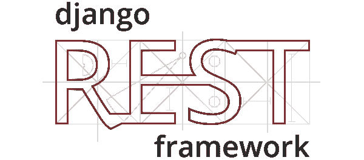

# 用 Django Rest 框架为不同的 HTTP 方法节流请求

> 原文：<https://medium.com/analytics-vidhya/throttling-requests-with-django-rest-framework-for-different-http-methods-3ab0461044c?source=collection_archive---------2----------------------->



# 前言

最近我在做一个项目，在这个项目中，我有一个支持`Get`和`POST`方法的单一端点来创建和检索数据。我想对`GET`请求设置一个比`POST`请求更严格的限制策略，但是没有发现用 Django Rest 框架的 API 视图实现这一点的简单方法。在网上寻找简单的解决方案后，我发现没有，因此想在本文中分享我的解决方案。

出于本文的目的，让我们假设我们有一个用实现了`GET`和`POST`方法的视图

```
class Book(APIView):
    def post(self, request):
        ...

    def get(self, request):
        ...
```

您可以通过定义`throttle_classes`参数来定义`Book` API 视图将使用的节流类(决定何时节流请求的类)

```
class Book(APIView):
    throttle_classes = [throttle_class_1, throttle_class_2, ...]
```

在其核心，throttle 类是一个实现`allow_request(self, request, view)`方法的类。如果`allow_request`返回`True`，则请求被允许。如果`False`，请求被抑制。

然而，定义`throttle_classes`参数使得这些 throttle 类应用于`Book`视图中的所有 HTTP 方法。如果我们想对`GET`和`POST`方法以不同的速率限制请求，我们需要定义自定义类。要轻松做到这一点，让我们看看 Django Rest 框架是如何实现节流的。

# Django Rest 框架节流内部

**注意:**这些实现细节适用于除`ScopedRateThrottle`之外的所有节流类。

要覆盖 Django Rest 框架节流类，您可以覆盖在`rest_framework.throttling`中定义的任何类。以匿名节流类的重写为例

```
*from* rest_framework *import* throttling*class* PostAnonRateThrottle(throttling.AnonRateThrottle):
    scope = 'post_anon'
```

Django Rest 框架节流类做的第一件事是获取节流率。

**注意:**这个 *Django Rest 框架节流内部*部分中的其余代码块直接来自 Django Rest 框架，是您自己做的**而不是**需要自己实现的事情。这里显示它们只是为了解释“引擎盖下”发生了什么

```
THROTTLE_RATES = api_settings.DEFAULT_THROTTLE_RATESif not getattr(self, 'rate', None):            
    self.rate = self.get_rate()...   
def get_rate(self):
    ...
    try:            
        return self.THROTTLE_RATES[self.scope]
```

上面的代码块首先检查是否在节流类上设置了`rate`属性。如果是，则将其用作节流率。如果没有，它检查在`DEFAULT_THROTTLE_RATES`设置中为给定范围设置的默认节流率。

```
REST_FRAMEWORK = {
    ...
    'DEFAULT_THROTTLE_RATES': {
        '<scope>': '<throttle limit>',
    }
}
```

在 Django Rest 框架节流[文档](https://www.django-rest-framework.org/api-guide/throttling/)中可以看到可能的节流限制。

在我们的例子中，我们将范围覆盖为`post_anon`。`AnonRateThrottle`和`UserRateThrottle`类分别带有默认的作用域`anon`和`user`。

接下来，我们应该了解 Django Rest 框架如何实现速率限制。它结合了`scope`和`identification`，其中标识要么是匿名用户的 IP 地址，要么是已验证用户的主要标识符。`scope`和`identification`的每个唯一组合被用作一个不同的请求集，被跟踪以进行过滤。

用于`AnonRateThrottle`类

```
def get_cache_key(self, request, view):        
    if request.user.is_authenticated:            
        return None       
    return self.cache_format % { 
        'scope': self.scope,                  
        'ident':   self.get_ident(request)        
    }
```

而对于`UserRateThrottle`类

```
def get_cache_key(self, request, view):        
    if request.user.is_authenticated:            
        ident = request.user.pk
    else:
        ident = self.get_ident(request) #Getting the IP Address      
    return self.cache_format % { 
        'scope': self.scope,                  
        'ident':   self.get_ident(request)        
    }
```

缓存关键字格式为

```
cache_format = 'throttle_%(scope)s_%(ident)s'
```

因此，我们可以看到缓存键是`scope`和用户身份的组合。

对于`throttle_class`属性中的每个 throttle 类，Django rest 框架调用`allow_request(self, request, view)`方法来确定请求是否被允许。如果任何节流类返回`False`，请求将被节流。

```
def get_throttles(self):    
    return [throttle() for throttle in self.throttle_classes]def check_throttles(self, request):
    for throttle in self.get_throttles(): 
        if not throttle.allow_request(request, self): 
            throttle_durations.append(throttle.wait())if throttle_durations:
    ...
    self.throttled(request, duration)
```

如果`allow_request(self, request, view)`为给定的节流类返回`True`，则一个成功的请求被添加到缓存中。这个请求对象的关键是前面提到的范围和身份的组合，以及成功请求的时间戳数组的值。

`allow_request`使用特定请求的给定速率和高速缓存键，查看高速缓存中记录的给定时间内发生的请求数。回想一下，它能够做到这一点是因为每个成功请求的时间戳都存储在缓存中。如果缓存请求的数量大于速率限制，请求将被抑制。

```
if len(self.history) >= self.num_requests:
    return self.throttle_failure()
```

因此，我们可以看到被节流的请求是`scope`、`identity`和`rate`的函数。知道了这一点，我们可以设计定制的节流类来保持我们的端点和不同的 HTTP 方法的节流分开。

# 不同 HTTP 方法的自定义节流类

假设我们知道独立的节流计数是为用户和范围的每个不同组合创建的，那么我们可以为 HTTP 方法定义自定义节流类。

出于本示例的目的，让我们为用户创建不同的节流类，并为`GET`和`POST`创建匿名用户。这模拟了全尺寸应用程序的许多用例。

为此，我们将覆盖`AnonRateThrottle`和`UserRateThrottle`类。只要将这些被覆盖的类导入到视图中，就可以将它们放在任何地方。

在重写类之前不要忘记导入`throttling`

```
from rest_framework import throttling
```

## 匿名`POST`节流

```
*class* PostAnononymousRateThrottle(throttling.AnonRateThrottle):
    scope = 'post_anon'
    *def* allow_request(self, request, view):
        *if* request.method == "GET":
            *return* True
        *return* super().allow_request(request, view)
```

## 匿名`GET`节流

```
*class* GetAnononymousRateThrottle(throttling.AnonRateThrottle):
    scope='get_anon'
    *def* allow_request(self, request, view):
        *if* request.method == "POST":
            *return* True
        *return* super().allow_request(request, view)
```

## 用户`POST`节流

```
*class* PostUserRateThrottle(throttling.UserRateThrottle):
    scope = 'post_user'
    *def* allow_request(self, request, view):
        *if* request.method == "GET":
            *return* True
        *return* super().allow_request(request, view)
```

## 用户`GET` 节流

```
*class* GetUserRateThrottle(throttling.UserRateThrottle):
    scope = 'get_user'
    *def* allow_request(self, request, view):
        *if* request.method == "POST":
            *return* True
        *return* super().allow_request(request, view)
```

**注意:**虽然您可以重构以减少重复，但为了更清楚起见，我将它们留在了这里。

这些类的作用是覆盖这些速率节流阀的`allow_request`方法并设置一个唯一的`scope`。如果传入的请求不是该类正在节流的同一类型(例如`GET`节流器和`POST`请求)，则允许该请求(返回`True`)。如果 HTTP 方法类型匹配，这些方法将返回`allow_request(request, view)`的超类实现，以允许您利用所有 Django Rest 框架的节流内部！

现在，由于这些类中的每一个都有不同的作用域，并且我们知道单个请求是根据对应于作用域和标识组合的缓存键来限制的，我们知道这四个限制类将维护不同数量的传入请求进行限制。

因此，这些类别将能够以不同的速率独立抑制以下组合:

*   `POST`认证用户请求
*   `POST`未认证用户请求
*   `GET`对经过身份验证的用户的请求
*   `GET`对未经认证用户的请求

利用这些限制类很简单，只需在您的`settings`文件中设置默认速率，并设置所需的速率限制

```
REST_FRAMEWORK = {
    ...
    'DEFAULT_THROTTLE_RATES': {
        'post_anon': '3/minute',
        'get_anon': '100/minute',
        'post_user': '5/minute',
        'get_user': '150/minute'
    }
}
```

并将它们作为节流类包含在您想要使用它们的任何视图中

```
class Book(APIView): throttle_classes = [PostAnononymousRateThrottle,        GetAnononymousRateThrottle, PostUserRateThrottle, GetUserRateThrottle ] def get(self, request):
        ... def post(self, request):
        ...
```

在您的`views.py`文件的`throttle_classes`中使用它们之前，不要忘记从您定义它们的任何文件中导入您的自定义速率限制类。

注意，您也可以直接在类本身中设置`rate`参数，以获得相同的效果

```
*class* GetUserRateThrottle(throttling.UserRateThrottle):
    scope = 'get_user'
    rate = '150/minute'
```

# 结论

现在，`POST`和`GET`对`Book`资源的请求被独立调节。这允许您遵循标准的 API 设计，其中一个资源支持多个 HTTP 方法。在本例中，这意味着对`Book`端点的`GET`请求将返回图书，而`POST`请求将创建一个并保存到数据库中。

理解 Django Rest 框架节流的内部机制还允许您扩展这个概念，并为您的应用程序需要的任何用例创建您自己的自定义节流类。限制 API 的速率是防止资源过载的基础，如果在云基础设施上运行，还可以节省资金。

如果你喜欢这篇文章和/或发现它有帮助，请一定要给它一些掌声！这是我写的第一篇，我很乐意回答任何问题。

快乐大厦！

# 有问题吗？想要更多吗？

有任何问题或想要更多有趣的技术内容吗？在 twitter @TheSeanRich 上关注我，我会尽我所能提供帮助！