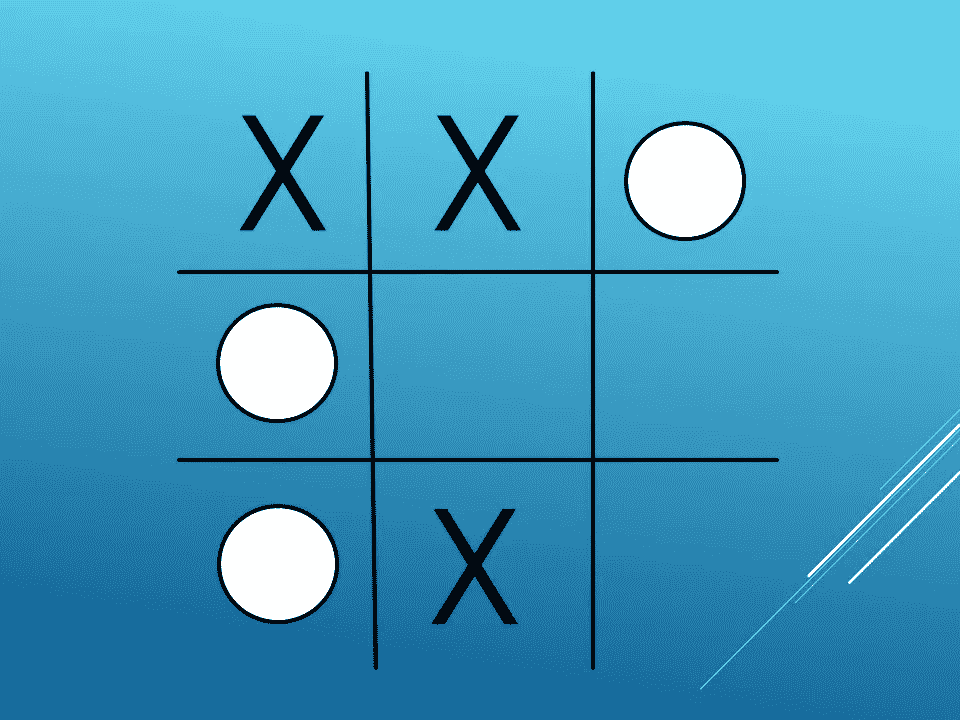

# 井字游戏:人工智能 Vs 用户

> 原文：<https://medium.com/analytics-vidhya/tic-tac-toe-ai-vs-user-1a2903621737?source=collection_archive---------14----------------------->

在今天的文章中，我们将为**井字游戏**创造一个无与伦比的 AI 智能体。这是一种纸笔游戏，也被称为“零和十字”。我们将使用**极小极大搜索**算法的概念，它被广泛应用于**人工智能**、**统计学**、**博弈论**，甚至**经济学**等领域。

人工智能代理:O &用户:X

# 目录

1.  什么是井字游戏？
2.  关于极大极小算法
3.  无敌人工智能代理
4.  接下来是什么…井字游戏使用阿尔法贝塔剪枝搜索算法？
5.  结论

在跳到极大极小算法之前，先了解一下井字游戏。

# **什么是井字游戏？**

> 它是一款基于 3x3 网格的游戏，也被称为 ***X 和 O 的*** 或***零和交叉*** 。这是一个双人游戏，玩家在一个 3x3 的格子上轮流玩。最先在一行、一列或一条对角线上获得三个方块的玩家赢得游戏。

就游戏而言，我们需要考虑如何从给定的当前网格状态中解决井字游戏。这个博弈是 [**完全信息**](https://en.wikipedia.org/wiki/Perfect_information) (人们可以很容易地分析出应该采取什么步骤才能让对手赢不了)和 [**零和**](https://en.wikipedia.org/wiki/Zero-sum_game) (数学上表示每个参与者的效用的获得或损失正好被损失或收益平衡的一种情况)博弈。这意味着有可能看到一个特定游戏的所有可能的移动。有了完美的发挥，总是以平局告终。

现在让我们转到极大极小算法！😃

# **关于极大极小算法**

> Minimax 是一种递归算法，用于为一个玩家选择最佳移动，假设另一个玩家也在最佳状态下游戏。类似于我们玩游戏时的思考方式:*“如果我下了这步棋，那么我的对手只能下这几步棋，”*等等。极小极大之所以被称为极小极大，是因为当其他玩家选择损失最大的策略时，它有助于使损失最小化。

这是一个游戏树结构，由所有可能的移动组成，允许你从游戏的一个状态移动到下一个状态。井字游戏可以定义为一个**搜索问题**，由以下部分组成:

1.  **当前状态:**包含板中 ***X 和 O***的位置。
2.  **终点状态:**是棋盘上 ***X 和 O 的*** 的位置，即单行、列或对角线上的三个方块赢得游戏，游戏结束。
3.  **效用函数:**为游戏结果分配数值的函数。在井字游戏中，结果要么是赢，要么是输，要么是平，这些可以分别用+1、-1 或 0 来表示。

现在让我们来看代码！

我们只是通过调用 Start_Game()开始游戏，棋盘的当前状态**(第 2 行)**是没有 X 和 O。因为它是最小最大算法，并且它利用**深度优先搜索**(搜索空间)来寻找最佳移动。

1.  用户将总是采取第一步**(第 6 行)**。用户可以将“X”放在棋盘上的任意 9 个位置。
2.  AI 代理将采取第二步**(第 14 行)**，并通过扩展整个搜索空间来搜索最佳移动。人工智能代理的最佳移动将通过比较最佳值和移动来选择。或者，用户和 AI 代理调用 Best_Move() **(第 28 行)**。用户的话轮是最大的，人工智能代理的话轮总是最小的。
3.  如果行的所有元素都是“O”或者列的所有元素都是“O”或者对角线的所有元素都是“O”，那么 AI agent 将赢得**(第 29 行)**。
4.  如果行的所有元素都是“X”或者列的所有元素都是“X”或者对角线的所有元素都是“X ”,那么用户将获胜。
5.  如果 3 分和 4 分都没有得到，那么比赛将是平局**(第 31 行)**。

为了更好地理解发生了什么，让我们举个例子！

# 无敌人工智能代理

看看董事会的现状，我们正在努力解决 **O 的**。

现在，我们有一个当前的情况，然后我们将如何解决它？

在这种情况下，最好的做法是将 O 的**放在棋盘的中间位置，但这不仅仅是 O 的获胜解。那么，对于 O 的**来说，你是如何得出解的呢？****

要确定，画一个包含所有可能状态的搜索树并分析它。

当前状态和人工智能代理(O's)回合的搜索树

从上面的树中，你可以看到，对于当前状态，我们有 2 个可能的下一步行动 **(1.0 和 1.1)** 。

如果 AI 智能体走棋 **1.0** 给则赢( ***+1*** )。但是，还有其他的可能性，让我们来探索一下。

如果人工智能代理采取移动 **1.1** 那么对手(在我们的例子中是用户)有 2 种可能性 **(2.0，2.1)** 。如果对手走棋 **2.0** 那么对手赢，我们输( ***-1*** )，如果对手走棋 **2.1** 那么只有一种可能走棋 **3.0** ，我们赢( ***+1*** )。

让我们来理解一下我们要如何计算 minimax 分数？

我们将从末端状态的底部开始计算最小最大值。

1.  在深度 **3** 处，我们将分数最大化到 **+1** ，并且它传播到深度 **2** 。
2.  在深度 **2** 处，我们将分数最小化为-1，它会传播到深度 **1** 。
3.  在深度 **1** 处，我们再次将分数最大化到 **+1** ，它会传播到当前状态，现在我们将选择与我们最终得到的 **+1** 分数相关联的移动。这样，每一步人工智能代理搜索的最佳举措，并保持不败。

# 接下来是什么…井字游戏使用阿尔法贝塔剪枝搜索算法？

> 现在，你应该能够理解 Minimax 算法背后的原理，它允许我们创建一个无与伦比的**井字游戏**人工智能代理。由于 minimax 是一种搜索算法，它会进入终止状态以选择最佳移动。对于井字游戏，我们使用 3×3 的网格，那么可能的状态数是 **(3⁹= 196839)** ，这是一个非常小的搜索空间。**我们的搜索空间很大怎么办？**(就像在国际象棋游戏中一个可能的状态数是将近 10 个⁰).有了如此广泛的搜索空间，我们仍然可以使用极大极小算法，但我们必须记住限制我们的搜索深度。否则，我们可以结束计算结果很长一段时间，甚至永远*。*

*对于同样的问题，我们可以使用 Alpha-Beta 剪枝来使用 Minimax。它是一种特定的方法。它通过在一定深度切断游戏树来加速游戏。与 Minimax 相比，它还提供了具有最少移动的最佳解决方案。在我们的例子中，井字游戏 alpha-beta 修剪将通过与 alpha-beta 值进行比较来修剪树的不必要部分，并返回最佳移动。与 Minimax 相比，它将花费较少的时间。*

# *结论*

*在搜索空间很小的情况下，极大极小算法是一种非常强大的搜索算法，可以提供最优解。它可以应用于各种各样的应用，比如博弈论。使用这个人工智能代理将赢得或游戏将平局！😆*

*代码在**可用。如有任何问题或疑问，欢迎致电 github.com/Devashi-Choudhary**[直接联系我。](https://github.com/Devashi-Choudhary)*****