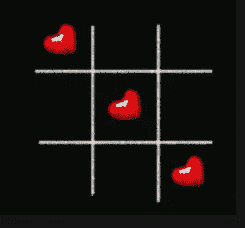

# 井字游戏项目——“学校时光的记忆”

> 原文：<https://medium.com/analytics-vidhya/tic-tac-toe-python-game-project-memory-of-school-time-be0e1ad55c66?source=collection_archive---------20----------------------->

**'我们来玩井字游戏“XO ”,你要做的就是匹配两张红心来赢得一张红心，但是如果我匹配这些红心，你可能会输'**

## **这背后的故事**

毫无疑问，你在学生时代一定玩过井字游戏，我们每个人都喜欢玩这个游戏。你会惊讶地发现井字游戏自古埃及时代就存在了。

**井字游戏**、**零、十字**或 **Xs 和 Os** 是两个玩家的[纸笔游戏](https://en.wikipedia.org/wiki/Paper-and-pencil_game),*X*和 *O* ，他们轮流标记 3×3 网格中的空格。成功在水平、垂直或对角线上放置三个标记的玩家获胜

由于井字游戏的简单性，它经常被用作一种[教学](https://en.wikipedia.org/wiki/Pedagogical)工具，用于教授良好[体育精神](https://en.wikipedia.org/wiki/Sportsmanship)的概念，以及处理[博弈树](https://en.wikipedia.org/wiki/Game_tree)搜索的[人工智能](https://en.wikipedia.org/wiki/Artificial_intelligence)的分支。

我们将建立一个互动游戏井字游戏，在这个过程中我们将学习新的东西。

# 井字游戏—关于 Python 项目

有趣的 Python 项目将使用 pygame 库构建。

**Pygame** 是一套 [Python](http://www.python.org/) 模块，专为编写视频游戏而设计。Pygame 在优秀的 SDL 库的基础上增加了功能。这允许你用 python 语言创建全功能的游戏和多媒体程序。

Pygame 具有高度的可移植性，几乎可以在任何平台和操作系统上运行。

我们将解释这个项目中使用的所有 pygame 对象方法。Pygame 是一个很棒的库，它允许我们创建窗口，并在窗口上绘制图像和形状。这样，我们将捕获鼠标坐标，并确定需要标记“X”或“O”的块。然后我们将检查用户是否赢得了游戏

# 先决条件

为了实现这个游戏，我们将使用 Python 和 Pygame 的基本概念，Pygame 是一个用于构建跨平台游戏的 Python 库。它包含计算机图形和声音库所需的模块。要安装该库，您可以从命令行使用 pip 安装程序:

1.  pip 安装游戏

# 构建 Python 项目的步骤—井字游戏

首先，让我们检查用 Python 构建井字游戏程序的步骤:

*   为我们的游戏创建显示窗口。
*   在画布上画出我们将要玩井字游戏的格子。
*   在画布下面画状态栏，显示轮到哪个玩家了，谁赢了游戏。
*   当有人赢得比赛或比赛是平局，然后我们重置游戏。

我们需要在一个无限循环中运行我们的游戏。它将不断寻找事件，当用户在网格上按下鼠标按钮时，我们将首先获得鼠标的 X 和 Y 坐标。然后我们会检查用户点击了哪个方块。然后，我们将在画布上绘制适当的“X”或“O”图像。这就是我们在这个 Python 项目中要做的事情。

# 1.初始化游戏组件

所以让我们从导入 pygame 库和 time 库开始，因为我们将使用 time.sleep()方法在某些位置暂停游戏。然后我们初始化所有将在井字游戏中使用的全局变量。

> 将 pygame 导入为 pg，sys
> 
> 从 pygame.locals 导入*
> 
> 导入时间
> 
> #初始化全局变量
> 
> XO = 'x '
> 
> 获胜者=无
> 
> draw = False
> 
> 宽度= 400
> 
> 高度= 400
> 
> 白色= (255，255，255)
> 
> line_color = (10，10，10)
> 
> #TicTacToe 3x3 板
> 
> TTT =[[无]*3，[无]*3，[无]*3]

这里，TTT 是主要的 3×3 井字游戏棋盘，起初，它有 9 个“无”值。我们将要玩游戏的画布的高度和宽度是 400×400。

# 初始化 Pygame 窗口

我们使用 pygame 创建一个新窗口，在这里我们可以玩井字游戏。所以我们用 pg.init()方法初始化 pygame，窗口显示设置为宽度 400，高度 500。我们保留了 100 像素的空间来显示游戏的状态。

pg.display.set_mode()初始化显示，我们用 screen 变量引用它。每当我们想在显示器上画东西时，就会用到这个屏幕变量。

pg.display.set_caption 该方法用于设置将出现在显示窗口顶部的名称。

> #初始化 pygame 窗口
> 
> pg。**初始化**()
> 
> fps = 30
> 
> 时钟= pg.time. **时钟**()
> 
> screen = pg . display .**set _ mode**((宽度，高度+100)，0，32)
> 
> pg.display. **set_caption** (“井字游戏”)

# 3.加载和转换图像

Python 机器学习项目使用了许多图像，如游戏开始或重置时将显示的开场图像。当用户点击网格时，我们将绘制的 X 和 O 图像。我们加载所有的图像，并调整它们的大小，以便它们可以很容易地适应我们的窗口。

# 4.定义功能

现在我们创建一个函数来启动游戏。当我们想重启游戏时，也会用到这个功能。在 pygame 中，blit()函数用于在一个图像上绘制另一个图像。

所以我们绘制开始的图像，在绘制之后，我们总是需要用 pg.display.update()更新显示。当开始图像被绘制时，我们使用 time.sleep(1)等待 1 秒钟，并用白色填充屏幕。

接下来，我们在白色背景上画 2 条垂直和水平的线，形成 3×3 的网格。最后，我们调用 draw_status()函数

> def game _ opening():
> screen . blit(opening，(0，0))
> pg . display . update()
> time . sleep(1)
> screen . fill(白色)
> 
> #画竖线
> pg.draw.line(screen，line_color，(width/3，0)，(width/3，height)，7)
> pg.draw.line(screen，line_color，(width/3*2，0)，(width/3*2，height)，7)
> #画横线

draw_status()函数绘制了一个黑色的矩形，我们在其中更新了游戏的状态，显示了轮到哪个玩家了，以及游戏是结束还是平局。

> 定义 **draw_status** ():
> 
> 全球抽奖
> 
> 如果获胜者是无:
> 
> message = XO。**上部**()+“s 转”
> 
> 否则:
> 
> 消息=赢家。**上位** () +“赢了！”
> 
> 如果绘制:
> 
> message = '游戏抽奖！'
> 
> font = pg.font. **Font** (无，30)
> 
> 文本=字体。渲染(消息，1，(255，255，255))
> 
> #将呈现的信息复制到白板上
> 
> 屏幕。**填充** ((0，0，0)，(0，400，500，100))
> 
> text_rect = text。**get _ rect**(center =(width/2500–50))
> 
> 屏幕。 **blit** (text，text_rect)
> 
> 页面显示。**更新**()

函数的作用是:检查井字游戏棋盘上所有的“X”和“O”标记。它计算玩家是否赢得了游戏。当玩家在一行、一列或对角线上连续标记 3 次时，他们可以获胜。每当我们在板上画一个“X”或“O”时，这个函数就会被调用。

> def **check_win** ():
> 
> 全球 TTT，赢家，平局
> 
> #检查获奖行
> 
> 对于**范围** (0，3)内的行:
> 
> **如果**((TTT[排][0]= = TTT[排][1]= = TTT[排][2]) **和**(TTT[排][0]不是无)):
> 
> #这一行赢了
> 
> 赢家= TTT[row][0]
> 
> pg.draw. **line** (屏幕，(250，0，0)，(0，(行+1)*高度/3-高度/6)，\
> 
> (宽度，(行+1)*高度/3-高度/6)，4)
> 
> 破裂
> 
> #检查获奖栏目
> 
> 对于**范围内的列** (0，3):
> 
> **如果**(TTT[0][col]= = TTT[1][col]= = TTT[2][col])**和** (TTT[0][col]不是无):
> 
> #这个栏目赢了
> 
> 获胜者= TTT[0][col]
> 
> #画赢线
> 
> pg.draw. **line** (屏幕，(250，0，0)，((col + 1)* width/3 — width/6，0)，\
> 
> ((col + 1)* width/3 — width/6，height)，4)
> 
> 破裂
> 
> #检查对角线获胜者
> 
> **如果**(TTT[0][0]= = TTT[1][1]= = TTT[2][2])**和** (TTT[0][0]不是无):
> 
> #游戏从左到右对角获胜
> 
> 赢家= TTT[0][0]
> 
> 第**行**(屏幕，(250，70，70)，(50，50)，(350，350)，4)
> 
> **如果**(TTT[0][2]= = TTT[1][1]= = TTT[2][0])**和** (TTT[0][2]不是无):
> 
> #游戏从右向左对角获胜
> 
> 获胜者= TTT[0][2]
> 
> 第**页线**(屏幕，(250，70，70)，(350，50)，(50，350)，4)
> 
> **如果**(**all**(**all**(row)for row in the TTT))并且获胜者是 None:
> 
> draw = True
> 
> **平局 _ 状态**()

drawXO(row，col)函数获取鼠标单击的行和列，然后绘制“X”或“O”标记。我们计算起点的 x 和 y 坐标，从这里我们将绘制标记的 png 图像。

> def **drawXO** (行，列):
> 
> 全球 TTT，XO
> 
> 如果 row==1:
> 
> posx = 30
> 
> 如果 row==2:
> 
> posx =宽度/3 + 30
> 
> 如果 row==3:
> 
> posx =宽度/3*2 + 30
> 
> 如果 col==1:
> 
> posy = 30
> 
> 如果 col==2:
> 
> posy =身高/3 + 30
> 
> 如果 col==3:
> 
> posy =高度/3*2 + 30
> 
> TTT[第一行][第一列] = XO
> 
> **如果** (XO == 'x '):
> 
> 屏幕。 **blit** (x_img，(posy，posx))
> 
> XO= 'o '
> 
> 否则:
> 
> 屏幕。 **blit** (o_img，(posy，posx))
> 
> XO= 'x '
> 
> 页面显示。**更新**()
> 
> #打印(posx，posy)
> 
> #打印(TTT)

每当用户按下鼠标按钮时，就会触发 userClick()函数。

当用户点击鼠标时，我们首先获取鼠标在显示窗口上被点击的位置的 x 和 y 坐标，然后如果那个位置没有被占用，我们就在画布上绘制“XO”。我们也检查玩家在黑板上画了“XO”后是否赢了。

> 定义**用户点击**():
> 
> #获取鼠标点击的坐标
> 
> x，y = pg.mouse. **get_pos** ()
> 
> #获取鼠标单击的列(1–3)
> 
> **如果** (x <宽度/3):
> 
> col = 1
> 
> **elif** (x <宽度/3*2):
> 
> col = 2
> 
> **elif** (x <宽度):
> 
> col = 3
> 
> 否则:
> 
> col =无
> 
> #获取鼠标单击的行(1–3)
> 
> **如果** (y <高度/3):
> 
> 行= 1
> 
> **elif** (y <高度/3*2):
> 
> 行= 2
> 
> **elif** (y <高度):
> 
> row = 3
> 
> 否则:
> 
> 行=无
> 
> #打印(行，列)
> 
> **如果**(行和列以及 TTT[行-1][列-1]为无):
> 
> 全球 XO
> 
> #在屏幕上画 x 或 o
> 
> **drawXO** (row，col)
> 
> **check_win** ()

最后一个函数是 reset_game()。这将重新开始游戏，我们也重置所有的变量到游戏的开始。

> def **重置 _ 游戏**():
> 
> 全球 TTT，赢家，XO，平局
> 
> 时间。**睡眠** (3)
> 
> XO = 'x '
> 
> draw = False
> 
> **游戏 _ 开场**()
> 
> 获胜者=无
> 
> TTT =[[无]*3，[无]*3，[无]*3]

# 5.永远运行游戏

要启动游戏，我们将调用 game_opening()函数。然后，我们运行一个无限循环，不断检查用户所做的任何事件。如果用户按下鼠标按钮，MOUSEBUTTONDOWN 事件将被捕获，然后我们将触发 userClick()函数。然后如果用户赢了或者游戏平局，我们通过调用 reset_game()函数来重置游戏。我们在每次迭代中更新显示，并将每秒帧数设置为 30。

> **游戏 _ 开场**()
> 
> #永远运行游戏循环
> 
> **而**(真):
> 
> 对于 pg.event. **get** ()中的事件:
> 
> 如果 event.type == QUIT:
> 
> pg。**退出**()
> 
> sys。**退出**()
> 
> elif event.type 为 MOUSEBUTTONDOWN:
> 
> #用户点击了；放置一个 X 或 O
> 
> 用户点击()
> 
> **如果**(赢家或平局):
> 
> **重置 _ 游戏**()
> 
> 页面显示.**更新**()
> 
> 时钟。**滴答** (fps)

游戏已经完成，可以开始玩了。