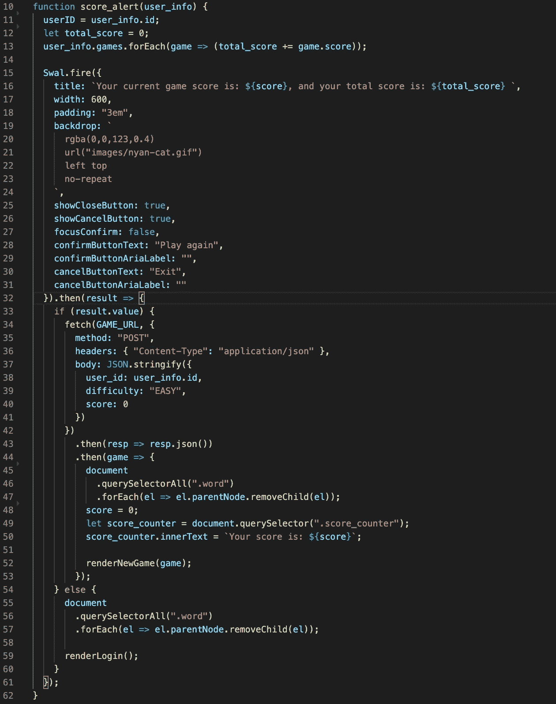
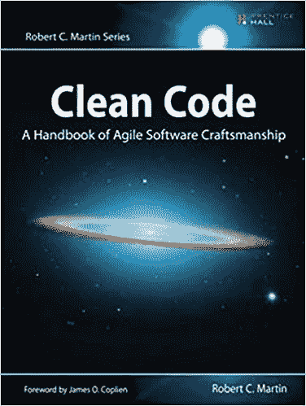

# 整理您的代码

> 原文：<https://medium.com/analytics-vidhya/tidying-up-your-code-c24e678e153?source=collection_archive---------17----------------------->

“编程大师认为系统是要讲的故事，而不是要写的程序。”——鲍勃叔叔。

如果你想让你和其他人的生活更轻松，你需要学会如何整理，我不是在说你的房间或橱柜:)

当我刚开始学习编程时，我的目标是:

*   学习如何写代码(…咄:D)
*   使其工作

在实现目标的过程中，我意识到我遗漏了一个重要的部分，那就是区分代码和优秀代码的部分。

我说的是“干净的代码”。

我想带你看一下我对我的一个项目的代码所做的修改，让它更简洁。我将向您展示我如何提高其中一个函数的可读性。

这是改进前的功能:

如您所见，这段代码有许多问题，主要有两个:

*   不清楚它是做什么的:函数太长，而且它跟踪太多变量。这很容易出错。
*   不可读:命名不太好，而且函数中有很多内容，很难理解这个函数在做什么。

为了说明编写干净的代码有多重要，我想向你提出一个练习:阅读前面的代码，花几分钟时间试图理解它做了什么。然后，检查重构后的代码，想一想你是否理解代码做什么更好。我做了这个练习，它真的帮助我理解了干净代码的重要性。

不多说了，下面是重构后的代码:

我没有以任何方式改变函数的行为，我所做的只是将函数“score_alert”中的代码分成几个函数，并给这些新函数起了有意义的名字。

这个例子说明了将行为分解成函数而不是将所有代码集中在一个函数中是多么重要，以及给函数起一个有意义的名字是多么重要。

如果你有兴趣写一个更干净、可读性更强的代码，我真的推荐你阅读《干净的代码》这本书，它详细解释了如何:

*   写好代码，把不好的代码转化成好的代码
*   创建好的名字、好的函数、好的对象和好的类
*   在不模糊代码逻辑的情况下实现完整的错误处理
*   格式化代码以获得最大的可读性

