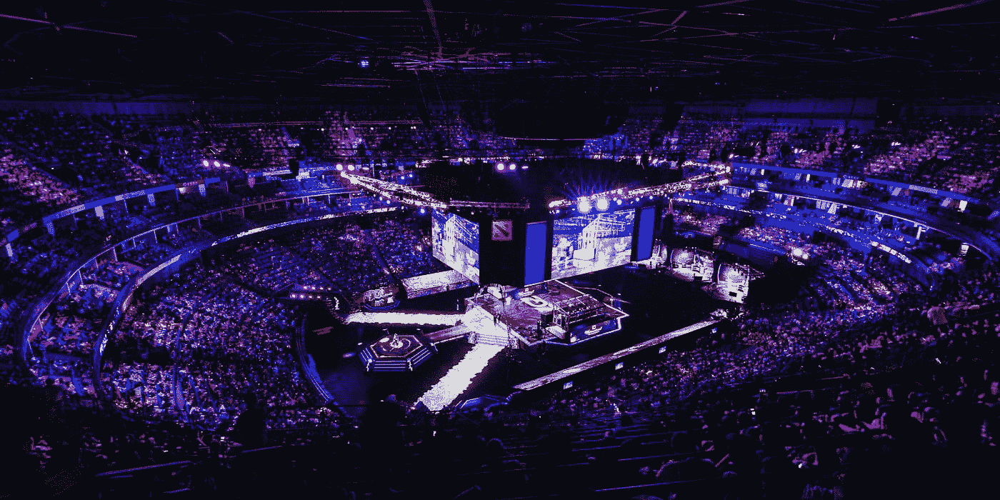
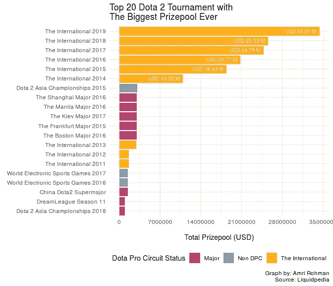
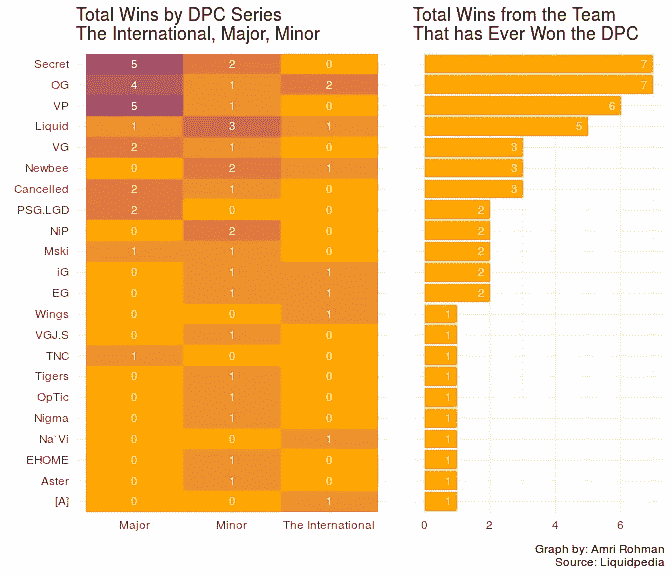
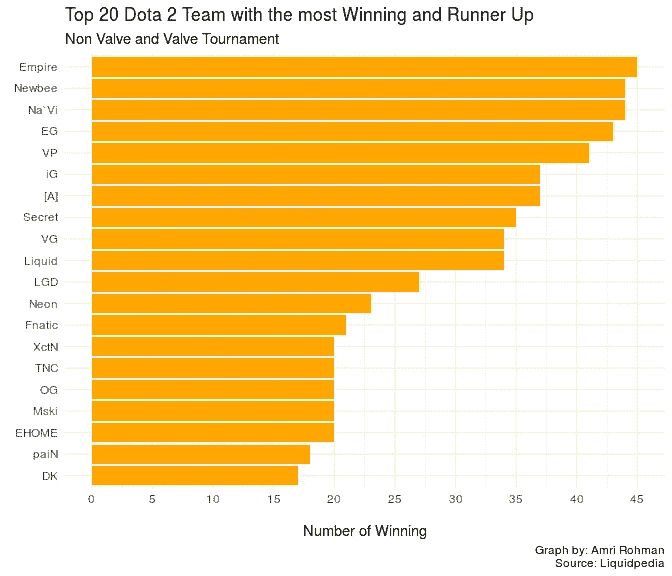
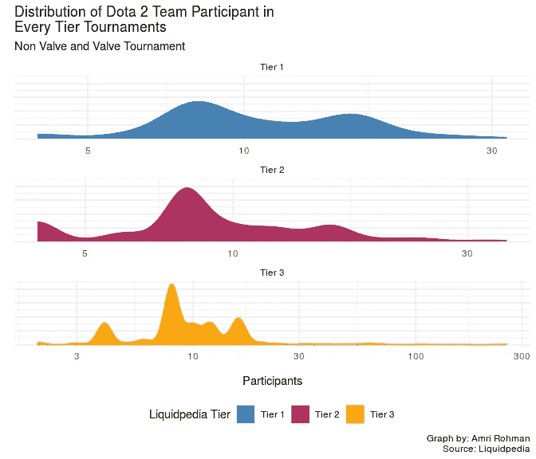
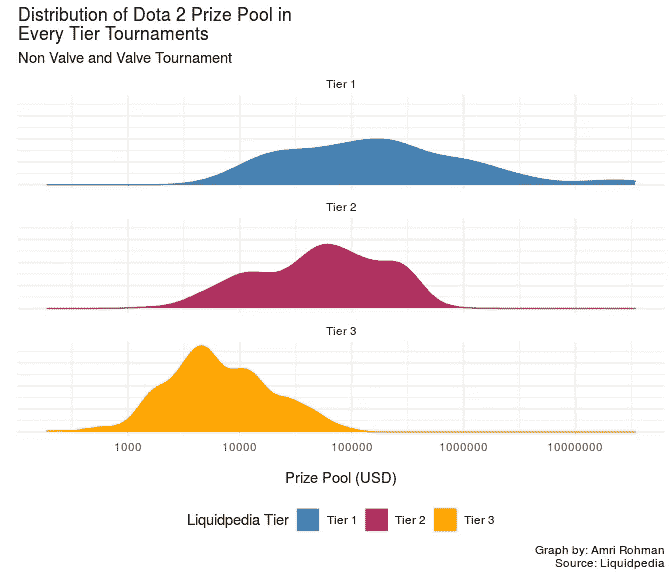
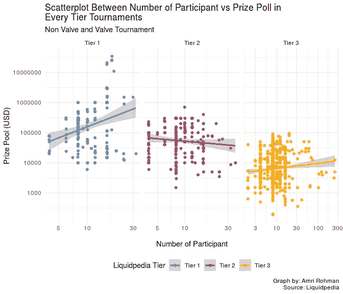
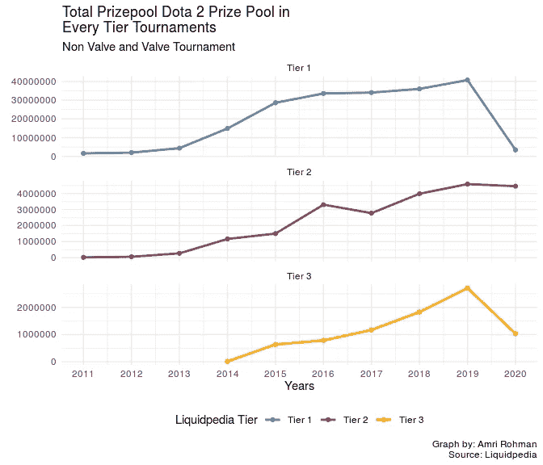

# Dota 2 锦标赛报废分析使用 r。

> 原文：<https://medium.com/analytics-vidhya/tidytuesday-video-games-f532fb493b60?source=collection_archive---------25----------------------->

大家好。在这篇文章中，我将向你展示除了 4 层以外的任何层(Liquidpedia 层)的 dota 2 锦标赛分析。这些数据是从 Liquidpedia 锦标赛页面上收集的。我做报废(2020 年 7 月 23 日)和分析在 R 用 tidyverse，rvest 和 cowplot 包。



monsterenergy.com 拍摄的照片

# 检索数据

在我完成函数之后，是时候将原始数据存储为数据帧格式了。

```
dota2_tournament_raw <- 
  bind_rows(map_df(2015:2020, get_tournament_tier3),
            map_df(c(2015, 2017, 2020), get_tournament_tier2),
            map_df(NA, get_tournament_tier1))
```

# 数据准备

原始数据还没有准备好进行分析，我需要清理这些数据并修改 somo 列/变量。我还将这些数据保存为 csv 格式。

```
write.csv(dota2_tournament, "dota2_tournament.csv")
```

# 设想

在这一节中，我将数据转换成图表，以便于理解。



国际赛事占据了有史以来最大的奖金池，紧随其后的是主要锦标赛。



团队秘密，OG 和维尔图斯职业(副总裁)是 dota 2 锦标赛历史上的成功团队。


在三个不同级别的锦标赛(Liquidpedia Tier)中有一个大五冠军。



团队帝国，纽比和纳威是最经常去的任何等级的大决赛。



第 1 级锦标赛通常有大约 8-30 名参与者，第 2 级与第 1 级相对相同，第 3 级有波动和变化的参与者。



每一层都有不同的奖金池，第三层是最多的奖金池。



参与者的数量和奖金池有小的相关性，我们可以看到下面的相关系数。

```
dota2_tournament %>% 
  filter(!is.na(participant)) %>%
  filter(!is.na(prize_pool_dollar)) %>%
  mutate(tier = str_to_title(tier)) %>%
  group_by(tier) %>%
  summarise(r = cor(participant, prize_pool_dollar))## # A tibble: 3 x 2
##   tier          r
##   <chr>     <dbl>
## 1 Tier 1  0.271  
## 2 Tier 2 -0.105  
## 3 Tier 3  0.00740
```

参与者数量和奖金池之间的相关系数值很小，这意味着越来越多的参与者也没有奖金池。



奖池逐年有增加趋势，但在 2020 年 Dota Pro 巡回赛(主要和次要)取消期间，电晕病毒疫情。

> 感谢你阅读这篇文章，如果你喜欢这篇文章，给我掌声，好吗。很抱歉我的英语不好，我还在学。
> 
> 祝你有愉快的一天。

# 谢谢你。

阿姆里·罗曼。
西多阿茹，东爪哇，身份证。