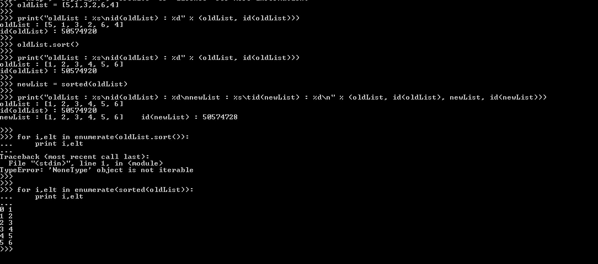

# TIL-Python 排序列表 list.sort()与 sorted(list)

> 原文：<https://medium.com/analytics-vidhya/til-python-sorting-lists-9ac88892c3bc?source=collection_archive---------1----------------------->

Python 中对列表排序的两种常见方法是`inputList.sort()`或`sorted(inputList)`。

嗯，`inputList.sort()`就地对列表进行排序，换句话说，您丢失了原始列表，因为它将被变异以包含新的排序列表。

`sorted(inputList)`另一方面，返回一个新的排序列表。

另一个重要的区别是`inputList.sort()`返回`None`，而`sorted(inputList)`返回一个新的列表对象。

所以，类似于`for i,elt in enumerate(inputList.sort())`的东西会失败，因为`inputList.sort()`会返回一个`None ,`，而`for i,elt in enumerate(sorted(inputList))`会正常工作。

另外，`sorted()`适用于所有的可迭代对象，而`list.sort()`是一个只为列表定义的方法。

Python wiki `inputList.sort()`更有效，所以在选择排序机制时也要考虑到这一点。

用 Python Wiki PFB 排序，检查一下`sorted()`的其他很酷的特性，比如指定排序类型(反向排序)，指定键等等。

[https://wiki.python.org/moin/HowTo/Sorting](https://wiki.python.org/moin/HowTo/Sorting)

